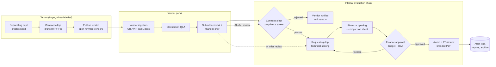
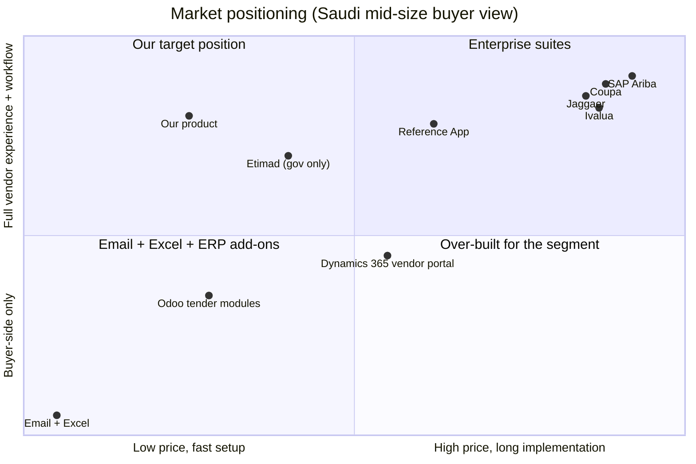
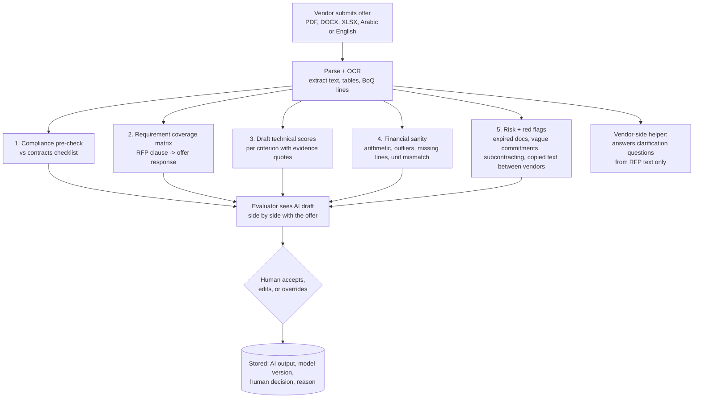

# WaslaBid: Tender-to-PO Platform for Saudi Mid-Market: Idea, Competitors, Features, AI

Date: 2026-09-21
Status: idea stage, pre-design

## 1. The idea in one paragraph

A multi-tenant, white-label SaaS where a Saudi private company (the tenant) publishes an RFP, RFQ, or tender under its own brand, external vendors register and submit technical and financial offers through a vendor portal, and the offers then flow through the tenant's internal chain: contracts department screening, requesting department technical evaluation, finance approval, and purchase order issuance. Every step is logged for audit. Arabic and English from day one.

Target customer: private companies in Saudi Arabia with roughly 100 to 2,000 staff that today run tenders by email, WhatsApp, and Excel.

Business model: subscription per tenant (tiered by active tenders and users), optional white-label domain fee, optional paid ERP integration per customer.

### 1.1 Product name

Decided 2026-09-26: **WaslaBid**. Arabic logo form **وصلة بد**, with the descriptor line **منصة وصلة للمناقصات** (the Wasla tender platform).

| Part | Meaning | Why |
|---|---|---|
| Wasla (وصلة) | Link, connection | The platform is the link between a buyer and its vendors. |
| Bid | Tender offer | Says the category in English and separates the name from other Saudi "Wasla" businesses. |

Rules:

- Write it as one word with a capital B: WaslaBid, never "Wasla Bid" or "Waslabid". Never shorten it to "Wasla" in marketing; that word alone is crowded (a Saudi cloud POS called Wasla POS, WaslaCo in Jeddah, a digital agency on `wsla.sa`, a regional browser app).
- It is our brand as the vendor of record: marketing site, platform admin area, contracts, and invoices. Tenant-facing screens, emails, and PDFs still carry only the tenant's brand (F-02, `08-design-system.md` section 5).
- Code and project names (`Platform.UI`, the `ERP` repository) do not change.

Rejected on the way: Hasm (حسم), because it is also the name of a designated Egyptian militant group and Gulf retail slang for a discount; plain Wasla, because of the crowding above.

Still to do before public use: SAIP trademark search for WaslaBid and وصلة بد (classes 9 and 42), and register `waslabid.com` and `waslabid.sa` (no DNS records found for either on 2026-09-26, which suggests but does not prove they are free).

## 2. Tender lifecycle (the product's core flow)

## 3. Competitor landscape

### 3.1 Positioning map

### 3.2 Competitor table

| Group | Player | What they do | Why they win | Where they are weak for our segment |
|---|---|---|---|---|
| Saudi-native direct | **Reference App** (Riyadh, 2020) | Cloud source-to-pay: sourcing, RFQ, approvals, PO, Reference App Souq marketplace, Local Content tracker. KPMG distribution partner, NHC sector platform. | Local, credible, funded, understands Saudi compliance and local content. | Moved upmarket to enterprise and consultancies. Pricing and onboarding are enterprise-shaped (from 50,000 USD with an implementation manager). Lists sealed bids, scoring privacy mode, and white-labeling as plan features since late 2025, but gates the commercial section by permission rather than encryption, allows post-submission price revisions, and states no hosting region (document 04, sweep of 2026-09-21). |
| Global suites | SAP Ariba, Coupa, Jaggaer, Ivalua, GEP | Full spend management, supplier networks, contracts, invoicing. | Brand safety for large companies and government-linked entities. | Cost, implementation time, need a partner, English-first, overkill for 300 staff. |
| ERP add-ons | Odoo Purchase + tender modules, Dynamics 365 vendor portal, SAP Business One add-ons | RFQ comparison inside the ERP, basic vendor bid portals. | Already installed, cheap, single system. | Buyer-side thinking, poor vendor UX, weak or no branding, no evaluation chain with separate roles, weak audit trail. |
| Adjacent, not direct | Etimad | Government tendering portal. | Mandatory for government. | Private companies cannot use it for their own tenders. Sets user expectations though. |
| Adjacent, not direct | Mustashar | AI that writes proposals for vendors responding to Etimad. | Vendor-side AI. | Not a buyer tool. Possible partner. |
| Adjacent, not direct | tendersalerts, tendersgo, tendersinfo | Scrape and alert on public tenders. | Cheap lead-gen for vendors. | No workflow at all. |

### 3.3 The gap

Nobody owns "white-label vendor portal plus internal multi-department evaluation chain for the Saudi private mid-market". Reference App is closest but priced and positioned upmarket. ERP add-ons are cheap but buyer-side and ugly. Email and Excel are still the most common "competitor".

Things to verify before building:

1. Ask three procurement or contracts managers what they use today and what Reference App quoted them.
2. Check Reference App's current pricing for a self-serve or SME tier. If one exists, the wedge narrows.
3. Confirm whether mid-size companies want the vendor to see their brand or are happy with a neutral portal. This decides how much to invest in white-labelling.

## 4. Proposed features to compete

### 4.1 Version 1 (must have to sell at all)

| Area | Feature |
|---|---|
| Tenant and branding | Tenant sign-up, logo, colors, custom subdomain (`tenders.customer.sa`), email sender name, Arabic/English UI, RTL. |
| Users and roles | Roles: Admin, Contracts, Requester/Technical evaluator, Finance approver, Vendor. Per-tender committee assignment. |
| Tender authoring | RFP/RFQ/tender types, sections (scope, terms, BoQ lines, evaluation criteria with weights), attachments, deadlines, open vs invited vendors, versioned amendments with vendor notification. |
| Vendor portal | Self-registration with CR number, VAT number, IBAN, documents with expiry dates. Approved vendor list per tenant. Clarification Q&A with public answers. Sealed submission: technical and financial parts stored separately, financial opened only after technical scoring is locked. |
| Evaluation chain | Contracts compliance checklist (mandatory docs, bid bond, validity). Technical scoring per criterion per evaluator, weighted totals, comments. Financial comparison sheet auto-built from BoQ lines. Finance approval against budget and delegation-of-authority limits. Any rejection returns to the previous stage with a reason. |
| Award and PO | Award letter and regret letters, branded PO PDF with tenant numbering and terms, PO register. |
| Audit and reporting | Immutable event log per tender (who, what, when, from which IP), export to PDF for internal audit, dashboard: cycle time, savings vs estimate, vendor participation. |
| Notifications | Email and SMS (Arabic/English) for deadlines, clarifications, stage changes. |

### 4.2 Differentiators (what makes a customer pick us over Reference App or Odoo)

| Differentiator | Why it matters in Saudi mid-market |
|---|---|
| **True white-label** as a tenant setting: custom domain with automatic TLS, branded vendor emails and PDFs, on a monthly plan | Companies want vendors to see *their* brand, not a SaaS logo. Reference App lists white-labeling only inside an enterprise contract from 50,000 USD; Odoo does not offer it. |
| **Sealed two-envelope submission enforced by cryptography, state machine, and audit** | Mirrors how Saudi contracts departments already work on paper. Reference App hides the commercial section by application permission until technical evaluation ends; we encrypt it with a separate key, require score locking first, and open it at a witnessed, logged event that even the platform admin cannot bypass. Prices are immutable after the deadline, where Reference App allows revision requests. |
| **Local Content (Iktva-style) and Saudization fields on the vendor profile** | Large customers of our customers increasingly ask for this in their supply chain. Cheap to add, expensive for competitors to retrofit. |
| **ZATCA-ready vendor data** | Capture VAT number and CR at registration so the PO and later invoice matching are clean. |
| **AI offer review** (section 5) | Cuts evaluation time and gives small contracts teams a second pair of eyes. |
| **Vendor experience** | Mobile-friendly, WhatsApp notifications, one vendor account reused across every tenant on the platform (network effect: the more tenants, the less registration friction for vendors). |
| **Pricing a department head can approve** | Monthly per-tenant subscription, no implementation project, live in a day. |
| **PDPL and data residency** | Host in a Saudi region (STC Cloud, Oracle Jeddah, AWS or Google Dammam/Riyadh). State it on the pricing page. |

### 4.3 Later (only after paying customers ask)

- Reverse auctions.
- Contract management after award (milestones, variations, performance bonds).
- ERP integration connectors (Odoo, SAP B1, Dynamics) as paid add-ons.
- Vendor performance scoring across tenders.
- Cross-tenant vendor marketplace (only once vendor count is large).

## 5. Adding AI to review offers

### 5.1 Principle

AI assists, humans decide. The AI never awards, never rejects, and never changes a score. It produces drafts, flags, and summaries that a named evaluator accepts or overrides. Every AI output is stored with the model version and prompt version so an auditor can reproduce it.

### 5.2 Where AI fits in the flow

### 5.3 The five AI capabilities, in build order

| # | Capability | Input | Output | Value |
|---|---|---|---|---|
| 1 | **Compliance pre-check** | Contracts checklist + offer documents | Checklist with pass/fail/unclear per item and the page reference | Removes the first hour of every evaluation. Easiest to build, easiest to trust. |
| 2 | **Requirement coverage matrix** | RFP requirements (auto-extracted, then confirmed by contracts) + offer | Table: requirement, where the offer addresses it, quoted evidence, "not addressed" flags | Evaluators stop hunting through 80-page PDFs. |
| 3 | **Draft technical scoring** | Evaluation criteria with weights + coverage matrix | Suggested score per criterion with a one-paragraph justification and quotes | Speeds scoring and makes it consistent across evaluators. Always shown as a draft. |
| 4 | **Financial sanity check** | BoQ template + vendor priced BoQ | Arithmetic errors, unit or quantity mismatches, prices more than N% from the median of other bids or from the internal estimate, missing lines | Catches the errors that cause post-award disputes. |
| 5 | **Risk and integrity flags** | All offers in the tender | Expired CR or VAT, near-identical text across vendors (collusion signal), same contact details across vendors, vague delivery commitments | Gives a small contracts team a fraud and quality lens they cannot afford otherwise. |

### 5.4 Technical approach

- **Parsing:** superseded by spike W-22 and ADR-0005: PDFs go to the model as PDFs (96 percent agreement, against 65 percent after conversion), DOCX as extracted text; every claim cites a file and page.
- **Model:** a large language model called through an API with structured (JSON schema) outputs so scores and flags land in database columns, not free text. Claude models handle Arabic and long documents well; keep the vendor swappable behind one interface.
- **Grounding:** every prompt receives only that tender's requirements, criteria, checklist, and the one offer being reviewed. No retrieval step; the whole offer fits the context window. No training on customer data.
- **Determinism and audit:** fixed prompt version and stored input hash (current models accept no temperature setting), prompt and model version stored on each result, results are immutable once a human has acted on them.
- **Fairness:** run the same prompt over every offer in a tender in one batch so all vendors get the same treatment. Never send one vendor's prices to the model while scoring another vendor's technical part.
- **Sealed envelope respected:** the financial AI runs only after technical scoring is locked, exactly like the human process.
- **Data residency and PDPL:** process in a Saudi region or via a provider with an in-Kingdom option; redact personal data of vendor staff before sending to the model where it is not needed. The provider choice, including a free self-hosted open-weight model in Jeddah, is open decision 7 in document 02 section 5.
- **Cost control:** one review per offer at technical opening through the Batch API, tender context cached, per-tenant monthly budget; price checks and integrity comparison are code. Design: `docs/superpowers/specs/2026-09-26-ai-offer-review-design.md`.

### 5.5 What AI should not do in version 1

- Auto-score with no human review.
- Rank vendors and present a "winner".
- Read one vendor's offer while evaluating another (except the integrity check, which is explicit and logged).
- Translate legal terms in a binding way. It can produce a convenience translation labelled as such.

## 6. Open decisions before design

1. **PO scope for version 1.** Recommended: generate a branded PO PDF inside the product (option A). ERP push (B) becomes a paid per-customer integration later. Becoming the full ERP (C) is out of scope.
2. **Vendor identity model.** One vendor account across all tenants (network effect, better UX, harder data isolation) versus one account per tenant (simpler, no network effect). Recommended: one platform-wide vendor identity with per-tenant approval status.
3. **First customer.** Pick one real company to design with. Their workflow becomes the default template.
4. **Hosting region and provider** to satisfy data residency claims.

## 7. Sources

- Reference App: Dealroom, Reference App Souq launch, NHC partnership, KPMG partnership, founder interview
- Enterprise suites: [Coupa alternatives 2026](https://www.pivotapp.ai/blog/top-7-coupa-alternatives-to-explore-in-2026), [Ariba alternatives](https://www.speclens.ai/compare/ariba-alternatives)
- ERP add-ons: [Odoo Purchase Tender Management](https://apps.odoo.com/apps/modules/15.0/sh_po_tender_management), [Odoo 19 tender guide](https://www.serpentcs.com/blog/odoo-purchase-procurement-management-532/odoo-19-purchase-tender-management-711), [Odoo call for tenders](https://www.odoo.com/documentation/19.0/applications/inventory_and_mrp/purchase/manage_deals/calls_for_tenders.html)
- Government and adjacent: [Etimad tendering](https://portal.etimad.sa/en-us/services/servicedetails?ServiceGuid=60fd9b6d-faa5-4429-a60b-c1f38d0c8446), [Saudi national procurement portal](https://my.gov.sa/en/content/e-procurement), [Mustashar](https://mustashar.sa/blog/en/ai-proposal-software/)
