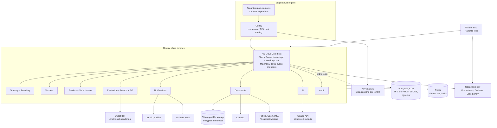

# Core Features and Tech Stack

Date: 2026-09-21
Status: proposal, for review before design
Depends on: `01-idea-competitors-features-ai.md`. Diagrams: `03-diagrams.md`

This file lists the features that must exist for the product to be sellable to a Saudi mid-size private company, then the technology stack to build it with. Feature IDs (F-xx) and non-functional IDs (N-xx) are stable so later design and planning documents can reference them.

## 1. Actors

| Actor | Who | What they do |
|---|---|---|
| Platform admin | Us | Creates tenants, sets plans, monitors health. Never sees tender content. |
| Tenant admin | Customer's IT or procurement head | Branding, users, roles, approval limits, templates. |
| Contracts officer | Customer's contracts or procurement department | Drafts and publishes tenders, answers clarifications, runs compliance screening, opens financial envelopes, issues award and PO. |
| Technical evaluator | Customer's requesting department | Scores technical offers against criteria. |
| Finance approver | Customer's finance department | Approves award against budget and delegation of authority. |
| Vendor user | Supplier staff | Registers the company, maintains documents, submits offers, asks clarifications. |
| Auditor | Customer's internal audit (read-only) | Reads the event log and exports evidence. |

## 2. Core features (must exist in version 1)

### 2.1 Tenancy and branding

| ID | Feature | Acceptance |
|---|---|---|
| F-01 | Tenant provisioning | Platform admin creates a tenant with name, CR number, plan, and default language. Tenant is usable within minutes with no deployment. |
| F-02 | White-label branding | Tenant admin uploads logo and favicon, picks primary and accent colors, sets portal name. Vendor portal, emails, PDFs, and PO carry the tenant brand only. |
| F-03 | Custom subdomain | Each tenant gets `<slug>.platform.sa` by default and can map `tenders.customer.sa` with a CNAME. TLS issued automatically. |
| F-04 | Language and RTL | Every screen, email, and PDF is available in Arabic and English. Arabic is right-to-left throughout. Each user picks their language. Tender content can be entered in either or both. |
| F-05 | Tenant data isolation | No query can return another tenant's rows. Enforced in the database, not only in application code. |

### 2.2 Identity, users, and roles

| ID | Feature | Acceptance |
|---|---|---|
| F-06 | Tenant staff accounts | Tenant admin invites staff by email. Login with email and password plus optional TOTP. SSO via the tenant's Microsoft Entra ID or any OIDC provider is a plan feature. |
| F-07 | Roles | Built-in roles: Tenant admin, Contracts officer, Technical evaluator, Finance approver, Auditor. A user can hold several roles. |
| F-08 | Per-tender committee | For each tender, the contracts officer assigns named evaluators and approvers. Only committee members see that tender's offers. |
| F-09 | Delegation of authority | Tenant admin defines approval limits by amount (for example: under 100k one finance approver, above 1M two approvers plus CFO). The award flow enforces them. |
| F-10 | Vendor identity | One vendor company account works across all tenants on the platform. Each tenant separately approves or blocks the vendor. Vendor staff are invited by the vendor's own admin. |

### 2.3 Vendor registration and profile

| ID | Feature | Acceptance |
|---|---|---|
| F-11 | Vendor self-registration | Company name (Arabic and English), CR number, VAT number, address, contact, IBAN, activity categories. Email and phone verified. |
| F-12 | Vendor documents with expiry | CR, VAT certificate, GOSI certificate, Zakat certificate, Chamber of Commerce, Saudization (Nitaqat) status, ISO certificates. Each has an expiry date; expired documents block submission and trigger a reminder 30 days before. |
| F-13 | Local content fields | Local content percentage, Saudi employees count and percentage, and supporting evidence. Shown in comparison sheets. |
| F-14 | Tenant vendor list | Tenant sees pending, approved, and blocked vendors, can invite by email, and can tag by category. |

### 2.4 Tender authoring and publishing

| ID | Feature | Acceptance |
|---|---|---|
| F-15 | Tender types | RFQ (price only), RFP (technical and financial), and Tender (sealed two-envelope). The type decides which stages are active. |
| F-16 | Tender content | Title, reference number (tenant pattern), description, scope of work, terms and conditions, attachments, BoQ lines (item, unit, quantity), submission deadline, offer validity period, clarification deadline, bid bond requirement. |
| F-17 | Evaluation model | Contracts officer defines mandatory compliance checklist items, technical criteria with weights summing to 100, minimum technical pass mark, and the financial method (lowest price or weighted technical-financial split). |
| F-18 | Templates | Any tender can be saved as a tenant template and reused. |
| F-19 | Visibility | Open (any approved vendor on the tenant can submit) or invited (only listed vendors). Optional public listing page under the tenant's domain. |
| F-20 | Amendments | Publishing a change after release creates a new version, notifies all invited or registered vendors, and optionally extends the deadline. Previous versions stay visible. |
| F-21 | Clarifications | Vendors ask questions before the clarification deadline. Contracts officer answers privately or publishes the answer anonymised to all vendors. |

### 2.5 Offer submission (vendor portal)

| ID | Feature | Acceptance |
|---|---|---|
| F-22 | Submission wizard | Vendor confirms eligibility documents, uploads technical response, prices every BoQ line, uploads financial attachments, declares validity period, and submits. Progress is saved as draft. |
| F-23 | Sealed envelopes | Technical and financial parts are stored and encrypted separately. Before the financial opening event, no tenant user or platform admin can read financial content. The opening is a logged event with the names of the officers present. |
| F-24 | Deadline enforcement | Submission closes at the deadline using server time. Late submissions are refused with a recorded timestamp. Vendors can withdraw or resubmit before the deadline; each resubmission is versioned. |
| F-25 | Submission receipt | Vendor receives a PDF receipt with a hash of the submitted files, timestamp, and tender reference. |
| F-26 | Vendor dashboard | Open invitations, drafts, submitted offers, results, and expiring documents. Mobile-friendly. |

### 2.6 Evaluation chain

| ID | Feature | Acceptance |
|---|---|---|
| F-27 | Stage state machine | Draft, Published, Clarification, Closed, Compliance screening, Technical evaluation, Financial opening, Financial evaluation, Finance approval, Awarded, Cancelled. Only the role that owns a stage can move it forward. Every transition is logged. |
| F-28 | Compliance screening | Contracts officer marks each checklist item pass, fail, or waived with a reason per offer. Failed offers are excluded with a vendor notification. |
| F-29 | Technical scoring | Each evaluator scores every criterion for every compliant offer independently. Scores are hidden from other evaluators until all have submitted. Weighted average and pass or fail against the minimum mark are computed. |
| F-30 | Score locking | Once technical scores are locked, they cannot change. Locking is required before the financial envelope can be opened. |
| F-31 | Financial comparison sheet | Auto-generated table: vendor, each BoQ line price, totals, VAT, variance from internal estimate, arithmetic check, local content. Exportable to Excel. |
| F-32 | Combined ranking | Ranking by the financial method defined in F-17. Contracts officer can recommend a vendor other than rank one with a mandatory written justification. |
| F-33 | Finance approval | Approvers see the recommendation, ranking, budget code, and justification. Approve or return with a reason. Returns go back to the previous stage. Approval limits from F-09 are enforced. |
| F-34 | Cancellation | A tender can be cancelled at any stage with a reason, notifying vendors. |

### 2.7 Award and purchase order

| ID | Feature | Acceptance |
|---|---|---|
| F-35 | Award and regret letters | Branded PDFs generated from templates, sent to the winner and the other vendors. |
| F-36 | Purchase order | Branded PO PDF with tenant numbering pattern, line items from the winning offer, VAT, payment terms, delivery terms, and signatories. Recorded in a PO register. |
| F-37 | PO export | PO available as PDF and as a structured JSON or CSV export so the customer can key or import it into their ERP. Direct ERP push is a later paid integration. |

### 2.8 Notifications

| ID | Feature | Acceptance |
|---|---|---|
| F-38 | Channels | Email always. SMS through a Saudi provider (Unifonic or similar) for vendors. In-app notifications. WhatsApp is a later addition. |
| F-39 | Events | Invitation, amendment, clarification answered, deadline in 48 hours, submission received, stage advanced, action required from me, award or regret, document expiring. |
| F-40 | Digest and preferences | Users can choose immediate or daily digest per event type. |

### 2.9 Audit, reporting, and documents

| ID | Feature | Acceptance |
|---|---|---|
| F-41 | Immutable event log | Every create, update, transition, download, and login is appended with actor, tenant, timestamp, IP, and before or after values where relevant. Append-only. Retained for at least 10 years. |
| F-42 | Audit export | Auditor exports a tender's full history as a signed PDF bundle including all submitted files and their hashes. |
| F-43 | Dashboards | Per tenant: open tenders, average cycle time per stage, savings versus estimate, vendor participation rate, awards by vendor and category. |
| F-44 | Document storage | All files stored encrypted with virus scanning on upload, size limits, and allowed types. Financial files use a separate encryption key that is unlocked only at the opening event. |

### 2.10 AI offer review (assist only)

| ID | Feature | Acceptance |
|---|---|---|
| F-45 | Compliance pre-check | On submission close, the system produces a draft pass, fail, or unclear per checklist item with a page reference. The officer confirms or overrides each. |
| F-46 | Requirement coverage matrix | For RFP and Tender types, a table of each requirement with where the offer addresses it and a quoted excerpt. |
| F-47 | Draft technical scores | Suggested score per criterion with a short justification and quotes, shown as draft next to the evaluator's empty score fields. Never pre-filled into the evaluator's score. |
| F-48 | Financial sanity check | Arithmetic errors, unit mismatches, missing lines, and prices beyond a configurable variance from the median of other offers or the internal estimate. Runs only after F-30 locking. |
| F-49 | Integrity flags | Near-identical text or identical contact details across offers in the same tender. |
| F-50 | AI audit record | Every AI output is stored with model name, model version, prompt version, input hash, and the human decision. AI can be turned off per tenant. |

## 3. Non-functional requirements

| ID | Requirement | Target |
|---|---|---|
| N-01 | Data residency | All customer data, backups, and AI processing inside Saudi Arabia. |
| N-02 | PDPL compliance | Consent on vendor registration, data subject access and deletion process, processor agreement template for tenants. |
| N-03 | Security | OWASP ASVS level 2, encryption at rest and in transit, MFA for tenant staff, rate limiting, annual penetration test. |
| N-04 | Availability | 99.5% monthly for version 1. Submission deadline windows are the critical path: the platform must not miss a deadline because of a deploy. |
| N-05 | Performance | Page loads under 2 seconds on Saudi mobile networks. Uploads up to 100 MB per file. |
| N-06 | Scale for version 1 | 50 tenants, 5,000 vendors, 200 concurrent users, 10,000 documents. Design so that 10x needs no re-architecture. |
| N-07 | Backups | Daily encrypted backups, 35-day retention, restore tested monthly. |
| N-08 | Observability | Structured logs, metrics, traces, and alerts on failed notifications and failed submissions. |
| N-09 | Accessibility | Keyboard navigation and screen reader labels on vendor-facing screens. |

## 4. Tech stack

### 4.1 Recommended stack: .NET and Blazor

Chosen by you: .NET with Blazor. This section fits the rest of the stack around that choice and keeps Keycloak, which you already run. Decided 2026-09-21: no API gateway product in version 1. Caddy handles TLS and host routing; tenant resolution and rate limiting live in ASP.NET Core.

| Layer | Choice | Why |
|---|---|---|
| Language and runtime | C# on .NET 10 (LTS) | Current long-term-support release. One language for backend, UI, workers, and tests. |
| Web and API framework | ASP.NET Core, modular monolith | One deployable host with module class libraries (Tenancy, Identity, Vendors, Tenders, Evaluation, Awards, Notifications, Documents, Ai, Audit). Minimal APIs for the few endpoints that need to be public (vendor mobile, PO export, webhooks). Split into services only when a module proves it must scale alone. |
| UI | Blazor Web App, Interactive Server render mode, static server rendering for public pages | Server mode keeps all logic and secrets on the server, gives fast first paint on Saudi mobile networks, and avoids a separate API layer for the UI. Public tender listing pages render statically for search engines. Move the vendor portal to Interactive Auto later if long sessions on weak connections become a support issue. |
| Design system and components | Tailwind CSS v4 (standalone CLI, no Node) with design tokens as CSS variables, our own Razor component library `Platform.UI`, Microsoft QuickGrid for tables | Tenant branding is one style block of token overrides (F-02); right-to-left is enforced by allowing only logical utilities (F-04); no third-party kit identity to fight. Decided 2026-09-21, ADR-0002, details in `08-design-system.md`. |
| Localisation | .NET resource files with `IStringLocalizer`, culture from the user profile, `dir="rtl"` set per culture | Standard .NET approach, Arabic and English resources side by side. |
| Persistence | PostgreSQL 16 with Npgsql and EF Core | EF Core global query filters on `TenantId` in code, plus row-level security policies in the database so F-05 holds even if a query bypasses EF. JSONB columns for tender content and AI outputs, pgvector for AI retrieval. |
| Migrations | EF Core migrations, applied by a one-shot job at deploy time | Versioned schema in the repository. |
| Identity | Keycloak 26 through the ASP.NET Core OpenID Connect handler | You know Keycloak deeply. One realm, one Keycloak Organization per tenant, vendor users as members of many organizations (F-10), tenant SSO as an identity provider on the organization (F-06). ASP.NET Core Identity with a hosted provider is the alternative if you later want no external identity server. |
| Authorization | ASP.NET Core policy-based authorization with tenant and role requirements | Policies such as `CanOpenFinancialEnvelope` live in code next to the state machine. Open Policy Agent only if per-tenant custom policy becomes a sales requirement. |
| Edge and TLS | Caddy in front of Kestrel | On-demand TLS issues a certificate the first time a customer's domain is seen, with an approval endpoint the app answers (F-03). Single Go binary, config under 30 lines in git. |
| Tenant routing and rate limiting | ASP.NET Core middleware | Host header resolves the tenant before any Blazor circuit is created. The built-in .NET rate limiter partitions by tenant and by vendor account. No proxy hop on the Blazor WebSocket path. |
| API gateway | None in version 1. Add YARP or Ocelot later if a public vendor API or a second service appears | Kong OSS, APISIX, Tyk, Ocelot, and WSO2 were assessed on 2026-09-21. All add a hop and operations for a single-host app; WSO2 alone needs 4 GB RAM. Ocelot (ThreeMammals, .NET) is the natural pick when a gateway becomes necessary. |
| Workflow | Explicit state machine in code (Stateless library) | Covers F-27 with a readable transition table and guards per role. A workflow engine only if tenants must design their own flows. |
| Background jobs | Hangfire with PostgreSQL storage | Notifications, parsing, AI runs, PDF rendering, and the scheduled deadline-closure job (with a distributed lock so one node closes a tender). Dashboard included. |
| Cache and locks | Redis | Blazor circuit state that must survive a node restart, rate-limit counters, and distributed locks. |
| PDF generation | QuestPDF, with Playwright for .NET (headless Chromium) as fallback | QuestPDF renders Arabic with proper shaping and RTL and is fast. Chromium rendering is the escape hatch for complex layouts. Test Arabic output early either way. |
| Document storage | S3-compatible object storage (cloud provider's, or MinIO) through the AWS S3 .NET SDK | Server-side encryption, per-tender data keys for financial envelopes wrapped by the cloud KMS (F-23, F-44). |
| Document parsing and OCR | PdfPig for PDF text, Open XML SDK and ClosedXML for Word and Excel, Tesseract with Arabic language pack for scanned files | Feeds AI features and full-text search. |
| Search | PostgreSQL full-text search with Arabic dictionary | No Elasticsearch until search is a product feature. |
| AI | Claude API through Anthropic's .NET SDK behind the `Microsoft.Extensions.AI` abstractions, structured JSON outputs, prompt caching per tender | Strong Arabic and long-document handling. The abstraction layer keeps the model and provider swappable without touching domain code. |
| Email and SMS | Transactional email provider with a GCC option, Unifonic for SMS | Simple HTTP APIs with Arabic support. |
| Virus scanning | ClamAV sidecar via nClam | Required before any uploaded file is stored as final. |
| Validation and mapping | FluentValidation, plain constructors (no AutoMapper) | Keeps rules explicit and testable. |
| Testing | xUnit, Testcontainers for PostgreSQL and Keycloak, bUnit for Blazor components, Playwright for end-to-end | Real database in tests catches RLS mistakes. |
| Local development | Docker Compose stack in `infra/compose` (PostgreSQL with pgvector, Keycloak 26, Redis, MinIO, ClamAV, Mailpit, Caddy) with the app on the host under `dotnet watch` | One command from a clean clone, same images as production, Windows-friendly. .NET Aspire can be layered on later for the dashboard; it is not required. Decided 2026-09-21. |
| Containers and deployment | Docker images (`dotnet publish` container support), Kubernetes in production | Matches your existing container work. |
| Hosting | A Saudi-region cloud: Oracle Cloud (Jeddah, Riyadh), Google Cloud (Dammam), STC Cloud, or AWS once its Saudi region is available | Pick the one with managed PostgreSQL, S3-compatible storage, KMS, and Kubernetes in-Kingdom at the best price. Verify at signing time. |
| Observability | OpenTelemetry for .NET, Serilog structured logs, Prometheus, Grafana, Loki, self-hosted Sentry | You already run Sentry. |
| CI/CD | GitHub Actions | Build, test, `dotnet format`, dependency and container scan (Trivy), publish image, deploy. |
| Diagrams and docs | Markdown, Mermaid, PlantUML for detailed design, ADRs in `docs/adr` | Your existing practice. GitHub renders Mermaid in place. |

### 4.2 Architecture overview



### 4.3 Tenancy model

- **Database:** single PostgreSQL instance, shared schema, `tenant_id` column on every tenant-owned table. Two layers: EF Core global query filters on `TenantId` for everyday safety, and PostgreSQL row-level security policies `tenant_id = current_setting('app.tenant_id')` as the hard boundary. A `DbConnection` interceptor sets the setting at the start of each request or job from the validated token. Platform-admin operations use a separate database role that bypasses RLS and is never used by the web request path.
- **Identity:** one Keycloak realm. Each tenant is a Keycloak Organization with its own domain, login theme, and optional identity provider. Tenant staff are organization members with roles. Vendor users live in the same realm and are members of every organization that has approved their company, with a `vendor` role. Tokens carry the active organization; the ASP.NET Core authentication pipeline turns it into a `TenantContext` scoped service used by EF Core and authorization policies.
- **Routing and Blazor circuits:** Caddy terminates TLS and forwards the original `Host` header unchanged. ASP.NET Core middleware maps the host to a tenant slug and verifies it against the token's organization before a Blazor circuit is created, so a user on tenant A can never open a circuit against tenant B's host. Each circuit is bound to one tenant for its lifetime.
- **Storage:** one bucket per environment, object keys prefixed by tenant, with a per-tender data key for financial envelopes held in the database encrypted by a master key in the cloud KMS.

### 4.4 Alternatives considered

| Option | When it would be better | Why not now |
|---|---|---|
| Java 21 with Spring Boot and React | If the team were Java-first and wanted a separate SPA with its own API. | Two languages and a separate API layer double the surface for a small team. You chose .NET. |
| Blazor WebAssembly instead of Server | If offline vendor drafting or very high concurrent user counts became requirements. | Larger first download, harder Arabic font handling on the client, secrets and logic exposed to the browser, needs a full API layer. Interactive Auto can be enabled per page later. |
| Node.js (NestJS) with Next.js | If a co-founder is a JavaScript developer. | Not your stack. |
| Duende IdentityServer or ASP.NET Core Identity instead of Keycloak | If you want zero external identity components. | Keycloak Organizations already solve multi-tenant membership, and you have deep Keycloak experience. |
| Microservices from day one | Only if separate teams own separate modules. | A modular monolith ships faster; module boundaries make a later split cheap. |
| Odoo or ERPNext as the base | Fastest to a demo, includes accounting. | Weak vendor experience, hard to white-label, customisations become the product with no moat. |
| Elsa or Temporal for the tender workflow | If tenants need to design approval flows visually. | A state machine in code covers F-27 with far less operational weight. |

### 4.5 Repository layout (proposed)

```
ERP/
  docs/                              idea, features, stack, diagrams, ADRs, design specs
  src/
    Platform.Web/                    ASP.NET Core host: Blazor tenant-app + vendor-portal, minimal APIs
    Platform.Worker/                 Hangfire worker host: parsing, OCR, PDF, AI, notifications, deadlines
    Platform.Shared/                 tenant context, auditing, results, common abstractions
    Modules/
      Tenancy/                       tenants, branding, domains, approval limits
      Identity/                      Keycloak integration, roles, committees
      Vendors/                       vendor companies, users, documents, approvals
      Tenders/                       tender authoring, versions, clarifications, submissions, envelopes
      Evaluation/                    state machine, compliance, scoring, comparison, approvals
      Awards/                        award letters, PO, exports
      Notifications/                 email, SMS, in-app, preferences
      Documents/                     storage, scanning, parsing, OCR
      Ai/                            offer review providers, prompts, audit of AI outputs
      Audit/                         append-only event log, exports
    UI/
      Platform.UI/                   Tailwind tokens (app.css), Razor components, component gallery, localisation resources
  tests/
    Platform.UnitTests/
    Platform.IntegrationTests/       Testcontainers: Postgres, Keycloak, MinIO
    Platform.UITests/                bUnit + Playwright
  infra/
    compose/                         local development stack (docker-compose.yml, .env.example, caddy, keycloak, postgres init)
    k8s/                             production manifests or Helm chart
    keycloak/                        realm export, themes
    caddy/                           Caddyfile, on-demand TLS ask endpoint config
  .github/workflows/
```

## 5. Decisions needed before design

1. **PO scope:** confirm branded PDF plus structured export (F-36, F-37) for version 1, with ERP push as a later paid integration.
2. **Vendor identity:** confirm one platform-wide vendor account with per-tenant approval (F-10).
3. **Hosting provider:** pick the Saudi-region provider. Affects managed PostgreSQL, storage, and KMS choices.
4. **UI stack and edge:** decided 2026-09-21: Blazor Web App (Interactive Server) with Tailwind CSS and the in-house `Platform.UI` components (ADR-0002). Caddy at the edge for TLS and routing, no API gateway product in version 1.
5. **First customer:** name the company whose workflow becomes the default template.
