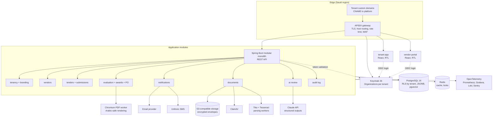

# Core Features and Tech Stack

Date: 2026-09-21
Status: proposal, for review before design
Depends on: `01-idea-competitors-features-ai.md`

This file lists the features that must exist for the product to be sellable to a Saudi mid-size private company, then the technology stack to build it with. Feature IDs (F-xx) and non-functional IDs (N-xx) are stable so later design and planning documents can reference them.

## 1. Actors

| Actor | Who | What they do |
|---|---|---|
| Platform admin | Us | Creates tenants, sets plans, monitors health. Never sees tender content. |
| Tenant admin | Customer's IT or procurement head | Branding, users, roles, approval limits, templates. |
| Contracts officer | Customer's contracts or procurement department | Drafts and publishes tenders, answers clarifications, runs compliance screening, opens financial envelopes, issues award and PO. |
| Technical evaluator | Customer's requesting department | Scores technical offers against criteria. |
| Finance approver | Customer's finance department | Approves award against budget and delegation of authority. |
| Vendor user | Supplier staff | Registers the company, maintains documents, submits offers, asks clarifications. |
| Auditor | Customer's internal audit (read-only) | Reads the event log and exports evidence. |

## 2. Core features (must exist in version 1)

### 2.1 Tenancy and branding

| ID | Feature | Acceptance |
|---|---|---|
| F-01 | Tenant provisioning | Platform admin creates a tenant with name, CR number, plan, and default language. Tenant is usable within minutes with no deployment. |
| F-02 | White-label branding | Tenant admin uploads logo and favicon, picks primary and accent colors, sets portal name. Vendor portal, emails, PDFs, and PO carry the tenant brand only. |
| F-03 | Custom subdomain | Each tenant gets `<slug>.platform.sa` by default and can map `tenders.customer.sa` with a CNAME. TLS issued automatically. |
| F-04 | Language and RTL | Every screen, email, and PDF is available in Arabic and English. Arabic is right-to-left throughout. Each user picks their language. Tender content can be entered in either or both. |
| F-05 | Tenant data isolation | No query can return another tenant's rows. Enforced in the database, not only in application code. |

### 2.2 Identity, users, and roles

| ID | Feature | Acceptance |
|---|---|---|
| F-06 | Tenant staff accounts | Tenant admin invites staff by email. Login with email and password plus optional TOTP. SSO via the tenant's Microsoft Entra ID or any OIDC provider is a plan feature. |
| F-07 | Roles | Built-in roles: Tenant admin, Contracts officer, Technical evaluator, Finance approver, Auditor. A user can hold several roles. |
| F-08 | Per-tender committee | For each tender, the contracts officer assigns named evaluators and approvers. Only committee members see that tender's offers. |
| F-09 | Delegation of authority | Tenant admin defines approval limits by amount (for example: under 100k one finance approver, above 1M two approvers plus CFO). The award flow enforces them. |
| F-10 | Vendor identity | One vendor company account works across all tenants on the platform. Each tenant separately approves or blocks the vendor. Vendor staff are invited by the vendor's own admin. |

### 2.3 Vendor registration and profile

| ID | Feature | Acceptance |
|---|---|---|
| F-11 | Vendor self-registration | Company name (Arabic and English), CR number, VAT number, address, contact, IBAN, activity categories. Email and phone verified. |
| F-12 | Vendor documents with expiry | CR, VAT certificate, GOSI certificate, Zakat certificate, Chamber of Commerce, Saudization (Nitaqat) status, ISO certificates. Each has an expiry date; expired documents block submission and trigger a reminder 30 days before. |
| F-13 | Local content fields | Local content percentage, Saudi employees count and percentage, and supporting evidence. Shown in comparison sheets. |
| F-14 | Tenant vendor list | Tenant sees pending, approved, and blocked vendors, can invite by email, and can tag by category. |

### 2.4 Tender authoring and publishing

| ID | Feature | Acceptance |
|---|---|---|
| F-15 | Tender types | RFQ (price only), RFP (technical and financial), and Tender (sealed two-envelope). The type decides which stages are active. |
| F-16 | Tender content | Title, reference number (tenant pattern), description, scope of work, terms and conditions, attachments, BoQ lines (item, unit, quantity), submission deadline, offer validity period, clarification deadline, bid bond requirement. |
| F-17 | Evaluation model | Contracts officer defines mandatory compliance checklist items, technical criteria with weights summing to 100, minimum technical pass mark, and the financial method (lowest price or weighted technical-financial split). |
| F-18 | Templates | Any tender can be saved as a tenant template and reused. |
| F-19 | Visibility | Open (any approved vendor on the tenant can submit) or invited (only listed vendors). Optional public listing page under the tenant's domain. |
| F-20 | Amendments | Publishing a change after release creates a new version, notifies all invited or registered vendors, and optionally extends the deadline. Previous versions stay visible. |
| F-21 | Clarifications | Vendors ask questions before the clarification deadline. Contracts officer answers privately or publishes the answer anonymised to all vendors. |

### 2.5 Offer submission (vendor portal)

| ID | Feature | Acceptance |
|---|---|---|
| F-22 | Submission wizard | Vendor confirms eligibility documents, uploads technical response, prices every BoQ line, uploads financial attachments, declares validity period, and submits. Progress is saved as draft. |
| F-23 | Sealed envelopes | Technical and financial parts are stored and encrypted separately. Before the financial opening event, no tenant user or platform admin can read financial content. The opening is a logged event with the names of the officers present. |
| F-24 | Deadline enforcement | Submission closes at the deadline using server time. Late submissions are refused with a recorded timestamp. Vendors can withdraw or resubmit before the deadline; each resubmission is versioned. |
| F-25 | Submission receipt | Vendor receives a PDF receipt with a hash of the submitted files, timestamp, and tender reference. |
| F-26 | Vendor dashboard | Open invitations, drafts, submitted offers, results, and expiring documents. Mobile-friendly. |

### 2.6 Evaluation chain

| ID | Feature | Acceptance |
|---|---|---|
| F-27 | Stage state machine | Draft, Published, Clarification, Closed, Compliance screening, Technical evaluation, Financial opening, Financial evaluation, Finance approval, Awarded, Cancelled. Only the role that owns a stage can move it forward. Every transition is logged. |
| F-28 | Compliance screening | Contracts officer marks each checklist item pass, fail, or waived with a reason per offer. Failed offers are excluded with a vendor notification. |
| F-29 | Technical scoring | Each evaluator scores every criterion for every compliant offer independently. Scores are hidden from other evaluators until all have submitted. Weighted average and pass or fail against the minimum mark are computed. |
| F-30 | Score locking | Once technical scores are locked, they cannot change. Locking is required before the financial envelope can be opened. |
| F-31 | Financial comparison sheet | Auto-generated table: vendor, each BoQ line price, totals, VAT, variance from internal estimate, arithmetic check, local content. Exportable to Excel. |
| F-32 | Combined ranking | Ranking by the financial method defined in F-17. Contracts officer can recommend a vendor other than rank one with a mandatory written justification. |
| F-33 | Finance approval | Approvers see the recommendation, ranking, budget code, and justification. Approve or return with a reason. Returns go back to the previous stage. Approval limits from F-09 are enforced. |
| F-34 | Cancellation | A tender can be cancelled at any stage with a reason, notifying vendors. |

### 2.7 Award and purchase order

| ID | Feature | Acceptance |
|---|---|---|
| F-35 | Award and regret letters | Branded PDFs generated from templates, sent to the winner and the other vendors. |
| F-36 | Purchase order | Branded PO PDF with tenant numbering pattern, line items from the winning offer, VAT, payment terms, delivery terms, and signatories. Recorded in a PO register. |
| F-37 | PO export | PO available as PDF and as a structured JSON or CSV export so the customer can key or import it into their ERP. Direct ERP push is a later paid integration. |

### 2.8 Notifications

| ID | Feature | Acceptance |
|---|---|---|
| F-38 | Channels | Email always. SMS through a Saudi provider (Unifonic or similar) for vendors. In-app notifications. WhatsApp is a later addition. |
| F-39 | Events | Invitation, amendment, clarification answered, deadline in 48 hours, submission received, stage advanced, action required from me, award or regret, document expiring. |
| F-40 | Digest and preferences | Users can choose immediate or daily digest per event type. |

### 2.9 Audit, reporting, and documents

| ID | Feature | Acceptance |
|---|---|---|
| F-41 | Immutable event log | Every create, update, transition, download, and login is appended with actor, tenant, timestamp, IP, and before or after values where relevant. Append-only. Retained for at least 10 years. |
| F-42 | Audit export | Auditor exports a tender's full history as a signed PDF bundle including all submitted files and their hashes. |
| F-43 | Dashboards | Per tenant: open tenders, average cycle time per stage, savings versus estimate, vendor participation rate, awards by vendor and category. |
| F-44 | Document storage | All files stored encrypted with virus scanning on upload, size limits, and allowed types. Financial files use a separate encryption key that is unlocked only at the opening event. |

### 2.10 AI offer review (assist only)

| ID | Feature | Acceptance |
|---|---|---|
| F-45 | Compliance pre-check | On submission close, the system produces a draft pass, fail, or unclear per checklist item with a page reference. The officer confirms or overrides each. |
| F-46 | Requirement coverage matrix | For RFP and Tender types, a table of each requirement with where the offer addresses it and a quoted excerpt. |
| F-47 | Draft technical scores | Suggested score per criterion with a short justification and quotes, shown as draft next to the evaluator's empty score fields. Never pre-filled into the evaluator's score. |
| F-48 | Financial sanity check | Arithmetic errors, unit mismatches, missing lines, and prices beyond a configurable variance from the median of other offers or the internal estimate. Runs only after F-30 locking. |
| F-49 | Integrity flags | Near-identical text or identical contact details across offers in the same tender. |
| F-50 | AI audit record | Every AI output is stored with model name, model version, prompt version, input hash, and the human decision. AI can be turned off per tenant. |

## 3. Non-functional requirements

| ID | Requirement | Target |
|---|---|---|
| N-01 | Data residency | All customer data, backups, and AI processing inside Saudi Arabia. |
| N-02 | PDPL compliance | Consent on vendor registration, data subject access and deletion process, processor agreement template for tenants. |
| N-03 | Security | OWASP ASVS level 2, encryption at rest and in transit, MFA for tenant staff, rate limiting, annual penetration test. |
| N-04 | Availability | 99.5% monthly for version 1. Submission deadline windows are the critical path: the platform must not miss a deadline because of a deploy. |
| N-05 | Performance | Page loads under 2 seconds on Saudi mobile networks. Uploads up to 100 MB per file. |
| N-06 | Scale for version 1 | 50 tenants, 5,000 vendors, 200 concurrent users, 10,000 documents. Design so that 10x needs no re-architecture. |
| N-07 | Backups | Daily encrypted backups, 35-day retention, restore tested monthly. |
| N-08 | Observability | Structured logs, metrics, traces, and alerts on failed notifications and failed submissions. |
| N-09 | Accessibility | Keyboard navigation and screen reader labels on vendor-facing screens. |

## 4. Tech stack

### 4.1 Recommended stack

The choice favours what you already run day to day (Java, Keycloak, API gateways, PlantUML and ADR practice) so that the side business does not also become a new-language learning project.

| Layer | Choice | Why |
|---|---|---|
| Language and runtime | Java 21 | Your main language. Virtual threads make a single service handle many concurrent uploads and notifications cheaply. |
| Application framework | Spring Boot 3.x, modular monolith | One deployable with clear module boundaries (tenancy, identity, vendors, tenders, evaluation, awards, notifications, documents, ai, audit). Split into services only when a module proves it needs to scale separately. |
| Persistence | PostgreSQL 16 | One database, `tenant_id` on every table, row-level security policies so F-05 is enforced in the database. JSONB for tender content and AI outputs. pgvector for AI retrieval over offer chunks. |
| Migrations | Flyway | Standard in Spring, versioned schema. |
| Identity | Keycloak 26 | You know it deeply. One realm for the platform. Keycloak Organizations gives one organization per tenant for staff and lets a vendor user belong to many organizations, which is exactly F-10. Tenant SSO (F-06) is an identity provider on the organization. |
| Authorization | Spring Security with tenant and role checks in code, Open Policy Agent optional later | Start simple. OPA only if per-tenant policy customisation becomes a sales requirement. |
| API gateway | Apache APISIX | You already use it. Handles per-tenant host routing, TLS termination for custom domains (F-03), rate limiting, and WAF plugins. |
| Frontend | React 18 with TypeScript, Vite, Ant Design, react-i18next | Ant Design has first-class RTL and Arabic locale support and a proven form and table library, which is most of this product. Two apps sharing one component library: `tenant-app` and `vendor-portal`. |
| PDF generation | OpenPDF or Thymeleaf to HTML then rendered by a headless Chromium worker | Arabic shaping in PDFs is a known pain. HTML to PDF through Chromium handles Arabic fonts and RTL correctly. |
| Document storage | S3-compatible object storage (MinIO self-hosted, or the cloud provider's S3 in a Saudi region) | Server-side encryption with per-tender keys for financial envelopes (F-23, F-44). |
| Document parsing and OCR | Apache Tika for text and tables, Tesseract with Arabic language pack for scanned PDFs | Feeds the AI features and full-text search. |
| Search | PostgreSQL full-text search with Arabic dictionary | Avoid running Elasticsearch until search becomes a product feature. |
| Background jobs and messaging | Spring Boot with a Postgres-backed job queue (JobRunr) | Notifications, parsing, AI runs, and scheduled deadline checks without a separate broker. Move to RabbitMQ only if volume demands it. |
| Cache and locks | Redis | Session data, rate limits, and the distributed lock around deadline closure so only one node closes a tender. |
| AI | Claude API via the official Java SDK, structured JSON outputs, prompt caching per tender | Strong Arabic and long-document handling. Keep it behind one `OfferReviewProvider` interface so the model or provider can be swapped without touching the domain code. |
| Email and SMS | Transactional email provider with a Saudi-region or GCC option, Unifonic for SMS | Both have simple APIs and Arabic support. |
| Virus scanning | ClamAV sidecar | Required before any uploaded file is stored as final. |
| Containers and deployment | Docker images, Docker Compose for development, Kubernetes (or the cloud provider's managed Kubernetes) for production | Matches your existing container work. |
| Hosting | A Saudi-region cloud: Oracle Cloud (Jeddah, Riyadh), Google Cloud (Dammam), STC Cloud, or AWS once its Saudi region is available | Pick the one that gives managed PostgreSQL, S3-compatible storage, and Kubernetes in-Kingdom at the best price. Verify at signing time. |
| Observability | OpenTelemetry, Prometheus, Grafana, Loki, and self-hosted Sentry | You already run Sentry. |
| CI/CD | GitHub Actions | Repository is already on GitHub. Build, test, scan (Trivy, OWASP dependency check), push image, deploy. |
| Diagrams and docs | Markdown, Mermaid, PlantUML for detailed design, ADRs in `docs/adr` | Your existing practice. |

### 4.2 Architecture overview



### 4.3 Tenancy model

- **Database:** single PostgreSQL instance, shared schema, `tenant_id` column on every tenant-owned table, row-level security policy `tenant_id = current_setting('app.tenant_id')`. The application sets the setting at the start of each request from the validated token. Platform-admin operations use a separate database role that bypasses RLS and is never used by the web request path.
- **Identity:** one Keycloak realm. Each tenant is a Keycloak Organization with its own domain, branding theme, and optional identity provider. Tenant staff are organization members with roles. Vendor users live in the same realm and are members of every organization that has approved their company, with a `vendor` role. Tokens carry the active organization so the API can set `app.tenant_id`.
- **Routing:** the gateway maps `Host` to tenant slug and forwards it as a header. The API verifies the header against the token's organization to stop a user on tenant A from calling tenant B's host.
- **Storage:** one bucket per environment, object keys prefixed by tenant, with a per-tender data key for financial envelopes held in the database encrypted by a master key in the cloud KMS.

### 4.4 Alternatives considered

| Option | When it would be better | Why not now |
|---|---|---|
| Node.js (NestJS) with Next.js | If a co-founder is a JavaScript developer, or if a single language across frontend and backend matters more than Java depth. | You would be learning the backend framework while building the product. |
| Quarkus instead of Spring Boot | Lower memory, faster start, same ecosystem Keycloak itself is built on. | Smaller hiring pool and fewer ready-made integrations. Reasonable to revisit if hosting cost becomes the main constraint. |
| Microservices from day one | Only if separate teams own separate modules. | One person or a small team ships faster with a monolith. The module boundaries above make a later split cheap. |
| Odoo or ERPNext as the base and customise | Fastest to a demo, includes accounting. | Weak vendor experience, hard to white-label properly, and the customisations become the product with no moat. |
| Camunda or Temporal for the tender workflow | If tenants need to design their own approval flows visually. | A state machine in code covers F-27 with far less operational weight. Add a workflow engine only when custom flows become a sales requirement. |

### 4.5 Repository layout (proposed)

```
ERP/
  docs/                      idea, features, stack, ADRs, design specs
  backend/                   Spring Boot modular monolith (Gradle or Maven multi-module)
    modules/tenancy
    modules/identity
    modules/vendors
    modules/tenders
    modules/evaluation
    modules/awards
    modules/notifications
    modules/documents
    modules/ai
    modules/audit
    app/                     wiring, configuration, migrations
  frontend/
    packages/ui              shared components, theme, i18n
    apps/tenant-app
    apps/vendor-portal
  infra/
    compose/                 local development
    k8s/                     production manifests or Helm chart
    keycloak/                realm export, themes
    apisix/                  routes and plugins
  .github/workflows/
```

## 5. Decisions needed before design

1. **PO scope:** confirm branded PDF plus structured export (F-36, F-37) for version 1, with ERP push as a later paid integration.
2. **Vendor identity:** confirm one platform-wide vendor account with per-tenant approval (F-10).
3. **Hosting provider:** pick the Saudi-region provider. Affects managed PostgreSQL, storage, and KMS choices.
4. **Frontend framework:** confirm React with Ant Design, or state a preference.
5. **First customer:** name the company whose workflow becomes the default template.
