# Diagrams: WaslaBid in Pictures

Date: 2026-09-21
Status: companion to `01-idea-competitors-features-ai.md` and `02-core-features-and-tech-stack.md`

Every diagram is Mermaid, so GitHub renders it in place. Each one has a two-line "how to read it" note. Feature IDs (F-xx) refer to document 02.

## 1. System context: who touches the platform

Read it as: the platform in the middle, people on the left and right, external systems below.

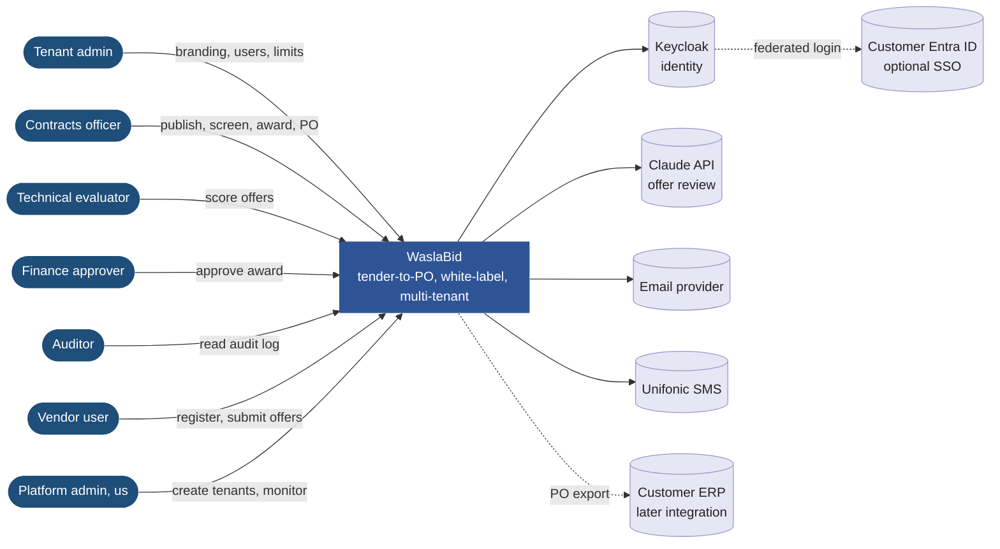

## 2. Who does what, in order

Read it as: each column is a role, time runs top to bottom, and each arrow is a hand-off. The AI column only ever hands drafts back to a person.

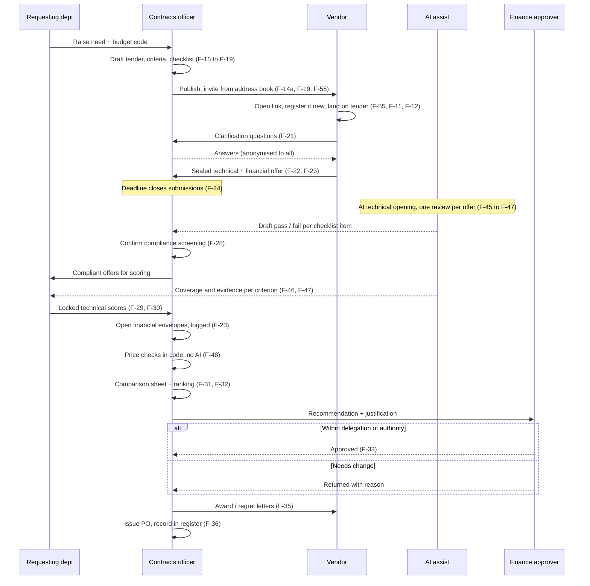

## 3. Tender lifecycle: the state machine (F-27)

Read it as: boxes are states a tender can be in, arrows are the only allowed moves, and the label on each arrow is the role that can make the move.

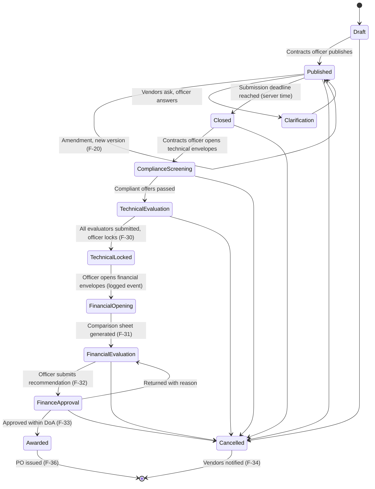

## 4. Sealed envelopes: how the price stays hidden (F-23)

Read it as: time runs top to bottom. The financial file is encrypted with a key that nobody can use until the opening event, and the opening itself is written to the audit log.

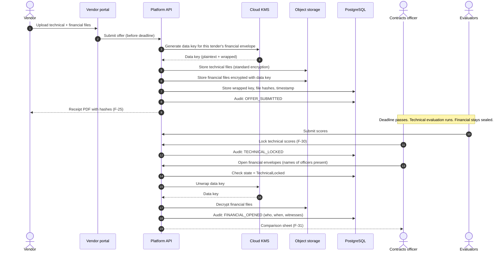

## 5. Login and tenant isolation: one request end to end

Read it as: the same user can never reach another tenant's data because the host, the token, and the database row policy must all agree. Caddy only terminates TLS; the tenant decision is made inside the app.

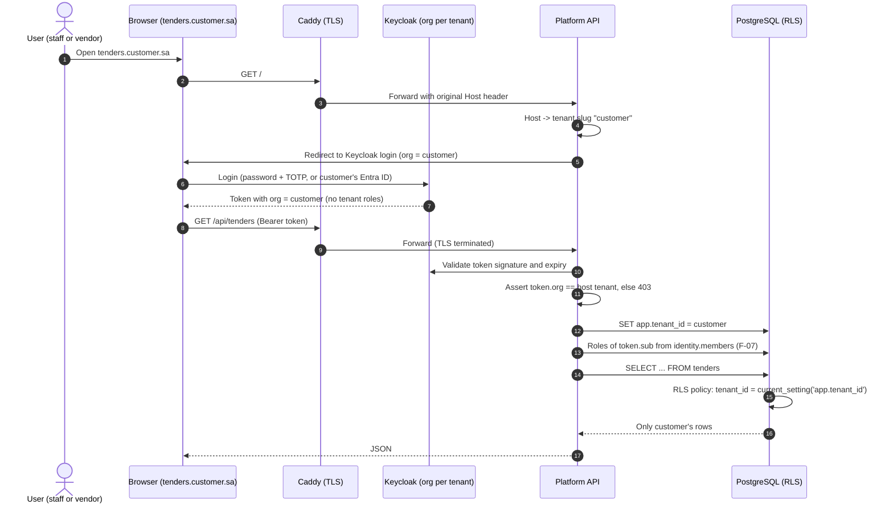

## 6. Tenancy model: one platform, many brands, shared vendors

Read it as: tenants are isolated boxes, vendors are shared and can be approved by several tenants, and each layer enforces the boundary in its own way.

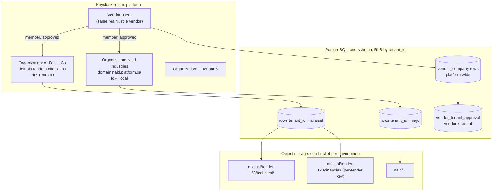

## 7. Core data model, part 1: tenants, vendors, tenders

Read it as: boxes are tables, lines are relationships, and the crow's foot end is the "many" side. Every table except the vendor tables carries a tenant_id.

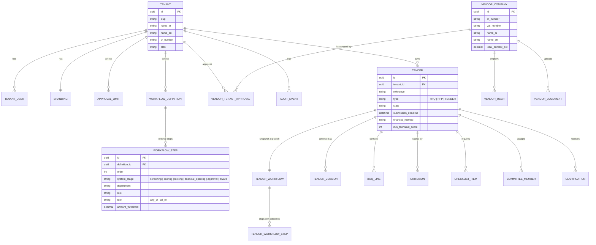

## 7b. Core data model, part 2: offers, evaluation, award

Read it as: one offer per vendor per tender, two envelopes per offer, and every AI output stored as its own row next to the human decision.

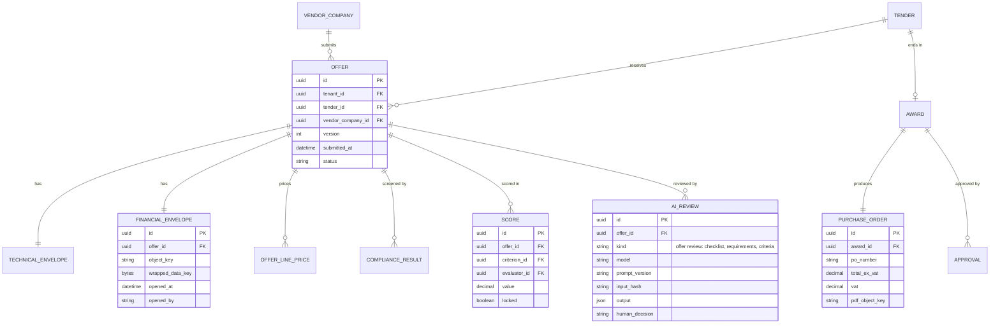

## 8. Application modules and how they depend on each other

Read it as: arrows point from the module that calls to the module it depends on. Nothing points back up, which keeps the monolith splittable later. Boxes with a thick dark border (tenancy, identity, audit, workflow, operations) exist in code today (`src/Modules/*`, checked against the project references); modules depend on each other only through their `*.Contracts` projects. Operations (F-51, F-54, F-60) is platform-level, not tenant-level: it depends on no other module, and the hosts (web, worker) wire it in.

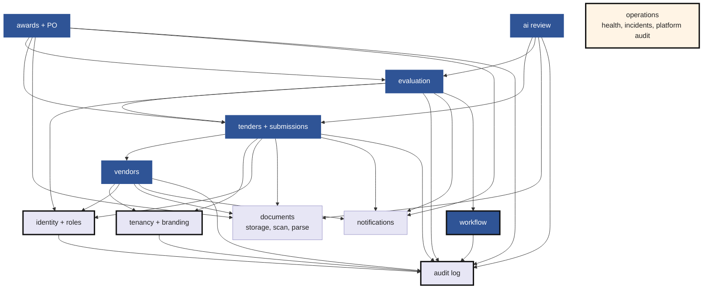

## 9. Deployment in a Saudi region

Read it as: everything inside the dashed box lives in one Saudi cloud region. Only email, SMS, and the model API cross the boundary, and none of them receive full offer files unless the provider is in-Kingdom.

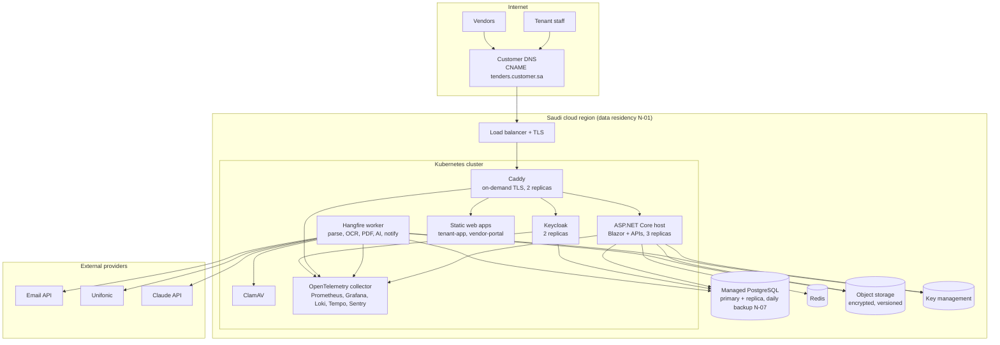

## 10. AI offer review: what happens to one offer

Read it as: left to right, one offer goes in once, at technical opening; one model call returns every draft; nothing is final until the person in the diamond acts. Design: `docs/superpowers/specs/2026-09-26-ai-offer-review-design.md`, ADR-0005.

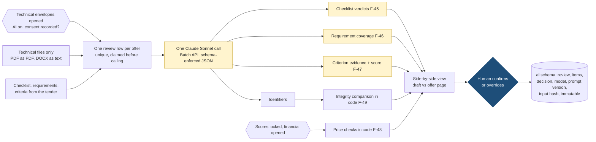

## 11. Roadmap: from idea to first paying customer

Read it as: bars are phases, and each phase ends with something a real person can use. Dates assume part-time effort by one or two people and will move.

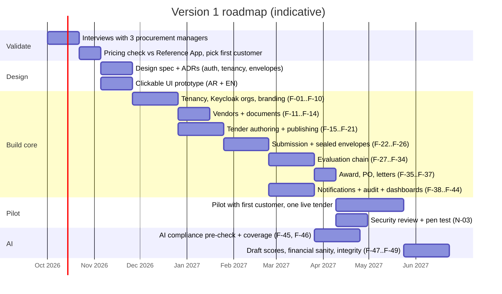

## 12. Feature map at a glance

Read it as: one branch per module, leaves are the feature IDs from document 02.

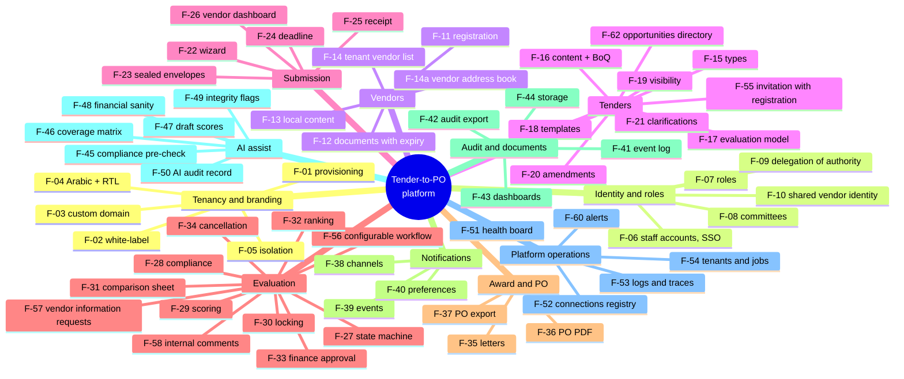
