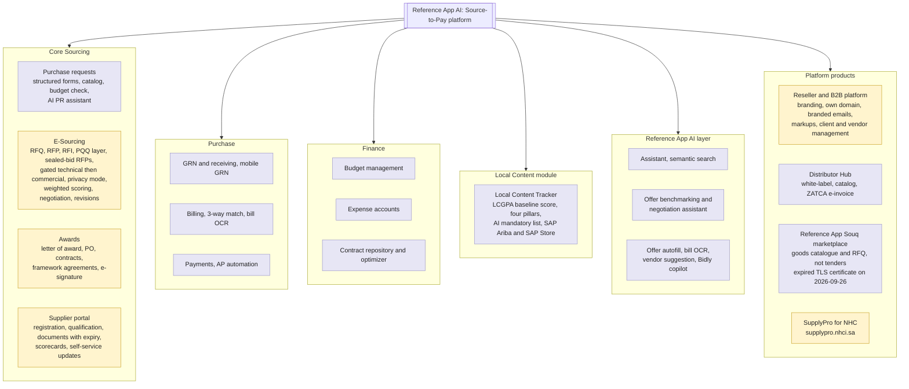
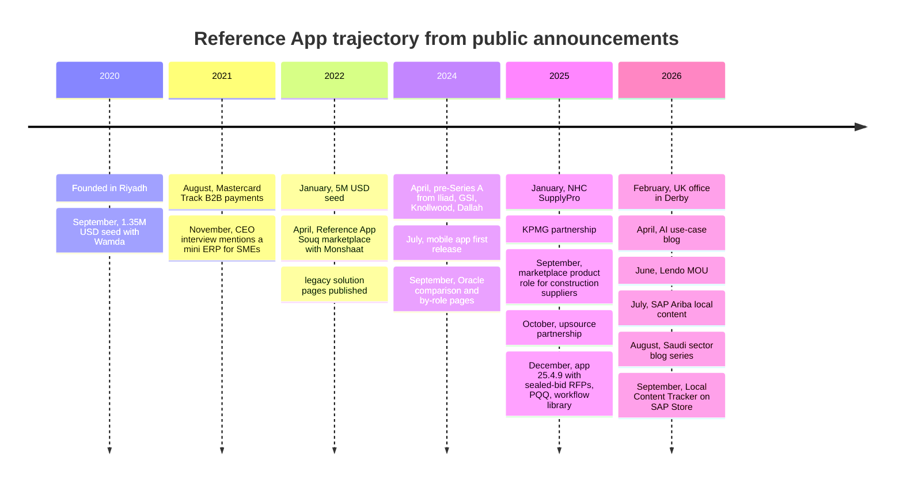
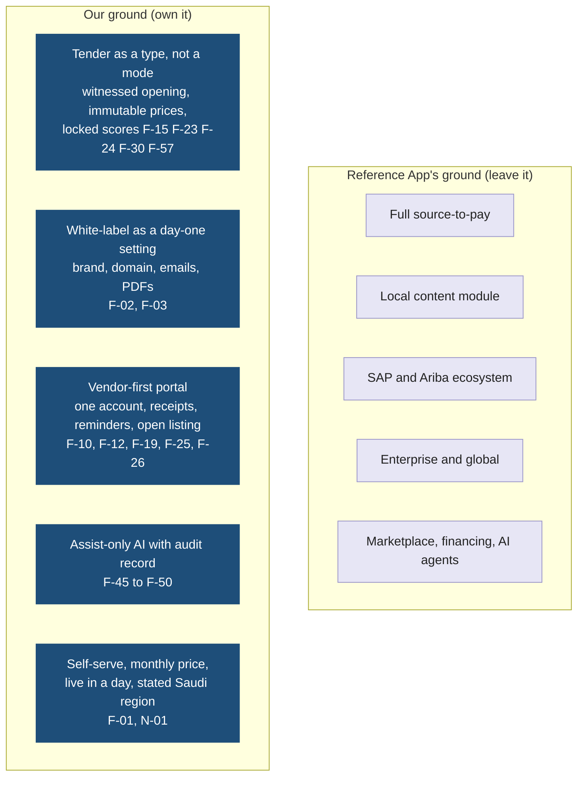
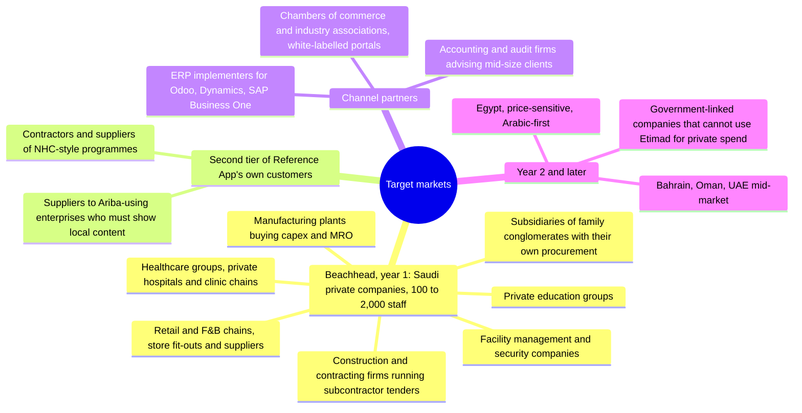

# Reference App: Features, Technology, Direction, Gaps, and How We Compete

Date: 2026-09-21 (baseline from eight pages; revised the same day after the full site sweep in section 3.4). Revised 2026-09-26: Reference App Souq status and the cross-buyer directory landscape (ADR-0007, F-62)
Status: competitor analysis from public sources. Items marked "not found publicly" were searched for and not confirmed; they are not proof of absence. Where the sweep contradicted the baseline, the row says "corrected 2026-09-21".
Related: `01-idea-competitors-features-ai.md` (landscape), `02-core-features-and-tech-stack.md` (our F-xx IDs), `05-mvp-scope.md` (what the pilot ships)

## 1. Snapshot

| Item | Fact | Source |
|---|---|---|
| Company | Reference App, brand "Reference App" and since 2026 "Reference App AI", Riyadh, founded 2020 by a four-person founding team. Legal entity for the app store: Reference App WLL (Bahrain) | Company overview, Crunchbase, PitchBook, App Store |
| Funding | 1.35M USD first seed, September 2020 (Wamda). 5M USD seed, January 2022, led by Outliers VC with Shorooq, Hambro Perks ORYX, Wamda, Class 5 Global. Undisclosed pre-Series A, April 2024, Iliad Partners, GSI, Knollwood, Dallah. Totals quoted between 6.35M and 10.3M USD depending on the database | AlKhaleej feature, Seed round, Pre-Series A, Crunchbase |
| Offices | Riyadh HQ; Abu Dhabi; Manama; Derby, UK (opened February 2026). UK entity Reference App Technologies Limited | TradeArabia, 2026-07-09, UK office, Companies House |
| Scale claims | "75+ countries", "over 1B USD" spend managed, 100,000 procurement activities, 11,000 suppliers onboarded, 130,000 supplier activities, "18.3 % cost reduction", "4x faster" request to PO, "go-live in days" | Home, Supplier portal, Landing |
| Target customer (their words) | Demo form offers 1-50, 51-200, 201-500, 500+ employees. A directory entry states "GCC and UK companies making 100M to 500M USD annually". A 2022 blog courted mid-market with catalogs and no pricing | Request demo, Art of Procurement, Mid-market blog, 2022-02-28 |
| Partners | KPMG, McKinsey, Voltalia, SAP Ariba (local content, July 2026), SAP Store listing (September 2026), Lendo (financing MOU, June 2026), upsource by solutions (October 2025), Monshaat (Reference App Souq), Mastercard Track B2B payments (August 2021), NHC (SupplyPro, January 2025) | Newsroom |
| Named customers | Carrier, MSC, NICE, 17Sixty, National Housing Company | reference app site, Wamda |
| Pricing | "Enterprise Ready" from 50,000 USD, "Enterprise Ready Customizable" from 150,000 USD (engineering manager added), "Special Projects" on request (full-time engineers). Every plan includes standard configuration, implementation manager, account manager, post-implementation support. Unlimited basic users, core users "to be defined". Arabic pricing page shows the same USD figures. Feature checklist on the same page: see section 3.2. "Billing solely based on the number of modules and users" and "1 to 3 months" implementation on the Oracle comparison page | Pricing, Arabic pricing, Reference App vs Oracle |
| Trial | Conflict. An orphan page `/start-trial/` (last modified 2023-07-14, not linked from the navigation) offers a trial "no credit card needed" with module selection. The current pricing, landing, and demo pages mention no trial; GetApp and Software Advice list none. Prefer the current pages: no trial in practice, verify on a call | Start trial, Pricing, GetApp |
| Mobile app | "Reference App" on the App Store, seller Reference App WLL, first release 2024-07-19, version 25.4.9 on 2025-12-29, English only. Description: "Users can raise requests and grant approvals", so a buyer and approver app. Android listed on Capterra; a Google Play listing was not found (the "Reference App AI" developer on Play is an unrelated direct-sales app) | App Store, Capterra |
| Reviews | Capterra: one review, 5.0, 87 listed features, April 2023. SourceForge: four reviews, 4.8, languages Arabic and English, integrations Fusion, NetSuite, SAP S/4HANA, Xero, Zoho Books. Cons: small remarks fields, filters lost on back, cannot open RFQs in a new tab | Capterra, SourceForge |
| Help centre | the reference app help centre is a Zoho Desk portal (`/portal/en/kb`); content renders client-side and could not be read on 2026-09-21 | Help centre |

## 2. Product map

Read it as: everything Reference App sells, grouped the way their site groups it. Highlighted boxes overlap with our version 1. Corrected 2026-09-21: sealed bids and white-label moved into the overlap after the sweep.

## 3. Core features, mapped to ours

### 3.1 Baseline rows, corrected after the sweep

| Reference App module | What they have (public) | Our equivalent | Verdict |
|---|---|---|---|
| Purchase requests | Structured requisition forms, category and budget guidance, catalog with bulk import, approvals "triggered automatically based on value, category, or team", multi-level with remarks, request watchers who get notifications (app 6.7.0, 2025-09-12) | Not in version 1. Our flow starts at the tender, with a budget code on the need (F-16) | Deliberate gap. Requisitions belong to P2P, not tendering |
| E-Sourcing | RFQ, RFP, RFI in one place. Technical and commercial sections. Guided supplier response form. Automatic comparison table with unit price excl. and incl. tax columns. "Assign scoring responsibilities and apply weighted evaluation rules". "Negotiate with multiple suppliers at once in a single view". "Send revision requests and track updated offers". Route sourcing events for internal review by value or category. Full action record. Templates for eRFx. Vendors can add non-price factors and discount plans (2022 page) | F-15 to F-21 authoring, F-22 submission, F-28 to F-32 evaluation, F-41 audit | Overlap. Corrected 2026-09-21: they are deeper than the baseline said (see the sealed bid and PQQ rows), but the model is still RFQ-shaped with revision and negotiation |
| Vendor communication after submission | Negotiation in one view; revision requests that produce an updated offer, so a price can change after submission. "Centralize vendor Q&A within the sourcing event, creating a transparent record visible to all participants" (blog, 2026-04-22). "Manage clarifications in real time" (blog, 2026-08-17). Internal department threads not found publicly | F-21 clarifications, F-57 information requests (one channel through the officer, prices immutable, questions logged), F-58 internal comment threads never visible to vendors | Different rule, not a gap. Theirs allows price revision; ours forbids it after the deadline, which is what a formal tender and its auditor require. Parity on public Q&A |
| Sealed bids, opening event | Corrected 2026-09-21. "Sealed Bids" is a listed sourcing feature on the pricing page. App release 25.4.9 (2025-12-29): "Gated Technical & Commercial Evaluations" for "Sealed Bid RFPs", "Commercial submissions are now strictly hidden until the technical evaluation is completed", "Scoring privacy is enforced". Separate encryption keys, a logged opening event with named officers, bid bonds, and platform-admin exclusion not found publicly | F-23 sealed envelopes with separate keys (F-44), F-30 locking as a precondition, opening logged with witnesses | Narrowed differentiator. They gate the commercial view in the application; we make it a cryptographic and audited event. Verify in a demo who can override the gate |
| Per-tender committee, independent blind scoring | Corrected 2026-09-21. "Saved Approver Groups", "Privacy Mode setting that allows organizations to hide responses and scores", scoring responsibility assignable (app 25.4.9). Whether evaluators are hidden from each other, or only from requesters and vendors, is not stated | F-08 per-tender committee bound to the workflow snapshot, F-29 scores hidden between evaluators until all submit | Near parity on paper. Ours is a fixed rule of the state machine; theirs is a setting. Verify the scope of Privacy Mode |
| Pre-qualification | New 2026-09-21. "Pre-Qualification Questionnaire (PQQ) layer to the sourcing process", triggerable before RFQ submission or before award; questionnaires editable until submission (app 25.4.9). Blog: "distribute them to a prequalified supplier network" | F-12 documents with expiry (pre-submission), F-28 compliance checklist (post-submission). No structured PQQ step | Their advantage. Candidate story in section 12 |
| Direct award | New 2026-09-21. "Direct Award" with a "6-point justification form" for a preferred vendor (app 25.4.9) | F-32 mandatory written justification when recommending other than rank one; no direct-award path by design | Different rule. A formal tender has no direct award; keep it out |
| Delegation of authority and workflow | Corrected 2026-09-21. "Workflow Library that decouples approval flows from specific workspaces"; "Routing Selector logic ... picks the appropriate workflow based on conditions like amount bands, vendor preference, or category" (app 25.4.9). Multi-level with remarks; standardised remarks across modules (6.5.0). "Role-based routing, threshold-based approvals" (blog, 2026-08-09) | F-09 amount thresholds, F-56 tenant workflow definitions with per-tender snapshot and fixed points (ADR-0003), F-33 finance approval | Parity on configuration; their library is more mature. Our difference: the running tender uses a snapshot that later edits cannot change, and sealed envelopes, locking, deadlines, and audit cannot be reordered |
| Supplier management | Registration, qualification, document collection, onboarding, "automating expiry tracking, and supporting electronic signatures" (blog, 2026-08-31), scorecards for delivery, quality, contractual compliance, risk alerts, "self-service portal to update records, upload licenses, and respond to requests" (blog, 2026-08-19), "CR Owner Type" vendor field (app 5.4.0), download of a single vendor profile, vendor list export | F-11 to F-14, F-14a | Parity on registration and documents. Their performance scorecards are later for us |
| Document expiry enforcement | Corrected 2026-09-21. Expiry tracking is claimed (blog, 2026-08-31). "Automated reminders for expiring invitation attachments" at 45 days to the vendor and 30 days to the manager; attachment expiry optional per invitation (app 6.7.0, 5.6.0). Blocking a submission when a certificate has expired not found publicly | F-12 expired document blocks submission, reminder 30 days before | Reminder parity. The block is still ours to verify |
| Local content and Saudization | Full module: LCGPA baseline score across four pillars, auto-classified transactions, drill-down to transaction, targets, CSV export "structured for LCGPA audit submissions", ERP or bulk-upload ingestion, "AI Mandatory List" matching RFQ items to the LCGPA list, SAP Ariba integration, SAP Store listing | F-13 fields on the vendor profile, shown in comparison sheets | They win on depth. We only need the fields, not the module |
| Awards, POs, contracts | Corrected 2026-09-21. Pricing checklist: "Letter of Award (LOA)", "Purchase Orders (POs)", "Contracts", "Framework Agreements / Utilization Tracking", "Multi-Framework Agreement". POs in vendor currency, custom terms, auto-created from approved offers, "automatically sends it to vendors by email", sync "via API, CSV, or custom file formats". E-Signature listed under integrations | F-35 award and regret letters, F-36 PO PDF, F-37 export | Parity on LOA and PO. Regret letters to losing vendors not found publicly. Contracts and framework agreements are out of scope for us; e-signature is a candidate (section 12) |
| GRN, billing, payments, budgets, expenses | Full P2P: mobile-friendly GRN, partial deliveries, 3-way match, bill OCR, rule-based invoice approvals, ERP push to SAP S/4HANA, Oracle JD Edwards, Odoo, budget deduction on approval, expense claims from mobile | Out of scope for version 1 by design | Deliberate gap. This is where the 50,000 USD price comes from |
| AI | "Limited usage AI Features" in every plan. AI PR assistant, AI sourcing assistant, "AI agent for offer benchmarking and negotiation assistant", "AI Knowledge intelligence", offer autofill from PDF, Excel, Word with mismatches flagged for review, bill OCR, semantic catalog search, vendor suggestion, AI mandatory list, Bidly AI copilot (visual search, RFQ and BoQ autofill). No model or vendor named; no statement that outputs are stored with model and prompt version | F-45 to F-50: compliance pre-check, coverage matrix, draft scores with quotes, financial sanity after locking, integrity flags, AI audit record; AI can be switched off per tenant | Different philosophy. Theirs speeds up the buyer's work and negotiates; ours assists evaluators on the vendor's documents and records every output. The "negotiation assistant" wording (2026) is softer than the "AI negotiation" claim on the home page |
| White-label for the buyer's brand | Corrected 2026-09-21. "White-labeling" is a default feature in every plan on the pricing page. Reseller and "B2B e-commerce as a platform" pages: "Customise the branding to match your organization's identity", "Tailored emails containing your logo and colour scheme", "Use your domain". Distributor Hub: "Platform White-Label". Whether a mid-size buyer can brand its own supplier-facing sourcing portal and map a domain without an implementation project is not stated | F-02, F-03 self-serve branding and custom domain with automatic TLS, applied to vendor portal, emails, PDFs, PO | Narrowed differentiator. They sell it inside a 50,000 USD plan and to reseller operators; we make it a tenant setting on day one. Verify what "white-labeling" covers in the Enterprise Ready plan |
| Marketplace and sector platforms | Corrected 2026-09-26. Reference App Souq is a catalogue and RFQ marketplace for goods (office supplies, electronics, hardware, HVAC, building materials), launched April 2022 with a Monshaat partnership to onboard SME sellers; it is not a tender directory. Its host refused connections on 2026-09-21 and returned an expired TLS certificate on 2026-09-26. Activity in 2025 or 2026 not found publicly. A cross-buyer tender directory is already run by Monafasat, a private Riyadh company founded in 2022 (document 01 section 3.2), not by Reference App. SupplyPro for NHC at supplypro.nhci.sa (announced 2025-01-27). A senior product manager role for "communities and marketplaces" (2025-09-28) targets suppliers who "respond to tenders" with "rapid growth ... particularly in the construction and contracting sectors" | Not in version 1. F-10 vendor identity across tenants is our network effect; F-62 cross-tenant opportunities directory, gated (ADR-0007) | Watch. Their marketplace hiring aims at the construction supplier base we want as vendors, but the public marketplace sells goods, not tenders. For a cross-buyer tender directory the precedent to watch is Monafasat, not Reference App |
| Mobile | Native app for buyers and approvers: requests, approvals, SSO via in-app browser (6.2.0). English only. Mobile-friendly GRN and expense capture on the web. A supplier app not found publicly | F-26 mobile-friendly vendor dashboard | Their advantage for approvers; ours on the vendor side, if we deliver it. Verify whether suppliers can submit from a phone on Reference App |
| Arabic and RTL | Corrected 2026-09-21. Full Arabic marketing site with translated product pages; "available in both English and Arabic" (blog, 2026-08-09); "Arabic and English interfaces across onboarding, contract management, and communication" (blog, 2026-08-19); SourceForge lists Arabic. The app store listing is English only. The Arabic e-sourcing page uses RFQ, RFP, RFI wording, not مناقصة or مظاريف مغلقة | F-04 every screen, email, and PDF in both languages, RTL throughout | Parity on the web UI. Verify vendor-side Arabic quality and Arabic PDFs |
| ZATCA e-invoicing | Corrected 2026-09-21. Distributor Hub: "Approved by ZATCA", "ZATCA compliant E-Invoice platform" (page last modified 2023-07-14). Reseller: "Validate your invoices through ZATKA confirmed as optional offering" (2024-02-15). The global e-invoicing page (2022) names no country. Source-to-pay product pages do not mention ZATCA | ZATCA-ready vendor data on the profile (document 01); no invoicing in version 1 | Their advantage in P2P, outside our wedge |
| Integrations | Pricing checklist: "Major Cloud-based ERPs (SAP, Oracle, Microsoft, Odoo...etc)", "E-Signature", "Other cloud-base Platforms". Pages name SAP S/4HANA, Oracle JD Edwards, Odoo, QuickBooks, NetSuite; SourceForge adds Fusion, Xero, Zoho Books; the backend job names Oracle Fusion. SAP Ariba and SAP Store for local content. SSO exists (mobile fix 6.2.0); identity providers not named | F-06 SSO via Entra ID or OIDC, F-37 structured PO export, ERP push later as paid integration | They win. Expected for an enterprise product |
| Open or public tenders | Sourcing goes to "pre-approved vendor lists"; a public listing page for open tenders not found publicly | F-19 Open visibility with a public listing under the tenant domain, registration through the invitation flow (F-55) | Our advantage, verify |
| Submission receipt and file hashes | Not found publicly | F-25 PDF receipt with hash, timestamp, reference | Our advantage, verify |
| Vendor identity across buyers | Not found publicly on the product pages; the reseller platform manages "clients" and "vendors" per operator | F-10 one vendor account across all tenants, approval per tenant | Our advantage, verify (section 10 item 5) |
| Audit | "Capture a complete record of every action, change, and decision"; "one secure, timestamped log"; CSV exports; "Timeline UI" (app 5.6.0). Retention period, immutability guarantee, and a signed evidence bundle not found publicly | F-41 append-only log retained 10 years, F-42 signed audit export with file hashes | Parity on the log; the signed bundle is ours |
| Security and hosting | Integration and Security page carries three unlabeled "Globally Recognized Standards" badges and no text on encryption, SSO, backups, uptime, or region. ISO 27001 or SOC 2 not found publicly. Backend job posting asks for "GCP deployments and pipelines management" (posted 2021, still listed). No data residency statement on the English or Arabic site | N-01 all data, backups, and AI processing in Saudi Arabia; N-03 ASVS level 2 | Our advantage if we state it. Verify their region on a call |
| Procurement as a service | "Procurement as service: Included" on the Oracle comparison (40+ specialists, 10,000+ products); a `/by-need/procurement-services/` page offers sourcing support and supplier engagement alongside the software | No counterpart, and none needed for a tendering tool | Their model, not ours |

### 3.2 The pricing page feature checklist, item by item

Every plan lists the same checklist (pricing page, read 2026-09-21). This is the closest thing to a public feature list Reference App publishes, so it is mapped in full.

| Group | Reference App item (verbatim) | Our ID | Verdict |
|---|---|---|---|
| Default | Advance approval workflow | F-56, F-09, F-33 | Parity |
| Default | White-labeling | F-02, F-03 | Narrowed differentiator, scope unverified |
| Default | Email Integration | F-38 | Parity |
| Default | Products & Catalogues | none | Deliberate gap |
| Default | Workspaces | none (tenant is the unit) | No counterpart needed |
| Default | Vendor Management | F-11 to F-14 | Parity |
| Default | Limited usage AI Features | F-45 to F-50 | Different philosophy |
| Pre-Sourcing | Internal Sourcing Request, Internal Purchase Request, Internal Agreement Request, AI agents for purchase requisitions | none | Deliberate gap |
| Sourcing | RFQs, RFPs | F-15 | Parity. Our third type, Tender (sealed two-envelope), has no named counterpart; their sealed bid is a mode of RFP |
| Sourcing | Offers comparison, analysis, and negotiation | F-31, F-32; negotiation deliberately absent | Different rule |
| Sourcing | Sealed Bids | F-23, F-30, F-44 | Narrowed differentiator |
| Sourcing | Evaluation / Scoring | F-17, F-28, F-29 | Parity |
| Sourcing | AI agent for offer benchmarking and negotiation assistant | F-48 partially (variance from estimate and median) | Different philosophy |
| Finance | GRN, Billing management, Payment, Budget management, Expense Accounts | none | Deliberate gap |
| Awarding & Contract | Letter of Award (LOA) | F-35 | Parity; regret letters unverified |
| Awarding & Contract | Purchase Orders (POs) | F-36, F-37 | Parity |
| Awarding & Contract | Contracts, Framework Agreements / Utilization Tracking, Multi-Framework Agreement | none | Deliberate gap for version 1 |
| AI | AI PR Assistant, AI Sourcing Assistant, AI Knowledge intelligence | F-45 to F-47 loosely | Different philosophy |
| Integration | Major Cloud-based ERPs (SAP, Oracle, Microsoft, Odoo...etc) | F-37 export; F-37b import files for Odoo, SAP and Oracle (P2), no live push | Their advantage, narrowed by F-37b |
| Integration | E-Signature | none | Candidate, section 12 |
| Integration | Other cloud-base Platforms | none | Their advantage |
| Users | Unlimited basic users, core users To Be Defined | F-06, F-07 | Pricing lever they hold back; ours is per tenant |

### 3.3 What the sweep did not find

Searched on every product, solution, FAQ, pricing, and 2025 to 2026 blog page, the app store release notes, and the review sites. Each is "not found publicly", not "absent".

- A witnessed financial opening event with named officers, or financial files encrypted with a key that only the opening releases (F-23, F-44).
- A rule that prices cannot change after the deadline (F-24, F-57). The opposite is advertised.
- A tender type with bid bond, validity period, and clarification deadline as first-class fields (F-16).
- Regret letters to unsuccessful vendors (F-35).
- A vendor-side submission receipt with file hashes (F-25).
- One supplier account across several buyers (F-10).
- A public listing page for open tenders (F-19).
- A hosting region, data residency commitment, ISO 27001, or SOC 2 (N-01, N-03).
- A stored model and prompt version per AI output (F-50).
- An SME or monthly price, or a live trial reachable from the navigation.
- A supplier mobile app or Arabic in the mobile app.
- Blocking a submission when a supplier certificate has expired (F-12).

### 3.4 Full site sweep, 2026-09-21

**Discovery.** `(link withheld)` and `sitemap_index.xml` both return the same index of 11 child sitemaps: post, page, elementskit_content, jobs, news, webinar, whitepapers, category, post_tag, page_category, position. Counts as parsed: page 88 entries (44 English, 44 Arabic mirrors), post 96 entries reported (the blog index shows 2026 posts beyond the parsed list, so the true count is higher), news 26 (13 English), webinar 10 (5), whitepapers 10 (5), jobs 10 (5), elementskit 14 (menu fragments, skipped), taxonomy sitemaps skipped. The home page navigation exposed the `/source-to-pay/`, `/local-content/`, `/by-need/`, and `/by-role/` trees, which the page sitemap parser did not list, plus (page withheld) and `/by-need/procurement-services/` found through search. About 130 unique English content URLs were found, about 260 with Arabic mirrors.

**Fetched and read: 97 reference app site pages, 8 sitemaps, 13 external sources.**

| Group | Pages read |
|---|---|
| Home and company | `/`, `/ar/`, `/company-overview/`, `/landing/`, `/product/`, `/careers/`, `/people-team-contact/`, `/request-demo/`, `/pricing/`, `/ar/pricing/`, `/start-trial/`, (page withheld), `/integration-amp-security/`, `/industries/`, `/industries/manufacturing/` |
| Source-to-pay tree | `/source-to-pay/`, `/source-to-pay/core-sourcing/`, `.../purchase-requests/`, `.../e-sourcing-rfq/` (English and Arabic), `.../pos-awards/`, `.../supplier-management/`, `/source-to-pay/purchase/`, `.../grn-receiving/`, `.../billing-management/`, `.../payments/`, `/source-to-pay/finance/budget-management/`, `.../expense-accounts/`, `/source-to-pay-oou/supplier-management/`, `/e_procurement/` |
| Local content | `/local-content/`, `/live-dashboards/`, `/spend-insights/`, `/audit-reday/`, `/data-consolidation/`, whitepaper `local-content-tracker-for-lcgpa-vision-2030-compliance` |
| By need and by role | `/by-need/procurement-ai/`, `/ap-automation/`, `/cost-optimization/`, `/digital-transformation/`, `/supplier-risk-management/`, `/procurement-services/`; `/by-role/procurement/`, `/finance/`, `/supply-chain/`, `/it/` |
| AI | (page withheld), `/bidly-ai-2/`, blog posts `types-of-procurement-ai` (2026-09-06), `procurement-ai-vs-traditional-procurement-software-whats-the-difference` (2026-08-30), `blog-ai-use-cases-procurement` (2026-04-15) |
| Platform products | `/reseller/`, `/reseller-questions/`, `/distributor-hub/`, `/b2b-e-commerce-as-platform/`, `/suppliers/` |
| FAQ | `/general-questions/`, `/company-questions/`, `/e-source-questions/` (all four FAQ pages carry the same five P2P answers) |
| Legacy 2022 solution pages | `/advanced-sourcing/`, `/global-e-invoicing-compliance/`, (page withheld), `/online-payment-solutions/`, `/inventory-management-solution/`, `/category-management-solution/`, `/research-material-management-solutions/`, `/invoice-solution-that-frees-your-time/`, (page withheld), `/digital-mailroom-solutions/`, `/spend-analytics-solution-old/` (generic copy, last modified 2022; treat as claims, not shipped modules) |
| Blog, 2025 to 2026 | (page withheld) (2026-08-31), `rfp-in-procurement-meaning-process-and-real-world-examples` (2026-04-22), `rfp-process-steps` (2026-08-17), `construction-procurement-management-software` (2026-08-13), `healthcare-procurement-saudi-arabia` (2026-08-09), `supplier-relationship-management-saudi` (2026-08-19), `procurement-management-software-for-transportation-companies` (2026-07-27), blog index pages 1 to 3 |
| Blog, older, feature check only | (page withheld) (2022-02-28), `top-5-advantages-of-etendering` (2022-04-21), `etendring-and-online-procurement` (2022-04-23), `things-to-look-for-in-esourcing-software` (2022-04-30), `why-suppliers-and-buyers-need-e-sourcing` (2022-08-20), `contract-negotiation-in-eprocurement` (2022-04-25). None describes a Reference App tendering feature |
| News | (page withheld) (2021-08-09), (page withheld) (2020-09-25), (page withheld) (2025-01-27), (page withheld) (2025-10-28); the rest were already in the baseline |
| Webinars | (page withheld), `from-year-end-audits-to-real-time-local-content-visibility` (dates corrupted on the pages) |
| Jobs | `senior-backend-development-engineer`, `senior-product-manager-communities-marketplaces` |
| External | App Store (US and MX listings with full version history), Google Play developer search, Capterra, Software Advice, SourceForge, GetApp, Art of Procurement directory, MarcoPolis CEO interview (2021-11-17), The Startup Scene (pre-Series A), TradeArabia (SAP Ariba), Crunchbase and PitchBook via search |

**Could not access.** the reference app marketplace (connection refused on both `/` and `/en/`); the reference app docs site (no DNS record); the reference app help centre (Zoho portal shell only, `/en`, `/hc/en-us`, `/portal/en/kb/articles` return 404 or an empty shell); the reference app web app, `/ar/login`, `/en/register`, `/en/signup` (title only, no form content); a Google Play listing for the procurement app. Rechecked 2026-09-26: the marketplace host now answers but with an expired TLS certificate, so its content could not be read.

## 4. Core technology

Everything below comes from job postings, app store metadata, and public listings, so treat it as the shape of the stack rather than a blueprint.

| Layer | Reference App | Note |
|---|---|---|
| Frontend | Angular with TypeScript ("MEAN stack"), WebSockets, backend-for-frontend pattern, Nx monorepo | Single-page app with a separate API layer |
| Backend | Node.js with Express and NestJS, REST, gRPC or connectrpc between services, microservices, message queues, data pipelines | Service-oriented, not a monolith |
| Data | MongoDB preferred, SQL databases, distributed caches, ETL | Document store fits their flexible forms. Immutable audit and row-level tenant isolation become application discipline rather than database guarantees |
| Mobile | Native iOS app (Reference App WLL, first release 2024-07-19, version 25.4.9 on 2025-12-29, English only); Android per Capterra, Play listing not found | Buyer and approver app; SSO through an in-app browser |
| Cloud | "GCP deployments and pipelines management" in the backend job posting (2021). No region stated anywhere on the site | Google Cloud has a Dammam region, but Reference App makes no residency claim. Ask directly |
| Integration | REST APIs, CSV and custom file exports, ERP connectors (SAP S/4HANA, Oracle JD Edwards, Oracle Fusion, Odoo, NetSuite, QuickBooks, Xero, Zoho Books named across pages), e-signature integration, SAP Ariba and SAP Store for local content | The SAP relationship is their enterprise path |
| Marketing and support | WordPress with Elementor (elementskit sitemap), Zoho Desk help centre | Not product signals, but the help centre being unreadable means release notes on the App Store are the only public changelog |

What this means for us: our stack choice (document 02) is deliberately the opposite shape. One .NET host, PostgreSQL with row-level security, and Blazor Server give a two-person team a smaller surface to build and operate, and let us make audit and isolation guarantees in the database that Reference App has to make in code.

## 5. Direction and roadmap signals

Read it as: what they announced, in order. Corrected 2026-09-21: pre-Series A moved to 2024, NHC to January 2025, and the December 2025 app release added because it is the first public evidence of sealed bids.

**Where they are heading, inferred from the announcements**

1. **Up-market and into the SAP ecosystem.** SAP Ariba partnership and SAP Store listing position the Local Content Tracker as an add-on that large Ariba customers buy. Pricing from 50,000 USD with an implementation manager confirms the enterprise motion.
2. **Local content as the wedge.** The local content module, the AI mandatory list, and three of the last six announcements are about local content. This is a Saudi regulatory need for large companies and government contractors, not for a 300-person private company.
3. **Global expansion.** Offices in Abu Dhabi, Manama, and Derby, "75 countries", and the "Reference App AI" rebrand aim at a generic international spend-management story.
4. **Embedded finance.** The Lendo MOU and the earlier Mastercard Track integration point at supplier financing and payments inside the flow, which needs the P2P modules and volume.
5. **AI as agents.** The pricing page sells "AI agents" for requisitions, benchmarking, and negotiation assistance; the blog frames procurement AI as self-improving and autonomous.
6. **Sourcing formality is being added.** The December 2025 release added sealed-bid RFPs, gated evaluations, PQQ, and direct award with justification. This is the first sign that Reference App is moving toward the formal process our wedge depends on, delivered as settings inside an RFQ product.
7. **Marketplaces aimed at construction suppliers.** The communities and marketplaces product role names construction and contracting as the growth sector, which is our beachhead's vendor base. Note 2026-09-26: this is a hiring signal only; the one public marketplace (Souq) is a goods catalogue with an expired certificate, and a tender marketplace from Reference App is not found publicly.
8. **Sector platforms as bespoke deals.** SupplyPro shows they will build a branded, sector-specific platform when a large partner such as NHC pays for it, and the reseller and B2B platform products show the branding machinery already exists.

## 6. Gaps and what is missing for the Saudi mid-market

| Gap | Evidence | Why it matters to a 100 to 2,000 staff company |
|---|---|---|
| No SME price point | Plans start at 50,000 USD, no self-serve tier, no trial reachable from the navigation, demo form still accepts 1-50 employee companies | A department head cannot sign that. It needs a board-level budget line |
| Implementation project required | Every plan includes an implementation manager and "standard configuration"; "1 to 3 months" on their own comparison page | Weeks to go live. Mid-size buyers want to run their next tender this month |
| Formal tender process is a mode, not the product (corrected 2026-09-21) | Sealed-bid RFPs exist since December 2025 as gating and privacy settings inside RFP. A witnessed opening, separate encryption, immutable prices, bid bonds, and regret letters are not found publicly. The Arabic pages never use مناقصة or مظاريف مغلقة | A contracts department that runs a two-envelope process on paper will ask who can switch the gate off and whether a price can be revised. On Reference App the answer to the second is yes |
| White-label is inside an enterprise plan (corrected 2026-09-21) | "White-labeling" is a default plan feature and the reseller products offer branding, branded emails, and "use your domain". Scope for a buyer's own sourcing portal is not stated | Vendors of a mid-size buyer probably can see the buyer's brand on Reference App, but only after a 50,000 USD contract and an implementation project |
| Breadth over depth in sourcing | Sourcing is one of six modules. The product gravity is P2P, finance, and local content; the blog output in 2026 is sector SEO and AI | The sourcing screens get the attention of a general-purpose team, not a tendering specialist |
| UI friction reported | Small remarks fields, filters lost on back, no new-tab RFQ links (2023 review); table sorting and column controls only arrived in mid-2025 (app 6.5.0) | Small evidence, but consistent with a broad product maintained by a small team |
| Attention is moving away | UK, UAE, and Bahrain offices, SAP ecosystem, global messaging | Saudi mid-market support and product attention will thin as the company chases enterprise and export revenue |
| Data residency not stated | No hosting region on any page; the only cloud signal is a GCP requirement in a 2021 job posting; no certification named | Increasingly asked by Saudi buyers; a stated in-Kingdom region is a cheap win for us |
| Vendor experience is buyer-centric | The mobile app serves buyers and approvers only. Supplier self-service exists for records, licences, and responses (blog, 2026-08-19). Receipts with hashes, one account across buyers, and a supplier app are not found | The vendor side is where mid-market tenders fail: low participation, late or incomplete bids |

## 7. How to compete

Read it as: the same map as document 01, but only the axis that matters. We attack the empty bottom-left of Reference App's position, not Reference App head-on. Labels corrected 2026-09-21 so that none claims a feature Reference App now lists.

**Five plays**

1. **Sell the tender, not the spend.** Position as "run your next tender properly this week", not "digitise procurement". Every feature name on the site should be a tendering word a contracts officer already uses, in Arabic first: مناقصة, مظاريف, لجنة, فتح المظاريف.
2. **Price where Reference App cannot go.** Monthly subscription per tenant with a published price, a free first tender, and no implementation project. Reference App's cost structure (implementation manager, account manager, engineering manager) stops them matching this without breaking their enterprise pricing.
3. **Make the vendor the hero.** One vendor account across every buyer on the platform (F-10). Each new tenant makes the platform more valuable to vendors, and vendors then ask their other customers to use it. Reference App's supplier portal is buyer-owned; their marketplace role shows they know this and are chasing construction suppliers, so speed matters. The cross-buyer tender directory itself already exists at Monafasat (private, 2022, suppliers pay per opportunity), so our later directory (F-62, ADR-0007) competes on free vendor access and the formal workflow behind each listing.
4. **Be the formal-process tool, precisely.** Do not claim Reference App lacks sealed bids; since December 2025 it has them as a mode. Claim what is true: financial files encrypted until a witnessed opening that even the platform operator cannot bypass, prices that cannot change after the deadline, scores locked before opening, and a signed audit bundle with file hashes. These are invariants of our state machine, not settings.
5. **Ride Reference App's own messaging.** When Reference App sells local content to a large enterprise, that enterprise's contractors and suppliers are mid-size companies who now need to run compliant tenders of their own. Their SupplyPro deal with NHC proves the demand for exactly this second tier. We serve the tier below Reference App's customers.

## 8. Clone or compete

**Do not clone the platform.** Reference App's six modules represent six years and about 10M USD of work, and the P2P and finance modules are the expensive, low-differentiation part. Cloning them puts us in a price war we lose against their funding and against Odoo.

**Clone the sourcing slice, then go deeper.** Replicate the parts of E-Sourcing and the supplier portal that customers already understand (comparison table, weighted scoring, Q&A, supplier documents, letter of award), so a Reference App user feels at home, and then add what they do not have.

| Replicate as-is | Skip in version 1 | Beat |
|---|---|---|
| Side-by-side comparison table with excl. and incl. VAT columns (F-31) | Purchase requisitions, catalogs, workspaces | Encrypted envelopes with witnessed opening (F-23, F-44); Reference App only hides the commercial view until technical is done |
| Weighted technical and commercial scoring (F-17, F-29) | GRN, billing, payments, budgets, expenses | Score locking as a hard precondition of opening (F-30) |
| Supplier registration and documents with expiry reminders (F-11, F-12) | Contracts, framework agreements | Document expiry that blocks submission (F-12) |
| Value-based approvals and approver groups (F-09, F-33, F-56) | Local content module, AI mandatory list | Per-tender workflow snapshot immune to later edits, fixed points that cannot be skipped (F-56) |
| Full action log and timeline (F-41) | Marketplace, financing | Signed audit export with file hashes, 10-year retention (F-41, F-42) |
| RFQ and RFP event types, public vendor Q&A (F-15, F-21) | AI negotiation and benchmarking agents | Tender type with bid bond, validity, clarification deadline; prices immutable after deadline (F-15, F-16, F-24, F-57) |
| Supplier invitation, guided response, letter of award (F-19, F-22, F-35, F-55) | Native buyer app | Vendor identity across tenants, receipts, open listing, regret letters (F-10, F-19, F-25, F-35) |

Replicate functionality and workflow, never their code, screens, copy, or brand. Build the UI from our own design so that a side-by-side comparison shows two different products.

## 9. Target markets

Read it as: the beachhead in the centre, the next rings only after the beachhead pays.

**Beachhead choice.** Construction and contracting first. They run the most tenders per year, they already use a two-envelope process on paper, their subcontractors are the vendors who will spread the platform, and Reference App's own NHC work shows the sector is ready. Second: manufacturing and healthcare groups, which have formal procurement committees and internal audit pressure.

**Contested since 2025-09-28.** Reference App's marketplace product role names construction and contracting suppliers as its growth target, and Reference App published construction, healthcare, and Saudi SRM blog posts in August 2026. The buyer side of the beachhead is still open; the supplier network is where Reference App will compete first. Qualified 2026-09-26: the evidence is a job posting and blog posts, not a live tender marketplace; Reference App Souq sells goods, and its activity in 2025 or 2026 is not found publicly. The supplier-side contest for open tenders is with Monafasat (cross-buyer directory) and HRDF's Forsah (quotes and awards for SMEs), see document 01 section 3.2 and ADR-0007.

**Segment size to verify.** The Saudi General Authority for Statistics and Monshaat publish company counts by size band; pull the count of medium and large private establishments in construction, manufacturing, and health to size the beachhead before pricing.

## 10. What to verify in a Reference App demo or with a former customer

Refreshed 2026-09-21. Items 1, 2, and 8 changed after the sweep.

1. Sealed-bid RFP: who can open the commercial section early, is it logged, is there an opening event with names, are financial files encrypted separately or only hidden by permission (F-23, F-44).
2. Privacy Mode: are evaluators hidden from each other until all have scored, or only from requesters and vendors; can scores be edited after the commercial opening (F-29, F-30).
3. Arabic UI quality and RTL on the supplier side, and whether PDFs (LOA, PO) render in Arabic (F-04, F-35, F-36).
4. Hosting region, cloud provider, and any data residency or certification commitment (N-01, N-03).
5. Whether the supplier portal is one account per buyer or one account across buyers, and whether suppliers can submit from a phone (F-10, F-26).
6. Real go-live time and total first-year cost for a 300-person company; what "white-labeling" in the Enterprise Ready plan includes (logo, colours, emails, own domain) (F-02, F-03).
7. Whether an SME or self-serve tier is planned, and whether `/start-trial/` is still honoured.
8. Revision requests after the deadline: can a vendor change a price in a sealed-bid RFP, and is the change audited (F-24, F-57).
9. PQQ layer: is it a structured questionnaire with pass or fail per item, and does it block submission (F-12, F-28).
10. Regret letters and the audit export: what a losing vendor receives, and what an internal auditor can download (F-35, F-42).
11. Added 2026-09-26. Is Reference App Souq still operated, and is a tender listing across buyers planned for it or for the marketplace role (F-62, ADR-0007).

Checked 2026-09-26: items 1 to 11 are all still open; they need a demo or a call. The follow-up questions from ADR-0007 about Monafasat (sealing, fees, hosting, buyers, white-label, approval chain), HRDF Forsah (buyer eligibility, API), and SAP Business Network Discovery (Arabic, Saudi buyers) were researched instead; the answers and any remaining "not found publicly" points are in document 01 section 3.2.

## 11. Sources

Read 2026-09-21 unless dated otherwise.

- Product: Home, Arabic home, Source-to-Pay, Core Sourcing, Purchase requests, E-Sourcing, E-Sourcing Arabic, POs and awards, Supplier portal, Purchase, GRN, Billing, Payments, Budgets, Expense accounts, E-Procurement, Product
- Local content: Module, Live dashboards, Spend insights, Audit ready, Data consolidation, LCGPA whitepaper
- AI: Reference App AI, Procurement AI, Bidly AI, AI use cases, 2026-04-15, Types of procurement AI, 2026-09-06, Procurement AI vs traditional, 2026-08-30
- Pricing, plans, trial: Pricing, Arabic pricing, Start trial (2023), Reference App vs Oracle, Request demo, Procurement services
- Platform products and white-label: Reseller, Reseller FAQ, Distributor Hub, B2B e-commerce as a platform, Suppliers
- Solutions and roles: By need, AP automation, Cost optimization, Digital transformation, Supplier risk, Procurement role, Finance role, Supply chain role, IT role, Integration and security, Industries, Manufacturing
- FAQ: General, Company, E-Source
- Legacy 2022 pages: Advanced sourcing, Global e-invoicing, Contracts, Online payments, Inventory, Category management, Research materials, Invoice, Data capture, Digital mailroom, Spend analytics
- Blog, 2026: Suppliers in one system, 2026-08-31, RFP in procurement, 2026-04-22, RFP process steps, 2026-08-17, Construction, 2026-08-13, Healthcare Saudi, 2026-08-09, SRM Saudi, 2026-08-19, Transportation, 2026-07-27, Blog index
- Blog, 2022: Mid-market, E-tendering advantages, E-tendering and online procurement, E-sourcing software, Suppliers and buyers, Contract negotiation
- Company and news: Company overview, Careers, Backend engineer job, Marketplaces product manager job, Newsroom, Seed 2020, Mastercard 2021, Seed 2022, Iliad, GSI, Knollwood, NHC SupplyPro, upsource, UK office, SAP Ariba, SAP Store, Lendo, Webinar, digital sourcing, Webinar, local content
- Sitemaps: Index, Pages, Posts, News, Webinars, Whitepapers, Jobs
- External: App Store, US, App Store, MX, Capterra, Software Advice, SourceForge, GetApp, Art of Procurement, MarcoPolis interview, 2021-11-17, Pre-Series A, 2024-04-15, TradeArabia, 2026-07-09, Wamda on NHC, Fintech Times, UK office, KPMG partnership, Crunchbase, [PitchBook](https://pitchbook.com/profiles/company/439311-88), [Companies House](https://find-and-update.company-information.service.gov.uk/company/16180694), Full-stack job posting
- Unreachable on 2026-09-21: Reference App Souq, Help centre, App login
- 2026-09-26: Reference App Souq host, expired TLS certificate on fetch; Souq launch press, Wamda, 2022-04-13 (URL withheld because it names the company); Big 5 Saudi sponsor listing (undated)
- 2026-09-26, cross-buyer directories: [Monafasat site](https://www.monafasat.sa/en), [Monafasat LinkedIn](https://sa.linkedin.com/company/monafasat), [HRDF Forsah service](https://www.hrdf.org.sa/products-and-services/programs/establishments/other/nine-tenths-program/forsah-tender-submissions/), [Forsah 2025 results, Jawlah, 2026-02-24](https://jawlah.co/51567)

## 12. Proposed backlog rows from this sweep

Added to `09-backlog.md` on 2026-09-22 as F-59, F-36b, and F-39b (all P2); the docs/01 wording change was applied on 2026-09-21.

| ID | Story | Acceptance | Priority | Size | Source of the need |
|---|---|---|---|---|---|
| F-59 (proposed) | As a contracts officer I attach a pre-qualification questionnaire to a tender so that only vendors who pass it can submit an offer | Given a tender with a PQQ of pass-or-fail items, when a vendor opens the submission wizard (F-22), then the PQQ is the first step and a failed mandatory item stops the wizard with the reason shown. Given a passed PQQ, when the officer runs compliance screening (F-28), then the PQQ answers appear beside the checklist. Given the deadline has passed, when anyone edits the PQQ, then the edit is refused | P2 | M | Reference App app 25.4.9 PQQ layer; Reference App blog "prequalified supplier network" |
| F-36 addition (proposed) | As a finance approver I sign the PO electronically so that the vendor receives a signed document without a wet signature round | Given an approved award, when the named signatories confirm in the portal with MFA, then the PO PDF carries their names, timestamps, and a document hash in the footer, and the event is in the audit log (F-41). Given a Saudi e-signature provider is configured for the tenant, when the PO is generated, then it is routed to that provider and the returned signed PDF replaces the draft | P2 | M | Reference App pricing checklist "E-Signature" |
| F-39 addition (proposed) | As a tenant user I follow a tender so that I receive its stage notifications without being on the committee | Given a user with the Contracts officer or Tenant admin role, when they follow a tender, then they receive stage-advanced and award events (F-39) and see the tender in a "Following" list; when they are not on the committee, then they never see offers or scores (F-08) | P2 | S | Reference App app 6.7.0 "Request Watchers" |
| Positioning note for docs/01 section 4.2 (proposed, not a story) | Reword the differentiator "Reference App has no sealed envelopes" to "Reference App gates the commercial view by permission; we encrypt financial files until a witnessed, logged opening and forbid price changes after the deadline" | Document 01 section 4.2 and the quadrant labels no longer claim an absence that Reference App's December 2025 release contradicts | P1 | XS | Reference App pricing page "Sealed Bids"; app 25.4.9 release notes |
