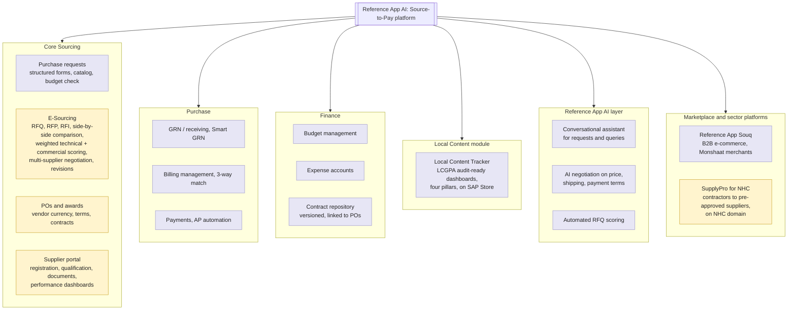
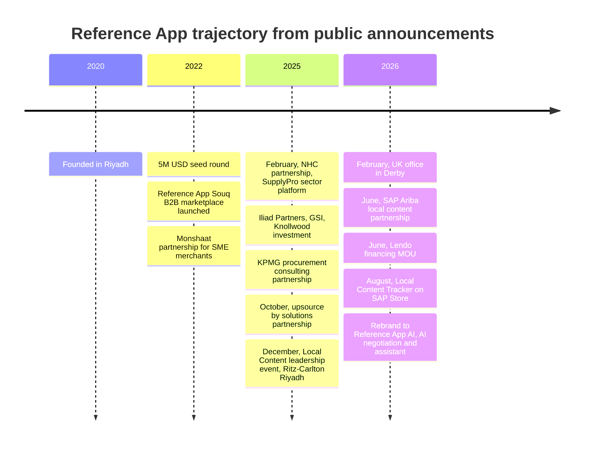
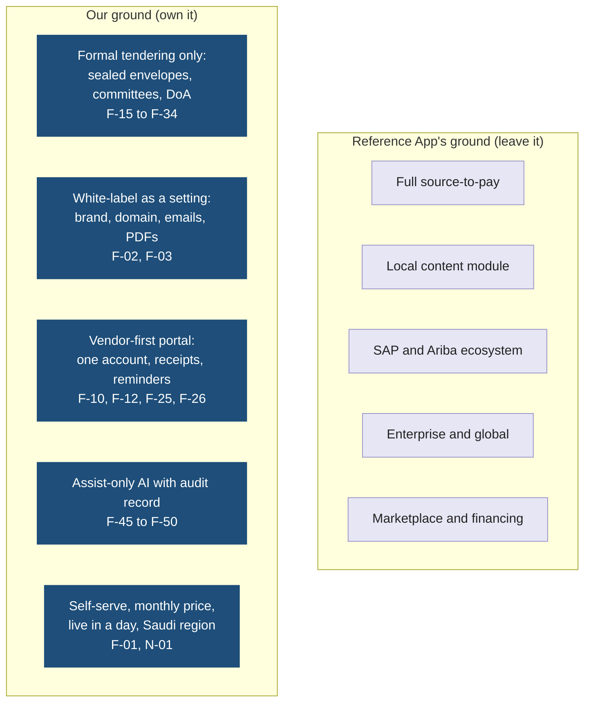
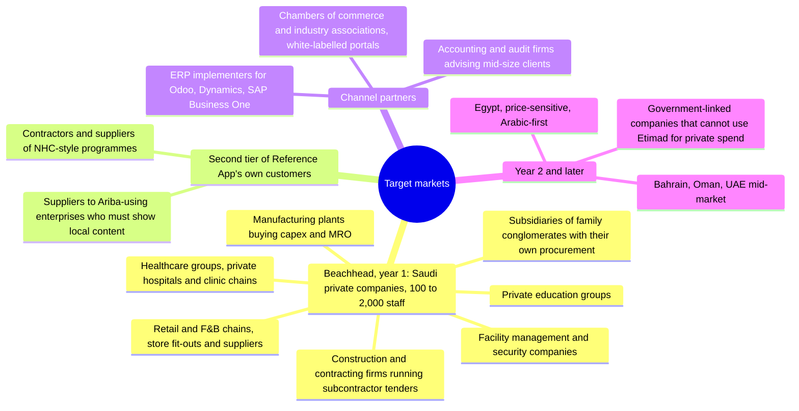

# Reference App: Features, Technology, Direction, Gaps, and How We Compete

Date: 2026-09-21
Status: competitor analysis from public sources. Items marked "not found publicly" were searched for and not confirmed; they are not proof of absence.
Related: `01-idea-competitors-features-ai.md` (landscape), `02-core-features-and-tech-stack.md` (our F-xx IDs)

## 1. Snapshot

| Item | Fact | Source |
|---|---|---|
| Company | Reference App, brand "Reference App" and lately "Reference App AI", Riyadh, founded 2020 by a four-person founding team | Crunchbase, PitchBook |
| Funding | About 10.3M USD total. 5M USD seed in January 2022 led by Outliers VC with Shorooq, Hambro Perks ORYX, Wamda, Class 5 Global. Later investment from Iliad Partners, GSI, Knollwood | Crunchbase, reference app site |
| Offices | Riyadh HQ, operations in Bahrain, UK office in Derby opened February 2026 with Northern Ireland leadership. UK entity Reference App Technologies Limited | reference app site, Fintech Times, Companies House |
| Scale claims | Customers in "more than 75 countries", over 1B USD spend managed, 100,000 procurement activities, 11,000 suppliers onboarded, 130,000 supplier activities | reference app site |
| Partners | KPMG (procurement consulting distribution), McKinsey, Voltalia, SAP Ariba (local content), SAP Store listing, Lendo (financing), upsource by solutions, Monshaat (SME authority) for Reference App Souq | reference app site newsroom |
| Named customers | Carrier, MSC, NICE, 17Sixty, National Housing Company (SupplyPro platform) | reference app site, Wamda |
| Pricing | "Enterprise Ready" from 50,000 USD, "Enterprise Ready Customizable" from 150,000 USD, "Special Projects" on request. Implementation manager and account manager included. Unlimited basic users, core users "to be defined". No trial, no SME tier | reference app site/pricing |
| Reviews | One Capterra review, 5.0 rating, 87 listed features. Pros: easy price comparison, good layout. Cons: small remarks fields, filters lost on back navigation, cannot open RFQs in a new tab | Capterra |

## 2. Product map

Read it as: everything Reference App sells, grouped the way their site groups it. The highlighted box is the only part that overlaps with our version 1.

## 3. Core features, mapped to ours

| Reference App module | What they have (public) | Our equivalent | Verdict |
|---|---|---|---|
| Purchase requests | Structured requisition forms, category and budget guidance, catalog management with bulk import, multi-level value or category based approvals with remarks | Not in version 1. Our flow starts at the tender, with a budget code on the need (F-16) | Deliberate gap. Requisitions belong to P2P, not tendering |
| E-Sourcing | RFQ, RFP, RFI in one place. Standardised events with technical and commercial sections. Guided supplier response form. Automatic comparison table. Weighted evaluation rules with assignable scoring responsibility. Negotiate with many suppliers in one view. Revision requests with tracking. Full action record | F-15 to F-21 authoring, F-22 submission, F-28 to F-32 evaluation, F-41 audit | Overlap. They are broad, we go deeper on formal tendering |
| Vendor communication after submission | Negotiate with many suppliers in one view; revision requests with tracked updated offers (an RFQ model where a revision can change the price). Approval remarks exist; internal department threads not found publicly | F-57 information requests: one channel through the officer, replies attached to the offer, prices immutable, questions logged for fairness; F-58 internal comment threads with department mentions, never visible to vendors | Different rule, not a gap: theirs allows price revision, ours forbids it after the deadline, which is what a formal tender and its auditor require |
| Sealed bids, opening event | Not found publicly | F-23 sealed envelopes, F-30 locking before financial opening, opening logged with witnesses | Our differentiator |
| Per-tender committee, independent blind scoring | Scoring responsibility can be assigned. Blind scoring between evaluators not found publicly | F-08, F-29 | Our differentiator, verify in a demo |
| Delegation of authority | Approvals by value or category | F-09, F-33 | Parity |
| Supplier management | Registration, qualification, document collection, onboarding, negotiation, performance tracking (delivery accuracy, responsiveness, quality), spend and proposal history | F-11 to F-14 | Parity on registration. Their performance tracking is later for us |
| Document expiry enforcement | Not found publicly | F-12 | Likely differentiator, verify |
| Local content and Saudization | Full module: LCGPA audit-ready tracker, spend insights across four pillars, SAP Store listing, SAP Ariba partnership | F-13 fields on the vendor profile, shown in comparison sheets | They win on depth. We only need the fields, not the module |
| POs and awards | POs in vendor currency, custom terms, convert offers to contracts, contract repository linked to POs and spend | F-35 to F-37 | Parity for PO. Contract repository is later for us |
| GRN, billing, payments, budgets, expenses | Full P2P: multiple GRNs, 3-way match, bill approval, combined payments, budget control, expense accounts, Lendo financing MOU | Out of scope for version 1 by design | Deliberate gap. This is where the 50,000 USD price comes from |
| AI | Conversational assistant, AI negotiation, automated RFQ scoring, Smart GRN | F-45 to F-50: compliance pre-check, coverage matrix, draft scores with quotes, financial sanity, integrity flags, AI audit record | Different philosophy. Theirs automates and negotiates. Ours assists a named human and records every output |
| White-label for the buyer's brand | Not offered as a product. SupplyPro for NHC runs on an NHC domain, built as a bespoke partnership | F-02, F-03 self-serve branding and custom domain | Our differentiator. They can do it as a project, we do it as a setting |
| Marketplace | Reference App Souq B2B catalog with Monshaat merchants | Not in version 1 | Deliberate gap |
| Mobile | Android and iOS apps listed on Capterra | F-26 mobile-friendly web | Verify whether their apps cover vendors or only approvers |
| Arabic and RTL | Not stated on the English site; Reference App Souq has an Arabic site | F-04 | Verify in a demo. A Saudi company almost certainly has it |
| ZATCA e-invoicing | Not found publicly | ZATCA-ready vendor data (document 01) | Verify |
| Integrations | "Automated ERP connections", API available. Third-party listings mention Sage, Dynamics, NetSuite, QuickBooks, Xero. SAP Store listing for the local content tracker | F-37 structured PO export, ERP push later as paid integration | They win. Expected for an enterprise product |

## 4. Core technology

Everything below comes from a 2026 full-stack job posting and public listings, so treat it as the shape of the stack rather than a blueprint.

| Layer | Reference App | Note |
|---|---|---|
| Frontend | Angular with TypeScript, WebSockets, backend-for-frontend pattern | Single-page app, so a separate API layer and BFF services exist |
| Backend | Node.js with Express and NestJS, gRPC or connectrpc between services | Service-oriented, not a monolith. Go mentioned as a plus |
| Data | MongoDB preferred, message queues, distributed caches, ETL pipelines | Document store fits their flexible forms. It makes strict relational guarantees, such as immutable audit or row-level tenant isolation, an application-level discipline rather than a database one |
| Mobile | Android and iOS apps | Likely wrappers or a separate mobile client |
| Cloud | Not found publicly | Data residency claims for Saudi hosting were not found on the site |
| Integration | REST APIs, ERP connectors, SAP Store certified listing for the local content tracker | The SAP relationship is their enterprise path |

What this means for us: our stack choice (document 02) is deliberately the opposite shape. One .NET host, PostgreSQL with row-level security, and Blazor Server give a two-person team a smaller surface to build and operate, and let us make audit and isolation guarantees in the database that Reference App has to make in code.

## 5. Direction and roadmap signals

Read it as: what they announced, in order. The pattern is enterprise, global, and local content.

**Where they are heading, inferred from the announcements**

1. **Up-market and into the SAP ecosystem.** SAP Ariba partnership and SAP Store listing position the Local Content Tracker as an add-on that large Ariba customers buy. Pricing from 50,000 USD with an implementation manager confirms the enterprise motion.
2. **Local content as the wedge.** Three of the last six announcements are about local content. This is a Saudi regulatory need for large companies and government contractors, not for a 300-person private company.
3. **Global expansion.** The UK office, "75 countries", and the "Reference App AI" rebrand aim at a generic international spend-management story.
4. **Embedded finance.** The Lendo MOU points at supplier financing inside the payment flow, which needs the P2P modules and volume.
5. **AI as automation.** AI negotiation and automated scoring are sold as replacing steps, not assisting evaluators.
6. **Sector platforms as bespoke deals.** SupplyPro shows they will build a branded, sector-specific platform when a large partner such as NHC pays for it.

## 6. Gaps and what is missing for the Saudi mid-market

| Gap | Evidence | Why it matters to a 100 to 2,000 staff company |
|---|---|---|
| No SME price point | Plans start at 50,000 USD, no trial, no self-serve tier | A department head cannot sign that. It needs a board-level budget line |
| Implementation project required | Every plan includes an implementation manager and "standard configuration" | Weeks to go live. Mid-size buyers want to run their next tender this month |
| Formal tender process not visible | Sealed envelopes, opening event, bid bonds, blind committee scoring not found in any public material | Saudi contracts departments run a two-envelope process on paper today and will not adopt a tool that cannot enforce it |
| White-label is a project, not a product | SupplyPro on an NHC domain is a partnership build. Nothing on the site offers branding or custom domains to ordinary customers | Vendors of a mid-size buyer see the Reference App brand, not the buyer's |
| Breadth over depth in sourcing | Sourcing is one of six modules. The product gravity is P2P, finance, and local content | The sourcing screens get the attention of a general-purpose team, not a tendering specialist |
| UI friction reported | The single public review lists small remarks fields, filters lost on back, no new-tab RFQ links | Small evidence, but consistent with a broad product maintained by a small team |
| Attention is moving away | UK office, SAP ecosystem, global messaging | Saudi mid-market support and product attention will thin as the company chases enterprise and export revenue |
| Data residency not stated | No hosting region claim found on the site | Increasingly asked by Saudi buyers; a stated in-Kingdom region is a cheap win for us |
| Vendor experience is buyer-centric | Supplier portal is described as a place buyers manage suppliers; vendor-side convenience (receipts with hashes, expiring document reminders, one account across many buyers) not found | The vendor side is where mid-market tenders fail: low participation, late or incomplete bids |

## 7. How to compete

Read it as: the same map as document 01, but only the axis that matters. We attack the empty bottom-left of Reference App's position, not Reference App head-on.

**Five plays**

1. **Sell the tender, not the spend.** Position as "run your next tender properly this week", not "digitise procurement". Every feature name on the site should be a tendering word a contracts officer already uses.
2. **Price where Reference App cannot go.** Monthly subscription per tenant with a published price, a free first tender, and no implementation project. Reference App's cost structure (implementation manager, account manager, engineering manager) stops them matching this without breaking their enterprise pricing.
3. **Make the vendor the hero.** One vendor account across every buyer on the platform (F-10). Each new tenant makes the platform more valuable to vendors, and vendors then ask their other customers to use it. Reference App's supplier portal is buyer-owned and has no such loop.
4. **Be the formal-process tool.** Sealed envelopes, witnessed opening, blind committee scoring, delegation of authority, immutable audit export. This is what internal audit and boards ask for, and it is absent from Reference App's public material.
5. **Ride Reference App's own messaging.** When Reference App sells local content to a large enterprise, that enterprise's contractors and suppliers are mid-size companies who now need to run compliant tenders of their own. Their SupplyPro deal with NHC proves the demand for exactly this second tier. We serve the tier below Reference App's customers.

## 8. Clone or compete

**Do not clone the platform.** Reference App's six modules represent five years and about 10M USD of work, and the P2P and finance modules are the expensive, low-differentiation part. Cloning them puts us in a price war we lose against their funding and against Odoo.

**Clone the sourcing slice, then go deeper.** Replicate the parts of E-Sourcing and the supplier portal that customers already understand (comparison table, weighted scoring, revision requests, clarifications, supplier documents), so a Reference App user feels at home, and then add what they do not have.

| Replicate as-is | Skip in version 1 | Beat |
|---|---|---|
| Side-by-side comparison table (F-31) | Purchase requisitions and catalogs | Sealed two-envelope submission (F-23) |
| Weighted technical and commercial scoring (F-17, F-29) | GRN, billing, payments, budgets, expenses | Witnessed financial opening and score locking (F-30) |
| Supplier registration and documents (F-11, F-12) | Contract repository | Document expiry that blocks submission (F-12) |
| Value-based approvals (F-09, F-33) | Local content module | Blind committee scoring and DoA enforcement (F-08, F-29, F-33) |
| Full action log (F-41) | Marketplace, financing | Signed audit export with file hashes (F-42) |
| RFQ, RFP, RFI event types (F-15) | AI negotiation | White-label and custom domain as settings (F-02, F-03) |
| Supplier invitation and guided response (F-19, F-22) | Mobile native apps | Vendor identity across tenants, receipts, reminders (F-10, F-25, F-26) |

Replicate functionality and workflow, never their code, screens, copy, or brand. Build the UI from our own design so that a side-by-side comparison shows two different products.

## 9. Target markets

Read it as: the beachhead in the centre, the next rings only after the beachhead pays.

**Beachhead choice.** Construction and contracting first. They run the most tenders per year, they already use a two-envelope process on paper, their subcontractors are the vendors who will spread the platform, and Reference App's own NHC work shows the sector is ready. Second: manufacturing and healthcare groups, which have formal procurement committees and internal audit pressure.

**Segment size to verify.** The Saudi General Authority for Statistics and Monshaat publish company counts by size band; pull the count of medium and large private establishments in construction, manufacturing, and health to size the beachhead before pricing.

## 10. What to verify in a Reference App demo or with a former customer

1. Whether sealed bids or a financial opening step exist in any form.
2. Whether evaluators can be blinded from each other's scores.
3. Arabic UI quality and RTL on the supplier side.
4. Hosting region and any data residency commitment.
5. Whether the supplier portal is one account per buyer or one account across buyers.
6. Real go-live time and total first-year cost for a 300-person company.
7. Whether an SME or self-serve tier is being planned, which would narrow our wedge.

## 11. Sources

- Reference App AI home, E-Procurement, E-Sourcing, Supplier management, Pricing, Newsroom
- Seed round announcement, Iliad, GSI, Knollwood investment, Crunchbase, [PitchBook](https://pitchbook.com/profiles/company/439311-88)
- NHC SupplyPro partnership, Wamda on NHC, Reference App Souq, WAYA on Reference App Souq
- UK office, Fintech Times, UK office, reference app site, [Companies House](https://find-and-update.company-information.service.gov.uk/company/16180694)
- SAP Ariba partnership, Local Content Tracker on SAP Store, Lendo MOU, KPMG partnership
- Capterra listing, Software Advice, SourceForge
- Full-stack developer job posting
