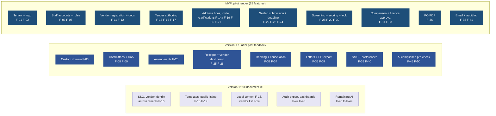
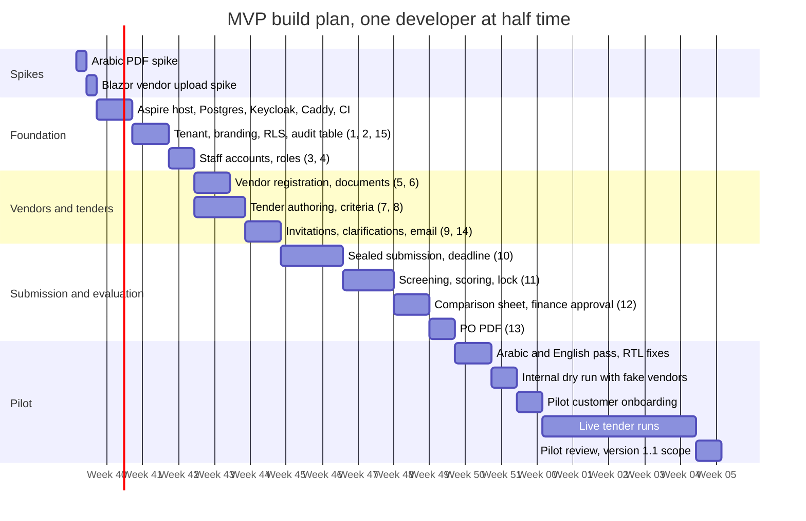

# MVP Scope: One Pilot Tender, End to End

Date: 2026-09-21
Status: proposal. Defines the smallest product that can run one real tender for one real customer.
Related: `02-core-features-and-tech-stack.md` (feature IDs), `04-reference-app-analysis.md` (why these features)

## 1. The goal

Glossary: tender = مناقصة; the vendor portal and emails use the Arabic term.

One Saudi private company runs one real tender on the platform, from publishing to a signed PO, with at least five vendors submitting, and the contracts officer says they would run the next one on it too. Everything in this document exists to make that sentence true. Anything that does not is out.

## 2. How the MVP relates to version 1

Read it as: top row ships for the pilot, middle row follows once the pilot has run, bottom row completes version 1.

## 3. MVP feature list

Every row is a feature ID from document 02 with the MVP-sized version of its acceptance. Where the MVP is narrower than document 02, the narrowing is stated.

| # | ID | MVP version | Narrowed from document 02 |
|---|---|---|---|
| 1 | F-01 | Platform admin creates a tenant by running a script. No admin UI | No self-serve provisioning screen |
| 2 | F-02 | Logo, one primary colour, portal name. Applied to both portals, emails, and the PO | No favicon, no accent colour |
| 3 | F-06 | Tenant admin invites staff by email. Password login with TOTP through Keycloak | No SSO |
| 4 | F-07 | Roles: Tenant admin, Contracts officer, Technical evaluator, Finance approver | No Auditor role. Auditor reads the log as Tenant admin |
| 5 | F-11 | Vendor self-registration: names in Arabic and English, CR, VAT, contact, email verified | No IBAN, no activity categories, no phone verification |
| 6 | F-12 | CR and VAT certificate with expiry dates. Expired document blocks submission | Two document types instead of seven. No 30-day reminder |
| 7 | F-15, F-16 | One tender type: sealed two-envelope Tender. Title, reference, description, scope attachment, terms attachment, BoQ lines, submission deadline, clarification deadline | No RFQ or RFP type, no bid bond field, no validity period |
| 8 | F-17 | Compliance checklist items, technical criteria with weights summing to 100, minimum pass mark, financial method fixed to lowest compliant price | No weighted technical-financial split |
| 9 | F-14a, F-19, F-55, F-21 | Officer picks invitees from the tenant's vendor address book or types new emails. Each invitee gets a branded single-use link: registered vendors land on the tender after login, unregistered ones register with the email pre-filled and land on the tender, resumable until the deadline. Officer sees sent, opened, registered, submitted per invitee. Vendors ask questions; officer answers publicly to all invited vendors | No open tenders, no private answers, no vendor categories beyond a text tag |
| 10 | F-22, F-23, F-24 | Wizard: documents check, technical upload, BoQ prices, financial upload, submit. Technical and financial stored with separate keys; financial unreadable until opening. Server-time deadline, late refused, resubmission allowed before deadline | No draft autosave beyond the browser session. Resubmission replaces rather than versions |
| 11 | F-28, F-29, F-30 | Officer marks checklist pass or fail per offer. Evaluators score each criterion, hidden from each other until all submit. Officer locks scores | No "waived" state |
| 12 | F-31, F-33 | Auto-built comparison sheet: vendor, BoQ line prices, totals, VAT, arithmetic check. Export to Excel. One finance approver approves or returns with a reason | No internal estimate variance, no local content column, no approval limits |
| 13 | F-36 | Branded PO PDF with tenant numbering, winning offer lines, VAT, payment terms text. Stored against the tender | No PO register screen, no structured export |
| 14 | F-38, F-39 | Email only: invitation, question answered, deadline in 48 hours, submission received, action required, award or regret | No SMS, no in-app, no digests |
| 15 | F-41 | Append-only event table: actor, tenant, action, entity, timestamp, IP. Visible to Tenant admin as a filterable list | No signed export |

Also in the MVP because the pilot cannot run without them, though they carry no feature ID: Arabic and English UI with right-to-left (F-04 is treated as a constraint, not a feature), and the tender state machine (F-27) limited to the states the fifteen features need.

## 4. Explicitly out of the MVP

Custom domains, SSO, per-tender committees, delegation of authority limits, amendments, receipts with hashes, vendor dashboard, ranking other than lowest price, cancellation, award and regret letters, PO export, SMS, notification preferences, local content fields, the full tenant vendor list with approval states (the address book F-14a is in), templates, public listing, audit export, dashboards, every AI feature, mobile apps, ERP integration, vendor identity across tenants.

If the pilot customer asks for one of these, the answer is "version 1.1, after your tender closes", unless the tender cannot legally proceed without it.

## 5. The two spikes to run before anything else

Both are one-day experiments whose failure would change the stack, so they come first.

| Spike | Question | Pass condition | If it fails |
|---|---|---|---|
| Arabic PDF | Can QuestPDF render a PO with mixed Arabic and English, correct shaping, right-to-left tables, and a Saudi font? | A one-page PO with Arabic vendor name, Arabic terms paragraph, and a numeric BoQ table prints correctly | Switch to Playwright for .NET with headless Chromium rendering HTML |
| Blazor on a vendor's connection | Does a Blazor Server upload wizard survive a 50 MB file on a throttled 3G profile with a 2-second latency spike? | Upload completes, circuit reconnects after the spike, draft state survives | Move the vendor portal pages to static server rendering with plain form posts, keep Blazor Server for the tenant app |

## 6. Build plan

Read it as: one developer, roughly half time. Two developers compress the middle bars by about half. Dates are relative to the start, not calendar dates.

About 13 weeks from first spike to the live tender at the durations shown, then a 30-day tender window and a review, so about 18 weeks to the pilot verdict. Plan for 16 to 18 weeks to the live tender if a spike fails or the customer is late. Two developers bring the build portion to about 7 weeks.

## 7. What the pilot must prove

| Question | Measure | Target |
|---|---|---|
| Will vendors use it? | Invited vendors who submit | At least 5 of 8 |
| Does the sealed process hold? | Attempts to read financial before opening, from logs | Zero successful, every attempt logged |
| Is it faster than email and Excel? | Days from close to finance approval | Under 5 working days |
| Is Arabic good enough? | Vendor and evaluator complaints about language or layout | Zero blocking, under 5 cosmetic |
| Would they pay? | Contracts officer and finance approver asked at review | Both say yes to a monthly price you name |
| What is missing? | Features requested during the tender | Ranked list feeds version 1.1 |

## 8. Decisions this plan assumes

- PO scope: branded PDF only (closes open decision 1 in document 02 for the MVP).
- Vendor identity: one account per vendor company, registered on the pilot tenant. Cross-tenant identity waits for version 1 (open decision 2 stays open).
- Hosting: any Saudi-region VM or small Kubernetes cluster for the pilot; the provider decision (open decision 3) can wait until version 1.
- First customer: still to be named. The plan cannot start section "Pilot" without one, so finding them runs in parallel with the spikes and foundation.
