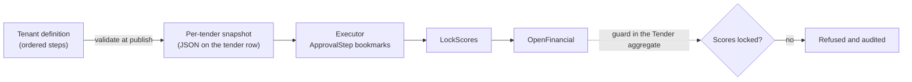
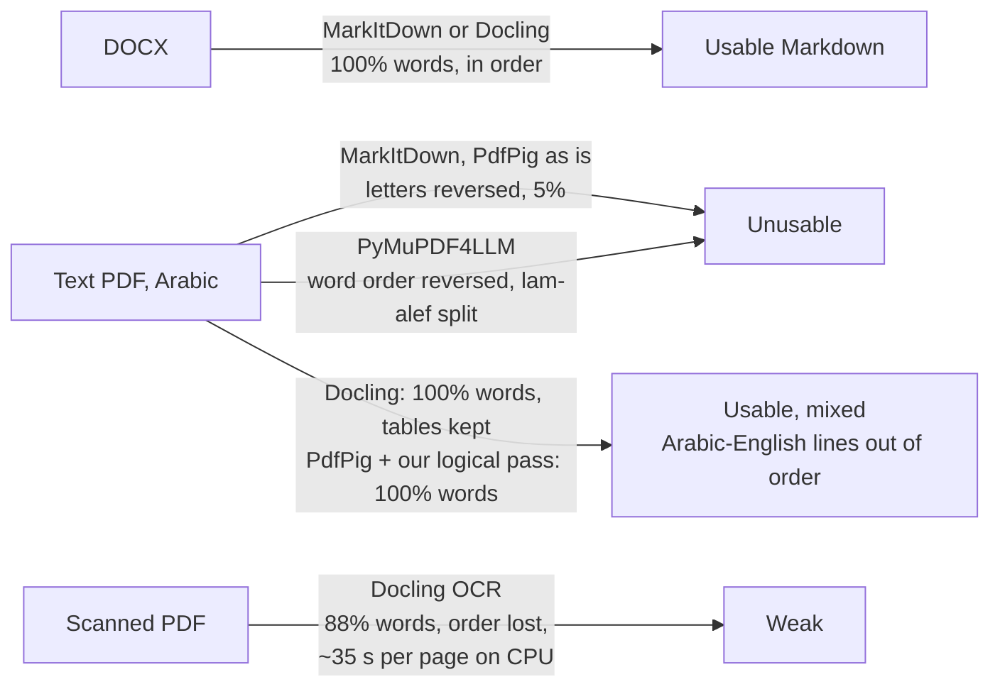

# Spike Results: Arabic PDF and Vendor Upload on a Weak Connection

Date: 2026-09-21
Status: both spikes from `05-mvp-scope.md` section 5 executed; the Elsa workflow spike (W-20) added 2026-09-26 as section 6. Code is in `spikes/`.
Environment: Windows 11, .NET SDK 9.0.121 (the .NET 10 SDK is not installed on this machine yet; nothing in either spike depends on 10), QuestPDF 2026.9.0, Chrome with DevTools network emulation.

## 1. Verdicts

| Spike | Question | Verdict | What changes in the design |
|---|---|---|---|
| Arabic PDF | Can QuestPDF render a branded PO with mixed Arabic and English, correct shaping, right-to-left tables, and a Saudi-style font? | **Pass** | Keep QuestPDF. One rule for the PDF module: wrap every English-only run in a left-to-right container. |
| Blazor upload | Does a Blazor Server upload survive a 50 MB file on throttled 3G with a connectivity gap? | **Pass with a design change** | Latency spikes are fine. A dropped WebSocket kills the in-flight InputFile stream and, a minute later, the circuit. Vendor file uploads must go over direct chunked HTTP, not through the circuit. The chunked fallback was built and tested in the same spike. |
| Elsa executor (W-20) | Can Elsa 3 run a tenant's approval chain from a per-tender snapshot with the fixed points guaranteed, and can its designer serve tenants in Arabic, right to left, under their brand? | **Executor pass, designer fail** | Per the rule in ADR-0003 point 5, our own state machine executes the snapshot. Elsa Studio is not a tenant-facing editor. Proposed as ADR-0004. |

## 2. Spike 1: Arabic PDF with QuestPDF

Code: `spikes/ArabicPdfSpike/Program.cs`. Run `dotnet run` inside that folder; it writes `bin/Debug/net9.0/out/po-arabic.pdf` and a PNG of the page.

What was rendered: an A4 purchase order with tenant name in Arabic and English, CR and VAT numbers, a bilingual title bar, vendor block, order details with a Hijri date, a six-column BoQ table with Arabic and English descriptions and numeric columns, a totals block with VAT, an Arabic terms paragraph in Traditional Arabic, an English terms paragraph, three signature lines, and a bilingual footer.

Observed:

- Arabic shaping and ligatures are correct in both Tahoma and Traditional Arabic, registered from the Windows fonts folder.
- `ContentFromRightToLeft()` on the page flips the whole layout correctly: the header row, the table columns, the totals alignment, and the signature order.
- Mixed runs such as "س.ت 1010123456 | الرقم الضريبي 300012345600003" render in the right order without any markup.
- Numbers in the BoQ columns stay left-to-right and align as expected.
- **Defect found and fixed:** an English-only line inside the right-to-left page had its trailing period moved to the start ("Al-Faisal Contracting Co." rendered as ".Al-Faisal Contracting Co"). Same for the English terms paragraph. Wrapping those items in `ContentFromLeftToRight()` fixes it. A date such as "(21 Sep 2026)" embedded in an Arabic line needed Unicode isolate marks (U+2066 and U+2069) to keep its parts in order.
- `FontManager.RegisterFont(Stream)` is obsolete in QuestPDF 2026.9; use `RegisterFontFromStream`.

Rules for the product's PDF module:

1. Embed fonts as resources (Noto Naskh Arabic and Noto Sans, or the tenant's licensed fonts) so Linux containers render identically to this Windows run.
2. Every text element that is English-only goes in a left-to-right container. Mixed Arabic-first lines need nothing.
3. Use isolate marks around embedded Latin fragments in Arabic sentences.
4. Add a golden-image test: render the PO and compare the PNG against a stored reference so a QuestPDF upgrade cannot silently change Arabic layout.

## 3. Spike 2: Blazor Server upload on a weak connection

Code: `spikes/BlazorUploadSpike/`. Run with `ASPNETCORE_ENVIRONMENT=Development dotnet run --no-launch-profile` and open `http://127.0.0.1:5273/`. The page shows the circuit id, a per-second tick counter that proves the circuit is alive, a draft text field that must survive reconnects, the standard `InputFile` uploader, and the chunked fallback uploader.

Test file: 50 MB of random bytes, SHA-256 prefix `F1E661FFA8BF5D00`, so the server can prove it received every byte.

Throttle: Chrome DevTools "Fast 3G" (about 1.6 Mbps down, 750 kbps up, 560 ms round trip) on a 390 by 844 mobile viewport, "Slow 3G" for the latency spike (2 s round trip).

### 3.1 Results by scenario

| # | Scenario | Circuit | Draft state | Upload | Notes |
|---|---|---|---|---|---|
| A | Fast 3G, then Slow 3G for 10 s, back to Fast 3G | Same circuit, ticks never stopped, no reconnect overlay | Kept | Kept moving | Latency spikes are harmless. Render batches queued up to 8 s and then drained. |
| B | Fast 3G, then DevTools "Offline" for 6 s | Same circuit | Kept | Kept moving | The established WebSocket was not severed by the offline emulation, so nothing happened. An earlier run of the same step did sever it and ended on Chrome's offline error page after the client reloaded; the emulation is not deterministic, which is why scenario C was added. |
| C | Force the WebSocket closed from inside the page mid-upload | Reconnected in 1.2 s to a new WebSocket, **same circuit id**, ticks continued | Kept | **Stalled** at 18.7 percent. Sixty seconds later the server threw `TimeoutException: Did not receive any data in the allotted time` from the InputFile stream, the circuit reported an unhandled error, and the page showed the Blazor error banner | This is the real failure mode. Circuit-level reconnect works; the JS-to-.NET data stream that `InputFile` uses does not survive a transport change. |
| D | Clean run, Fast 3G, no interference, 50 MB through `InputFile` | Same circuit, 649 ticks | Kept | **Completed**: 52,428,800 bytes, SHA-256 prefix `F1E661FFA8BF5D00` matches the source file, 536 s (about 98 KB per second) | Baseline: `InputFile` is correct and complete when nothing interrupts the socket. |
| E | Chunked HTTP fallback, Fast 3G, WebSocket forced closed after chunk 1 of 13 | Reconnected in 1.2 s, **same circuit id**, 655 ticks, no reconnect overlay, no error banner | Kept | **Completed**: 52,428,800 bytes in 13 chunks, SHA-256 prefix `F1E661FFA8BF5D00` matches, **0 retries**, 643 s. Progress calls resumed on the new connection | The fix under test. The transfer never noticed the drop because no chunk was in flight over the circuit. |

### 3.2 Why scenario C fails

`InputFile.OpenReadStream` pulls the file through the SignalR connection as a JS interop data stream tied to the connection that started it. When Blazor reconnects, it re-attaches the circuit to a new connection, but the half-finished stream on the old connection is gone. The server side keeps waiting on the pipe until the JS interop timeout (60 s) fires. The exception surfaces as a circuit error rather than inside the component's `try` block, which is why the page ends with the error banner instead of a friendly "upload failed" message.

Blazor's reconnect defaults, read from the served `blazor.web.js`: 30 retries, the first 10 with no delay, then 5 s, then 30 s. If the server answers that the circuit is unknown, the client calls `location.reload()` immediately. That is what happened in the non-deterministic run of scenario B: the reload fired while the browser was still offline and landed on the error page. In the product this means a vendor who loses signal for long enough for the circuit to be evicted (3 minutes by default) will see a full page reload and lose any unsaved form state.

### 3.3 The fix: direct chunked HTTP upload

`spikes/BlazorUploadSpike/wwwroot/upload.js` slices the file into 4 MB chunks and sends each as an independent `PUT` to a minimal API endpoint, retrying a chunk up to 30 times with backoff. A final `POST` asks the server to stitch the chunks and return the SHA-256. Progress is reported to the Blazor component on a best-effort basis; if the circuit is down at that moment the call fails and is ignored, and the upload keeps going.

Properties that matter for F-22 to F-24:

- The transfer does not depend on the circuit at all. A reconnect, or even a full Blazor error, cannot stop it.
- A retried chunk overwrites the same file, so retries are idempotent.
- The server can enforce the deadline per chunk (reject `PUT` after the tender closes) and per completion (F-24).
- Resuming after a page reload is a small extension: keep the upload id and completed chunk indexes in `localStorage`.
- The receipt hash (F-25) falls out of the completion step for free.

### 3.4 Other observations from the spike

- Uploading through `InputFile` at Fast 3G ran at roughly 60 to 120 KB per second in these runs, so a 50 MB technical offer takes 7 to 14 minutes on a weak connection. The vendor UI must show progress and must not block the rest of the wizard while this runs.
- Raising `MaximumReceiveMessageSize` to 1 MB on the hub is needed for `InputFile` to be usable at all with large files; the default 32 KB makes the transfer very chatty.
- The mobile-viewport emulation in DevTools reloads the page when applied, which invalidated one run. Apply emulation before loading the page.
- Running with `--no-launch-profile` drops `ASPNETCORE_ENVIRONMENT=Development`, and in Production mode the scoped stylesheet 500s because static web assets are off. Set the environment explicitly when running spikes this way.

## 4. Decisions taken from the spikes

1. QuestPDF stays. The four PDF rules in section 2 go into the design spec for F-36.
2. Vendor file uploads use direct chunked HTTP with a completion step and server-side hashing, never `InputFile` through the circuit. The Blazor page only shows progress. This applies to F-22 technical and financial uploads and to vendor documents in F-12.
3. Blazor Server stays for both portals. Scenario A shows latency is not a problem for the circuit, and scenario C is solved by taking uploads off the circuit.
4. Configure reconnection so a vendor never sees a silent full-page reload: raise `DisconnectedCircuitRetentionPeriod`, keep form drafts in browser storage, and replace the default reconnect UI text with Arabic and English copy.
5. Add an Arabic PDF golden-image test and a throttled upload end-to-end test to the CI plan.

## 5. Update to document 05

Section 5 of `05-mvp-scope.md` listed the fallback for spike 2 as "move the vendor portal pages to static server rendering with plain form posts". The spike shows a narrower fix is enough: keep Blazor Server, move only the file transfer to chunked HTTP. Row 10 of the MVP feature list (F-22 to F-24) should be read with that change.

## 6. Spike 3: Elsa 3 as the workflow executor (W-20)

Date: 2026-09-26. Elsa 3.8.4 on .NET 9. Two throwaway projects:

- `spikes/ElsaWorkflowSpike/`: console app, `dotnet run`. Elsa is used as a library only: no Elsa database. The workflow JSON (snapshot) and the execution state are strings on an in-memory `Tender` row, and every step runs in a freshly built container to simulate a process restart. Prints seven PASS/FAIL checks.
- `spikes/ElsaStudioSpike/`: Elsa Server and Elsa Studio in one Blazor Server process. Run with `ASPNETCORE_ENVIRONMENT=Development dotnet run --no-launch-profile` and open `http://127.0.0.1:5281/`. Screenshots are in `spikes/ElsaStudioSpike/screenshots/`.

### 6.1 The four questions from W-20

| # | Question | Result | Evidence |
|---|---|---|---|
| 1 | Is a definition that skips locking or opens financial early rejected? | **Pass**, but by our code, not by Elsa | A publish-time validator rejects Sequence and Flowchart definitions where any path reaches `OpenFinancial` without `LockScores` (checks Q1b, Q1d). A bad definition forced past validation still cannot open early, because the guard lives in the `Tender` aggregate; the instance faults with the F-30 message (Q1c). Elsa itself has no concept of an invariant. |
| 2 | Does a running tender keep its snapshot after the definition changes? | **Pass** | The tender resumes from the Elsa workflow JSON stored at publishing; after the tenant edits the definition the old approver still decides and the new step never appears. A tender published after the edit gets the new chain (Q2). |
| 3 | Does the designer render in Arabic, right to left, under a tenant's colour? | **Fail** | See 6.2. |
| 4 | Time to implement one custom step | About 60 lines | `ApprovalStep` (any-of or all-of, named approvers, bookmark and resume) compiled and passed on the first build. The Studio host needed two undocumented stub services before it would start. A human developer's time was not measured; the spike was written in one session. |

Other measurements: a five-step snapshot is 2,169 characters of JSON; the finished execution state is 978 characters; one decision (fresh container, load, resume, save) takes 27 ms, 8 ms of which is building the container.

### 6.2 Elsa Studio in Arabic and right to left

| Aspect | Observed |
|---|---|
| Tenant colour | Works: a custom `IThemeProvider` set the primary and app bar colour. |
| Arabic strings | Partial: Elsa ships an `ar` resource file, but about a quarter of the visible strings are translated; headings, table columns, hints and every activity property stay English. Our own activity names and inputs would need their own translation. |
| Right to left | Not supported: Studio has no RTL setting. Forcing `dir="rtl"` mirrors some panels, but the navigation drawer stays on the left, pager arrows do not flip, tab labels are clipped ("IABLES"), and English hints show the same trailing-period bidi defect found in spike 1. The flow canvas does not mirror. |
| Stack | Studio brings MudBlazor, Radzen, CodeBeam extensions and Monaco. ADR-0002 dropped MudBlazor for Tailwind and `Platform.UI`. |
| Branding | The shell shows "Elsa Studio 3.8" and its logo; a branding provider exists but was not tested. |

### 6.3 Findings that apply whichever executor is chosen

1. **Throwing inside a step faults the whole instance.** The first run threw on a decision from a non-approver, and the tender went to Faulted. Authorisation failures must be refused and audited while the step keeps waiting; only real invariant breaches may fault.
2. **The fixed points belong in the domain.** The guard that mattered was in the `Tender` aggregate, not in the workflow. This confirms ADR-0003 point 3.
3. **Payload types do not survive serialisation.** Elsa bookmark payloads come back as `ExpandoObject`, not the record type. Our own model should store step state as explicit columns or versioned JSON.
4. **A snapshot in Elsa's JSON format ties running tenders to Elsa's serializer.** Tenders run for weeks or months; an Elsa upgrade must still read every snapshot in flight. A snapshot in our own definition format does not carry that risk.
5. **Keeping state in our row works.** Elsa ran without its own database, so PostgreSQL stays the single source of truth. That was the main risk named for Temporal in ADR-0003, and it is avoidable with Elsa too.

### 6.4 Decision proposed

ADR-0003 point 5 says Elsa executes the snapshot only if both the fixed points hold and the designer can be delivered in Arabic under the tenant's brand. The first holds, the second does not, so our own state machine executes the snapshot. Proposed as ADR-0004. The F-56b editor in version 1.1 is built in `Platform.UI` as an ordered step list, not as a flowchart canvas.

## 7. Spike 4: offers to Markdown for LLM review (W-22)

Date: 2026-09-26. Code, full score table, and run steps: `spikes/OfferToMarkdownSpike/`. Question: can DOCX, PDF, and scanned PDF offers, Arabic and English, become Markdown with page references that a cheap LLM can evaluate against the RFP (option (e), document 02 section 5 item 7)?

Samples were generated with known text: a three-page Arabic technical offer with English product names and a compliance table, exported to PDF by Word, plus a 200 dpi image-only copy and an English control. Real offers from a prospect are still needed.

| Input | Best converter | Arabic word recall | Caveat |
|---|---|---|---|
| DOCX | MarkItDown or Docling | 100% | No page numbers; cite headings instead |
| Word-exported PDF | Docling, or PdfPig with a visual-to-logical pass | 100% | Segment order on mixed Arabic and English lines is wrong in every tool |
| Scanned PDF | Docling with OCR | 88% | OCR errors on Latin tokens inside Arabic text; slow on CPU |

Decisions and follow-ups:

1. Accept DOCX where the tender allows it and prefer it in vendor guidance.
2. For PDFs, test the alternative before choosing a converter: give the PDF to an LLM that reads PDFs natively, which sidesteps text extraction at a higher token cost.
3. Evidence quotes must be matched on words, not as exact substrings, because segment order on mixed lines is unreliable.
4. W-22 stays in progress until two or three real Arabic offers are converted and read by a human.

### 7.1 Three test tenders, end to end

Three fictional tenders with nine offers and answer keys (`spikes/OfferToMarkdownSpike/samples/tenders/`) were converted and reviewed by Claude Haiku 4.5 as a stand-in for the cheapest model, one isolated run per offer.

| Input | Facts kept after conversion | Verdicts matching the answer key |
|---|---|---|
| DOCX | 100% | 33 of 41 |
| Word PDF (Docling) | 94 to 100% | 31 of 41 |
| Scanned PDF (Docling OCR) | 46 to 71% | 12 of 41 |

- A requirement was wrongly called "met" 3 times in 123; on unreadable scans the model said so instead of guessing.
- A deterministic price checker found every planted financial error with no false positive, so F-48 arithmetic, missing-line, quantity, and unit checks need no LLM.
- OCR lost the evidence behind several red flags (shared phone number, subcontractor name, certificate holder), so scans are not fit for this pipeline; test giving the PDF directly to a model that reads PDFs.
- Prompt version 2 (`prompts/offer-review-v2.md`: explicit number comparison, obligations moved to the buyer are partial, contract-long validity only when the RFP says so) raised agreement on DOCX and Word PDF from 63 to 72 of 82 (77 to 88 percent), scans from 12 to 16 of 41, and cut wrong "met" verdicts from 3 to 1.
- Decided 2026-09-26: a shortfall against a minimum (3 training days of 5, 2 references of 3) is `partial`; none at all is `not_met`; exceeding a maximum such as a deadline stays `not_met`. Written into prompt version 3. It may later become a tenant setting.
- Prompt version 3 run: 94 of 123 overall (76 percent), 73 of 82 on DOCX and Word PDF (89 percent, level with v2), 21 of 41 on scans, all three compliant offers fully right, but 3 wrong "met" verdicts and the shortfall rule ignored on one offer. Single runs vary as much as prompts do, so the next comparison uses three runs per offer with a majority verdict, plus one stronger model on the same set.
- One v2 run returned malformed JSON, so the product must use schema-enforced structured output.
