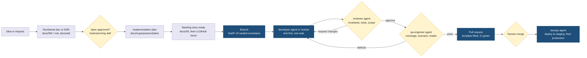
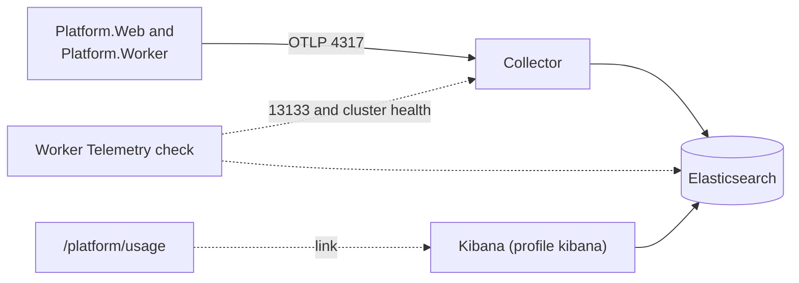

# Ways of Working

Date: 2026-09-21
Status: the operating rules for this repository from now until the pilot. Short on purpose; every rule here is one we will actually follow.
Related: `05-mvp-scope.md` (what we build first), `06-spike-results.md` (decisions from evidence), `CLAUDE.md` (rules Claude Code follows)

## 1. Principles

1. **Documents before code, IDs before names.** Every piece of work traces to a feature ID (F-xx), a requirement (N-xx), or an ADR. If it has no ID, it is not planned.
2. **Small, finished, reviewed.** A task is a few hours, ends in a pull request, is reviewed by someone or something that did not write it, and is tested before it is called done.
3. **Evidence over opinion.** Spikes, tests, and command output settle arguments. Document 06 is the model.
4. **The pilot decides.** Until one real tender has run, `05-mvp-scope.md` outranks every wish list.
5. **Arabic is not a translation task.** Both languages ship in the same pull request or the pull request is not done.

## 2. How work flows

Read it as: left to right, one idea becomes merged code. The diamonds are gates; nothing skips a gate.



Three gates that are never skipped: spec approval before planning, reviewer before qa-engineer, human merge before deploy.

## 3. Repository layout and where things go

| Path | What lives there | Owner |
|---|---|---|
| `docs/NN-*.md` | Numbered narrative documents. Add a README line for each. | Everyone |
| `docs/adr/` | Architecture decision records, one per decision, never edited after acceptance; superseded instead. | Architect (you) |
| `docs/superpowers/specs/` | Approved design specs per feature group, produced by the brainstorming workflow. | Whoever runs the spec session |
| `docs/superpowers/plans/` | Implementation plans broken into tasks with acceptance per task. | Whoever runs the planning session |
| `spikes/` | Throwaway experiments with a results write-up in `docs/`. Never imported by product code. | Anyone |
| `infra/compose/` | Local development stack. | devops |
| `infra/pilot/` | The pilot on one Oracle Cloud VM in Jeddah (W-19): production Compose file, app images, Caddyfile, realm files, deploy, backup and restore scripts. Runbook: `docs/19-pilot-runbook.md`. | devops |
| `infra/k8s/`, `infra/keycloak/`, `infra/caddy/` | Production and staging configuration after the pilot (not created yet). | devops |
| `src/` | The product, laid out as in `02-core-features-and-tech-stack.md` section 4.5. | developer |
| `tests/` | Unit, integration, UI tests. | qa-engineer and developer |
| `.claude/agents/` | The agent roster (section 6). | Everyone |
| `.github/` | Workflows, pull request template, issue templates. | devops |

## 4. Local environment

One command from a clean clone:

```
cd infra/compose
cp .env.example .env
docker compose up -d
```

| Service | Purpose | Port on localhost | Credentials from `.env` |
|---|---|---|---|
| PostgreSQL 16 with pgvector | Platform and Keycloak databases, RLS-ready roles | 5432 | POSTGRES_USER, POSTGRES_PASSWORD |
| Keycloak 26 | Identity, Organizations per tenant | 8080 (admin console), 9000 (health) | KEYCLOAK_ADMIN, KEYCLOAK_ADMIN_PASSWORD |
| Redis 7 | Rate-limit counters: since W-34 the duplicate-CR limits of the web host (per account and per source address), checked by the worker for F-60 alerts; later circuit state and locks. No persistence, so a restart clears the counters | 6379 | none |
| MinIO | S3-compatible object storage, bucket `erp-dev` | 9002 (API), 9003 (console) | MINIO_ROOT_USER, MINIO_ROOT_PASSWORD |
| ClamAV | Virus scanning for vendor uploads: the web host scans every completed upload over TCP `INSTREAM`, the worker retries pending ones (F-12), and the health board checks it | 3310 | none |
| Mailpit | Catches all outgoing email, shows it in a web UI | 1025 (SMTP), 8025 (UI) | none |
| Caddy | Local TLS edge; `https://<tenant>.localhost` forwards to the app on the host | 80, 443 by default; set `CADDY_HTTP_PORT` and `CADDY_HTTPS_PORT` (for example 8081 and 8443) on Windows machines where 443 sits in a reserved range | none |
| OpenTelemetry Collector (EDOT 9.5.4, Elastic's distribution) | Receives OTLP from the web host and the worker, drops query strings and credential headers, adds the APM fields and summary metrics Kibana's APM views read, writes logs, traces and metrics to Elasticsearch (W-10, ADR-0014); 320 MB limit; Compose health check on its health extension, which the worker also reads | 4317 (OTLP gRPC), 4318 (OTLP HTTP), 13133 (health), all bound to 127.0.0.1 | ELASTIC_COLLECTOR_PASSWORD (create documents only) |
| Elasticsearch 9 | Telemetry store, single node, 0 replicas, Basic licence; 1.75 GB limit, 768 MB heap | 9200 (127.0.0.1) | ELASTIC_PASSWORD (superuser, read only when the volume is created), ELASTIC_MONITOR_PASSWORD (cluster monitor, the worker's check) |
| `elastic-setup` | One-shot, runs on every `up -d` and is safe to repeat: sets the built-in and `waslabid_*` users and roles, the retention policies (`TELEMETRY_*_RETENTION`), the usage metric mappings; deletes a staff user that is no longer `KIBANA_STAFF_USER` | none | ELASTIC_PASSWORD and the other passwords |
| Kibana 9 and `kibana-setup` (profile `kibana`, off by default) | The one telemetry UI (Discover, Observability logs, the "WaslaBid usage" dashboard); `kibana-setup` imports the dashboard as `elastic`, then exits. Start: `docker compose --profile kibana up -d`; stop: `docker compose stop kibana` | 5601 (127.0.0.1) | KIBANA_STAFF_USER and KIBANA_STAFF_PASSWORD (role `viewer`), KIBANA_SYSTEM_PASSWORD, KIBANA_ENCRYPTION_KEY |

Elastic image signatures (checked 2026-10-03): Elastic signs `elasticsearch`, `kibana` and `elastic-otel-collector` with cosign and a published key, not keyless (no Fulcio identity). The key is `https://artifacts.elastic.co/cosign.pub`, committed as `infra/security/elastic-cosign.pub` (sha256 of the file `5430d336364179eb21f8a874bb568774699134c68f73d1f6f38590d2ac632386`); the signatures sit in the registry as `sha256-<digest>.sig` tags. CI verifies every pinned `docker.elastic.co` image in the Trivy job (`.github/scripts/verify-elastic-signatures.sh`, cosign v2.5.0) and fails on a missing signature or an image without a digest. By hand, per image: `cosign verify --key infra/security/elastic-cosign.pub docker.elastic.co/kibana/kibana:9.5.4@sha256:<digest>`; run it again, with the new digests, on every version bump. Key rotation: the committed key is replaced only after the new key is confirmed through Elastic's documentation; until then CI fails closed.

Memory on a 16 GB laptop: the Elastic part (collector 320 MB, Elasticsearch 1.75 GB) is about 2.1 GB always on; Kibana adds up to 1.25 GB while it runs (limit 1280 MB, 768 MB heap), which is why it sits behind the `kibana` profile. Elasticsearch needs `vm.max_map_count` of at least 262144 on the Docker host: recent Docker Desktop versions ship with it; if Elasticsearch exits at start, run `wsl -d docker-desktop sysctl -w vm.max_map_count=262144` (check with `wsl -d docker-desktop sysctl vm.max_map_count`; older versions lose it on restart). `ELASTIC_PASSWORD` is read only when the `elasticsearch-data` volume is first created: after changing it in `.env`, `elastic-setup` fails with "elastic user cannot authenticate", so reset with `docker compose rm -sf elasticsearch` and `docker volume rm erp-dev_elasticsearch-data` (this deletes the telemetry, which is not backed up).

The .NET app runs on the host with `dotnet watch` on port 5273 so hot reload works. Caddy forwards `*.localhost` to it, which lets you test several tenants on their own hostnames without editing the hosts file.

The pilot runs the same services in production mode on one VM, with the app containerised and every setting below taken from `infra/pilot/.env`; `docs/19-pilot-runbook.md` section 2 maps each host setting to its source.

Reset everything: `docker compose down -v` then `up -d` again. ClamAV takes up to three minutes on first start while it downloads signatures; its health check allows for that.

### Run the app locally

With the Compose stack up and these nine values (plus the ten telemetry values listed below the commands) filled in `infra/compose/.env` (see `.env.example` for how to generate
them): `WASLABID_WEB_CLIENT_SECRET`, `WASLABID_PLATFORM_CLIENT_SECRET`, `WASLABID_ADMIN_API_SECRET`,
`WASLABID_DEV_USER_PASSWORD` (at least 12 characters, not a user name, or the platform realm import fails),
`MINIO_HEALTH_PROBE_PASSWORD`, `VENDORS_CR_AUDIT_KEY` (base64 of at least 32 bytes; the web host does not start
without it), `ERP_KEY_RING_DB_PASSWORD` (the key ring's own database role, W-24; the web host does not start without
it), `ERP_WORKER_DB_PASSWORD` (the worker's own database role, W-36; the worker does not start without it) and `WASLABID_JOB_SIGNING_KEY` (base64 of at least 32 bytes; the key both hosts sign and verify background jobs with, W-42; neither host starts without it), run these once from the repository root (Git Bash). The commands read the values from `.env` into shell variables and never print them (N-10); user secrets live outside the repository.
In a git worktree `infra/compose/.env` does not exist (it is git-ignored), so point `env_value` at the main checkout's file, for example `grep "^$1=" ../ERP/infra/compose/.env` (the e2e scripts take `E2E_ENV_FILE` for the same reason).

```bash
env_value() { grep "^$1=" infra/compose/.env | cut -d= -f2- | tr -d '\r'; }
PGPW=$(env_value POSTGRES_PASSWORD)
WEB_SECRET=$(env_value WASLABID_WEB_CLIENT_SECRET)
PLATFORM_SECRET=$(env_value WASLABID_PLATFORM_CLIENT_SECRET)
ADMIN_API_SECRET=$(env_value WASLABID_ADMIN_API_SECRET)
# erp_app's password is the development value from infra/compose/postgres/init/01-databases.sql.
APP_DB="Host=localhost;Port=5432;Database=platform;Username=erp_app;Password=erp_app_dev_password"
# W-24: the Data Protection key ring's own role. The migrator gives erp_key_ring its login with this password; the web
# host's key-ring pool is the only thing that connects with it.
KEY_RING_DB="Host=localhost;Port=5432;Database=platform;Username=erp_key_ring;Password=$(env_value ERP_KEY_RING_DB_PASSWORD)"
# W-36: the worker's own role. The migrator gives erp_worker its login with this password; only the worker connects with it.
WORKER_DB="Host=localhost;Port=5432;Database=platform;Username=erp_worker;Password=$(env_value ERP_WORKER_DB_PASSWORD)"

dotnet user-secrets set "ConnectionStrings:Owner" "Host=localhost;Port=5432;Database=platform;Username=erp;Password=$PGPW" --project src/Platform.Migrator > /dev/null
dotnet user-secrets set "ConnectionStrings:Platform" "$APP_DB" --project src/Platform.Migrator > /dev/null
dotnet user-secrets set "ConnectionStrings:Platform" "$APP_DB" --project src/Platform.Web > /dev/null
dotnet user-secrets set "ConnectionStrings:KeyRing" "$KEY_RING_DB" --project src/Platform.Migrator > /dev/null
dotnet user-secrets set "ConnectionStrings:KeyRing" "$KEY_RING_DB" --project src/Platform.Web > /dev/null
dotnet user-secrets set "ConnectionStrings:Worker" "$WORKER_DB" --project src/Platform.Migrator > /dev/null
dotnet user-secrets set "ConnectionStrings:Worker" "$WORKER_DB" --project src/Platform.Worker > /dev/null
dotnet user-secrets set "Oidc:ClientSecret" "$WEB_SECRET" --project src/Platform.Web > /dev/null
dotnet user-secrets set "PlatformOidc:ClientSecret" "$PLATFORM_SECRET" --project src/Platform.Web > /dev/null
dotnet user-secrets set "KeycloakAdmin:ClientSecret" "$ADMIN_API_SECRET" --project src/Platform.Web > /dev/null
# Tenant logos (F-02) and storage used per tenant (F-54). Development uses the MinIO root user; there is no
# least-privilege application user in the Compose stack yet.
dotnet user-secrets set "ObjectStorage:AccessKey" "$(env_value MINIO_ROOT_USER)" --project src/Platform.Web > /dev/null
dotnet user-secrets set "ObjectStorage:SecretKey" "$(env_value MINIO_ROOT_PASSWORD)" --project src/Platform.Web > /dev/null
# Key of the duplicate-CR audit (V-6, keyed HMAC-SHA256 of the CR number); checked when the web host starts.
dotnet user-secrets set "Vendors:CrAuditKey" "$(env_value VENDORS_CR_AUDIT_KEY)" --project src/Platform.Web > /dev/null
# W-42: the same job signing key in both hosts. The web host signs the jobs it enqueues, the worker signs its recurring
# jobs and runs only jobs signed with this key (ADR-0012 addendum). Checked when each host starts.
dotnet user-secrets set "Jobs:SigningKey" "$(env_value WASLABID_JOB_SIGNING_KEY)" --project src/Platform.Web > /dev/null
dotnet user-secrets set "Jobs:SigningKey" "$(env_value WASLABID_JOB_SIGNING_KEY)" --project src/Platform.Worker > /dev/null
# Optional (W-33): Wathq for the CR ownership check, only with a Wathq subscription. Without both settings the console
# shows Wathq as not set up and officers check the CR certificate by hand. Sandbox base from Wathq's published
# specification; the key is never kept in the repository or printed.
# dotnet user-secrets set "Wathq:BaseUrl" "https://api.wathq.sa/sandbox/commercial-registration" --project src/Platform.Web > /dev/null
# dotnet user-secrets set "Wathq:ApiKey" "$(env_value WATHQ_API_KEY)" --project src/Platform.Web > /dev/null
unset PGPW WEB_SECRET PLATFORM_SECRET ADMIN_API_SECRET KEY_RING_DB WORKER_DB
```

Redis needs no secret locally: `ConnectionStrings:Redis` is `localhost:6379` in `appsettings.Development.json` of `Platform.Web` (the duplicate-CR throttle, W-34) and of `Platform.Worker` (the Redis health check, alerted like Disk and Telemetry). The pilot's value carries a password and lives in the secret store, never in the repository (N-10). Outside Development and Testing the web host refuses to start without it; in Development and Testing it then keeps the limits in process memory. The worker starts without it but then never checks Redis, so F-60 never alerts on a Redis outage: set it on the pilot's worker as well (W-19). Integration test hosts never use the developer's Redis: `PlatformWebFactory` sets the setting empty unless a test passes a Testcontainer's; with it, a Redis that is down never stops the host (`abortConnect=false`), and the throttle falls back to process memory, logging one Warning per outage.

The vendor limits are not secrets and need no setting; their defaults hold for development and the pilot, and an `appsettings` file or an environment variable (`Vendors__JoinsPerUserPerMinute`, and so on) overrides them: `Vendors:UploadRequestsPerMinute` (120, V-9), `Vendors:MaxUploadsPerDay` (30, V-9), `Vendors:JoinsPerUserPerMinute` (5), `Vendors:JoinsPerTenantPerMinute` (20 first-time joins) and `Vendors:MaxConcurrentJoins` (10 first-time joins in flight) for `/vendor/join` (W-37), `Vendors:ConsentGrantsPerCompanyPerHour` (30) for consent grants (W-35; revocations are never limited), and `Vendors:DuplicateCrPerAddress` (20) and `Vendors:DuplicateCrWindow` (`01:00:00`) for the duplicate-CR limits (W-34; five per account is fixed). The duplicate-CR limits are shared through Redis; the join and consent limits and the join cap are counted in each web process, so with more than one web instance each allows them (they could move to Redis the same way as W-34's).

Then migrate, seed the development tenants `acme` and `beta`, and start the app:

```bash
dotnet run --project src/Platform.Migrator -- --seed-dev
dotnet run --project src/Platform.Web
```

Background jobs run in a second process, the worker (W-08, Hangfire on PostgreSQL). Start it in another terminal; it opens no port and connects as its own role `erp_worker` through its own user secret `ConnectionStrings:Worker` (set above; W-36, ADR-0012 addendum): it refuses to start without it or with any other role, and the web host refuses `erp_worker` as `ConnectionStrings:Platform`. `erp_worker` holds what `erp_app` holds plus the worker-only functions and the ops writes, which `erp_app` (the web host and the platform console) no longer has. The migrator installs and upgrades Hangfire's tables in schema `hangfire` as the owner; neither host creates them, and `erp_app` keeps only what enqueueing, the console's re-run and the dashboard need: since W-42 it cannot write the recurring-job entries, the worker's locks, job ids ahead of the sequence or server heartbeats (jobs migrations 0001 to 0003, checked by the migrator on every run), and the worker runs only jobs signed with `Jobs:SigningKey` (both hosts hold it), so a job row written any other way fails without running. The worker checks its recurring jobs every five minutes and writes back one that went missing or was altered (and removes one whose job no worker may run), which opens an F-60 incident for component "Jobs" (closed by the next intact check). To change the key, set the old value as `Jobs:PreviousSigningKey` on the worker until the jobs signed with it have run. The web host only enqueues; jobs wait in the database until a worker runs.

```bash
dotnet run --project src/Platform.Worker
```

The worker also runs the health-check recurring job every minute (F-51, plan task 3): PostgreSQL, MinIO, Keycloak,
ClamAV, SMTP, its own Hangfire heartbeat, and the web host's `/health`, each with a five-second timeout, results in
`ops.health_results`. The non-secret endpoints have Development defaults in `src/Platform.Worker/appsettings.Development.json`
(`Health:MinIo:ServiceUrl`, `Health:MinIo:BucketName`, `Keycloak:ManagementUrl`, `ClamAv:Host`/`Port`, `Smtp:Host`/`Port`,
`Platform:WebHealthUrl`); MinIO's access key and secret have no default and are never written to an appsettings file
(N-10) - set them as user secrets or environment variables before starting the worker. `Health:MinIo:AccessKey` is the
least-privilege `health-probe` user (`infra/compose/docker-compose.yml`'s `minio-init`, list-only on the bucket), never
the root user, and its secret comes from `MINIO_HEALTH_PROBE_PASSWORD`:

```bash
env_value() { grep "^$1=" infra/compose/.env | cut -d= -f2- | tr -d '\r'; }
dotnet user-secrets set "Health:MinIo:AccessKey" "health-probe" --project src/Platform.Worker > /dev/null
dotnet user-secrets set "Health:MinIo:SecretKey" "$(env_value MINIO_HEALTH_PROBE_PASSWORD)" --project src/Platform.Worker > /dev/null
```

The same job (plan task 4, F-60 as narrowed) also sends one alert email when a check's incident opens, and one recovery
notice when it closes (`ops.incidents.notified_open`/`notified_close`, each saved right after its own send; an email
that fails to send is retried on the next run, and a recovery notice for up to 24 hours). When PostgreSQL itself is
down the results cannot be recorded, so the worker alerts from memory instead: one "is down" email per unhealthy
component and one "WaslaBid cannot record health results" email naming only the error type, once per outage; when
recording works again it sends the recovery emails and hands back to the incident pipeline without repeating a
"down" email. Disk usage above the configured threshold on the volume holding `Platform:DiskPath` goes through the
same incident pipeline as component "Disk", rather than being a board tile. A Hangfire job that fails three times in a
row sends one more alert, counted per recurring job id when it has one (every run of `health-check` is a new job id)
and per job id otherwise, in `ops.job_failure_streaks`; a success resets the count. The alert names the job as
`Type.Method` only, never its arguments (N-10). It runs through a job-server-scoped filter, not Hangfire's
process-wide `GlobalJobFilters`. Settings, all in `Platform.Worker`'s configuration:
`Smtp:Host`/`Smtp:Port` (shared with the SMTP health check and the staff-notice sender), `Smtp:Security` (optional: `Auto` default, `None`, `StartTls`, `Ssl`; Development stays plain for Mailpit), `Smtp:Username` and `Smtp:Password` (optional login; with no username none is attempted; the password only from user secrets or the secret store, never in an appsettings file, never logged: N-10; the health check logs in too), `Smtp:From`, `Platform:AlertRecipients` (a list; empty
sends nothing rather than guessing a destination), `Platform:DiskAlertPercent` (default 80), `Platform:DiskPath` (the
volume that holds PostgreSQL or object storage data in the deployment; default the worker's content root), and `Platform:BoardUrl`
(the link an alert email includes: `https://platform.localhost:8443/platform` in Development). Development defaults
for the non-secret ones are in `src/Platform.Worker/appsettings.Development.json`, including the recipient
`platform-admin@waslabid.test`; outside Development there is no default recipient, so no alert leaves until one is
configured. Mailpit (already in the Compose stack) catches every alert in Development. On a developer machine whose
system drive is above 80 percent full, the first run sends one "[WaslaBid] Disk is down" email and keeps that
incident open; that is the disk alert working, not a fault (raise `Platform:DiskAlertPercent` locally if it is noise).

#### Telemetry and Kibana (W-10, ADR-0014)



Fill ten more values in `infra/compose/.env` (`.env.example` says how to generate each): `ELASTIC_PASSWORD`,
`KIBANA_SYSTEM_PASSWORD`, `KIBANA_STAFF_USER` (a named user, for example your first name), `KIBANA_STAFF_PASSWORD`,
`ELASTIC_MONITOR_PASSWORD`, `ELASTIC_COLLECTOR_PASSWORD`, `KIBANA_ENCRYPTION_KEY`, and the retention ages
`TELEMETRY_LOGS_RETENTION`, `TELEMETRY_TRACES_RETENTION`, `TELEMETRY_METRICS_RETENTION` (3d locally; the pilot uses 30d,
7d and 30d). An existing clone must add them before any `docker compose` command: the Compose file requires each one
(`${NAME:?...}`), so `up`, `ps` and `down` all stop with "Set NAME in infra/compose/.env" until it is there. Then
`docker compose up -d` again; `elastic-setup` exits 0 and the collector and Elasticsearch come up
within about 30 seconds once the images are pulled (Kibana about 37 seconds more); the limit is four minutes. The host-side settings:

- `Telemetry:OtlpEndpoint` (web host and worker; `http://localhost:4317` in `appsettings.Development.json`). Outside
  Development and Testing a host without it does not start; an explicitly empty value turns export off.
- Worker only: `Telemetry:CollectorHealthUrl` (`http://localhost:13133/`), `Telemetry:ElasticsearchHealthUrl`
  (`http://localhost:9200/_cluster/health`), `Telemetry:ElasticsearchUser` (`waslabid_monitor`), all with Development
  defaults, and the password as a user secret, never in a file (N-10):
  `dotnet user-secrets set "Telemetry:ElasticsearchPassword" "$(env_value ELASTIC_MONITOR_PASSWORD)" --project src/Platform.Worker > /dev/null`
  (same `env_value` function as above). Without it the worker's "Telemetry" check fails with "elasticsearch answered
  HTTP 401" (Elasticsearch refuses the request without the monitoring user's password).
- `Telemetry:Environment` (web host and worker): the `deployment.environment.name` on every span, log record and metric;
  unset, it is the host environment name in lower case (`development` locally). Set `pilot` on the pilot (W-19).
- Web host: `Observability:KibanaUrl` (`http://127.0.0.1:5601` in Development) gives the "Open in Kibana" link on
  `/platform/usage`; on the pilot Kibana is reached through an SSH tunnel (O-18).

Kibana is off by default. `docker compose --profile kibana up -d` starts it and imports the dashboard; open
`http://127.0.0.1:5601` and sign in as `KIBANA_STAFF_USER` (read only; the `elastic` user is for administration).

Find a failed request: copy the `X-Correlation-Id` response header from the browser's network panel (it is the W3C trace
id; a `ProblemDetails` body carries it as `traceId`), then in Kibana Discover: for the logs, use the data view "All logs" with
KQL `trace_id : "<id>"`; for the trace, switch Discover to ES|QL mode and run `FROM traces-* | WHERE trace_id == "<id>"`
(no traces data view is shipped). The server span carries `waslabid.tenant.id`; the
Error log record carries the tenant, `waslabid.component`, the exception type and a masked message. For the trace as a
waterfall, open `http://127.0.0.1:5601/app/apm/link-to/trace/<id>?rangeFrom=now-2h&rangeTo=now` (widen the range for an
older request): Kibana's APM view opens the request's transaction in `waslabid-web` with its spans; Observability, APM,
Service inventory lists `waslabid-web` and `waslabid-worker` with latency, throughput and failed-transaction rate. The
summary metrics behind those views appear about a minute after the requests (the collector's `elasticapm` connector).

Health: `/health` is readiness (it includes the key ring and answers 503 when PostgreSQL is down); `/alive` is liveness
only, runs no check and answers 200 while the process is up, so a database outage does not make an orchestrator restart
the host. Both answer on every host without a tenant.

Usage numbers show in two places: the console page `/platform/usage` (reads the web host's registry and the worker's
stored counts, works without the telemetry stack) and the Kibana dashboard "WaslaBid usage" (history, per tenant).
`tests/e2e/observability.mjs` proves the whole pipeline against this stack (tests/e2e/README.md).

Open `https://acme.localhost:8443` (or the port in `CADDY_HTTPS_PORT`). Login only works through Caddy: it terminates TLS, which the OIDC correlation cookies need, and forwards the host with its port so the redirect URI is right. Plain `http://localhost:5273` cannot complete an OIDC login. Keycloak answers on `http://localhost:8080`; sign in as `acme.admin` or `beta.admin` with `WASLABID_DEV_USER_PASSWORD` from `.env`.

#### Staff invitations and TOTP (F-06)

Tenant admins invite staff at `https://<tenant>.localhost:8443/admin/staff`. The web host calls the Keycloak Admin API
as the service account `waslabid-admin-api` (settings `KeycloakAdmin:*`): `BaseUrl` (`http://localhost:8080`) and
`TenantUrl` (`https://{slug}.localhost:8443/`, where the invitation link returns; each result must be a registered
redirect URI of `waslabid-web`) have Development defaults in `src/Platform.Web/appsettings.Development.json`;
`ClientSecret` is the user secret set above from `WASLABID_ADMIN_API_SECRET`. Outside Development the host refuses to
start without all three. Keycloak sends the invitation (set a password and enrol an authenticator app, link valid 72
hours) through Mailpit, so open `http://localhost:8025` to follow it. Every tenant login asks for the TOTP code, and
`acme.admin` and `beta.admin` enrol an authenticator on their first login; three wrong codes (or passwords) lock the
account for fifteen minutes. The realm settings and the Admin API roles are in
`infra/compose/keycloak/import/README.md`. An existing `waslabid` realm is not re-imported: after pulling this change,
delete the realm in the Keycloak admin console (or `docker compose down -v`) and restart Keycloak.

#### Platform console host (D-1, D-2)

The platform console lives on its own host, `https://platform.localhost:8443` (Caddy's `*.localhost` rule already
covers it; `Platform:Host` is `platform.localhost` in `appsettings.Development.json`). On that host only `/platform/*`,
the platform sign-in callbacks (`/signin-platform`, `/signout-callback-platform`, `/signout-platform`), `/health` and
the shared framework paths (`/_framework`, `/_content`, `/_blazor`, `/culture`) answer; every tenant page is a 404 there,
and `/platform/*` is a 404 on every tenant host. Platform staff sign in to the separate Keycloak realm
`waslabid-platform` (client `waslabid-platform-web`, cookie `waslabid.platform`, same hardening as the tenant cookie),
never to `waslabid`. The `PlatformAdmin` policy needs the realm role `platform-admin` and an `acr` of at least 2, which
only a login with a one-time code produces; a password-only session gets a 403.

Sign in as the platform admin the first time:

1. Make sure both realms are current: Keycloak imports a realm file only on a start where that realm is missing, and
   the admin slice changed the tenant realm too (TOTP flow, brute force, SMTP, the `waslabid-admin-api` client). On a
   stack that was running before, delete both realms and recreate the container, together with Caddy (its Caddyfile
   now forwards the host with its port). This resets every local Keycloak user to the realm files: the dev users
   enrol TOTP again on their next login.

   ```bash
   env_value() { grep "^$1=" infra/compose/.env | cut -d= -f2- | tr -d '\r'; }
   TOKEN=$(curl -s http://localhost:8080/realms/master/protocol/openid-connect/token -d grant_type=password -d client_id=admin-cli \
     --data-urlencode "username=$(env_value KEYCLOAK_ADMIN)" --data-urlencode "password=$(env_value KEYCLOAK_ADMIN_PASSWORD)" \
     | python -c "import json,sys; print(json.load(sys.stdin)['access_token'])")
   for realm in waslabid waslabid-platform; do
     curl -s -o /dev/null -w "$realm %{http_code}\n" -X DELETE -H "Authorization: Bearer $TOKEN" http://localhost:8080/admin/realms/$realm
   done
   unset TOKEN
   docker compose -f infra/compose/docker-compose.yml --env-file infra/compose/.env up -d --force-recreate --no-deps keycloak caddy
   ```

   A 404 for a realm only means it did not exist yet. Keycloak is ready when `docker logs erp-keycloak` shows
   "Import finished successfully" and the container is healthy (about 40 seconds). Then run the migrator again
   (`--seed-dev`), since the admin slice adds migrations and the seeded tenant admins' member rows.
2. Set the platform client secret as a user secret (the block above does it).
3. Open `https://platform.localhost:8443/platform`. Keycloak shows the platform realm's login: user `platform.admin`,
   password `WASLABID_DEV_USER_PASSWORD` from `.env`.
4. Keycloak asks you to set up a mobile authenticator (required action `CONFIGURE_TOTP`). Scan the QR code with any TOTP
   app (Google Authenticator, Microsoft Authenticator, FreeOTP) and enter a code.
5. Every later sign-in asks for the password and then a six-digit code. Remove the credential in the admin console
   (realm `waslabid-platform`, Users, `platform.admin`, Credentials) to enrol a new device.
6. The health board fills after the worker's first check cycle (within a minute of the worker starting); a tile with
   no result younger than two minutes shows Unknown. To see an alert end to end: `docker stop erp-clamav`, the ClamAV
   tile turns Unhealthy within about 70 seconds and one "[WaslaBid] ClamAV is down" email reaches Mailpit;
   `docker start erp-clamav` (ClamAV takes one to three minutes to answer again) and one "has recovered" email
   follows while the incident shows its end time.

Checked end to end on 2026-09-26 (admin plan Task 11): every command in this section, from the user secrets to the
realm reimport, the migrator, the worker and the web host, run on Windows 11 with Git Bash against the Compose stack,
then a browser pass through Caddy for the tenant admin, an invited evaluator and the platform admin.

#### Vendor slice (F-11, F-12, F-10, F-64)

Checked end to end on 2026-09-28 with `tests/e2e/vendor.mjs` (21 of 21 steps pass; see `tests/e2e/README.md`).

1. **Realm reimport for registration.** The vendor slice changed the tenant realm: self-registration on, email
   verification on, email as user name, the realm role `vendor`. A `waslabid` realm imported before that keeps the old
   settings, and `/vendor/register` then shows Keycloak's login instead of its registration form. Delete only the
   tenant realm and recreate Keycloak, with the same commands as step 1 of "Platform console host" above but for
   `waslabid` alone (the platform realm is unchanged), then run the migrator with `--seed-dev` (it also adds the test
   consent recipient "Test finance partner"). Check the realm with the admin API: `registrationAllowed` and
   `verifyEmail` are `true`.
2. **Staff rows after any realm reset.** A reimport gives every Keycloak user a new id, but a member row seeded by email
   keeps the id it was bound to on the first sign-in, so `acme.admin` gets a 403 on every staff page. Unbind the
   seeded rows on the local stack as the Compose user `erp`, and they bind again on the next sign-in. This works
   because `erp` is a superuser, which row-level security never applies to; the policies are forced, so owning the tables
   would not be enough on its own:

   ```bash
   docker exec erp-postgres psql -U erp -d platform -c "update identity.members set user_id = null, status = 'invited', activated_at = null where email in ('admin@acme.waslabid.test', 'admin@beta.waslabid.test')"
   ```

3. **Worker settings.** The worker runs the vendor jobs (the retry scan of pending documents every 5 minutes and the
   cleanup of abandoned upload staging), so it needs object storage and ClamAV too. `ClamAv:Host`/`Port` and
   `ObjectStorage:ServiceUrl`/`BucketName` have Development defaults; the object storage keys are user secrets, as for
   the web host (the MinIO root user in development):

   ```bash
   env_value() { grep "^$1=" infra/compose/.env | cut -d= -f2- | tr -d '\r'; }
   dotnet user-secrets set "ObjectStorage:AccessKey" "$(env_value MINIO_ROOT_USER)" --project src/Platform.Worker > /dev/null
   dotnet user-secrets set "ObjectStorage:SecretKey" "$(env_value MINIO_ROOT_PASSWORD)" --project src/Platform.Worker > /dev/null
   ```

4. **ClamAV must be healthy** before a vendor uploads: an upload completed while it is down stays "waiting for the
   virus check" until the worker's retry finds it answering again. `minio-init` also sets the lifecycle rule that
   expires `staging/` after 2 days.
5. **Walk through it.** Open `https://acme.localhost:8443/vendor/register`, register with any address, open the
   "Verify email" message in Mailpit (`http://localhost:8025`), fill the company form and accept the privacy notice,
   sign in again, upload the two certificates on `/vendor`, and manage consent on `/vendor/consent`. Vendors sign in
   with a password only; staff pages ask for TOTP. Approve as `acme.admin` on `/admin/vendors`. The same vendor opening
   `https://beta.localhost:8443/vendor` is sent to `/vendor/join`. Each tenant host asks Keycloak for its own
   organization only (`organization:<alias>`), so a vendor working with both tenants is not shown an organization
   picker.

#### Edge and Data Protection key ring (W-24)

The login cookie, antiforgery tokens and Blazor's prerendered state are protected with the Data Protection key ring,
which lives in `platform.data_protection_keys` under the application name `waslabid-web`, so any number of web instances
and any restart accept the same cookie. Whoever can add a key can forge any session, so the table has its own role,
`erp_key_ring`, with SELECT and INSERT only, used only by the web host's key-ring pool (`ConnectionStrings:KeyRing`).
`erp_app`, which every module and Hangfire use, has no right on it at all, nor has the worker's `erp_worker` (a member of `erp_app`, W-36), and the host refuses a key-ring
connection string for any role but `erp_key_ring`. Migration `platform/0007` creates the role without a login; the
migrator gives it one from its own `ConnectionStrings:KeyRing`, so the password is never in a script (N-10); it sends
PostgreSQL only a SCRAM-SHA-256 verifier it computed, never the password, so a server log never holds the password
(keep database connections on TLS outside the host). The password must be printable ASCII (`openssl rand -hex 32`). The migrator's owner role needs CREATEROLE (or
superuser) to create the role and give it its login: the Compose owner `erp` is a superuser; on the pilot (W-19) grant
the migration owner CREATEROLE, or have an administrator create `erp_key_ring` and set its password once
(`\password erp_key_ring` in psql, which also sends only a verifier) and leave `ConnectionStrings:KeyRing` unset for the
migrator.
Row-level security on the table (no tenant, vendor or user context) is defence in depth only, never the protection.

In Development: the host takes only `X-Forwarded-Proto` from the local Caddy, from any address, and keeps the keys
unencrypted in the database, so its first start logs the expected Data Protection warning "No XML encryptor configured.
Key {...} may be persisted to storage in unencrypted form." (a key id only, no key material). When this change reaches
your machine, add `ERP_KEY_RING_DB_PASSWORD` to `.env` (`openssl rand -hex 32`), set the two `ConnectionStrings:KeyRing`
user secrets above, and re-run the migrator. The keys moved from your user profile to the database, so your old login
cookie is no longer accepted and you sign in again once; while your Keycloak session is still open, that second sign-in
may pass with no prompt at all.

If the migrator was not re-run, or the `KeyRing` password differs from the one the migrator was given, the web host
stops at startup with "The Data Protection key ring cannot be read with connection string 'ConnectionStrings:KeyRing'
(PostgreSQL 28P01)" (a wrong password), 28000 (the role has no login yet) or 42P01 (platform/0007 not applied); fix the
secret or re-run the migrator with the same `ConnectionStrings:KeyRing`. If the database is only unreachable, the host
starts and `/health` answers 503 Unhealthy until the key ring can be read, so the worker's health check reports it.
`/health` is anonymous, so it never reaches the database per request: the key ring is checked at most once every five
seconds (callers in between get that answer), on the ring's own pool of at most three connections, and a check gives up
after three seconds, inside the worker's five-second limit (F-51).

Everywhere else the host refuses to start without these settings:

| Setting | What it is | Example |
|---|---|---|
| `ConnectionStrings:KeyRing` | The key ring's own role (web host and migrator), a secret | `...;Username=erp_key_ring;Password=...` |
| `ForwardedHeaders:KnownProxies` | Caddy's address; a list (`ForwardedHeaders__KnownProxies__0`) or comma-separated. Preferred: pin Caddy's address in Compose and name only that | `172.18.0.5` |
| `ForwardedHeaders:KnownNetworks` | Or a network in CIDR form, when the address cannot be pinned. Refused: host bits set, and networks that together match every address | `172.18.0.0/16` |
| `DataProtection:CertificatePath` | PFX whose RSA key encrypts every Data Protection key before it is stored | a mounted secret file |
| `DataProtection:CertificatePassword` | Its password, a secret (N-10) | from the secret store, never a file in the repository |

Forwarded headers are taken only from those addresses, and only the last `X-Forwarded-For` entry counts. Caddy v2
replaces that header with the client address it sees (it trusts no incoming `X-Forwarded-*` unless configured to), and
the one-hop limit keeps a client-written address out even if that changes. A whole network trusts every other container
on it, so prefer `KnownProxies` with Caddy's pinned address (finding of the W-24 edge and key ring pentest). `X-Forwarded-Host` is never taken: the tenant
always comes from the `Host` header Caddy passes through.

The key ring is in every database backup, which is why it is encrypted with the certificate: keep the certificate out of
the backup. With a certificate configured, the host ignores any key stored without that encryption. Replacing the
certificate makes the stored keys unreadable, so the host makes a new key and every user signs in again; reading old
keys with a previous certificate is not built yet. Two instances starting together on an empty table make one key: the
store takes an advisory lock and skips a key when a stored one already covers its period.

Data Protection writes whole key elements at Debug and Trace, so the host caps every `Microsoft.AspNetCore.DataProtection`
category at Information for every logging provider, and outside Development it refuses to start if Debug is still
enabled there (N-10). Raising another category to Trace to debug a rotation is fine; that one stays capped.

The worker does not load the key ring; it issues and reads no cookie. Make a certificate once with
`openssl req -x509 -newkey rsa:3072 -nodes -days 1095 -subj "/CN=waslabid-key-ring" -keyout k.pem -out c.pem` and
`openssl pkcs12 -export -inkey k.pem -in c.pem -out key-ring.pfx`, then delete the PEM files.

#### The worker's database role (W-36)

The worker connects as its own role, `erp_worker` (ADR-0012 addendum 2026-10-03), never as `erp_app`. `erp_worker` is a
member of `erp_app` (it inherits its rights and cannot switch to it) and alone may execute the worker-only functions
(`identity.activity_counts`, `identity.prune_activity`, `tenancy.referenced_logos`, `vendor.stale_uploads`,
`vendor.claim_stale_upload`, `vendor.remove_stale_upload`, `vendor.pending_scan_documents`, `vendor.unalerted_cr_disputes`,
`vendor.mark_cr_disputes_alerted`) and write `ops.health_results`, `ops.incidents`, `ops.job_failure_streaks` and
`ops.active_user_counts`; `erp_app` reads the first, second and fourth, which is all the console shows. Migration
`platform/0008` creates the role without a login and the migrator gives it one from its own `ConnectionStrings:Worker`,
as for the key ring (a verifier, never the password). The same migration hands Hangfire's tables, which a host created as
`erp_app` before, to the migration owner; from then on the migrator installs and upgrades them.

Because `erp_app` can still write Hangfire's tables, the worker treats a job row as untrusted (ADR-0012 addendum point 5):
it resolves only platform, Hangfire and a few framework argument types, and runs only methods declared by a class marked
`[PlatformJob]` (`Platform.Shared.Jobs`). A new job class needs that attribute, with `TenantScoped = true` when it runs as
the enqueuing tenant; anything else fails on the worker without being invoked and is not retried. On the pilot an
administrator may create `erp_worker` beforehand (no superuser, BYPASSRLS, CREATEROLE, CREATEDB or REPLICATION, a member
of `erp_app` with inherit and without set, no member but the migration owner's own ADMIN OPTION); migration 0008 then
only checks those attributes and memberships. Object grants the administrator gave such a role directly (on tables,
functions or schemas) are not checked by the migration and stay the administrator's responsibility: give it none beyond
what the migrations grant. PostgreSQL 16 gives a CREATEROLE role that creates `erp_worker` an automatic ADMIN membership of it: an administrator
who pre-creates the role as a CREATEROLE role other than the migration owner must revoke that membership first
(`revoke erp_worker from <administrator>`), or migration 0008 refuses the role.

When this change reaches your machine: add `ERP_WORKER_DB_PASSWORD` to `.env` (`openssl rand -hex 32`), set the two
`ConnectionStrings:Worker` user secrets above, remove the worker's old secret with
`dotnet user-secrets remove "ConnectionStrings:Platform" --project src/Platform.Worker`, and re-run the migrator before
starting the worker. A worker started with the old secret stops at once with "Connection string 'Worker' is not
configured"; a role without a login yet fails with PostgreSQL 28000 (re-run the migrator with `ConnectionStrings:Worker`
set). Outside Development the worker's setting is a secret like the key ring's:

| Setting | What it is | Example |
|---|---|---|
| `ConnectionStrings:Worker` | The worker's own role (worker and migrator), a secret | `...;Username=erp_worker;Password=...` |

#### Operations

- Parked vendor document (12 retry scans without a verdict, V-10; the worker logs its id): once the cause is fixed, a platform operator connects with their own personal database login, which is a member of `erp`, runs `SET ROLE erp;` and then `select vendor.unpark_document('<document id>');` (neither `erp_app` nor public may execute it); the next five-minute retry scan tries it again. The audit records `session_user`, so it names the person, never the shared `erp` role; do not connect as `erp` itself for this. Parking and unparking are both in the platform audit (`vendor.document_parked`, `vendor.document_unparked`).
- Personal database login for that step, created once per operator on the local Compose stack. Set the password in your own shell first (`export ERP_OPERATOR_DB_PASSWORD=...`, typed or read from your password manager, never saved in a file in the repository); `docker exec -e ERP_OPERATOR_DB_PASSWORD` passes it by name, so the value appears in no command line:

  ```bash
  docker exec -i -e ERP_OPERATOR_DB_PASSWORD erp-postgres psql -U erp -d platform -v login=ahmed_ops <<'SQL'
  \getenv pw ERP_OPERATOR_DB_PASSWORD
  create role :"login" login noinherit password :'pw' in role erp;
  SQL
  ```

  `noinherit` means the login has no rights of its own until it runs `SET ROLE erp;`. Connect as it with `psql -h localhost -U ahmed_ops -d platform` (the password prompt reads it; or `PGPASSWORD` from the same variable). The integration test `A_personal_login_that_sets_role_erp_unparks_a_document_and_the_audit_names_that_login` checks this path.

## 5. Branches, commits, pull requests

- **Trunk-based.** `main` is always deployable. Branches live for days, not weeks.
- **Branch names:** `feat/F-23-sealed-envelopes`, `fix/F-24-late-submission-clock`, `infra/caddy-on-demand-tls`, `docs/adr-0004-uploads`, `spike/quest-pdf-arabic`.
- **Commits:** conventional prefix, imperative mood, feature ID in the body or title: `feat(tenders): enforce submission deadline with server time (F-24)`.
- **One pull request per task.** Fill the template in `.github/PULL_REQUEST_TEMPLATE.md`. CI must be green. The reviewer and qa-engineer agent reports are pasted into the pull request as evidence.
- **Human merges.** Squash merge with the conventional title.

## 6. The agent roster

Seven agents live in `.claude/agents/`: five build-time roles and two that answer questions (`pentester` added 2026-09-28 at the user's request). They are specialists, not a replacement for judgment; the orchestrating Claude Code session (or you) decides what to hand to whom.

| Agent | Does | Never does | Tools |
|---|---|---|---|
| `developer` | Implements one plan task or one feature ID, test first, inside module boundaries | Reviews itself, changes infrastructure, expands scope | All |
| `reviewer` | Reads the full changed code and its callers, reports ranked findings against the invariants (isolation, sealed envelopes, locking, audit, deadlines, Arabic parity), runs tests | Edits anything | Read-only plus Bash for tests |
| `qa-engineer` | Designs and writes tests, runs end-to-end scenarios on the Compose stack, produces pilot evidence | Writes production code, weakens assertions, adds retries | Read, Bash, Write under `tests/` |
| `pentester` | Attacks a finished slice or a sensitive change as a legitimate but hostile user: tenant and vendor isolation, sealed envelopes, authorization, identity, uploads, injection, abuse controls, secrets; proves each finding with a test under `tests/` | Touches anything but the local stack and Testcontainers, prints secret values, fixes production code, weakens a red proof test | Read, Bash, Write under `tests/` |
| `devops` | Compose stack, CI, Caddy, Keycloak export, Kubernetes, backups, Saudi-region hosting | Application code | All |
| `project-manager` | Answers status questions from the backlog, git history, and the plan: done, in progress, blocked, next, open decisions, risks; checks backlog health | Marks anything done without evidence, estimates without a plan | Read-only plus git |
| `market-analyst` | Competitor and market questions: feature comparison mapped to F-xx, landscape refresh of docs/01 and docs/04 with sources, gap watch on our differentiators, proposed backlog rows | Adds backlog rows itself, states a competitor lacks a feature without a search | Read, web search and fetch, edits docs/01 and docs/04 only |

**The loop for every task:** developer implements, reviewer reviews, developer fixes, qa-engineer covers and runs, human merges. At the end of every slice, and after any change to row-level security, a security-definer function, an authorization policy, an upload path or the Keycloak realm, pentester attacks it before the human merge, and its findings go back to the developer. The superpowers subagent-driven-development skill runs exactly this loop when given a plan.

**Rules of use:**
1. One task per developer run. Give it the plan file and the task number, nothing else.
2. reviewer always runs after developer, on the code, never on the developer's summary.
3. qa-engineer runs before a feature ID is marked done, and before every pilot milestone.
4. devops changes to `infra/` get the same reviewer pass as code.
5. When an agent reports a conflict with docs/02, the docs win until a human changes them.
6. "What is the status" goes to project-manager; "what does competitor X have" goes to market-analyst. Both answer from evidence with sources and never change scope.

## 7. Tracking

- **The backlog is `09-backlog.md`.** Every feature ID and work item is a story there with acceptance criteria, priority, size, status, and dependencies. It is the source; issues and plans are derived from it.
- **GitHub Issues** hold tasks derived from backlog rows. Labels: `F-01` to `F-50` and `N-01` to `N-09` for traceability, `module:tenancy` through `module:audit` for ownership, `type:feature`, `type:bug`, `type:infra`, `type:docs`, `type:spike`.
- **Milestones:** `MVP pilot` (document 05 section 3), `Version 1.1`, `Version 1`.
- **Project board** columns: Backlog, Ready (has a plan task), In progress, In review, In QA, Done. An issue is Ready only when its plan task exists.
- **Decisions** go in `docs/adr/`. Anything that changed a stack row, a diagram, or an invariant gets an ADR. The first five to write, from decisions already taken: stack, edge and no gateway, tenancy model, uploads off the circuit, AI assist-only policy.

## 8. Definition of done

A task is done when all of these are true, and not before:

1. Tests exist for the behaviour and would fail without the change.
2. reviewer approved with no blockers or majors open.
3. qa-engineer ran the coverage and any scenario the task touches, with real output pasted in the pull request.
4. Arabic and English resources both updated; right-to-left checked on any changed screen.
5. Tenant isolation, sealed envelope, locking, audit, and deadline invariants untouched or explicitly re-tested.
6. Docs and diagrams updated in the same pull request when behaviour they describe changed.
7. New or changed UI components appear in the component gallery in both directions and both cultures (docs/08).
8. CI green, pull request template complete, merged to `main`.

## 9. Cadence for a two-person team

| When | What | Output |
|---|---|---|
| Monday, 30 minutes | Pick the week's tasks from Ready; confirm they trace to the MVP list | Board updated |
| Daily, async | One line each: done, next, blocked, in the project channel or the issue | None |
| Thursday, 45 minutes | Demo on the Compose stack of everything merged that week; write down what the pilot customer would say | Demo notes appended to the milestone |
| Every second Friday, 1 hour | Decision review: open decisions in docs/02 section 5, new ADRs, what the spikes and tests taught us | ADRs merged, docs updated |

## 10. What we deliberately do not do yet

No microservices, no message broker, no API gateway, no separate API layer for the UI, no native mobile apps, no Kubernetes before the pilot. The tender workflow is tenant-configurable data from day one (ADR-0003); our own state machine executes it (ADR-0004, decided by spike W-20 on 2026-09-26). Each of these has a trigger in `02-core-features-and-tech-stack.md` section 4.4 or `06-spike-results.md`; until the trigger fires, the answer is no.
