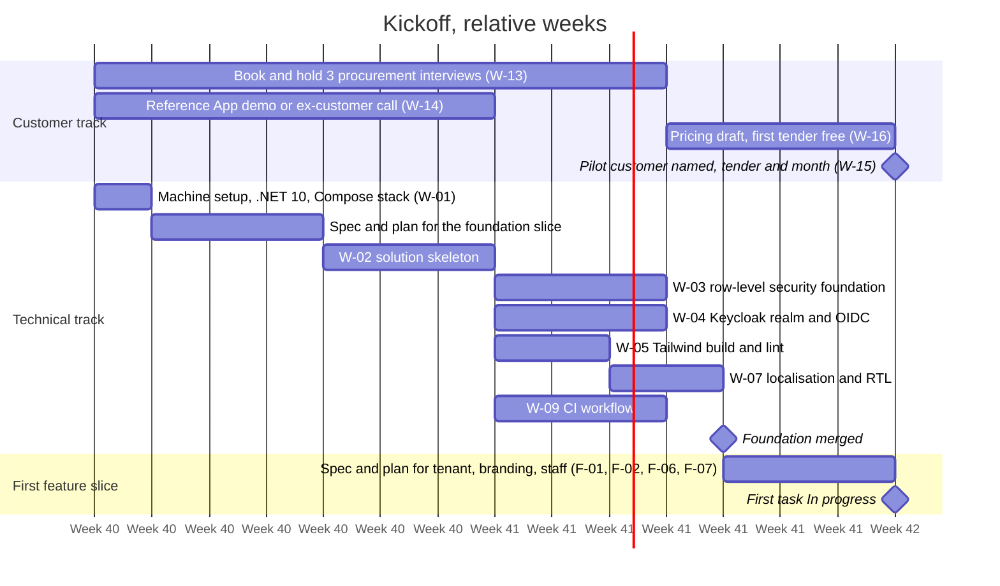

# Kickoff: The First Four Weeks

Date: 2026-09-21
Status: the plan for going from documents to a running foundation and a named pilot customer. Relative weeks; they become dates the day the customer track lands a name.
Related: `05-mvp-scope.md` (build plan), `07-ways-of-working.md` (process), `09-backlog.md` (rows referenced here)

## 1. What kickoff must produce

Kickoff is over when all four are true:

1. A pilot customer is named, with a tender and a target month (W-15).
2. The foundation slice is merged: skeleton, row-level security, Keycloak organizations, Tailwind build, localisation (W-02, W-03, W-04, W-05, W-07).
3. CI runs on every pull request (W-09).
4. The first feature slice has an approved spec and a plan, and its first task is In progress.

## 2. Two tracks in parallel

Read it as: the customer track and the technical track run side by side from day one; the pilot date in week 4 depends on both.

## 3. Week by week

| Week | Customer track | Technical track | Exit check |
|---|---|---|---|
| 1 | Send interview requests; hold the Reference App call; write the seven answers into document 04 section 10 | Install .NET 10; Compose stack healthy; run the brainstorming session for the foundation slice; spec approved; plan written | Spec file exists in `docs/superpowers/specs/`; plan in `docs/superpowers/plans/` |
| 2 | Hold interviews 1 and 2; write each up the same day | W-02 skeleton merged; W-03 RLS and W-04 Keycloak in progress through the developer, reviewer, qa-engineer loop | `dotnet test` green with the cross-tenant isolation test; login through Keycloak issues a token with an organization id |
| 3 | Hold interview 3; draft the pricing page (W-16); shortlist two pilot candidates | W-05 Tailwind and W-07 localisation merged; W-09 CI green on a pull request; gallery page renders in both directions | Every pull request shows the CI checks; the `ml-4` lint test fails the build on purpose once |
| 4 | Pilot customer named with a tender and month (W-15); document 05 section 6 gets calendar dates | Foundation merged; brainstorming and plan for the first feature slice; first task started | Kickoff exit criteria in section 1 all true |

## 4. Day-one checklist

- [ ] .NET 10 SDK installed; `dotnet --list-sdks` shows 10.x
- [ ] Docker Desktop running; `docker compose ps` in `infra/compose` shows all services healthy
- [ ] Git identity set for this repository
- [ ] Read in this order: CLAUDE.md, `docs/05`, `docs/07`, `docs/09` epic E0, `docs/08` sections 2 to 4
- [ ] Three interview requests sent; one Reference App call booked
- [ ] A Claude Code session opened in the repository root with `/superpowers:brainstorming` and the sentence "the foundation slice: W-02, W-03, W-04, W-05, W-07 from docs/09"

## 5. How a session runs the foundation slice

1. **Spec.** `/superpowers:brainstorming` asks one question at a time. Answer from the backlog rows; the acceptance criteria there are the spec's requirements. It writes `docs/superpowers/specs/<date>-foundation-design.md`.
2. **Plan.** `/superpowers:writing-plans` produces numbered tasks, each with its own acceptance and test. Check that each task maps to one W row.
3. **Execute.** `/superpowers:subagent-driven-development` runs the loop per task: developer implements test-first, reviewer reports ranked findings, developer fixes, qa-engineer covers and runs. You merge.
4. **Record.** The pull request template carries the evidence; the backlog row moves to Done in the same pull request.
5. **Status.** Ask "what is the status" at any point; project-manager answers from the backlog and git.

## 6. Decisions that must land during kickoff

| Decision | Needed by | Default if undecided |
|---|---|---|
| Hosting provider in a Saudi region (document 02 section 5) | Decided as interim on 2026-09-21: local Compose for development, Oracle Cloud Always Free in Jeddah for the pilot, revisit when Azure and AWS Saudi regions open in Q4 2026 | Design against generic managed PostgreSQL and S3-compatible storage |
| Pilot login method (how the customer's staff sign in: Keycloak password plus authenticator code, or their Microsoft Entra ID single sign-on) | Before W-04; only matters if the pilot customer refuses password login | Password plus TOTP through Keycloak, no SSO |
| PO scope for version 1 | Before the award slice, not during kickoff | Branded PDF only (document 05 assumption) |
| Vendor identity model | Before the vendor slice, not during kickoff | One account per vendor on the pilot tenant (document 05 assumption) |

## 7. Kickoff risks

| Risk | Signal | Response |
|---|---|---|
| No pilot customer by week 4 | Fewer than two candidates after the interviews | Widen to channel partners in document 04 section 9; keep building the foundation, do not start features that need customer input |
| Foundation slice grows | A task exceeds size L or touches a feature ID | Split; anything feature-shaped goes to the first feature slice |
| Keycloak organizations surprises | Token lacks the organization claim, or vendor multi-membership behaves unexpectedly | Time-box one day; the spike pattern from document 06 applies: write the finding, decide, record an ADR |
| Arabic slips to "later" | A pull request with only English resources | Definition of done item 4 blocks the merge; no exceptions during kickoff, because habits form now |
