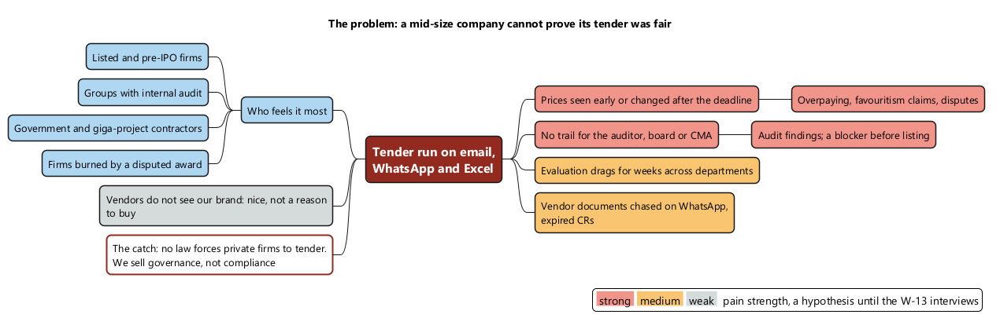
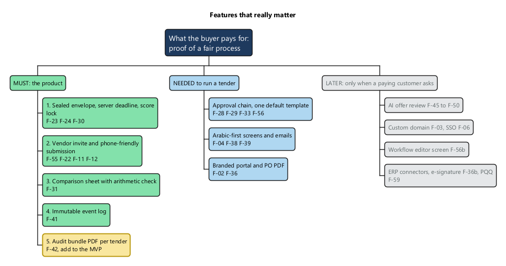
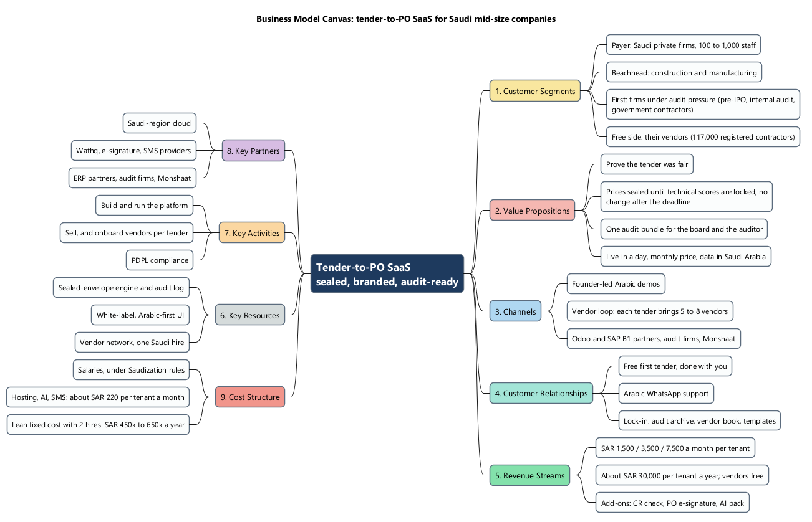
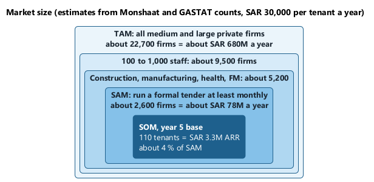
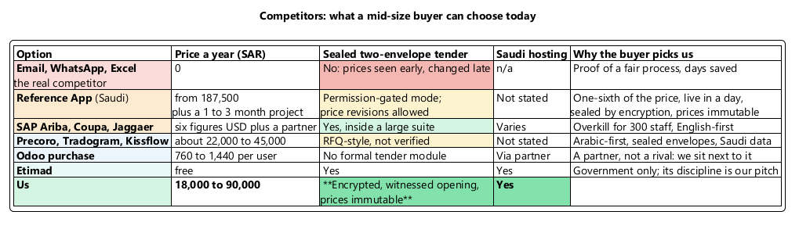
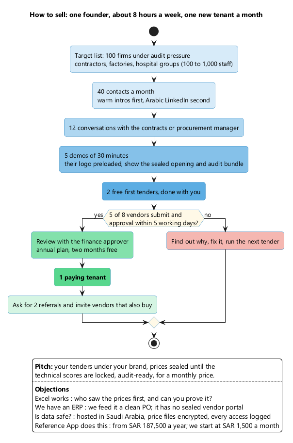
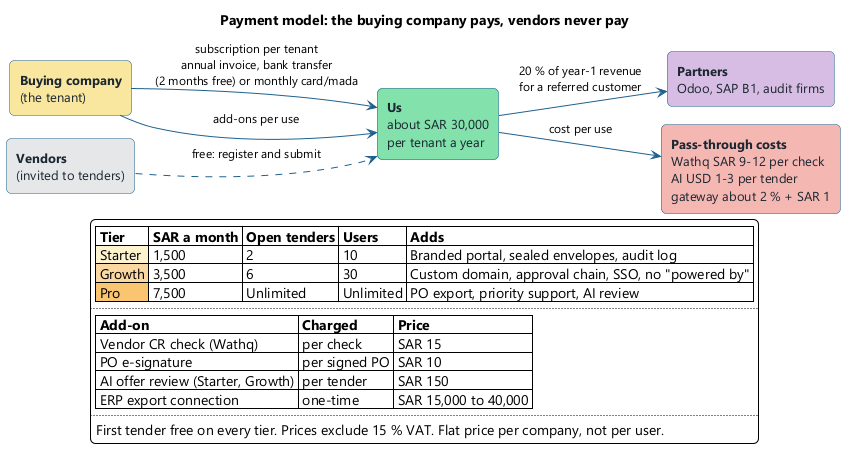
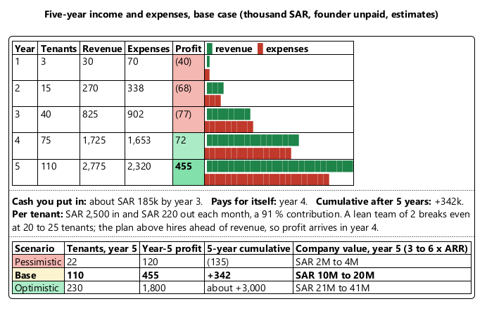
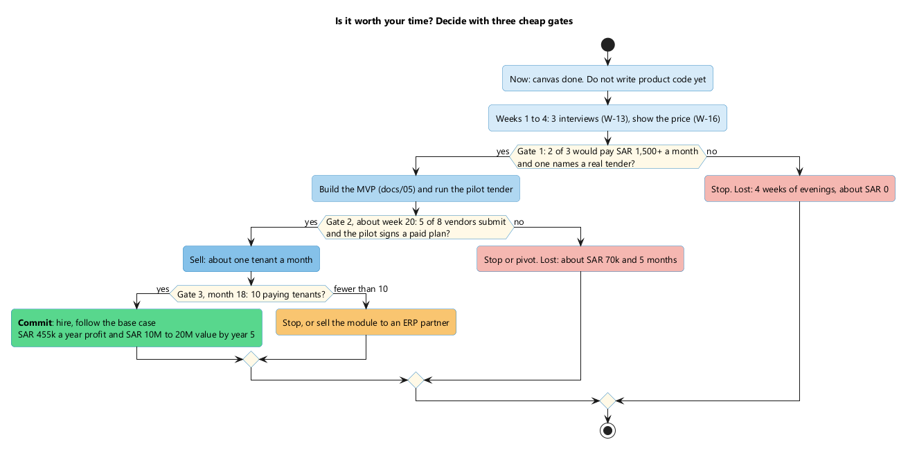

# Business Model Canvas: WaslaBid, Tender-to-PO for the Saudi Mid-Market

Date: 2026-09-26. Status: hypothesis, before the pilot. Numbers are estimates unless section 12 marks them verified.

Diagrams are PlantUML; the sources are in `docs/diagrams/11-bmc/`. To re-render: `java -jar ~/bin/plantuml.jar -charset UTF-8 -tpng docs/diagrams/11-bmc/0*.puml`.

## 1. The answer first

- **Problem.** A mid-size Saudi company that runs tenders on email and Excel cannot prove the tender was fair. The people who feel this most are firms under audit or governance pressure (section 2).
- **Features.** Sealed envelopes, vendor submission, the comparison sheet, the audit log, and an audit bundle. Everything else waits for a paying customer (section 3).
- **Payment.** The buying company pays a flat monthly subscription (SAR 1,500 to 7,500), mostly as an annual invoice; the first tender is free; vendors never pay (section 8).
- **Worth it?** Yes, as a staged bet. In the base case you put in about SAR 185k over three years, it breaks even in year 4, makes SAR 455k a year by year 5, and the company could be worth SAR 10M to 20M. **Run the three customer interviews before writing product code** (section 10).

## 2. The problem

No law forces a private company to run a sealed tender. Target the firms that already feel the pain: listed and pre-IPO firms, groups with internal audit, government contractors, and firms that have had a disputed award.

## 3. Features that really matter

The MVP in document 05 is well cut, with one gap: add a simple audit bundle PDF (F-42). It is what the finance approver shows the board, and it is the reason a governance buyer pays.

## 4. The canvas

The right side is the value we create for the customer (blocks 1 to 5). The left side is what it takes to deliver it (blocks 6 to 9).

## 5. Market size

Today's spend is small because Excel wins. The business grows by converting firms that use no tool, not by taking share from competitors.

## 6. Competitors

The real competitor is Excel. The Reference App (document 04) is priced for enterprises. The likeliest new threat is a cheaper Reference App tier, or an Odoo partner building a tender add-on. Both are reasons to reach 20 tenants quickly.

## 7. How to sell

Sell to the contracts manager, then close with the finance manager, who signs. Vendors never pay. Each tender brings 5 to 8 vendors onto the platform, and some of them run tenders of their own.

## 8. Payment model

The buying company pays a flat subscription per company, not per user, so adding more evaluators costs nothing. Most customers pay an annual invoice by bank transfer, which brings cash in early; Starter customers can pay monthly by card or mada. Vendors never pay: every free vendor is a possible future buyer.

## 9. Income, expenses, profit, value

Prices come from section 8, averaging about SAR 30,000 a year per tenant. Churn is assumed at 18 % a year. The founder is unpaid in every scenario. The month-by-month version, with the build year, a lean plan, and an Excel model, is in document 13.

## 10. Is it worth your time?

| For | Against |
|---|---|
| Clear price gap: the Reference App starts at SAR 187,500 a year | No regulation forces private tenders; governance sells more slowly than compliance |
| 91 % contribution per tenant; lean break-even at 20 to 25 tenants | No profit before year 4; your evenings (about SAR 216k a year at SAR 300 an hour) are paid back by the equity, not the profit |
| You build it yourself: architect, Keycloak, multi-tenant | Sales is the hard part: Arabic, in person, 3 to 6 month cycle |
| Gate 1 costs about SAR 0 | Pessimistic case: lose about SAR 135k over 5 years |

## 11. Riskiest assumptions

| # | Assumption | Test |
|---|---|---|
| 1 | Firms pay for a fair-tender process without a law forcing them | W-13 interviews and W-16 price; pilot measure "would they pay" (document 05 section 7) |
| 2 | AI review fits "all data in Saudi Arabia" | The Claude API processes data in the US or globally only (verified 2026-09-26), so this needs a decision and an ADR before AI work. The AI features are not in the MVP |
| 3 | The vendor loop brings tenants cheaply | Count sign-ups that trace back to a vendor invitation |
| 4 | SAR 1,500 to 7,500 a month is acceptable | Show the price page in the interviews (W-16) |
| 5 | A sales cycle of 3 to 6 months | Track days from first meeting to signature |

## 12. Key numbers and sources

V = verified by the source. E = our estimate.

| Number | Value | | Source |
|---|---|---|---|
| Medium enterprises in Saudi Arabia | 18,723 (Q4 2023) | V | [Monshaat](https://www.monshaat.gov.sa/en/node/53859) |
| Large private firms (250+ staff) | About 4,000 (range 2,500 to 6,000) | E | From 1.9M workers in large firms, [OBG 2019](https://oxfordbusinessgroup.com/reports/saudi-arabia/2019-report/economy/starting-small-a-key-role-is-played-by-small-and-medium-sized-enterprises-smes-in-fostering-new-job-opportunities-and-economic-growth) |
| Share of medium-firm revenue: manufacturing, construction | 29.6 %, 17.0 % | V | [GASTAT SME 2024](https://www.stats.gov.sa/documents/20117/2435267/SME+2024+EN.pdf) |
| Registered contractors | 117,000 (July 2026) | V | [Monshaat](https://www.monshaat.gov.sa/en/node/492401) |
| Saudi procurement software market | USD 70M (2025), 10.3 % a year | V, single source | [Reports Insights](https://www.reportsinsights.com/quants/research/procurement-software-market/saudi-arabia) |
| Procurement jobs reserved for Saudis | 70 % of 12 roles, from 2025-11-30 | V | [Middle East Briefing](https://www.middleeastbriefing.com/news/saudi-arabias-nitaqat-2026-update-latest-quotas-by-sector-and-what-foreign-employers-need-to-comply-now/) |
| PDPL enforcement | 48 decisions; fines up to SAR 5M | V | [IAPP](https://iapp.org/news/a/saudi-arabia-s-data-protection-authority-steps-up-enforcement) |
| Audit-committee review of related-party contracts | CMA governance rules, article 52 | V | [CMA](https://cma.gov.sa/en/RulesRegulations/Regulations/Pages/details.aspx?code=2) |
| Reference App price | From USD 50,000 a year | V | Document 04 |
| Precoro, Tradogram, Odoo | USD 499 to 999 a month; from USD 99; USD 16.90 to 32 per user | V | [Precoro](https://precoro.com/pricing), [Tradogram](https://www.tradogram.com/pricing), [Odoo](https://www.odoo.com/pricing) |
| Saudi accounting SaaS | SAR 99 to 600 a month | V, secondary | [Wafeq guide](https://www.wafeq.com/en/business-hub/for-business/the-ultimate-guide-to-accounting-software-pricing-in-saudi-arabia) |
| Wathq CR lookup | SAR 9 to 12 per call | V | [Wathq](https://developer.wathq.sa/en/Pricing/page/prices/basic) |
| Senior engineer, Riyadh | SAR 22k to 32k a month | V, secondary | [Levels.fyi](https://www.levels.fyi/t/software-engineer/levels/senior/locations/saudi-arabia) |
| Customer success hire | SAR 12k to 18k a month | E | None found |
| AI cost per tender (5 vendors) | USD 1 to 3 | E | Published per-token prices |
| Claude API processing region | US or global only | V | [Data residency docs](https://platform.claude.com/docs/en/manage-claude/data-residency) |
| Azure and AWS Saudi regions | November and December 2026 | V | [Microsoft](https://news.microsoft.com/source/emea/2026/08/microsoft-announces-saudi-arabia-east-datacenter-region-will-be-available-in-november-2026/), [AWS](https://www.aboutamazon.com/news/aws/aws-cloud-region-saudi-arabia) |
| Mid-market SaaS churn, sales cycle | 1.5 to 3 % a month; 60 to 120 days | V, global, secondary | [Vitally](https://www.vitally.io/post/saas-churn-benchmarks), [Wonit](https://wonit.ai/questions/b2b-sales-cycle-benchmarks-by-industry-2025) |
| SaaS company value | 3 to 6 times ARR | E | No Saudi deal data found |
