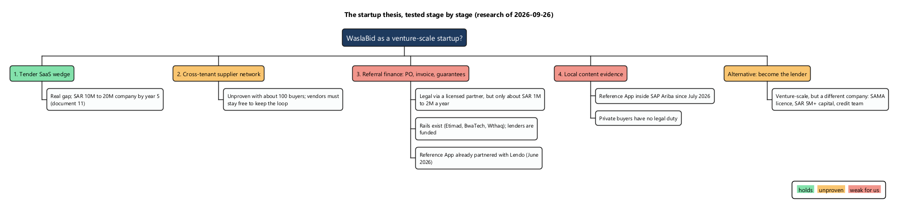
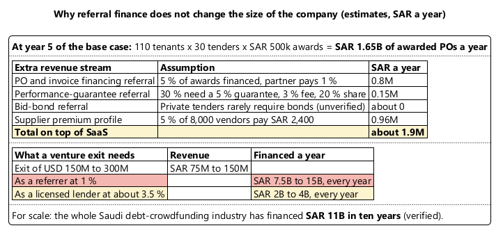
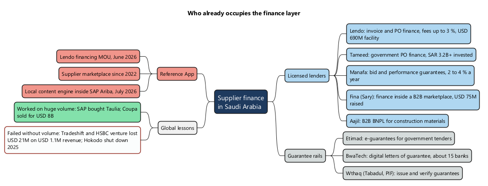
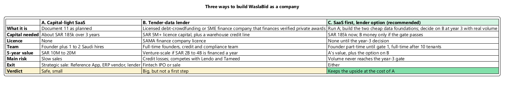
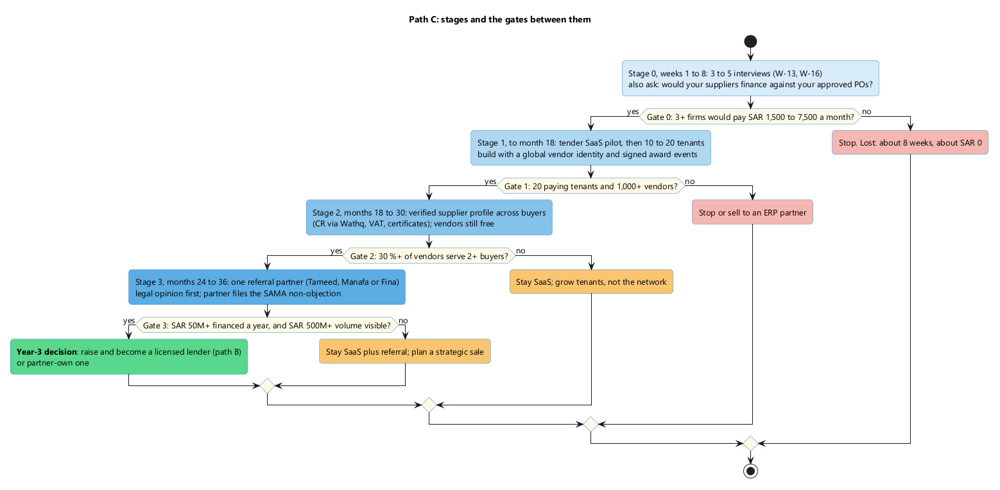

# Startup Thesis: Can WaslaBid Be a Venture-Scale Company?

Date: 2026-09-26. Status: research result, before any customer interview. Builds on the business model in document 11.

Diagrams are PlantUML; the sources are in `docs/diagrams/12-startup/`. To re-render: `java -jar ~/bin/plantuml.jar -charset UTF-8 -tpng docs/diagrams/12-startup/0*.puml`.

## 1. The answer first

- **The idea tested.** Tender SaaS as the way in, then a supplier network across buyers, then financing built in (PO and invoice financing, guarantees), then local content evidence.
- **Result.** It is **not venture-scale as described**. Every step is legal and has precedent in Saudi Arabia, but:
  - referral finance adds only about SAR 1M to 2M a year at year-5 scale;
  - the guarantee rails and the lenders already exist;
  - the Reference App has already taken the finance and local-content angles.
- **The one venture-scale version:** WaslaBid becomes a **licensed lender** that uses verified tender and award data as its underwriting edge. That is a fintech with a SaaS channel, and it needs a SAMA licence, SAR 5M+ capital, and a full-time team.
- **Recommendation: path C.** Build the SaaS from document 11 and make two cheap architecture choices now, so the lender option stays open. Decide on becoming a lender at year 3, with real volume data (sections 5 and 6).
- **Decided 2026-09-26: path C.** The section 7 choices were decided the same day; see the Decision column there.

## 2. The thesis, stage by stage

Only the wedge holds on today's evidence. The network is unproven, and the finance and local-content layers are weak for a new entrant.

## 3. The money: why referral finance is small

A referrer earns about 1 % of what gets financed. Reaching venture scale that way would take more volume every year than the whole Saudi crowdfunding industry has financed in a decade. Only a lender, earning about 3.5 %, can get there.

## 4. Who is already there

The global lesson is blunt. Finance on top of a network works when the network already carries huge volume (SAP with Taulia, Coupa). It fails when it does not (Tradeshift with HSBC, Hokodo).

## 5. Three ways to build the company

## 6. Path C: stages and gates

**Rules that keep the platform outside the licence perimeter until the year-3 decision:**
- Never hold or move funds.
- Never underwrite.
- Never rank one financier above another.
- The licensed partner files the SAMA outsourcing non-objection.
- Get a Saudi fintech lawyer's opinion before signing any partner agreement.

## 7. What to build differently now

These are cheap now and expensive to retrofit later. All five were decided on 2026-09-26.

| # | Choice | Why | Touches | Decision 2026-09-26 |
|---|---|---|---|---|
| 1 | **Global vendor identity**: one vendor across all tenants, with tenant-scoped relationship records under row-level security | The network and any future financing both depend on it | Closes open decision 2 in document 02 section 5 | In the MVP, keyed by CR number; tenders Invited or Open; vendors can invite buyers (ADR-0007, F-10, F-19b, F-62) |
| 2 | **Signed award and PO events**: expose the existing audit hashes as a verifiable "award" record | This is the underwriting evidence a financier would buy | F-41, F-42, F-36 | In the MVP with the audit bundle (ADR-0008, F-64, F-42) |
| 3 | **Consent ledger**: the vendor grants, scopes, and revokes sharing of award and PO data with a named financier | PDPL requires it before any data goes to a partner | New feature ID and ADR | In the MVP (ADR-0009, F-63) |
| 4 | **Guarantee as a verifiable document type**: verify it against Wthaq or BwaTech; never issue guarantees | Guarantees are common on government tenders; issuing them needs a licence | F-12, F-16 | Verify, never issue; version 1 (ADR-0010, F-65) |
| 5 | **Vendors never pay**, until gate 2 proves the network | A supplier fee would slow the vendor-to-buyer loop | Document 11 section 8 | Adopted |

The section 6 rules that keep the platform outside the licence perimeter were adopted as invariants on the same day (ADR-0010, N-11).

## 8. Funding reality

| Fact | Value | |
|---|---|---|
| Saudi VC, 2025 | USD 1.72B across 257 deals (a record) | V |
| Saudi VC, H1 2026 | USD 219M across 72 deals (−74 %); fintech took 67 % | V |
| Local seed cheques | USD 250k to 3M | V, secondary |
| MENA seed pre-money valuation | USD 2M to 12M at about 10 % dilution | V, secondary |
| MISA entrepreneur licence for a foreign founder | No capital requirement; needs IP, VC backing, or a recommendation letter | V, secondary |

What this means for you:
- **Path A** needs no investor.
- **Path C** can raise a small seed round after gate 1, on real tenant and vendor numbers.
- **Path B** needs a fintech round and a lender's balance sheet, and investors will expect full-time founders, one of them Saudi.

## 9. Riskiest assumptions

| # | Assumption | How it is tested |
|---|---|---|
| 1 | Private tenders produce volume worth financing | Gate 0 interview question; gate 3 volume |
| 2 | A licensed partner will pay a referral fee, and SAMA accepts the structure | Legal opinion and one partner conversation before stage 3 |
| 3 | WaslaBid can out-run the Reference App, which already has finance, a marketplace, local content, and sealed bids | Win rate in deals where both are shortlisted |
| 4 | A network forms from about 100 buyers | Gate 2: 30 % of vendors serve 2 or more buyers |
| 5 | Investors fund a SaaS referrer in a fintech-heavy market | Investor conversations after gate 1 |

## 10. Sources

V = verified by the source. E = estimate. Secondary = aggregator or search summary.

| Claim | Source |
|---|---|
| Financing needs a SAMA licence; licence types; debt crowdfunding at SAR 5M capital and a SAR 7.5M limit per borrower | [SAMA Rulebook: law](https://rulebook.sama.gov.sa/en/entiresection/8350), [licence types](https://rulebook.sama.gov.sa/en/types-licenses-1), [crowdfunding rules](https://rulebook.sama.gov.sa/en/rules-engaging-debt-based-crowdfunding) |
| Aggregator licence at SAR 2M; referral as a material outsourced function needing SAMA non-objection | [Support activities](https://rulebook.sama.gov.sa/en/rules-licensing-finance-support-activities), [aggregation](https://rulebook.sama.gov.sa/en/instructions-practicing-aggregation-activity), [outsourcing](https://rulebook.sama.gov.sa/en/rules-outsourcing-finance-companies) |
| Open banking licensed from 2026-03-26 | [Clyde & Co](https://www.clydeco.com/en/insights/2026/03/sama-new-licensing-framework-for-open-banking) |
| Etimad e-guarantees; BwaTech digital letters of guarantee; Wthaq | [Etimad](https://portal.etimad.sa/en-us/services/servicedetails?ServiceGuid=2c081571-89e4-4b6a-b3a6-77a47b339a4e), [BwaTech](https://bwatech.sa/bwa-business/lg/), [Mubasher](https://english.mubasher.info/news/3694013/Tabadul-to-streamline-bank-guarantee-services-in-Saudi-Arabia) |
| SME lending SAR 467.7B (11.3 % against a 20 % target); gap above SAR 300B | [TradeArabia 2026-09-22](https://tradearabia.com/News/486686/Saudi-SME-lending-reached-%24125bn-in-2025-says-report) |
| Debt crowdfunding SAR 11B since 2016; 12 licensed platforms | [Arab News 2026-06-16](https://www.arabnews.com/node/2647381/business-economy) |
| Lendo fees and facility; Tameed; Fina; Aajil; Manafa guarantee fees | [Lendo pricing](https://www.lendo.sa/en/pricing), [AGBI](https://www.agbi.com/banking-finance/2025/01/lendo-raises-690m-to-fund-sme-growth-in-saudi-arabia/), [Tameed](https://www.ta3meed.com/en), [Disruption Banking](https://www.disruptionbanking.com/2026/09/16/fina-launches-sar-500m-financing-fund-to-offer-liquidity-to-smes/), [Wamda](https://www.wamda.com/2024/03/buildnow-secures-9-4-million-seed-funding), [NextBid](https://nextbidsa.com/en/blog/bid-bond-performance-guarantee-etimad) |
| SAP network supplier fees; Taulia; Coupa; Tradeshift and HSBC venture; Hokodo | [SAP Learning](https://learning.sap.com/courses/overview-of-sap-business-network/discussing-the-sap-business-network-supplier-fees_e4deac90-bef8-4e86-a86b-08d526286a4b), [CNBC](https://www.cnbc.com/2022/01/27/software-group-sap-to-buy-majority-stake-in-us-fintech-firm-taulia.html), [Coupa](https://www.coupa.com/newsroom/coupa-software-enters-definitive-agreement-be-acquired-thoma-bravo-for-8/), [GTR](https://www.gtreview.com/news/digital-trade/tradeshift-exits-semfi-joint-venture-with-hsbc/), [The Paypers](https://thepaypers.com/payments/news/hokodo-shuts-down-after-eight-years-and-usd-177-mln-raised-in-b2b-bnpl-market) |
| Saudi VC 2025 and H1 2026 | [SPA](https://www.spa.gov.sa/en/N2494920), [Argaam 2026-08-01](https://www.argaam.com/en/article/articledetail/id/1924963) |
| Seed sizes and valuations; MISA entrepreneur licence | [valu.vc](https://valu.vc/saudi-startup-funding/), [Clear](https://clear.world/2025-mena-early-stage-data-handbook), [saudimarketentry](https://saudimarketentry.com/pathways/entrepreneur-license/) |
| Local content: required on government contracts of SAR 25M+; Aramco IKTVA | [Argaam 2023](https://www.argaam.com/en/article/articledetail/id/1620128), [Tamimi](https://www.tamimi.com/law-update-articles/doing-business-with-saudi-aramco-the-iktva-program/) |
| Reference App: Lendo MOU, marketplace, SAP Ariba local content | Document 04 |

Not found: letters of guarantee outstanding at Saudi banks; the cost of a local content certificate; how often private tenders require bonds; verified Saudi tender-alert prices; Saudi-only seed valuation medians; SAMA guidance that explicitly allows unlicensed referral fees.
