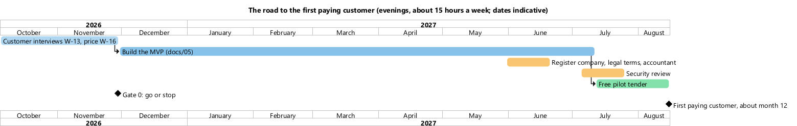
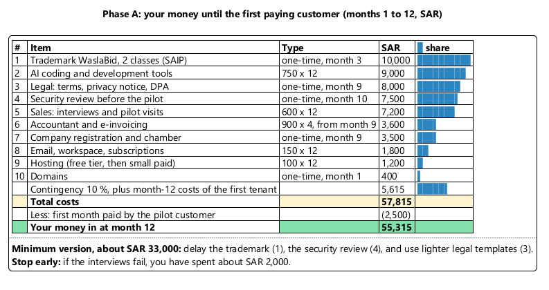
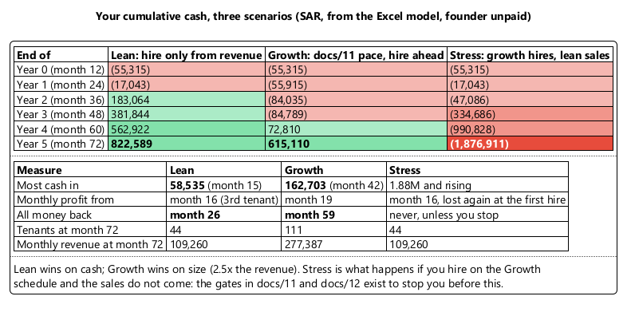
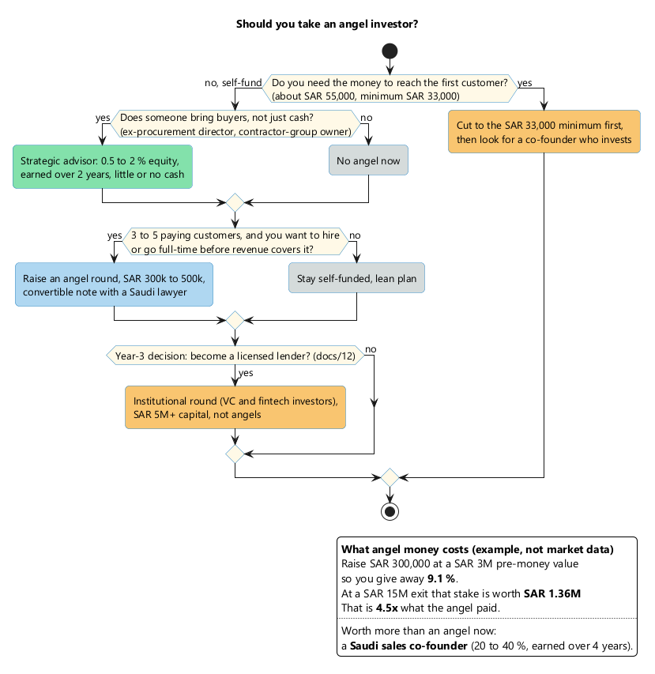

# Founder Investment: Your Money In, and When It Comes Back

Date: 2026-09-26. Status: estimates for planning, before the customer interviews. Not tax or legal advice.

The numbers come from the Excel model `docs/13-founder-investment-model.xlsx`. It has four parts:
- **Assumptions**: blue cells are inputs; yellow cells are the key assumptions.
- **Monthly cash flow**: lean, growth, and stress scenarios, 72 months each.
- **Summary**: the headline results for each scenario.
- **Angel calculator**: what equity an investment costs you.

Change any input and every figure updates. Diagram sources are in `docs/diagrams/13-investment/`.

## 1. The answer first

- **To the first paying customer (month 12): about SAR 55,000 of your own money**, or about SAR 33,000 in the minimum version. If the interviews fail, you stop after about SAR 2,000.
- **Lean plan** (you do everything until revenue pays for hires): the most cash in is **SAR 58,535**. Monthly profit starts at the 3rd paying tenant (month 16), and **all your money is back in month 26**.
- **Growth plan** (the pace of document 11, hiring ahead of revenue): the most cash in is **SAR 162,703**, and all of it is back in month 59. By month 72 it produces 2.5 times the lean plan's revenue.
- **Stress** (hiring on the growth schedule while customers arrive at the lean pace): losses keep growing, reaching **SAR 1.9M by month 72**. **Never hire ahead of paying customers**; the gates exist to stop this.
- **Angel investor: not now.** Self-fund phase A. Take a strategic advisor, not cash. Raise SAR 300k to 500k only after 3 to 5 paying customers, and only if you want to hire or go full-time sooner (section 5).

Founder salary is zero in every scenario.

## 2. The road to the first customer

## 3. Phase A: every riyal until the first customer

## 4. Three scenarios after the first customer

How the lean plan breaks even:

| Item | SAR a month |
|---|---|
| Fixed costs after the first customer: tools 750, hosting 300, subscriptions 150, accountant 900, sales 3,000, renewals 100 | **5,200** |
| Net per tenant: 2,500 price, less a 10 % partner share and 145 of variable cost | **about 2,100** |
| **Break-even**: 5,200 ÷ 2,100 | **3 tenants** |

What a hire really costs: a SAR 15,000 salary plus employer GOSI (about 11.75 %) plus medical insurance (about SAR 5,000 a year) comes to **about SAR 17,200 a month**.

## 5. Angel investor: when, and at what cost

Before a Saudi co-founder or angel invests, get a Saudi lawyer to structure it, for example as a convertible note. I have not verified how SAFE-style instruments are treated under Saudi law.

## 6. What the model leaves out

| Item | Why it matters |
|---|---|
| **Your employment contract** | Check it for clauses on outside business, conflicts of interest, and intellectual property **before** you register the company |
| **MISA licence if the owner is not Saudi** | About SAR 60,000 a year (sources conflict). It roughly doubles phase A. A Saudi co-founder holding the company avoids it |
| **VAT** | Registration is mandatory above SAR 375,000 of revenue a year (lean plan: around month 40, on trailing 12-month revenue). VAT is collected from customers, so it is not a cost, but invoices must be ZATCA e-invoices |
| **Zakat or income tax** | Zakat of 2.5 % on the zakat base if the company is Saudi-owned; 20 % income tax on the foreign-owned share. Small until you are profitable |
| **Your time** | About 15 hours a week; at SAR 300 an hour that is about SAR 216,000 a year. It is not cash, but it is the real price of the lean plan |
| **Founder salary** | Zero in the model. In the lean plan, you can start paying yourself after month 26 |

## 7. Key assumptions

All of these are ESTIMATE unless marked otherwise; change them in the model.

| Assumption | Value | Basis |
|---|---|---|
| Average price per tenant | SAR 2,500 a month | Tiers of SAR 1,500 / 3,500 / 7,500 (document 11 section 8) |
| Monthly churn | 1.5 % | Global mid-market benchmark of 1.5 to 3 % a month (Vitally, secondary) |
| New tenants a month, lean | 0.5, 0.75, 1, 1.25, 1.5 across years 1 to 5 | Founder-led selling |
| New tenants a month, growth | 0.25, 1.17, 2.5, 3.75, 4.33 | Document 11 base case, shifted by the build year |
| First paying customer | Month 12 | Document 05 plan at evening pace |
| Trademark, legal, security review | SAR 10,000 / 8,000 / 7,500 | Estimates; verify the trademark fees with SAIP |
| Company registration | SAR 3,500 including the chamber | Registration SAR 1,200 to 2,000 (InCorp, secondary) |
| Employer GOSI | 11.75 % | Pension 9 %, occupational hazards 2 %, SANED 0.75 %; verify with GOSI |
| Senior engineer salary | SAR 27,000 a month | Riyadh range SAR 22k to 32k (Levels.fyi, April 2026, secondary) |

Document 11 gave about SAR 185,000 as the cash needed for its base case. This monthly model gives SAR 162,703 for the same pace, including the build year. The difference comes from monthly rather than yearly timing.
