# 14. Ten adjacent ideas with fewer competitors

Date: 2026-09-26
Status: ideas to test in the W-13 interviews, not decisions. Ideas 2, 5 and 7 were verified with sources by the market-analyst agent on 2026-09-27 (section 4); the other seven are still our estimate.
Related: docs/01 section 3, docs/04 section 9, docs/11 section 2 (the four segments), docs/12 (path C), F-10, F-12, F-13, F-41, F-42, F-56, F-62, F-65, F-66

**Answer first.** Tender software is crowded at the top (Etimad, the Reference App, Monafasat, SAP). The work *around* a tender is not: before it (vendor compliance papers), beside it (bank guarantees, approvals), and after it (contract milestones, payment claims, supplier scores). Six of the ten ideas reuse more than half of what WaslaBid already has, so they can be sold as a wedge into a buyer that is not ready for full tendering, then grow into WaslaBid. After the 2026-09-27 check, all three front-runners have more competitors than estimated. **2 vendor compliance vault** and **7 procurement audit checks** still stand, each on a narrower point (section 4). **5 subcontractor claims** drops: at least five Saudi Arabic contracting ERPs already handle claims.

## 1. Where each idea sits

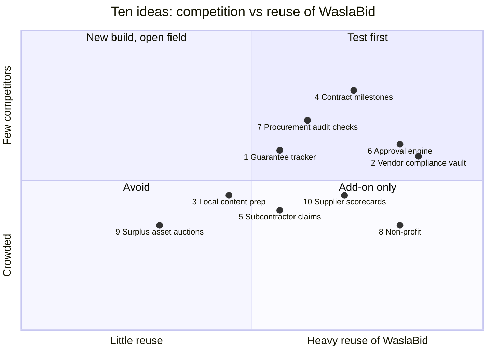

## 2. The ten ideas at a glance

| # | Idea | Who pays | Competitors (estimate unless marked verified) | Reuse of WaslaBid | Score /10 |
|---|---|---|---|---|---|
| 1 | Bank guarantee tracker and verification | Buyers holding bid and performance guarantees | Bank portals only; Etimad covers government | F-66, F-41, notifications | 7 |
| 2 | Vendor compliance vault: CR, ZATCA, GOSI, Nitaqat, Chamber certificates with expiry, shared across buyers | Buyers (vendors free) | **Verified, medium:** سجل (kyc.sa) checks documents and tracks expiry in Arabic; free government checks; Wathq paid API; buyer-owned portals. One vault the vendor shares with many buyers not found publicly | F-10, F-12, F-64 | **7** |
| 3 | Local content score preparation for suppliers bidding on government work | Suppliers | Consultancies; Reference App through SAP Ariba | F-13 only | 5 |
| 4 | Post-award contract milestones: deliverables, variations, retention, expiry alerts | Buyers | Enterprise tools (Icertis, Agiloft) in English; Excel | F-36, F-41, F-56 | 7 |
| 5 | Subcontractor payment claims: progress claims, measurement against the BoQ, retention, approval chain | Main contractors | **Verified, medium to high:** BuildERP, Salis, Babel, Orchida and others (Saudi, Arabic); Oracle Aconex and Unifier; Procore; Arkan (UAE) | F-16 BoQ, F-56, F-65 | 5 |
| 6 | Approval and delegation-of-authority engine with signed decisions, sold alone | Finance and audit teams | Generic e-signature apps; ERP workflows | F-56, F-65, ADR-0004 | 6 |
| 7 | Procurement audit checks on the buyer's ERP export: split orders, single source, vendor bank account shared with staff, price outliers | Internal audit, CFO | **Verified, medium:** A³ Audit (Saudi, Arabic, early); Caseware IDEA in Arabic; Diligent, SAP, MindBridge for enterprises; Big 4 forensics | F-42, F-48, F-49 logic | **7** |
| 8 | Non-profit procurement for grant-funded organisations | Non-profits and grant makers | Tanafos (docs/01) | Almost all of WaslaBid | 5 |
| 9 | Surplus and scrap asset auctions for private companies | Sellers | Several auction platforms | Little | 3 |
| 10 | Supplier performance scorecards after the PO: delivery, quality, SLA penalties | Buyers | ERP modules (rarely used by mid-size) | F-10, F-43 | 6 |

## 3. Pros and cons

| # | Pros | Cons |
|---|---|---|
| 1 Guarantees | Real money at risk (expired or fake guarantees); easy to explain; F-66 is already planned; no licence needed if we verify and never issue (N-11) | Banks may not offer a verification channel to a startup; buyers may see it as a feature, not a product |
| 2 Compliance vault | Every buyer checks the same five documents, every vendor uploads them again and again; builds the vendor network that F-62 needs; vendors never pay (docs/12) | سجل already does checking and expiry alerts in Arabic, so the value is only the vendor-owned profile shared across buyers (F-10, F-64); Wathq charges per call and its terms limit reuse of the data, so written clearance is needed before showing it to other buyers; Nitaqat is not in Wathq's API; needs 3 or more buyers before vendors see the value |
| 3 Local content | Mandatory for government tenders, so demand is steady | Rules change often; consultancy-heavy, hard to automate; sells to vendors, not our buyers |
| 4 Contract milestones | Every tender ends in a contract that nobody tracks; natural next step after PO (F-36) | Buyers expect it inside their ERP; value shows only months later |
| 5 Subcontractor claims | Construction is the beachhead (docs/04 section 9); claims are monthly, so usage is sticky; money disputes make it urgent; a portal where subcontractors submit their own claims was not found publicly | Arabic claims tools are common (verified 2026-09-27); sold against contracting ERPs already installed; needs deep construction knowledge (measurement, retention rules) |
| 6 Approval engine | We already build it (F-56); every company needs it | "Just a workflow" is easy for ERPs and e-signature apps to copy; hard to price high |
| 7 Audit checks | Sells to the governance segment (docs/11 section 2), which has budget; no system change for the buyer (one export); short sales story: "we found X in your data"; ready-made procurement rules plus the audit bundle (F-42) were not found publicly for mid-size firms | Needs data access, so trust and PDPL work up front; findings can embarrass staff, so sponsor must be the CFO or audit committee; Arabic is no longer unique (A³ Audit, IDEA in Arabic), and an in-house auditor with IDEA can build the tests, so the pitch is "nobody has to build them" |
| 8 Non-profit | Donors and regulators demand clean procurement records; WaslaBid fits almost as is | Small budgets; Tanafos already there; different sales channel |
| 9 Asset auctions | Companies do have surplus to sell | Crowded; nothing reused; different business (payments, logistics) |
| 10 Scorecards | Cheap to add; feeds award decisions in the next tender | Low willingness to pay alone; better as a WaslaBid feature |

## 4. Verified competitors for ideas 2, 5 and 7 (2026-09-27)

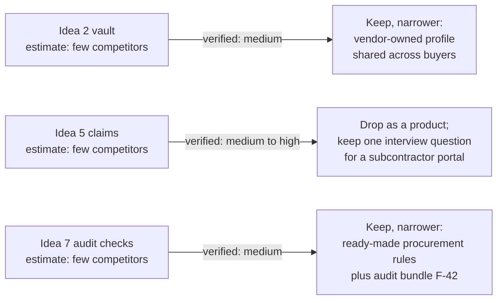

| Idea | Main competitors found | Arabic | Price | Sources (accessed 2026-09-27) |
|---|---|---|---|---|
| 2 | سجل (kyc.sa), Riyadh: collects counterparty documents, checks the commercial registry, VAT and sanctions, expiry alerts, IBAN check, API, data in the Kingdom | Yes | Per active partner, indicative | [kyc.sa](https://www.kyc.sa/), [pricing](https://www.kyc.sa/pricing) |
| 2 | Wathq API (Ministry of Commerce): CR, national address, GOSI employee data; open to companies of any size; terms limit commercial reuse | Yes | 2 to 12 SAR per CR call; prepaid from SAR 5,000 | [APIs](https://developer.wathq.sa/en/apis), [pricing](https://developer.wathq.sa/en/Pricing) |
| 2 | Free government checks: ZATCA zakat certificate, GOSI certificate, Saudization certificate, Chamber documents | Yes | Free | [ZATCA](https://zatca.gov.sa/en/eServices/Pages/eServices_038.aspx), [MHRSD](https://www.mol.gov.sa/Services/Inquiry/SaudiCertificateInquiry.aspx), [Tujar](https://tujar.fsc.org.sa/en) |
| 5 | BuildERP (muqawil-erp.com): claims against site records and the BoQ, retention, approvals | Yes | Not public | [progress claims](https://muqawil-erp.com/progress-claims/) |
| 5 | Salis ERP, Babel, Orchida, Shyphan: contracting ERPs with subcontractor claims | Yes | Quote only | [Salis](https://www.saliserp.com/contracting-management/), [Babel](https://www.babelsoftco.com/extracts_accounting_guidance/), [Orchida](https://orchida-soft.com/ar/const13-ocapv5/) |
| 5 | Oracle Aconex and Unifier; Procore (Dubai office since 2022) | Partly | Enterprise | [Oracle](https://www.oracle.com/sa/construction-engineering/aconex/), [Procore](https://www.procore.com/press/procore-opens-first-mena-office-in-dubai-to-reinforce-industry-commitment) |
| 7 | A³ Audit, hosted in Saudi Arabia: audit platform with a fraud module; procurement rules not found publicly | Yes | Free tier, then not public | [a3audit.ai](https://a3audit.ai/ar) |
| 7 | Caseware IDEA (Arabic since 2017); Diligent, SAP Business Integrity Screening, MindBridge for enterprises | IDEA yes | Quote only | [IDEA Arabic](https://idea.caseware.com/press-releases/caseware-idea-now-available-in-arabic/), [SAP](https://www.sap.com/products/financial-management/fraud-management.html) |

Open questions for a demo or call: can one سجل vendor profile be reused across its customers; may a platform show Wathq data to buyers other than the caller with the vendor's consent (F-64); do BuildERP or Salis let subcontractors submit claims themselves; which A³ Audit rules exist, and does it accept a raw ERP export.

Outside this document: Baten (batengate.com), a free marketplace for price requests between contractors and subcontractors with 4,000+ entities, touches the core product in the construction beachhead and should be added to docs/01.

## 5. Use case flows

Read each one as: who starts it on the left, what the system does in the middle, what the paying customer gets on the right. Boxes marked with a feature ID reuse WaslaBid.

### Idea 1. Bank guarantee tracker and verification

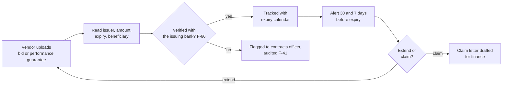

### Idea 2. Vendor compliance vault

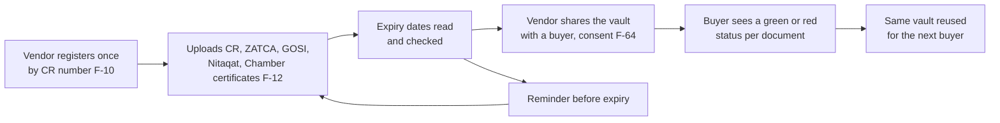

### Idea 3. Local content score preparation

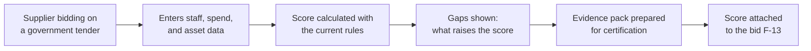

### Idea 4. Contract milestones after award

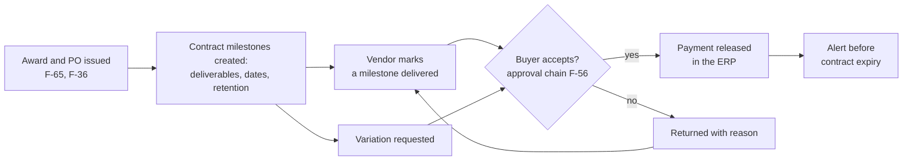

### Idea 5. Subcontractor payment claims

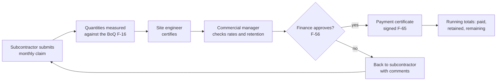

### Idea 6. Approval engine sold on its own

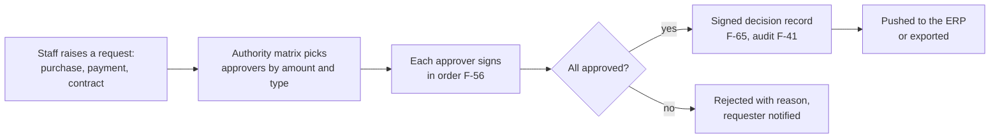

### Idea 7. Procurement audit checks

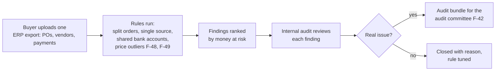

### Idea 8. Non-profit procurement

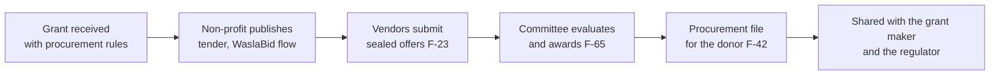

### Idea 9. Surplus asset auctions

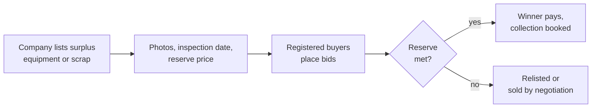

### Idea 10. Supplier performance scorecards

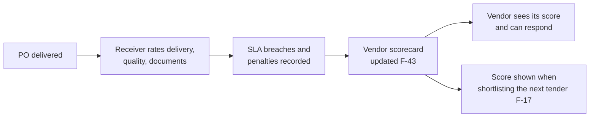

## 6. What to do with this

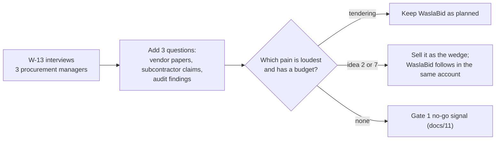

1. Do not start a new product. Keep the foundation work and the interview plan in docs/10.
2. In each interview, after the tender questions, ask three short ones:
   - "How do you check vendor papers such as CR, ZATCA, and GOSI, and how often do they expire on you?" (idea 2)
   - "If you work with subcontractors, how do you handle their monthly claims and retention?" (idea 5)
   - "When internal audit reviews purchasing, what do they find, and how long does it take?" (idea 7)
3. If an idea wins in two of three interviews, write it up as a feature in docs/02 with a new ID and decide at gate 1 (W-31) whether it leads.
4. Ideas 2, 5 and 7 were verified on 2026-09-27 (section 4). Before choosing idea 2 or 7, get the open questions in section 4 answered in a demo or call. Idea 5 stays only as interview question E2 in docs/15, to test whether subcontractors would submit claims in their own portal.
