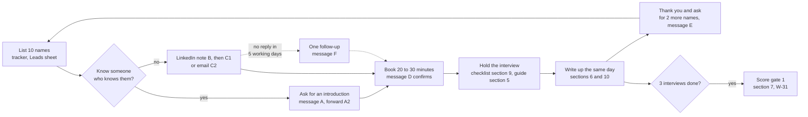
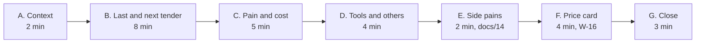
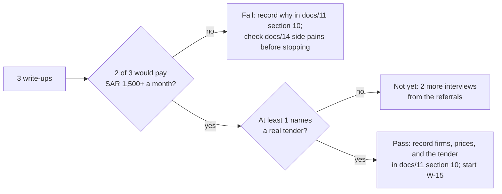
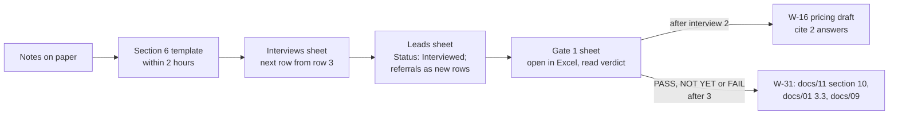

# 15. Customer interview kit (W-13)

Date: 2026-09-27. Refreshed 2026-10-03.
Status: ready to use. It serves W-13 (three interviews), W-16 (price test), and W-31 (gate 1).
Related: docs/10 (weeks 1 to 3), docs/11 sections 2, 8, 10 and 11 (segments, price tiers, gate, riskiest assumptions), docs/04 sections 6, 9 and 10 (Reference App gaps, target markets), docs/14 (ideas 2, 5 and 7), docs/05 section 7 (pilot measures), docs/18 (the 10-minute demo of what is built). Tracker: `docs/15-interview-tracker.xlsx`.

**Changed 2026-10-03.**
- Section 3: outreach messages are ready to send, Arabic first, with a forwardable introduction (A2), LinkedIn and email variants of the first ask (C1, C2), and one follow-up (F).
- Section 5: every question names the gate 1 criterion or F-xx hypothesis it tests; leading wording removed (D2, D3); new questions B6 (after the award), B7 (the next real tender), D4 (data and hosting) and F3 (which tier fits); the price card copies the tiers, add-ons and terms of docs/11 section 8 unchanged; E2 is optional, since idea 5 was dropped on 2026-09-27.
- Section 6: the write-up template follows the tracker columns, with the rules that keep the Gate 1 formulas right.
- Section 7: a stricter rule for when "would pay" counts as Yes.
- New sections 8 (objection handling), 9 (interview-day checklist) and 10 (same-day write-up into the tracker).
- Question IDs of 2026-09-27 are unchanged, because the tracker's column headers carry them.

**Answer first.** Find 10 names, get 3 conversations of 20 to 30 minutes, and listen more than you talk. Ask about the **last real tender** and the **next one**, not opinions about the future. Show the price only at the end. Write each interview up the same day (sections 6 and 10), then score gate 1 (section 7).

## 1. The whole flow



## 2. Who to talk to

| Priority | Role | Why |
|---|---|---|
| 1 | Procurement manager, contracts manager (مدير المشتريات، مدير العقود) | Runs tenders every month; feels the daily pain |
| 2 | CFO or finance director (المدير المالي) | Approves awards and budget; decides on price |
| 3 | Head of internal audit (رئيس المراجعة الداخلية) | Finds the problems after the fact; sponsor for the governance segment |

Cover at least three of the four segments decided in docs/11 section 2: listed or pre-IPO firms, groups with internal audit, government contractors, and firms that have had a disputed award. Companies with 100 to 2,000 staff (docs/04 section 9).

Rules:
- Research, not sales. No deck, no price until the last five minutes, and no demo before the price card (the demo in docs/18 is for the end of the meeting or a second one).
- One person at a time; no scraping, no bulk email (PDPL and LinkedIn rules).
- Keep this separate from your employer: no employer clients, contacts, or working hours.
- Ask before taking notes or recording, and store notes only in the tracker and the write-up.
- Do not mix this with the procurement audit review offer (`docs/offers/outreach-messages.md`, docs/16 idea 7) in the same conversation; one ask per person.

## 3. Outreach messages

Ready to send: replace only the angle brackets. Arabic first, English second; send English only when their profile or company works in English. Add one personal line where a message has `<سطر شخصي>` / `<personal line>` (how you know them, or something from their company), or delete it. Log each message in the Leads sheet: the "Message used" list holds A to E, so for C1 or C2 pick C, and record a follow-up F in Notes with its date.

### Message A. Ask a friend for an introduction (WhatsApp)

> السلام عليكم <الاسم>، عساك بخير. أشتغل على منصة تساعد الشركات الخاصة تطرح مناقصاتها وتستقبل العروض وتعتمد الترسية بطريقة منظمة، وقبل ما أكمل البناء أبغى أسمع من ناس يديرون المشتريات أو العقود فعلياً. تعرف أحد بهالدور في شركتكم أو شركة تعرفها؟ ٢٠ دقيقة بس أسمع تجربته، بدون بيع ولا عرض. لو يناسبك أرسل لك نبذة قصيرة تحوّلها له.

> Hi <name>, hope you are well. I am working on a platform that helps private companies publish tenders, receive offers and approve awards in an orderly way, and before I build further I want to hear from people who actually run procurement or contracts. Do you know someone in that role at your company, or at a company you know? Twenty minutes to hear their experience, no selling. If it suits you, I will send a short note you can forward.

### Message A2. The note your friend forwards

> أعرّفك بـ<اسمك>، وهو يدرس كيف تدير الشركات الخاصة في المملكة مناقصاتها: الطرح، واستلام العروض، والتقييم، واعتماد الترسية. يطلب ٢٠ دقيقة يسمع فيها تجربتك، حضورياً أو باتصال، وليس عرض بيع. جواله: <جوالك>.

> Meet <your name>, who is studying how private companies in the Kingdom run tenders: publishing, receiving offers, evaluation and award approval. He would like 20 minutes to hear your experience, in person or by call; it is not a sales pitch. Mobile: <your mobile>.

### Message B. LinkedIn connection note

Kept under 200 characters, which fits the shorter note limit some LinkedIn accounts have.

> أستاذ <الاسم>، أدرس كيف تطرح الشركات الخاصة في المملكة مناقصاتها وتقيّم العروض وتعتمد الترسية، وخبرتك في <الشركة> هي ما أريد أن أتعلم منه. يسعدني التواصل.

> <Name>, I am studying how private companies in the Kingdom run tenders and approve awards. Your experience at <company> is what I want to learn from. Glad to connect.

### Message C1. The ask, on LinkedIn after they accept

> شكراً على قبول الدعوة أستاذ <الاسم>. أعمل على منصة لمناقصات الشركات الخاصة، وقبل أن أكمل بناءها أتعلم من مديري المشتريات والعقود: كيف طرحتم آخر مناقصة، ومن اطّلع على الأسعار ومتى، وكيف اعتُمدت الترسية. هل يناسبك اتصال أو لقاء لمدة ٢٠ دقيقة هذا الأسبوع أو القادم؟ لن أعرض عليك شيئاً للبيع، وسأشاركك ملخص ما أتعلمه من المقابلات إن رغبت.

> Thank you for connecting, <name>. I am working on a platform for private-company tenders, and before I build further I am learning from procurement and contracts managers: how your last tender was published, who saw the prices and when, and how the award was approved. Could you spare 20 minutes, by call or in person, this week or next? I will not try to sell you anything, and I am happy to share a summary of what I learn across the interviews.

### Message C2. The ask, by email (work address from an introduction or the company site)

Subject: ٢٠ دقيقة عن آخر مناقصة طرحتموها / 20 minutes about your last tender

> الأستاذ <الاسم> المحترم،
>
> تحية طيبة، وبعد،
>
> <سطر شخصي>
>
> أعمل على منصة تساعد الشركات الخاصة في المملكة على طرح مناقصاتها باسمها، واستلام العروض الفنية والمالية في مظاريف مغلقة، واعتماد الترسية عبر سلسلة الموافقات المعتمدة لديها. وقبل أن أكمل البناء، أريد أن أتعلم من مسؤولي المشتريات والعقود كيف تجري الأمور فعلاً.
>
> هل يناسبك اتصال أو لقاء لمدة ٢٠ دقيقة خلال الأسبوعين القادمين؟ لن يكون عرض مبيعات؛ أسئلتي عن تجربتكم فقط، وسأرسل لك ملخص ما أتعلمه من المقابلات إن رغبت.
>
> مع خالص التحية،
> <اسمك> · <جوالك>

> Dear <name>,
>
> <personal line>
>
> I am working on a platform that helps private companies in the Kingdom publish tenders under their own name, receive technical and financial offers in sealed envelopes, and approve the award through their own approval chain. Before I build further, I want to learn from procurement and contracts managers how it really works today.
>
> Could we have a 20-minute call or meeting in the next two weeks? It will not be a sales pitch; my questions are only about your experience, and I will send you a summary of what I learn across the interviews if you would like.
>
> Kind regards,
> <your name> · <your mobile>

### Message D. Confirm the meeting

> ممتاز، نلتقي <اليوم> <التاريخ> الساعة <الوقت>، <المكان أو رابط الاتصال>. ٢٠ إلى ٣٠ دقيقة تكفي، بدون عرض تقديمي؛ أسئلتي عن آخر مناقصة طرحتموها. إذا تغيّر شيء فأخبرني في أي وقت.

> Great, see you on <day> <date> at <time>, <place or call link>. Twenty to thirty minutes is enough, with no presentation; my questions are about the last tender you ran. If anything changes, just let me know.

### Message E. Thank you and referral (same day)

> شكراً جزيلاً على وقتك اليوم أستاذ <الاسم>، استفدت كثيراً خاصة من <نقطة محددة قالها>. وعدتك بـ<ما وعدت به، إن وُجد> وسأرسله قبل <الموعد>. هل تعرف شخصين في شركات أخرى يديرون المناقصات وقد يفيدونني بالطريقة نفسها؟

> Thank you for your time today, <name>; I learned a lot, especially about <specific point they made>. I promised <what you promised, if anything> and will send it by <date>. Do you know two people at other companies who run tenders and might help me the same way?

### Message F. One follow-up, five working days after B, C1 or C2 with no reply

Send it once, on the same channel, then mark the lead "No reply" and move on.

> أستاذ <الاسم>، أعرف أن وقتك مزدحم فأختصر: إن لم يكن الوقت مناسباً الآن، تكفيني كلمة "لاحقاً" ولن أكرر الرسالة. وإن كان في الشركة زميل أنسب للحديث عن المناقصات، أكون شاكراً لو دللتني عليه.

> <Name>, I know your time is busy, so briefly: if now is not a good time, a one-word "later" is enough and I will not write again. If a colleague at your company is better placed to talk about tenders, I would be grateful for their name.

## 4. Before the interview (five minutes)

- Read their company website: size, sector, is there a supplier registration page, any tender announcements.
- Check LinkedIn: how long in the role, where before.
- Fill the company row in the tracker; bring the price card (section 5, part F) printed or on the phone, face down.
- The rest of the day's list is in section 9.

## 5. Interview guide (20 to 30 minutes)

Ask about what happened, not what they would do. When they give an opinion, ask "when did that last happen?" Stay quiet after each answer; the useful part often comes after the pause. Do not describe the product, and do not name Reference App, Etimad or any other platform, before they do; part F is the first time they hear what WaslaBid is.



What each question tests. G-pay and G-tender are the two gate 1 criteria (W-31); M is a W-13 acceptance measure (docs/09); H1 to H8 are the hypotheses behind the MVP (docs/05) and the business model (docs/11 section 11).

| Code | Hypothesis or criterion |
|---|---|
| G-pay | Two of three firms would pay SAR 1,500 or more a month |
| G-tender | At least one names a real upcoming tender |
| M | W-13 measures: current tools, last cycle time, what others quoted, whether vendors should see their brand |
| H1 | Tenders on email and Excel cost them time or trust, and they already spend on it (docs/11 risk 1) |
| H2 | Who sees prices, and when, matters: sealed financial envelope, deadline, locked scores (F-23, F-24, F-30) |
| H3 | Each firm's approval chain differs, so it must be configurable (F-56, F-07) |
| H4 | Audit, the board or a losing vendor ask for proof: audit bundle and signed award record (F-42, F-65) |
| H5 | Vendors should see the buyer's brand, not ours (F-02, F-03) |
| H6 | Getting vendors registered and submitting complete offers is a pain (F-10, F-11, F-12, F-55) |
| H7 | A PO as PDF plus export is enough; no ERP push (F-36, F-37) |
| H8 | IT, legal or the board ask where the data is hosted (N-01) |

| # | English | العربية | Tests |
|---|---|---|---|
| **A** | **Context** | **السياق** | |
| A1 | What is your role, and who else is involved when your company buys something big? | ما دورك، ومن يشارك معك عندما تشتري الشركة شيئاً كبيراً؟ | H3; user, approver, payer |
| A2 | Roughly how many tenders or competitive purchases do you run in a year, and of what size? | تقريباً كم مناقصة أو شراء تنافسي تطرحون في السنة، وبأي حجم؟ | G-pay: which tier fits (docs/11 section 8) |
| **B** | **The last tender, and the next** | **آخر مناقصة والمناقصة القادمة** | |
| B1 | Tell me about the last tender you ran, from the request to the purchase order. | حدثني عن آخر مناقصة طرحتموها، من الطلب حتى أمر الشراء. | H1; the core story, do not interrupt |
| B2 | How did vendors receive the documents and send their offers? How many were invited, and how many submitted? | كيف استلم الموردون الكراسة وكيف أرسلوا عروضهم؟ كم مورداً دُعي، وكم قدّم فعلاً؟ | H6; pilot measure 5 of 8 (docs/05 section 7) |
| B3 | Who could see the prices, and when? | من كان يستطيع رؤية الأسعار، ومتى؟ | H2 |
| B4 | How were technical and financial offers evaluated, and who signed the award? | كيف قُيّمت العروض الفنية والمالية، ومن وقّع الترسية؟ | H3 |
| B5 | How long did it take from publishing to the purchase order? | كم استغرق من الطرح حتى أمر الشراء؟ | M: cycle time |
| B6 | After the award, how was the purchase order raised, and in which system? | بعد الترسية، كيف صدر أمر الشراء، وفي أي نظام؟ | H7 |
| B7 | What is the next tender you expect to run? What is it for, roughly when, and about what value? | ما المناقصة القادمة التي تتوقعون طرحها؟ لأي غرض، ومتى تقريباً، وبأي قيمة؟ | G-tender, as a fact; the ask comes in G1 |
| **C** | **Pain and cost** | **المشكلة وتكلفتها** | |
| C1 | What was the hardest or slowest part of that tender? | ما أصعب أو أبطأ جزء في تلك المناقصة؟ | H1, in their words |
| C2 | Has a vendor or a manager ever questioned an award? What happened? | هل اعترض مورد أو مدير على ترسية من قبل؟ ماذا حدث؟ | H4; disputed-award segment |
| C3 | What does internal audit or the board ask for about purchasing? | ماذا تطلب المراجعة الداخلية أو مجلس الإدارة بخصوص المشتريات؟ | H4 |
| C4 | Have you ever spent time or money changing how you run tenders? On what? | هل سبق أن صرفتم وقتاً أو مالاً لتغيير طريقة إدارة مناقصاتكم؟ على ماذا؟ | H1, G-pay: pain with a budget beats pain without |
| **D** | **Tools and others** | **الأدوات والبدائل** | |
| D1 | What tools do you use today: ERP, Excel, email, a portal? | ما الأدوات التي تستخدمونها اليوم: نظام ERP، إكسل، بريد، منصة؟ | M: current tools |
| D2 | Have you looked at any other way to run tenders: a platform, an ERP module, a consultant? What happened, and what were you quoted? | هل بحثتم عن طريقة أخرى لإدارة المناقصات: منصة، أو وحدة في نظام ERP، أو مستشار؟ ماذا حدث، وكم كان عرض السعر؟ | M: what others quoted (Reference App, Monafasat, Odoo; let them name it) |
| D3 | When a vendor receives your tender today, whose name, logo and email address do they see? Has that ever come up? | عندما يستلم المورد مناقصتكم اليوم، اسم من وشعار من وبريد من يراه؟ هل أثير هذا الموضوع من قبل؟ | M, H5: record Yes only if they say it matters without prompting |
| D4 | Before you use an online tool that holds vendor data, what do IT, legal or the board ask? | قبل أن تستخدموا أداة إلكترونية تحفظ بيانات الموردين، ماذا تسأل تقنية المعلومات أو الشؤون القانونية أو مجلس الإدارة؟ | H8 |
| **E** | **Side pains (docs/14)** | **مشكلات جانبية** | |
| E1 | How do you check vendor papers such as CR, ZATCA, and GOSI, and how often do they expire on you? | كيف تتحققون من أوراق الموردين مثل السجل التجاري وشهادات هيئة الزكاة والضريبة والجمارك والتأمينات الاجتماعية، وكم مرة تنتهي صلاحيتها دون أن تنتبهوا؟ | Idea 2, compliance vault; F-12 |
| E2 | Optional, only if they use subcontractors and time allows: how do you handle their monthly claims and retention? | اختياري: إذا كان لديكم مقاولو باطن، كيف تديرون مستخلصاتهم الشهرية والمحتجزات؟ | Idea 5, dropped 2026-09-27 (docs/14 section 4); skip first |
| E3 | When internal audit reviews purchasing, what do they find, and how long does it take? | عندما تراجع المراجعة الداخلية المشتريات، ماذا تجد، وكم يستغرق ذلك؟ | Idea 7, audit checks; H4 |
| **F** | **Price card (last)** | **بطاقة السعر** | |
| F1 | Say: "This is what we plan to charge once it runs a full tender." Turn the card over, stay silent, then ask: what is your first reaction? | قل: "هذا ما نخطط أن نتقاضاه عندما تعمل المنصة لمناقصة كاملة." اقلب البطاقة، والتزم الصمت، ثم اسأل: ما انطباعك الأول؟ | G-pay, W-16; write down the number they react to and their exact words |
| F2 | Who would have to approve this spend, and from which budget? | من يعتمد هذا الصرف، ومن أي ميزانية؟ | G-pay: a real buyer and budget line |
| F3 | Which line, if any, fits a company like yours? What would make it a clear no? | أي خيار، إن وُجد، يناسب شركة مثل شركتكم؟ وما الذي يجعل الجواب "لا" بوضوح؟ | G-pay, W-16: tier fit and the deal-breaker |
| **G** | **Close** | **الختام** | |
| G1 | Could the tender you mentioned (B7) run on this as a pilot, with the first tender free? What would you need to see first? | هل يمكن أن نطبّق المناقصة التي ذكرتها على المنصة كتجربة، والمناقصة الأولى مجاناً؟ وما الذي تحتاج أن تراه قبل ذلك؟ | G-tender: the named tender and its month |
| G2 | Who else should I talk to, inside or outside your company? | من غيرك يستحق أن أتحدث معه، داخل شركتكم أو خارجها؟ | Referrals refill the list |
| G3 | Would it help to see the parts already built, ten minutes, now or with <the approver from F2>? | هل يفيدك أن ترى الأجزاء المبنية فعلاً، عشر دقائق، الآن أو مع <المعتمد من F2>؟ | Buying process; demo per docs/18 |

The price card, printed on one side, face down until F1. Tiers, add-ons and terms are copied unchanged from docs/11 section 8 (`docs/diagrams/11-bmc/09-payment.puml`). The AI review there is part of the hypothesis, but no AI is in the MVP (docs/05 section 4): if asked, say it comes later, off by default, and only with the company's consent (ADR-0005).

| وصلة بد WaslaBid | شهرياً / a month | مناقصات نشطة في وقت واحد / tenders running at once | مستخدمون / users | يشمل / adds |
|---|---|---|---|---|
| Starter | SAR 1,500 | 2 | 10 | بوابة باسم شركتكم، مظاريف مغلقة، سجل تدقيق / branded portal, sealed envelopes, audit log |
| Growth | SAR 3,500 | 6 | 30 | نطاقكم الخاص، سلسلة اعتماد، دخول موحد، بدون "مشغّل بواسطة" / custom domain, approval chain, SSO, no "powered by" |
| Pro | SAR 7,500 | بلا حد / unlimited | بلا حد / unlimited | تصدير أوامر الشراء، دعم أولوية، مراجعة العروض بالذكاء الاصطناعي / PO export, priority support, AI review |

| إضافات / add-ons | يُحتسب / charged | السعر / price |
|---|---|---|
| التحقق من السجل التجاري للمورد (واثق) / vendor CR check (Wathq) | لكل تحقق / per check | SAR 15 |
| توقيع إلكتروني لأمر الشراء / PO e-signature | لكل أمر شراء موقّع / per signed PO | SAR 10 |
| مراجعة العروض بالذكاء الاصطناعي (Starter، Growth) / AI offer review (Starter, Growth) | لكل مناقصة / per tender | SAR 150 |
| ربط تصدير مع نظام ERP / ERP export connection | مرة واحدة / one-time | SAR 15,000 to 40,000 |

المناقصة الأولى مجاناً في كل الباقات. الأسعار لا تشمل ضريبة القيمة المضافة ١٥٪. سعر ثابت للشركة لا للمستخدم. الفاتورة السنوية بتحويل بنكي: شهران مجاناً. الموردون لا يدفعون.
First tender free on every tier. Prices exclude 15 % VAT. Flat price per company, not per user. Annual invoice by bank transfer: two months free. Vendors never pay.

Do not ask: "Would you use this?", "Is this a good idea?", or "How much would you pay?" People say yes to be polite. The price card tests a real number instead, and G1 tests a real tender.

## 6. Write-up template (same day)

Write it from your notes within two hours, then copy it into the tracker's Interviews sheet (section 10 maps each line to its column). It covers every W-13 acceptance point.

```
Interview <n>  Date:            Company:              Segment:
Person and role:                Staff count:          Tenders a year (A2):
Current tools (D1), and where the PO is raised (B6):
Last tender: what, value, vendors invited and submitted (B1, B2):
Cycle time from publish to PO, in days, a number only (B5):
Who saw prices and when (B3):
Approval chain (B4):
Hardest part in their words (C1), quote exactly:
Disputes or audit findings (C2, C3):
Money or time already spent on the problem (C4):
Others looked at and what they quoted (D2):
Brand matters to vendors? Yes / No / Unsure (D3):
IT, legal or board questions about data (D4):
Side pains: vault (E1) 0-3   claims (E2) 0-3 or blank   audit (E3) 0-3
Price reaction (F1): number they reacted to, words used:
Budget owner (F2):
Tier that fits, and the deal-breaker (F3):
Would pay SAR 1,500 or more a month? Yes / No / Unsure, and why (rule in section 7)
Named tender for a pilot (B7, G1): what and month; leave empty if none
Referrals (G2):
Demo wanted (G3): now / second meeting / no
Surprise: one thing I did not expect
```

Score each pain 0 to 3: 0 not a problem, 1 mild, 2 real but no money spent, 3 real and they spend money or time on it today.

## 7. Scoring gate 1 (W-31)



When "would pay" counts as **Yes**: they picked a line at SAR 1,500 or more in F3, or reacted to that number without pushing it below 1,500, **and** named the budget owner in F2. Requiring the budget owner is the working rule for this kit, stricter than W-31 as first written; the W-31 acceptance in docs/09 records it. Positive words without a budget owner, or "I need to check", are **Unsure**. Anything below SAR 1,500, or no line fits, is **No**. A tender counts as **named** only with what it is for and a month (B7, G1).

The tracker's Gate 1 sheet counts the answers from the Interviews sheet and shows PASS, NOT YET, or FAIL (NOT YET also covers enough Yes plus Unsure answers: follow up the unsure ones before more interviews). Record the result and the pricing model in docs/11 section 10 (W-31), write the W-16 pricing draft citing at least two interview answers, update the docs/01 section 3.3 "things to verify" list (W-13), and set W-13 to Done in docs/09.

## 8. Objection handling

Answer briefly and truthfully, then turn it back into a question about their last tender. Never describe a feature that is not built as if it were (docs/18 section 2 lists what is built). Do not run down a competitor.

| They say | What is true | Then ask |
|---|---|---|
| "Our data must stay in the Kingdom." / "بياناتنا لازم تبقى داخل المملكة." | The decision is that everything will be hosted in a Saudi region (docs/02); the pilot is planned for Jeddah, in Oracle Cloud's region there; Azure and AWS Saudi regions are reviewed in December 2026 (docs/05 section 8). There is no AI in the pilot; if AI offer review comes later, it is off by default and on only with your recorded consent, because the model runs outside the Kingdom (ADR-0005). | "Who in your company would sign off on that, and what would they ask for?" (D4) |
| "Excel and email work fine for us." / "نمشي أمورنا بالإكسل والإيميل." | Agree: most mid-size firms do, and Excel is the real competitor (docs/11 section 6). Do not argue. | "What happened the last time an award was questioned, or audit asked for the file? How long did it take to put together?" (C2, C3). If there is no pain, record a clear No; it is a valid answer. |
| "How are you different from Reference App?" / "وش الفرق بينكم وبين Reference App؟" | Do not claim they lack sealed bids; they have them as a setting since December 2025 (docs/04 section 7, play 4). True: Reference App is full source-to-pay, priced from USD 50,000 a year with an implementation project (docs/04 section 1). WaslaBid is designed to do only tender to PO, with no implementation project, and the financial envelope is designed to stay encrypted until a logged opening after scores are locked (not built yet; docs/18 section 2). The price we plan to test is from SAR 1,500 a month. | "Did you get a quote from them or anyone else? What stopped you?" (D2) |
| "How do we know nobody sees the prices early?" / "وش يضمن إن ما أحد يشوف الأسعار قبل الوقت؟" | Built today: each company's data is separated in the database by row-level security, staff sign in with a password and a one-time code, vendor files are virus-scanned, and a vendor's CR ownership is checked before first approval. Designed, not yet built: the financial envelope is stored with a separate key and opened only after technical scores are locked, the opening is written to the audit log with names, and even the platform operator cannot open it early (docs/03 diagram 4). | "Who opens the price envelopes today, and who witnesses it?" (B3) |
| "We already use Etimad." / "نستخدم اعتماد." | Etimad is the government portal for government entities' tenders; a private company cannot publish its own tenders there (docs/01 section 3.2). For a government contractor, WaslaBid is for the tenders it runs itself, to subcontractors and suppliers. Vendors who know Etimad already recognise envelopes and deadlines. | "When you buy from subcontractors for a government project, how do you run that tender?" |

## 9. Interview-day checklist (one page)

| When | Do |
|---|---|
| Day before | Confirm with message D. Do the five-minute research (section 4) and fill the Leads row. Print the price card (section 5) and this page. If they might ask for the demo, run the docs/18 pre-demo checklist tonight, not in the morning. |
| One hour before | Phone on silent; authenticator app at hand only if a demo is possible. Notebook and pen: paper notes feel less like an audit than a laptop. Re-read their B7-style facts from the research (any tender announcements). Leave early; arrive five minutes before. |
| First minute | Thank them. Say: "Twenty minutes, questions about your last tender, no presentation." Ask: "May I take notes?" Record only if they agree, and say where the recording is kept and when it is deleted. |
| During | Follow section 5 in order; cut E first if time is short. Write their exact words for C1 and F1. Do not explain the product before F. Do not promise features or dates. Never name other interviewees or their companies. |
| Last five minutes | Price card (F1 to F3), then G1, G2, G3. Stop at 30 minutes by the clock, even mid-flow; offer a second meeting instead. |
| Within two hours | Write the section 6 template from your notes while it is fresh. |
| Same evening | Copy it into the tracker (section 10). Send message E. Add referrals as new Leads rows. If they asked for a demo, propose a time with message D. |

## 10. Same-day write-up into the tracker

Do not change the workbook's structure; type only in the blue cells, and open it in Excel so the formulas recalculate (LibreOffice is not installed).



| Template line | Interviews column | Rule |
|---|---|---|
| Date, person and role, company, segment, staff count, tenders a year | B to G | Company (D) must be filled: the Gate 1 sheet counts interviews by it. Segment from the list |
| Current tools, PO system (D1, B6) | H | |
| Last tender, vendors invited and submitted (B1, B2) | I | For example "MEP subcontract, SAR 3.2M; 7 invited, 4 submitted" |
| Cycle time (B5) | J | A number of days only; text breaks the median |
| Who saw prices (B3), approval chain (B4), hardest part (C1), disputes or audit (C2, C3), money or time spent (C4), others and quotes (D2) | K to P | C1 as an exact quote |
| Brand matters (D3) | Q | Yes, No or Unsure from the list |
| Side pains (E1, E2, E3) | R, S, T | Whole numbers 0 to 3; leave S empty when E2 was skipped |
| Price reaction (F1), budget owner (F2) | U, V | |
| Would pay SAR 1,500+ | W | Yes, No or Unsure, by the rule in section 7 |
| Named tender (B7, G1) | X | What and month, for example "Warehouse fit-out, January". **Leave it empty when there is none**: any text, even "none", counts as a named tender |
| Referrals (G2) | Y | Also add each as a Leads row with Source "Referral" and "Introduced by" |
| Surprise, plus D4, F3 and G3 | Z | Prefix each extra with its question ID, for example "D4: IT asks for the hosting region" |

Then in the Leads sheet set the person's Status to "Interviewed" with the next step and its date. The Gate 1 sheet needs no typing; read its verdict once three interviews are in.
