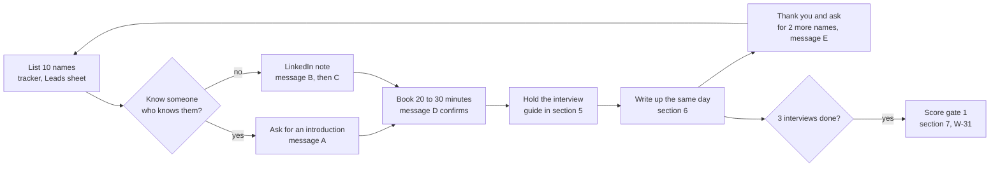
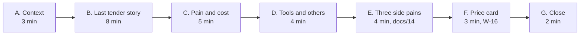
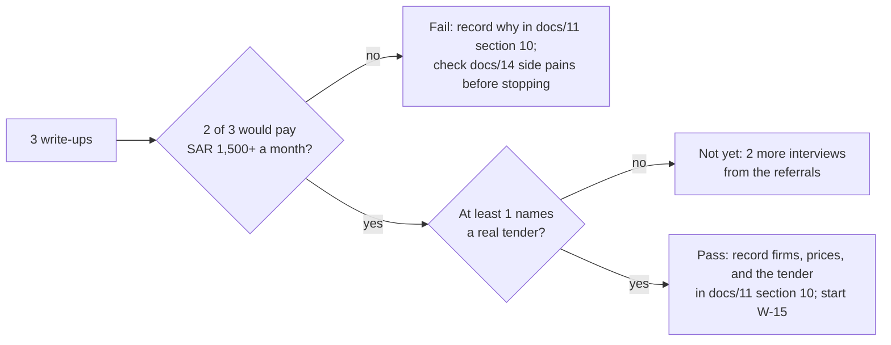

# 15. Customer interview kit (W-13)

Date: 2026-09-27
Status: ready to use. It serves W-13 (three interviews), W-16 (price test), and W-31 (gate 1).
Related: docs/10 (weeks 1 to 3), docs/11 sections 2, 10 and 11 (segments, gate, riskiest assumptions), docs/04 section 9 (target markets), docs/14 (ideas 2, 5 and 7), docs/05 section 7 (pilot measures). Tracker: `docs/15-interview-tracker.xlsx`.

**Answer first.** Find 10 names, get 3 conversations of 20 to 30 minutes, and listen more than you talk. Ask about the **last real tender**, not opinions about the future. Show the price only at the end. Write each interview up the same day in the template in section 6, then score gate 1 (section 7).

## 1. The whole flow



## 2. Who to talk to

| Priority | Role | Why |
|---|---|---|
| 1 | Procurement manager, contracts manager (مدير المشتريات، مدير العقود) | Runs tenders every month; feels the daily pain |
| 2 | CFO or finance director (المدير المالي) | Approves awards and budget; decides on price |
| 3 | Head of internal audit (رئيس المراجعة الداخلية) | Finds the problems after the fact; sponsor for the governance segment |

Cover at least three of the four segments decided in docs/11 section 2: listed or pre-IPO firms, groups with internal audit, government contractors, and firms that have had a disputed award. Companies with 100 to 2,000 staff (docs/04 section 9).

Rules:
- Research, not sales. No deck, no demo, no price until the last five minutes.
- One person at a time; no scraping, no bulk email (PDPL and LinkedIn rules).
- Keep this separate from your employer: no employer clients, contacts, or working hours.
- Ask before taking notes or recording, and store notes only in the tracker and the write-up.

## 3. Outreach messages

Replace the parts in angle brackets. Arabic first, English second.

### Message A. Ask a friend for an introduction (WhatsApp)

> السلام عليكم <الاسم>، أتمنى تكون بخير. أشتغل على فكرة لتنظيم المناقصات والمشتريات في الشركات الخاصة، وأبغى أتعلم من ناس يديرون المشتريات فعلياً قبل ما أبني شي. تعرف أحد مسؤول عن المشتريات أو العقود في شركتكم أو شركة تعرفها؟ أحتاج ٢٠ دقيقة بس أسمع منه، بدون بيع ولا عرض. أكون شاكر لك لو عرّفتني عليه.

> Hi <name>, hope you are well. I am working on an idea to help private companies run tenders and purchasing, and I want to learn from people who actually run procurement before I build anything. Do you know who handles procurement or contracts at your company, or a company you know? I only need 20 minutes to listen, no selling. I would be grateful for an introduction.

### Message B. LinkedIn connection note (under 300 characters)

> أستاذ <الاسم>، أبحث في طريقة إدارة الشركات السعودية للمناقصات والمشتريات، وخبرتك في <الشركة> تهمني. يسعدني التواصل.

> <Name>, I am researching how Saudi companies run tenders and purchasing, and your experience at <company> is exactly what I want to learn from. Glad to connect.

### Message C. After they accept (LinkedIn or email)

> شكراً على قبول الدعوة. أعمل على دراسة لطريقة إدارة المناقصات في الشركات الخاصة: كيف تُطرح، وكيف تُقيّم العروض، وكيف تُعتمد الترسية. هل عندك ٢٠ دقيقة هذا الأسبوع أو القادم، حضورياً أو عبر الاتصال؟ لن أعرض عليك منتجاً؛ أريد أن أسمع تجربتك فقط، وسأشاركك ملخص ما أتعلمه من المقابلات إن أحببت.

> Thank you for connecting. I am studying how private companies run tenders: how they are published, how offers are evaluated, and how awards are approved. Could you spare 20 minutes this week or next, in person or by call? I will not pitch a product; I only want to hear your experience, and I am happy to share a summary of what I learn across the interviews.

### Message D. Confirm the meeting

> ممتاز، نلتقي <اليوم> الساعة <الوقت> <المكان أو رابط الاتصال>. ٢٠ دقيقة تكفي. شكراً مقدماً.

> Great, see you <day> at <time>, <place or call link>. Twenty minutes is enough. Thank you in advance.

### Message E. Thank you and referral (same day)

> شكراً جزيلاً على وقتك اليوم، استفدت كثيراً خاصة في <نقطة محددة قالها>. هل تعرف شخصين في شركات أخرى يواجهون نفس التحدي وممكن يفيدوني بنفس الطريقة؟

> Thank you for your time today; I learned a lot, especially about <specific point they made>. Do you know two people at other companies who face the same challenge and might help me the same way?

## 4. Before the interview (five minutes)

- Read their company website: size, sector, is there a supplier registration page, any tender announcements.
- Check LinkedIn: how long in the role, where before.
- Fill the company row in the tracker; bring the price card (section 5, part F) printed or on the phone, face down.

## 5. Interview guide (20 to 30 minutes)

Ask about what happened, not what they would do. When they give an opinion, ask "when did that last happen?" Stay quiet after each answer; the useful part often comes after the pause.



| # | English | العربية | Why we ask |
|---|---|---|---|
| **A** | **Context** | **السياق** | |
| A1 | What is your role, and who else is involved when your company buys something big? | ما دورك، ومن يشارك معك عندما تشتري الشركة شيئاً كبيراً؟ | Maps the buyers: user, approver, payer |
| A2 | Roughly how many tenders or competitive purchases do you run in a year, and of what size? | تقريباً كم مناقصة أو شراء تنافسي تطرحون في السنة، وبأي حجم؟ | Volume for pricing (docs/11) |
| **B** | **The last tender** | **آخر مناقصة** | |
| B1 | Tell me about the last tender you ran, from the request to the purchase order. | حدثني عن آخر مناقصة طرحتموها، من الطلب حتى أمر الشراء. | The core story; do not interrupt |
| B2 | How did vendors receive the documents and send their offers? | كيف استلم الموردون الكراسة وكيف أرسلوا عروضهم؟ | Email, portal, paper |
| B3 | Who could see the prices, and when? | من كان يستطيع رؤية الأسعار، ومتى؟ | Sealed envelopes (F-23) |
| B4 | How were technical and financial offers evaluated, and who signed the award? | كيف قُيّمت العروض الفنية والمالية، ومن وقّع الترسية؟ | Approval chain (F-56) |
| B5 | How long did it take from publishing to the purchase order? | كم استغرق من الطرح حتى أمر الشراء؟ | W-13 measure: cycle time |
| **C** | **Pain and cost** | **المشكلة وتكلفتها** | |
| C1 | What was the hardest or slowest part of that tender? | ما أصعب أو أبطأ جزء في تلك المناقصة؟ | The real pain in their words |
| C2 | Has a vendor or a manager ever questioned an award? What happened? | هل اعترض مورد أو مدير على ترسية من قبل؟ ماذا حدث؟ | Disputed-award segment |
| C3 | What does internal audit or the board ask for about purchasing? | ماذا تطلب المراجعة الداخلية أو مجلس الإدارة بخصوص المشتريات؟ | Audit bundle (F-42) |
| C4 | Have you spent money or time trying to fix this? On what? | هل صرفتم وقتاً أو مالاً لحل هذه المشكلة؟ على ماذا؟ | Pain with budget beats pain without |
| **D** | **Tools and others** | **الأدوات والبدائل** | |
| D1 | What tools do you use today: ERP, Excel, email, a portal? | ما الأدوات التي تستخدمونها اليوم: نظام ERP، إكسل، بريد، منصة؟ | W-13 measure: current tools |
| D2 | Have you looked at any tender platform? Which, and what did they quote? | هل اطّلعتم على أي منصة مناقصات؟ أيها، وكم كان عرض السعر؟ | W-13 measure: what others quoted; Reference App, Monafasat |
| D3 | Would it matter if vendors saw your company's name and logo, or the platform's? | هل يهمك أن يرى الموردون اسم شركتكم وشعارها أم اسم المنصة؟ | W-13 measure: white-label (F-02) |
| **E** | **Three side pains (docs/14)** | **ثلاث مشكلات جانبية** | |
| E1 | How do you check vendor papers such as CR, ZATCA, and GOSI, and how often do they expire on you? | كيف تتحققون من أوراق الموردين مثل السجل التجاري والزكاة والتأمينات، وكم مرة تنتهي صلاحيتها دون أن تنتبهوا؟ | Idea 2, compliance vault |
| E2 | If you work with subcontractors, how do you handle their monthly claims and retention? | إذا كان لديكم مقاولو باطن، كيف تديرون مستخلصاتهم الشهرية والمحتجزات؟ | Idea 5, payment claims |
| E3 | When internal audit reviews purchasing, what do they find, and how long does it take? | عندما تراجع المراجعة الداخلية المشتريات، ماذا تجد، وكم يستغرق ذلك؟ | Idea 7, audit checks |
| **F** | **Price card (last)** | **بطاقة السعر** | |
| F1 | Show the card: "A platform under your brand: sealed offers, your approval chain, audit file, PO. SAR 1,500 to 7,500 a month depending on volume; first tender free." Then ask: what is your first reaction? | اعرض البطاقة: "منصة باسم شركتكم: عروض مختومة، سلسلة اعتماداتكم، ملف تدقيق، أمر شراء. من ١٥٠٠ إلى ٧٥٠٠ ريال شهرياً حسب الحجم، والمناقصة الأولى مجاناً." ثم اسأل: ما انطباعك الأول؟ | W-16 price test; note the number they react to |
| F2 | Who would have to approve this spend, and from which budget? | من يعتمد هذا الصرف، ومن أي ميزانية؟ | Real buyer and budget line |
| **G** | **Close** | **الختام** | |
| G1 | Is there a real tender coming in the next three months we could run together as a pilot? | هل لديكم مناقصة حقيقية خلال الأشهر الثلاثة القادمة يمكن أن نطبقها معاً كتجربة؟ | Gate 1 needs one named tender |
| G2 | Who else should I talk to, inside or outside your company? | من غيرك يستحق أن أتحدث معه، داخل شركتكم أو خارجها؟ | Referrals refill the list |

Do not ask: "Would you use this?", "Is this a good idea?", or "How much would you pay?" People say yes to be polite. The price card tests a real number instead.

## 6. Write-up template (same day)

Copy this into the tracker's Interviews sheet or a note; it covers every W-13 acceptance point.

```
Interview <n>  Date:            Company:              Segment:
Person and role:                Staff count:          Tenders a year:
Current tools (D1):
Last tender: what, value, cycle time from publish to PO (B5):
Who saw prices and when (B3):
Approval chain (B4):
Hardest part in their words (C1), quote exactly:
Disputes or audit findings (C2, C3):
Money or time already spent on the problem (C4):
Others looked at and what they quoted (D2):
Brand matters to vendors? yes / no / unsure (D3):
Side pains: vault (E1) 0-3   claims (E2) 0-3   audit (E3) 0-3
Price reaction (F1): number they reacted to, words used:
Budget owner (F2):
Named tender for a pilot (G1): name, month, or none
Would pay SAR 1,500 or more a month? yes / no / unsure, and why
Referrals (G2):
Surprise: one thing I did not expect
```

Score each pain 0 to 3: 0 not a problem, 1 mild, 2 real but no money spent, 3 real and they spend money or time on it today.

## 7. Scoring gate 1 (W-31)



The tracker's Gate 1 sheet counts the answers from the Interviews sheet and shows PASS, NOT YET, or FAIL. Record the result and the pricing model in docs/11 section 10 (W-31), update the docs/01 "things to verify" list (W-13), and set W-13 to Done in docs/09.
