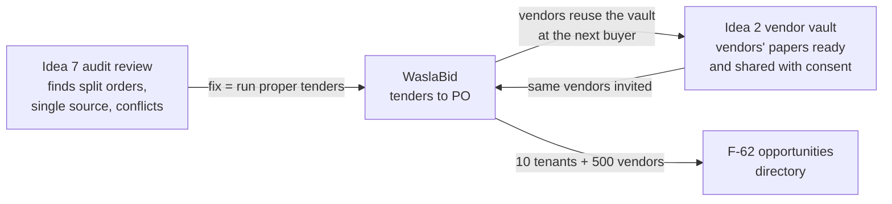
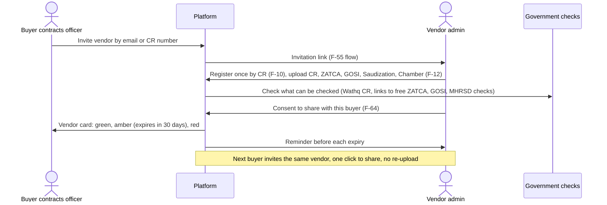
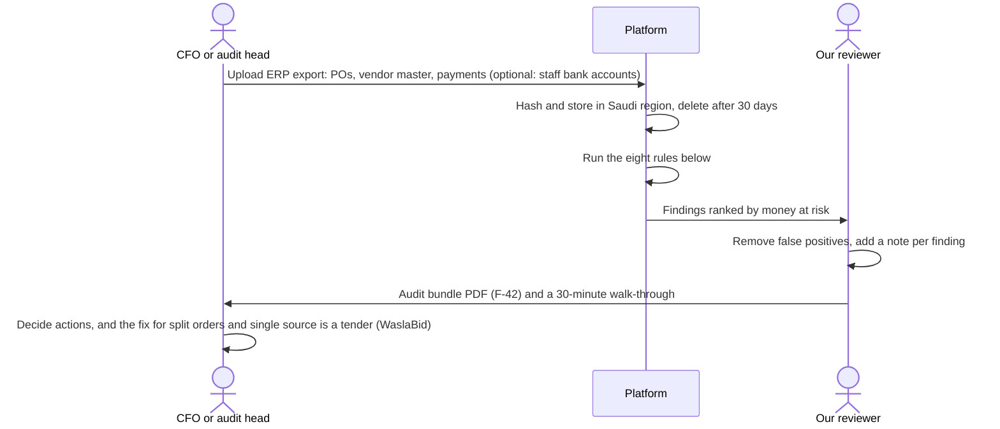
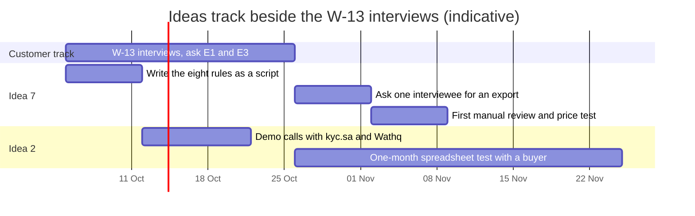

# 16. Deep dives: vendor compliance vault and procurement audit checks

Date: 2026-09-27
Status: concepts to test, not decisions. Prices, sizes and timings are hypotheses to test in the W-13 interviews (docs/15) and gate 1 (W-31).
Related: docs/14 ideas 2 and 7 and section 4 (verified competitors), docs/15 questions E1 and E3, docs/12 (vendors never pay, global vendor identity), F-10, F-12, F-41, F-42, F-48, F-49, F-56, F-62, F-64, F-65, N-10, ADR-0007, ADR-0008, ADR-0010

**Answer first.** Both ideas can be sold to the same buyer as WaslaBid, and both lead into it. **Idea 7, procurement audit checks, is the faster test.** You can run the first review by hand with a script on one company's export, charge for it, and build nothing. **Idea 2, the vendor compliance vault, builds the vendor network** that WaslaBid and the directory (F-62) need, but it only pays off after 3 or more buyers share vendors. Suggested order: sell idea 7 reviews to find buyers with budget, and offer idea 2 inside WaslaBid rather than as a separate product.

## 1. Side by side

| | Idea 2: vendor compliance vault | Idea 7: procurement audit checks |
|---|---|---|
| One line | Vendors keep their company papers once and share them with every buyer; buyers see what is valid and what expires | Upload one ERP export; get ranked purchasing red flags and an audit file for the committee |
| Who pays | Buyer (contracts or procurement); vendors free (docs/12) | CFO or internal audit; audit firms as resellers |
| Pain today | Same five documents chased from every vendor, expired certificates found too late | Internal audit samples a few percent of orders; the rest is never checked |
| Verified competition | Medium: سجل (kyc.sa), free government checks, Wathq API | Medium: A³ Audit, Caseware IDEA in Arabic, enterprise tools |
| Our angle | Vendor-owned profile shared across buyers with consent (F-10, F-64); nobody showed this publicly | Ready-made procurement rules plus the audit bundle (F-42), no setup for mid-size firms |
| First paid test | 4 to 6 weeks of build, then a buyer with 50+ vendors | 1 week: a script and a manual review, no product |
| Price hypothesis | SAR 500 to 1,500 a month per buyer by active vendors | SAR 7,500 to 15,000 per review, or about SAR 3,000 a month for quarterly reviews |
| Reuse of the foundation | High: Tenancy, Identity, Audit, file uploads (ADR-0001) | Medium: Tenancy, Audit, QuestPDF; rules are new code |
| Biggest risk | Chicken and egg: vendors see value only with several buyers | Trust: the buyer must hand over purchasing and payment data |
| Leads into WaslaBid by | The same vendors are invited to tenders; the network feeds F-62 | Findings (split orders, single source) are fixed by running tenders |

## 2. Idea 2: vendor compliance vault

### Use case

### First version (4 to 6 weeks, solo)

| In | Out, later |
|---|---|
| Vendor registration by CR number (F-10, ADR-0008) | Automatic Saudization (Nitaqat) check: not in Wathq's API |
| Document upload with type and expiry date (F-12) | Sanctions screening, bank account checks (سجل's ground) |
| Consent per buyer, revocable, in the ledger (F-64, ADR-0010) | Scoring or rating vendors |
| Buyer dashboard: status per vendor and document, filter by expiring | Cross-buyer search of vendors (that is F-62, gated) |
| Email reminders to vendors at 30 and 7 days | SMS and WhatsApp reminders |
| One Wathq CR lookup per vendor, only after written clearance of Wathq's terms | Showing Wathq data to other buyers without that clearance |

### Price and customers

- **Price hypothesis:** free for vendors. Buyer pays SAR 500 a month up to 100 active vendors, SAR 1,000 up to 500, SAR 1,500 above. First 25 vendors free. Check against سجل's per-partner plans in a demo.
- **Best first customers:** buyers with many small vendors whose papers expire: contractors with 50+ subcontractors, facility management companies, hospital groups, retail and F&B chains. Find them through supplier registration pages (`"تسجيل الموردين" site:.sa`) and the Leads sheet in `docs/15-interview-tracker.xlsx`.
- **Test before building:** for one buyer, keep 30 vendors' papers in a spreadsheet for a month and send the reminders by hand. If the buyer will not pay SAR 500 for that month, do not build it.

### Pros and cons

| Pros | Cons |
|---|---|
| Every buyer needs it; easy to explain in one sentence | سجل already checks documents and alerts on expiry in Arabic |
| Builds the vendor network WaslaBid and F-62 need; vendors never pay | Value to vendors appears only after 3 or more buyers share them |
| Mostly built already: F-10, F-12, F-64, uploads | Wathq terms limit commercial reuse; needs written clearance |
| Low data risk: company documents, not payments | Low price point; hard to reach SAR 1,500 a month alone |

### Confirm in a demo or call

1. سجل: can one vendor profile be reused across its customers? What do its plans actually cost?
2. Wathq (sales@wathq.sa): may we show a vendor's Wathq data to a buyer who did not make the call, with the vendor's consent (F-64)?
3. Two buyers from the interviews: how many active vendors do they have, and who chases expired papers today (docs/15 question E1)?

## 3. Idea 7: procurement audit checks

### Use case

### The eight rules for the first review

| # | Rule | Data needed | Why it matters |
|---|---|---|---|
| 1 | Split orders: several POs to one vendor within days, each just under an approval limit | POs, approval limits | Avoiding a higher approver or a tender |
| 2 | Single source: one vendor gets all orders in a category with no competing quote | POs by category | Pricing never tested |
| 3 | Duplicate invoices: same vendor, amount and date, or same invoice number | Payments | Paid twice |
| 4 | Vendor bank account matches a staff bank account | Vendor master, staff bank list | Conflict of interest or fraud |
| 5 | New vendor paid within days of creation | Vendor master, payments | Fake or rushed vendors |
| 6 | Price outliers: unit price far from the median for the same item (F-48 logic) | PO lines | Overpaying |
| 7 | Approvals out of hours or by the requester | PO approval log | Weak control |
| 8 | Round-number or sequential invoices from one vendor | Payments | Estimated rather than real invoices |

### First version

- **Week 1, no product:** a Python script runs the eight rules on one export (built 2026-09-27: `spikes/AuditReviewSpike`, with fictional sample data in which it finds all 21 planted red flags), and the findings go into a QuestPDF bundle built from the existing foundation. Run it for one company with its consent; charge or accept a written reference in return.
- **After 3 paid reviews:** an upload page on the foundation (Tenancy, Identity, Audit), the rules as code with tests, a findings screen with a reviewer note per finding, and the audit bundle (F-42). Approval limits come from the buyer's authority matrix, entered once.
- **Data rules:** Saudi region only; files deleted after 30 days; staff bank accounts are optional, and if given they are compared as hashes and never shown; access is logged (F-41) and secrets never logged (N-10). A PDPL review comes before the first real export.

### Price and customers

- **Price hypothesis:** one-off review SAR 7,500 for up to 10,000 PO lines, SAR 15,000 above. Quarterly subscription about SAR 3,000 a month. Test the number with the price card method in docs/15.
- **Best first customers:** listed and Nomu companies (audit committees must report on controls), groups with an internal audit team, and firms after a disputed award (docs/11 section 2).
- **Channel:** small and mid-size audit firms can resell the review to their clients. One partner could bring several companies (docs/04 section 9, channel ring).
- **Test before building:** ask one interviewee for an anonymised export of a quarter. Run the script, present three real findings, and ask what they would pay to get this every quarter.

### Pros and cons

| Pros | Cons |
|---|---|
| Fastest to first revenue: a script and a report, no platform | Buyers must trust us with purchasing and payment data |
| Sells to the governance segment, which has budget | Findings can embarrass staff; the sponsor must be the CFO or audit committee |
| "We found X in your data" is a strong opening for WaslaBid | A³ Audit and Arabic IDEA exist; an in-house auditor could build the tests |
| Reuses F-42, F-48 and F-49 logic that WaslaBid needs anyway | Service-heavy at first: each review needs a person to remove false positives |
| Each export teaches us how Saudi mid-size firms really buy | ERP exports differ (SAP, Oracle, Odoo, local ERPs); mapping takes time |

### Confirm in a demo or call

1. A³ Audit: which FraudLens rules exist, does it accept a raw ERP export, and what does Pro cost?
2. One audit firm partner: would they resell a SAR 7,500 review, and at what margin?
3. Two interviewees: what did their last internal audit of purchasing find, and how long did it take (docs/15 question E3)?

## 4. Plan for the next six weeks

Decide at gate 1 (W-31), using the interview scores for E1 and E3 in the tracker: lead with idea 7 if a firm pays for a review, fold idea 2 into WaslaBid as the vendor profile if buyers only care about it inside tenders, or drop both if neither scores 2 or more.
