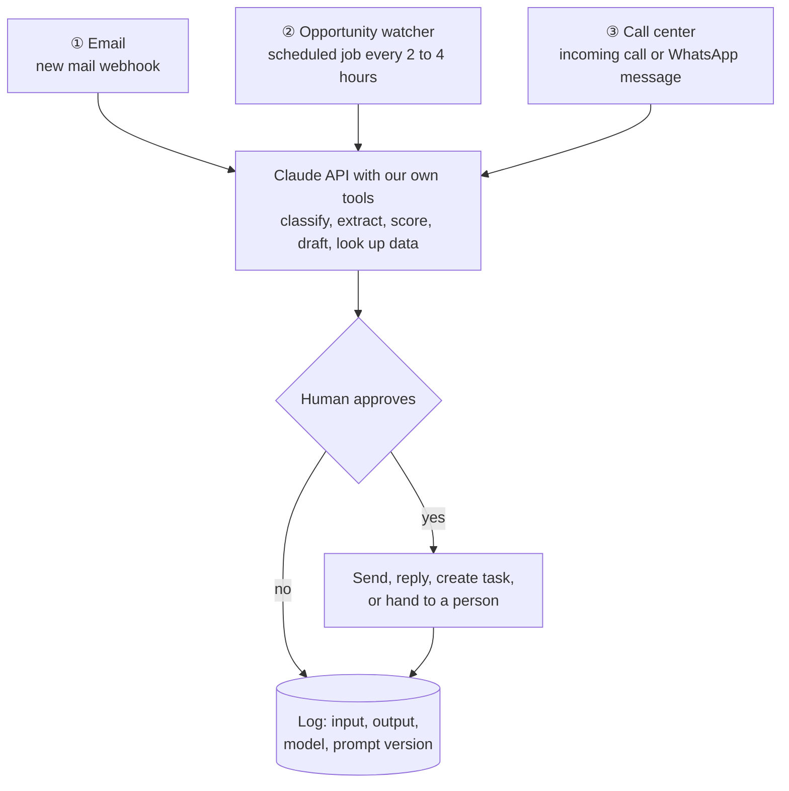
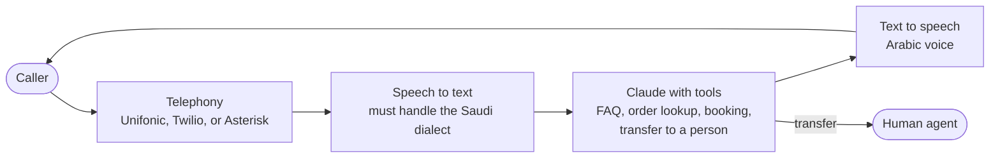
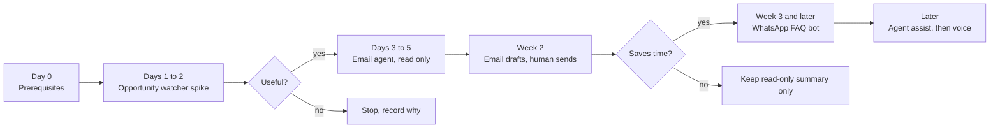

# AI Agents: Email, Opportunity Watcher, Call Center

Date: 2026-09-27
Status: idea and first steps. Nothing here is in the backlog yet. It is not decided whether each agent is an internal tool for the business or a WaslaBid feature (see section 6).
Related: `02-core-features-and-tech-stack.md` (F-62, N-10), `adr/0005-ai-offer-review-provider.md`, `adr/0007-open-opportunities-directory.md`, `16-idea-deep-dives.md`

## 1. The shared pattern

All three agents follow the same pattern: a trigger, then Claude reads and decides, then a named human approves. This matches the assist-only AI rule: AI drafts, a human decides, and every output is stored with the model and prompt version.

## 2. Email agent

| Step | How |
|---|---|
| Read the mailbox | Microsoft Graph API for Outlook and Microsoft 365, or the Gmail API. New mail arrives by webhook |
| Understand | Claude sorts each email (customer, vendor, invoice, tender invitation, spam), extracts the fields (sender, deadline, amount), and summarises it |
| Act | Draft a reply, create a task, or forward to the right person. Nothing is sent without a human click, at least at first |
| Tools given to Claude | `search_crm`, `get_order_status`, `create_task`, `draft_reply` |

## 3. Opportunity watcher (Etimad and other portals)

| Step | How |
|---|---|
| Collect | A scheduled job fetches the public tender listings, keeps only IDs it has not seen before, and stores them |
| Score | Claude compares each new tender with the company profile (activities, CR classification, regions, size) and gives a fit score from 0 to 100 with reasons |
| Deliver | A daily digest by email or WhatsApp: title, entity, deadline, bid bond, fit score, link |
| Easier source | A registered supplier already gets Etimad's tender alert emails, so the email agent can read those. That is more reliable than scraping |

Cautions:
- Read Etimad's terms of use first. Use only the public pages, at a slow rate. Never automate a login or get around a captcha.
- Page layouts change, so the scraper will break sometimes. Send an alert when a run finds zero results.

## 4. Call center agent

Claude handles text, not audio, so a voice agent needs a pipeline around it.

Build it in this order, from least risk to most:

| Stage | What | Why this order |
|---|---|---|
| 1 | WhatsApp or web chat bot | Text only, the same brain, no voice problems |
| 2 | Agent assist | Transcribe live calls; Claude suggests answers and fills in the ticket. A human still talks |
| 3 | Full voice bot | Only after 1 and 2 work well. Arabic speech-to-text quality and latency are the hard parts |

Always give it a "transfer to a human" tool, and log every conversation.

## 5. Stack

| Part | Choice | Note |
|---|---|---|
| Scheduler | Hangfire in `Platform.Worker` | Already built by the admin UI slice |
| AI | Claude API through the Anthropic .NET SDK, behind a port | Same shape as the AI offer review (ADR-0005) |
| Tool loop | The SDK's tool runner (`BetaToolRunner` in C#) | We write only the tool functions |
| Secrets | User secrets and `infra/compose/.env` | Never in the repository (N-10) |
| Data residency | The Claude API runs outside the Kingdom | Customer emails and call recordings are personal data under PDPL: get recorded consent and remove what is not needed, as ADR-0005 does for offers |

## 6. Internal tool or WaslaBid feature

| Agent | As an internal tool | As a WaslaBid feature |
|---|---|---|
| ① Email | Helps the founder and partners handle sales and vendor mail | Not planned; out of the tender-to-PO scope |
| ② Opportunity watcher | Finds tenders for our own business and our pilot leads | Close to F-62 (cross-tenant opportunities directory), which is gated at 10 tenants and 500 vendors (ADR-0007). Building it inside WaslaBid earlier needs a new decision |
| ③ Call center | Not needed at our size | Not planned; could be a separate product |

Recommendation: build all three as internal tools first, outside `src/`, in a spike under `spikes/`. Move one into WaslaBid only through a spec, a backlog row, and an ADR if it changes a decision.

## 7. How to start

**Day 0: prerequisites**
1. Create an Anthropic Console account and an API key. Store it as an environment variable or in user secrets, never in the repository (N-10).
2. Register the company as a supplier on Etimad, and turn on tender alert emails for the activities that matter.
3. Read Etimad's terms of use and write down what automated reading is allowed.
4. Write the company profile as a small JSON file: activities, CR classification, regions, typical contract size, and past tender keywords.

**Days 1 to 2: opportunity watcher spike (start here)**
It is the fastest to build, needs no customer data, and gives value on day one.
1. Create `spikes/OpportunityWatcherSpike/`, throwaway like the other spikes.
2. Input: the Etimad alert emails or the public listing page, saved to files first so every run is repeatable.
3. For each tender, one Claude call returns a fit score, reasons, deadline, and bid bond as structured output.
4. Output: a Markdown digest sorted by score.
5. Success check: on 20 real tenders, the founder agrees with the ranking on at least 16.

**Days 3 to 5: email agent, read only**
1. Connect one mailbox with a read-only scope (Graph `Mail.Read` or Gmail `gmail.readonly`).
2. Classify and summarise the last 100 emails. Nothing is sent or moved.
3. Success check: at least 90 of the 100 are classified correctly by the founder's judgement.

**Week 2: email drafts**
1. Add the `draft_reply` tool. Drafts go to the Drafts folder, and a human reviews and sends them.
2. Track time saved per day for one week. If it saves under 20 minutes a day, stop at the read-only summary.

**Week 3 and later: call center**
1. Start with a WhatsApp or web chat bot that answers from a fixed FAQ list and has a "transfer to a person" tool.
2. Only after it answers most questions correctly, move to agent assist on real calls, then consider a voice bot.

**After each step**, record the result and the cost of the Claude calls in this document, and decide to keep going or stop. If an agent becomes a WaslaBid feature, write a spec in `docs/superpowers/specs/`, add a backlog row in `docs/09-backlog.md`, and add an ADR if it changes a decision.
