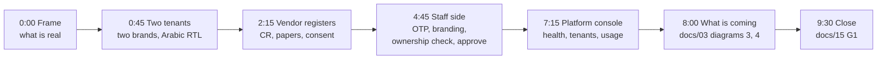

# 18. Demo script: ten minutes on the local stack (W-13)

Date: 2026-10-03
Status: ready to rehearse. For the end of a W-13 interview (question G3 in docs/15) or a second meeting with the approver, never before the price card.
Related: docs/15 (interview kit, objection handling in section 8), docs/07 section 4 (local run), `tests/e2e/README.md` (scripts), docs/03 diagrams 2, 3 and 4 (what is coming), docs/05 (MVP scope), docs/09 (status of each ID).

**Answer first.** Show only running software, on fictional companies: the white-label tenant portal in Arabic right to left, vendor self-registration with the CR rules and the consent ledger, staff administration behind a one-time code, and the platform console. Narrate the tender itself (publishing, sealed envelopes, scoring, PO) with the docs/03 diagrams, and say plainly that it is not built yet. End on docs/15 question G1: their next tender could be the first one it runs.

## 1. The ten minutes



Two browser windows side by side: a normal one for staff, a private one for the vendor. If time runs short, drop the rows marked optional.

| Time | Show | URL | Say | IDs |
|---|---|---|---|---|
| 0:00 | Nothing yet; look at them | | "Everything I click is running software on my laptop, with fictional companies. The tender itself, from publishing to sealed offers, scoring and the purchase order, is designed but not built; I will show it as drawings. It gets built with a first customer's real tender." / "كل ما سأعرضه برنامج يعمل فعلاً على جهازي ببيانات شركات وهمية. أما المناقصة نفسها، من الطرح إلى المظاريف المغلقة والتقييم وأمر الشراء، فمصممة ولم تُبنَ بعد؛ سأعرضها كرسوم، وتُبنى مع مناقصة حقيقية لأول عميل." | |
| 0:45 | Tenant portal "Acme Contracting", Arabic, right to left, its own colour and logo | `https://acme.localhost:8443` | "This is what your vendors see: your name, your colour, Arabic first. No WaslaBid logo." Switch the language to English and back. | F-02, F-04 |
| 1:30 | A second tenant, "Beta Industries", English, another colour | `https://beta.localhost:8443` | "Same platform, another company, another brand. Neither can see the other's data." | F-02, tenant isolation (docs/03 diagram 5) |
| 2:15 | A vendor registers on Acme: email, names, password; verification email; company form with CR number, VAT number and the privacy notice | `https://acme.localhost:8443/vendor/register`, Mailpit `http://localhost:8025`, then `/vendor/register/company` | "Vendors register themselves; you do not type their data. The CR number is unique on the platform: a second registration with the same CR is refused and sent to a dispute path." The sign-in page is Keycloak's standard page in Arabic; do not dwell on it. | F-11, ADR-0013 |
| 3:45 | The vendor's page: upload the CR certificate (virus-scanned, with an expiry date) | `https://acme.localhost:8443/vendor` | "Expired papers are flagged, and later they block submission." | F-12 |
| 4:15 | Optional. Consent ledger: grant and revoke for the test recipient | `https://acme.localhost:8443/vendor/consent` | "The vendor decides who may see its data, for how long; every grant and revoke is recorded." | F-64 |
| 4:45 | Staff sign-in as `acme.admin`: password, then the six-digit code from the phone | `https://acme.localhost:8443/admin/staff` | "Every staff login needs a one-time code. Roles: tenant admin, contracts officer, technical evaluator, finance approver." Optional: invite a contracts officer; the email lands in Mailpit. | F-06, F-07 |
| 5:30 | Branding: change the primary colour, save, reload the portal | `https://acme.localhost:8443/admin/branding` | "Your brand is a setting, not a project." | F-02 |
| 6:00 | The new vendor in the list, then its page: the CR ownership check before first approval, with a note; approve | `https://acme.localhost:8443/admin/vendors`, then the vendor's row | "Before the first approval, someone confirms the company really owns that CR, so nobody can squat on a supplier's number." | F-10, W-33 |
| 6:45 | Optional. The same vendor opens the second tenant and is asked to join, with the same account | `https://beta.localhost:8443/vendor` (lands on `/vendor/join`) | "One vendor account across every buyer on the platform; each buyer approves it separately." | F-10, ADR-0008 |
| 7:15 | Platform console: the health board, the tenant list, usage counts (sign in as `platform.admin` with its code) | `https://platform.localhost:8443/platform`, `/platform/tenants`, `/platform/usage` | "This is our side. We watch the service and get an alert when something fails; you do not need IT for it. The console shows counts, not your tenders." | F-51, F-54, F-60 |
| 8:00 | docs/03 diagram 3, the tender state machine | rendered diagram (section 3) | "Not built yet. A tender moves through these states; each step is a person in your approval chain, set per company." | F-27, F-56 |
| 8:45 | docs/03 diagram 4, sealed envelopes | rendered diagram | "Not built yet. The price file is locked with its own key; it opens only after technical scores are locked, and the opening is logged with names. Even we cannot open it early." Use their words from B3: who opens the envelopes today. | F-23, F-24, F-30, F-42 |
| 9:30 | Close | | "Your next tender, the one you mentioned, could be the first it runs; the first tender is free. What would you need to see first?" Write the answer in the tracker (docs/15 section 10, column X only if they name it). | G-tender |

## 2. Built and not built

Say this split out loud if asked. Status per docs/09 on 2026-10-03.

| Built and shown (Done in docs/09) | Not built; narrate with a diagram or say "not yet" |
|---|---|
| Tenant branding: portal name, colour, logo (F-02) | Tenant creation from the console (F-01, F-01b); the demo tenants come from the seed script |
| Staff invitations, password plus one-time code, roles (F-06, F-07) | Tender authoring, invitations, open listing (F-15 to F-17, F-19, F-19b, F-55): docs/03 diagram 2 |
| Vendor self-registration, unique CR, papers with expiry, virus scan (F-11, F-12) | Sealed submission and deadline (F-22 to F-24): docs/03 diagram 4 |
| One vendor across tenants, per-tenant approval (F-10); CR ownership check and dispute path (W-33) | Screening, scoring, score lock, comparison sheet, finance approval (F-28 to F-31, F-33): docs/03 diagram 3 |
| Consent ledger (F-64) | PO PDF (F-36), audit log screen and audit bundle (F-41, F-42), signed award record (F-65) |
| Platform console: health board, alerts, tenant list, usage counts (F-51, F-54 as narrowed, F-60) | Per-tenant sign-in page theme (docs/02 identity row), custom domain (F-03), any AI (F-45 to F-50) |

## 3. Set up the day before

Run from the main checkout `C:\Repo\ERP` on `main` in Git Bash: `infra/compose/.env` lives there (a worktree has none; see docs/07 section 4). The user secrets are already set once, as in docs/07 section 4, "Run the app locally".

```bash
cd infra/compose && docker compose up -d && cd ../..        # no --profile kibana: it costs 1.25 GB
dotnet run --project src/Platform.Migrator -- --seed-dev     # tenants acme (ar-SA) and beta (en-US), test consent recipient
dotnet run --project src/Platform.Web                        # terminal 2
dotnet run --project src/Platform.Worker                     # terminal 3
```

Demo data, in a fourth terminal:

```bash
cd tests/e2e && npm install
node vendor.mjs     # about 2 minutes: one vendor approved on acme (CR certificate valid, VAT expired), pending on beta
```

`vendor.mjs` signs in only as throwaway admins and deletes them at the end; the vendor company stays, so the staff list at `/admin/vendors` is not empty and beta shows a pending vendor. Its two PDFs in `tests/e2e/.state/` serve as the certificates for the live upload. Optional, only if you will show `/platform/vendors`: `node ownership.mjs` (about eight minutes) leaves a resolved CR dispute in the console.

By hand, once:
1. Sign in as `acme.admin`, `beta.admin` and `platform.admin` and enrol each in the authenticator on your phone (docs/07 section 4, "Platform console host", steps 3 to 5). If `tenant.mjs` enrolled `acme.admin` earlier, its seed sits in `tests/e2e/.state/`, not on your phone: remove the credential in the Keycloak admin console (realm `waslabid`, Users, `acme.admin`, Credentials) and enrol again.
2. At `/admin/branding` on each tenant host (`acme.localhost:8443` as `acme.admin`, `beta.localhost:8443` as `beta.admin`), set a fictional logo (PNG or JPEG). Never a real company's logo; the interviewee's own logo only if they sent it for the demo.
3. Render docs/03 diagrams 2, 3 and 4 to PNG and keep them open in an image viewer, so the demo needs no network: copy each Mermaid block into a `.mmd` file and run `npx @mermaid-js/mermaid-cli -i 03-3.mmd -o 03-3.png`.
4. Rehearse the ten minutes once with a timer, with a fresh vendor email.

## 4. Pre-demo checklist (fifteen minutes before)

- [ ] Laptop on power; IDE, Kibana (`docker compose stop kibana`) and other heavy apps closed: the stack needs most of 16 GB.
- [ ] `docker compose ps` shows every service healthy; ClamAV takes up to three minutes after a start.
- [ ] Web host and worker running; the console board at `https://platform.localhost:8443/platform` shows all seven tiles healthy and no open incident. A Disk incident on a nearly full system drive is the alert working; free space or raise `Platform:DiskAlertPercent` locally (docs/07 section 4).
- [ ] Mailpit emptied ("Delete all" at `http://localhost:8025`), so the inbox shows only the demo's emails.
- [ ] Staff window signed out; vendor window private; zoom about 125 %; tabs open on the Acme and Beta portals, Mailpit and the three diagram PNGs.
- [ ] A new vendor email (any address; Mailpit catches all), a fictional 10-digit CR number not used before (for example `9000000101`; numbers are unique on the platform) and a 15-digit VAT number that starts and ends with 3 (for example `300000000000103`).
- [ ] Phone unlocked with the `acme.admin` and `platform.admin` codes.
- [ ] Fallback ready: the real screenshots from the last script runs in `tests/e2e/shots-vendor/`, `shots-admin/` and `shots-ownership/`.

## 5. What not to show

- **No screen for anything not built.** No wireframes (`docs/wireframes/`) or mock tender screens presented as product; if they ask about a tender screen, say "not built" and show the diagram.
- **No internals:** the Keycloak admin console (`http://localhost:8080`), Kibana, the jobs dashboard `/platform/jobs`, the database, `/dev/gallery`, `/dev/throw`, terminals. They show test users and internals, and a terminal or `infra/compose/.env` could show a secret on screen (N-10).
- **No other people's data:** the tracker, notes or the names of other interviewees and their companies.
- **No competitor screens.** Do not open Reference App's site or put its name on a slide; answer comparisons with docs/15 section 8.
- **No dates.** The build plan has no calendar dates until a pilot customer is signed (W-15, docs/05 section 6). Say "built with your tender", not "ready in March".
- **No destructive scripts on demo day:** `platform.mjs` and `observability.mjs` stop containers and send alert emails; `revalidation.mjs` removes memberships; `keyring.mjs` starts a second web instance.

## 6. If something breaks

| Symptom | Fix, or what to say |
|---|---|
| Sign-in fails or loops on `http://localhost:5273` | Use the Caddy URL on port 8443; OIDC only completes through Caddy (docs/07 section 4) |
| `acme.admin` gets 403 on every staff page after a realm reset | Unbind the seeded member rows (docs/07 section 4, "Vendor slice", step 2), sign in again |
| `/vendor/register` shows a login form, not registration | The tenant realm predates the vendor slice; reimport it (docs/07 section 4, "Vendor slice", step 1) |
| An upload stays "waiting for the virus check" | ClamAV is not healthy yet; move on to consent and come back, or show the prepared vendor |
| A health tile is red during the demo | Say "this is the alerting you would never see; we would"; carry on |
| Anything else | "It is a laptop demo." Switch to the screenshots and the diagrams, and go to the close |
