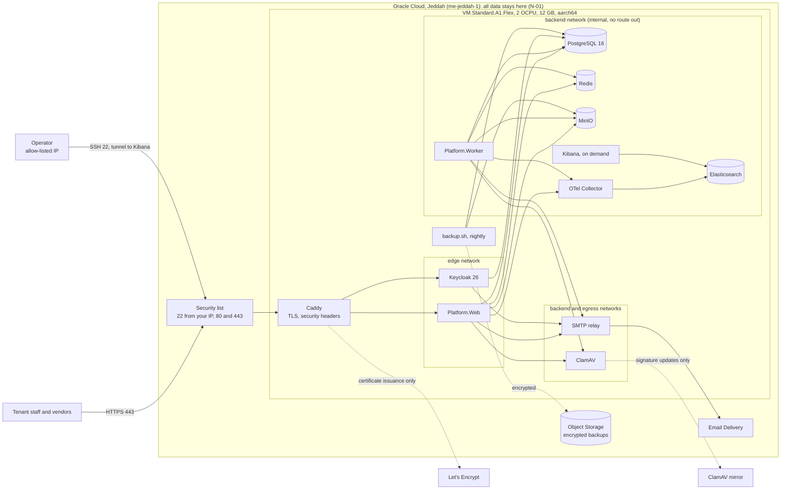
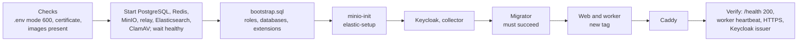

# 19. Pilot runbook: Oracle Cloud Always Free, Jeddah (W-19)

Prepared on 2026-10-03 on branch `w-19-pilot-prep` as pre-gate-1 preparation (docs/05 section 8). Nothing is deployed:
you create the Oracle Cloud account and the VM, then follow section 4. Every file named here is under `infra/pilot/`.
Acceptance (docs/09, W-19): the pilot tenant's host serves over HTTPS from one Jeddah VM, all data stays in Jeddah (N-01),
a nightly backup lands in Jeddah object storage (N-07), and a destroyed VM is rebuilt from backup within one hour.

## 1. What runs where



Only Caddy publishes ports (80 and 443). Keycloak's port 8080 and Kibana's 5601 bind to 127.0.0.1 for scripts and the SSH
tunnel. Outside Oracle's Jeddah region only two things travel, and neither carries customer data: certificate requests
(host names) and ClamAV signature downloads.

Memory limits (W-10 spec section 9, applied in `docker-compose.yml`):

| Service | Limit | Service | Limit |
|---|---|---|---|
| PostgreSQL | 1.5 GB | Web host | 1 GB |
| Keycloak | 1.5 GB | Worker | 512 MB |
| ClamAV (`ConcurrentDatabaseReload no`) | 2 GB | OTel Collector (`GOMEMLIMIT` 250 MiB) | 320 MB |
| Elasticsearch (768 MB heap) | 1.75 GB | MinIO, Redis, Caddy, SMTP relay | 1 GB together |
| **Steady total** | **9.56 GB** | Kibana, only while open | 1.25 GB |

## 2. The files

| File | What it is |
|---|---|
| `docker-compose.yml` | The pilot stack: production settings, limits, networks, health checks, no port but 80 and 443 |
| `docker/app.Dockerfile` | Web, worker and migrator images: .NET 10 pinned by digest, non-root (uid 1654), read-only root file system |
| `Caddyfile` | TLS for a static host list, security headers, Keycloak admin only from your IP |
| `keycloak/import/*.json` | The two realms for production: no development users, no test client, placeholders from `.env` |
| `postgres/bootstrap.sql` | Roles `erp_app` and `keycloak`, databases, extensions; passwords sent only as SCRAM verifiers |
| `.env.example`, `generate-secrets.sh` | Every setting with a generation hint; the script fills empty secrets and makes the key-ring certificate |
| `bootstrap.sh` | VM preparation: Docker, firewall, kernel, swap, NTP, security updates, SSH, systemd timers |
| `build-images.sh` | On your laptop: builds the arm64 images and loads them on the VM over SSH (no registry) |
| `deploy.sh` | Idempotent deploy in order, migrator first, then health verification |
| `provision-tenant.sh` | One tenant by hand until F-01: Keycloak organization, redirect URIs, tenant admin, database rows |
| `backup.sh`, `restore.sh`, `rclone.sh` | Nightly encrypted backup, restore test, disaster recovery |
| `watchdog.sh`, `systemd/` | Alerts when the worker, web host, backup or disk fail (the worker cannot report its own death) |
| `compose.sh`, `lib.sh`, `minio-init.sh` | Operations wrapper, shared helpers, MinIO users and lifecycle |

Where each host setting outside Development comes from (docs/07 section 4):

| Setting | Source |
|---|---|
| `ConnectionStrings:Platform`, `KeyRing` (web), `Worker` (worker), `Owner` (migrator) | `ERP_APP_DB_PASSWORD`, `ERP_KEY_RING_DB_PASSWORD`, `ERP_WORKER_DB_PASSWORD`, `POSTGRES_PASSWORD` |
| `ConnectionStrings:Redis` (both hosts) | `REDIS_PASSWORD`; required by the web host, and the worker's F-60 Redis check (W-34) |
| `Jobs:SigningKey` (both) | `WASLABID_JOB_SIGNING_KEY` (W-42) |
| `Telemetry:OtlpEndpoint`, `Telemetry:Environment` (both) | the collector on the backend network; `pilot` |
| `Oidc:*`, `PlatformOidc:*`, `Platform:Host` | `AUTH_HOST`, `PLATFORM_HOST`, the two client secrets |
| `KeycloakAdmin:BaseUrl`, `ClientSecret`, `TenantUrl` | `http://keycloak:8080` (internal), `WASLABID_ADMIN_API_SECRET`, `KEYCLOAK_TENANT_URL` |
| `ForwardedHeaders:KnownProxies` (W-24) | Caddy's pinned address `CADDY_EDGE_IP` (172.30.10.2) |
| `DataProtection:CertificatePath`, `CertificatePassword` (W-24) | `secrets/key-ring.pfx` as a Compose secret, `KEY_RING_CERT_PASSWORD` |
| `ObjectStorage:*`, `Health:MinIo:*` | MinIO user `waslabid-app` (bucket only), `health-probe` (list only) |
| `ClamAv:*`, `Smtp:*`, `Platform:AlertRecipients`, `Platform:DiskPath` | `clamav:3310`, the relay `smtp-relay:587` and `SMTP_FROM`, `ALERT_RECIPIENT`, the database volume |
| `Vendors:CrAuditKey`, `Wathq:*` | `VENDORS_CR_AUDIT_KEY`; Wathq optional |
| `Telemetry:Elasticsearch*`, `Observability:KibanaUrl` | `waslabid_monitor` and `ELASTIC_MONITOR_PASSWORD`; `http://127.0.0.1:5601` through the tunnel |

## 3. Before you start

- A domain you control (examples below use `example.sa`), and a password manager.
- A laptop with Docker Desktop (buildx) and Git Bash, able to build the solution.
- About two hours for the first run; one hour for a rebuild from backup.

## 4. Step by step

**Step 1. Oracle Cloud tenancy.** Sign up for Oracle Cloud Free Tier and choose **Saudi Arabia West (Jeddah)** as the home
region. The home region cannot be changed later, and Always Free resources exist only there. Turn on MFA for your
console user.

**Step 2. DNS.** Point A records at the VM's public IP (step 3 gives it): `platform.example.sa`, `auth.example.sa`, and
one per tenant host (`acme.example.sa`). TTL 300 seconds, so a rebuilt VM is reachable quickly. Add the SPF and DKIM
records that Email Delivery shows in step 4.

**Step 3. The VM.** Networking, Virtual Cloud Networks, "VCN with Internet Connectivity". In the public subnet's security
list allow ingress TCP 22 from your address only (`/32`), and TCP 80 and 443 from `0.0.0.0/0`; remove any other ingress
rule. Then Compute, Create instance: shape **VM.Standard.A1.Flex, 2 OCPU, 12 GB**, image **Canonical Ubuntu 24.04
(aarch64)**, boot volume 100 GB (Always Free allows 200 GB of block storage in all), your SSH public key. Reserve the
public IP (Networking, Reserved public IPs) and attach it, so a rebuilt VM keeps the same address and DNS. If Jeddah
answers "Out of capacity" for A1, retry later; the paid fallback in docs/02 section 5 item 3 (about 20 USD a month) is
the answer if it persists.

**Step 4. Object Storage and email.**
1. Object Storage, Create bucket `waslabid-pilot-backups` in Jeddah, Standard tier, private, no public access. Note the
   tenancy's Object Storage namespace (bucket details).
2. Identity: a group `waslabid-backup` with one user `waslabid-backup`, and a policy that limits the group to that bucket:
   `Allow group waslabid-backup to manage objects in tenancy where target.bucket.name='waslabid-pilot-backups'` and
   `Allow group waslabid-backup to read buckets in tenancy where target.bucket.name='waslabid-pilot-backups'`.
3. On the bucket: Retention rules, Create, a time-bound rule of 35 days (the same as `BACKUP_RETENTION_DAYS`). Nothing
   younger than that can be deleted or overwritten, not even with the VM's own key, so a compromised VM cannot purge the
   off-VM copies; `backup.sh` writes each object once and prunes only after 36 days. Once a nightly backup and a restore
   test have run with the rule in place, lock it (a locked rule cannot be shortened or removed, even by an
   administrator; the console asks for a lock date at least 14 days ahead; check the current terms there).
4. On the user `waslabid-backup`: Customer secret keys, Generate. The access key and secret go to `OCI_ACCESS_KEY_ID` and
   `OCI_SECRET_ACCESS_KEY`; `OCI_S3_ENDPOINT` is `https://<namespace>.compat.objectstorage.me-jeddah-1.oraclecloud.com`.
5. Email Delivery (Jeddah): an email domain with DKIM, an approved sender (the `SMTP_FROM` address), and SMTP credentials
   for a user (Identity, Users, SMTP credentials) into `SMTP_RELAY_USERNAME` and `SMTP_RELAY_PASSWORD`. Confirm the SMTP
   endpoint shown in the console matches `SMTP_RELAY_HOST`, and the free sending allowance.
6. Observability, Notifications: a topic with your email, and Monitoring, Alarm definitions: an alarm on the instance's
   `CpuUtilization` metric being absent for 10 minutes (the VM is down), sent to that topic. The watchdog cannot see this
   case from inside the VM.

**Step 5. Prepare the VM and the secrets.** The checkout belongs to root (the scripts run with `sudo`), so the deploy key
is root's: `sudo ssh-keygen -t ed25519 -N '' -f /root/.ssh/id_ed25519`, then add `/root/.ssh/id_ed25519.pub` to the
repository on GitHub as a read-only deploy key. Then on the VM:

```bash
sudo git clone git@github.com:AhmedAssaf/ERP.git /opt/waslabid && cd /opt/waslabid
sudo SSH_ALLOW_CIDR=203.0.113.7/32 infra/pilot/bootstrap.sh      # your address; it refuses one that locks you out
sudo infra/pilot/generate-secrets.sh                              # .env and secrets/key-ring.pfx
sudo nano infra/pilot/.env                                        # hosts, emails, SMTP and OCI values (comments say which)
```

Copy `infra/pilot/.env` and `infra/pilot/secrets/key-ring.pfx` into the password manager now. Without them no backup can
be restored, and the key-ring certificate must never be in the database backup (W-24).

**Step 6. Build, ship and deploy.** On the laptop, from a clean checkout of the commit to deploy:

```bash
infra/pilot/build-images.sh ubuntu@platform.example.sa   # arm64 images, loaded on the VM over SSH
```

On the VM: `cd /opt/waslabid && sudo git checkout <tag> && sudo infra/pilot/deploy.sh --tag <tag>`. The first run takes
about 15 minutes: ClamAV downloads its signatures and Keycloak builds its configuration. It ends with the checks in
section 5; a failed check names what to look at.

**Step 7. Keycloak, day one.** Open `https://auth.example.sa/admin` from your allow-listed address and sign in with
`KEYCLOAK_ADMIN` from `.env` (Keycloak marks this bootstrap account as temporary).
1. Master realm, Users: create your named admin with the `admin` role, set a password, and require an OTP
   (Authentication, Required actions, Configure OTP). Sign in again as that user.
2. Master realm, Clients: create `waslabid-ops` (client authentication on, service accounts on, every flow off). On its
   service account roles assign, from client `waslabid-realm`: `manage-users`, `view-users`, `query-users`,
   `manage-clients`, `manage-realm`. Put its secret in `.env` as `KEYCLOAK_OPS_CLIENT_SECRET`.
3. Delete the bootstrap admin user. `KEYCLOAK_ADMIN` and its password stay in `.env` (Compose requires them) but no longer
   sign in.
4. Platform console: open `https://platform.example.sa/platform`, sign in as `PLATFORM_ADMIN_USERNAME` with
   `PLATFORM_ADMIN_INITIAL_PASSWORD`; Keycloak asks for a new password and an authenticator app. The health board fills
   within two minutes.

**Step 8. The pilot tenant.**

```bash
sudo infra/pilot/provision-tenant.sh --slug acme --name "Acme Contracting" --culture ar-SA --color '#0F766E' \
     --admin-email admin@acme.example.sa --admin-first Sara --admin-last Alqahtani
```

The tenant admin gets a setup email (password and authenticator, 72 hours) and signs in at `https://acme.example.sa/`.
A new tenant later: add its host to `TENANT_HOSTS` (hosts separated by spaces or commas; the scripts pass Caddy
`a, b`, and `deploy.sh` validates the Caddyfile with the new list before it touches Caddy, so a typo stops the deploy
instead of the site) and DNS, run `deploy.sh` (Caddy gets the certificate), then this script.

**Step 9. Smoke checks.** The `tests/e2e` scripts drive `*.localhost`, Mailpit and the development users, so they do not
run against the pilot yet (follow-up in section 9). By hand, in ar-SA and en-US:

| Check | Expected |
|---|---|
| `https://acme.example.sa` in a browser | the tenant's brand, Arabic right to left, a valid certificate |
| Tenant admin signs in, invites a staff user at `/admin/staff` | the invitation email arrives; the invitee enrols TOTP |
| A vendor registers at `/vendor/register`, verifies the email, uploads a certificate | the upload is scanned (ClamAV) and listed |
| Platform console health board | every tile Healthy within two minutes |
| `sudo infra/pilot/compose.sh stop clamav`, wait 2 minutes, `start clamav` | one "ClamAV is down" email, then one "has recovered" |
| `curl -sI https://acme.example.sa` | HSTS, `X-Frame-Options: DENY`, `X-Content-Type-Options: nosniff`, CSP headers |
| `curl -s -o /dev/null -w '%{http_code}' https://auth.example.sa/admin/` from another address | 404 |
| `nmap -Pn platform.example.sa` from outside | only 22 (your address), 80 and 443 |

**Step 10. First backup and restore test.** `sudo infra/pilot/backup.sh`, then `sudo infra/pilot/restore.sh --verify`.
Record the result in section 7.

## 5. What deploy.sh does



The migrator applies every module's migrations as the owner, installs Hangfire's tables and secures them (`jobs/`
migrations), and gives `erp_key_ring` and `erp_worker` their logins (W-24, W-36). The owner is the PostgreSQL image's
superuser, so it holds the CREATEROLE the migrations need. Each step is safe to repeat, so a failed deploy is fixed and
`deploy.sh` run again. The hosts write no console logs outside Development (W-10 Q8): look in Kibana, or for a host that
does not start, `sudo infra/pilot/compose.sh logs web` (an unhandled startup exception still reaches stderr).

## 6. Operations

- **Status:** `sudo infra/pilot/compose.sh ps`; the platform console's health board (F-51) and its alerts (F-60).
- **Watchdog:** every five minutes `watchdog.sh` emails once when the worker's heartbeat is older than three minutes, the web
  host's `/health` is not 200, the last backup is older than 26 hours, the disk passes 85%, or security updates have
  waited more than a week for a reboot; and once more on recovery. `journalctl -u waslabid-watchdog` shows its runs.
- **Kibana (O-18):** `sudo infra/pilot/compose.sh --profile kibana up -d kibana kibana-setup`, then on your laptop
  `ssh -N -L 5601:127.0.0.1:5601 ubuntu@platform.example.sa` and open `http://127.0.0.1:5601` as `KIBANA_STAFF_USER`.
  The console's "Open in Kibana" link works while the tunnel is open. Stop it afterwards: `compose.sh stop kibana`.
- **Clock:** `chronyc tracking` (Oracle's NTP at 169.254.169.254); the job locks and token lifetimes depend on it.
- **Reboots:** security updates install daily without rebooting. Reboot in a quiet hour (`sudo reboot`); every container
  restarts on its own (`restart: unless-stopped`).
- **Idle reclamation:** Oracle may reclaim an Always Free instance that stays idle for 7 days (CPU, network and, on A1,
  memory below 20%). The stack keeps memory near 80%, so this should not apply; the OCI alarm in step 4 would report it.

## 7. Backups and restore (N-07)

| What | Where | Kept |
|---|---|---|
| `pg_dumpall --globals-only --no-role-passwords`, `pg_dump` of `platform` and `keycloak`, the list of MinIO object keys (without `staging/`), checksums | `nightly/<stamp>/` | 35 days, a new snapshot nightly |
| Every MinIO object, written once and never overwritten | `minio/objects/` | while a kept snapshot lists it, and at least 36 days |

The layout is write-once, so the bucket's 35-day retention rule (step 4) never blocks a backup: a snapshot is a new
folder, objects are copied with `--immutable` (the platform writes each object once: logos by hash, documents by id),
and pruning waits 36 days.

Everything is encrypted on the VM (rclone crypt: contents and names) before it reaches the bucket in Jeddah;
`BACKUP_CRYPT_PASSWORD` and `BACKUP_CRYPT_SALT` from the password manager are the only way to read it. The timer runs at
02:30 Riyadh time. Not backed up: Elasticsearch (telemetry), Redis (counters), Caddy certificates (re-issued), and the
secrets. Optional extra: an OCI boot volume backup policy (Always Free includes five volume backups) as a coarse second
copy. Mind the Always Free Object Storage allowance (20 GB in all).

**Monthly restore test:** `sudo infra/pilot/restore.sh --verify` restores the newest snapshot into a throwaway
PostgreSQL with no network, applies `bootstrap.sql` as a real restore does, prints row counts (tenants, members, key-ring
keys, forced-RLS tables, Keycloak realms and users), fails if a role is missing or cannot connect (a restore loses the
database-level grants; `bootstrap.sql` gives them back, including `erp_key_ring`'s, without which the web host cannot
start), checks that every object the snapshot lists is stored, and removes everything. Log each run here:

| Date | Backup stamp | Result | Duration |
|---|---|---|---|
| (first run after go-live) | | | |

**Disaster recovery (target: the pilot tenant back within one hour):**

| Step | Minutes |
|---|---|
| Create the VM (step 3) and move the reserved public IP to it | 10 |
| Root's deploy key, clone, `bootstrap.sh`, restore `.env` and `secrets/key-ring.pfx` from the password manager | 10 |
| `build-images.sh <vm>` for the tag in the backup's `MANIFEST` (or load saved images) | 10 |
| `sudo infra/pilot/restore.sh --full` (PostgreSQL and the MinIO objects) | 5 to 10 |
| `sudo infra/pilot/deploy.sh --tag <tag>` (ClamAV signatures, Keycloak first start) | 15 |
| Smoke checks of step 9 | 5 |

## 8. Upgrades and rollback

**Upgrade:** merge to `main`; on the laptop `infra/pilot/build-images.sh <vm>`; on the VM `sudo infra/pilot/backup.sh`
(a restore point taken just before), `sudo git fetch && sudo git checkout <tag>`, `sudo infra/pilot/deploy.sh --tag <tag>`.
Avoid deploying in the last hours before a tender deadline (N-04). Third-party images: change the version and digest in
both Compose files (development first), let CI verify signatures and scan, then deploy.

**Rollback:** the previous tag is in `/var/lib/waslabid/previous-tag` and its images stay on the VM.
`sudo git checkout <previous> && sudo infra/pilot/deploy.sh --tag <previous>`. Migrations only move forward: this is safe
when the newer release's migrations only added objects; if one changed or removed something the old code reads, restore
the backup taken before the upgrade (`restore.sh --full --force`), then deploy the old tag.

## 9. Residual risks and follow-ups

| Item | Effect on the pilot | Next step |
|---|---|---|
| No `ask` endpoint for on-demand TLS (F-03) | Tenant hosts are a static list; each new host needs `.env`, DNS and a deploy | Build `GET /internal/tls/allowed` on the web host (developer), then switch the Caddyfile to the commented shape |
| Tailwind's standalone CLI is configured for linux-x64 only | Images cannot be built on the arm64 VM; they are built on an amd64 machine and shipped | Add a linux-arm64 entry to `Platform.UI.csproj` (developer) |
| The application's SMTP client has no authentication setting | A local relay holds the SMTP credentials | `Smtp:Username`/`Password` in the app would remove the relay (developer, optional) |
| One VM, no replica | N-04 (99.5%) is not guaranteed; a VM loss means up to an hour down and up to a day of data (nightly backup) | Accepted for the pilot; WAL archiving or managed PostgreSQL when hosting is re-decided in December 2026 |
| Secrets live in a root-only file and in container environments (`docker inspect`) | Root on the VM reads every secret; N-10 asks for a KMS or secret store | OCI Vault when hosting is decided; until then SSH is allow-listed and key-only |
| MinIO and PostgreSQL are encrypted at rest only by the boot volume (Oracle-managed keys) | No per-tender keys (docs/03 section 9) | KMS-backed storage with the production hosting decision |
| `tests/e2e` targets `*.localhost`, Mailpit and development users | Pilot smoke checks are manual (step 9) | Parameterise the base URLs and mail check (qa-engineer) |
| CSP is report-only beyond framing, plugins, base and form targets | Script injection is not yet blocked by the browser | Enforce after a browser pass of every page on the pilot |
| Admin API over the internal network (`http://keycloak:8080`) with a public `KC_HOSTNAME` | Expected to work (tokens carry the configured issuer); not yet seen on a real host | Confirm at the first invitation in step 9; fallback `KeycloakAdmin:BaseUrl=https://auth.example.sa` with the web host's pinned address allowed for `/admin` in the Caddyfile |
| The worker's container health check only sees the process | A hung worker is caught by the watchdog's heartbeat check within about 8 minutes, not by Docker | Accepted |
| Keycloak `manage-realm` on the Admin API account (docs: `infra/compose/keycloak/import/README.md`) | A leaked `WASLABID_ADMIN_API_SECRET` can change the tenant realm | The user's open decision, unchanged |
| Images go laptop to VM without a registry or signature | Integrity rests on SSH and the commit tag | A registry in Jeddah (OCI Container Registry) with signing, if more than one person deploys |
| Caddy runs as root inside its container | A Caddy compromise is root in that container (no capabilities but `NET_BIND_SERVICE`, read-only root file system, `no-new-privileges`) | Accepted for the pilot: non-root needs the volumes re-owned and `net.ipv4.ip_unprivileged_port_start=0`; revisit with the production hosting decision |
| MinIO runs as `0:0` (the Chainguard image's own user cannot initialise the data directory, as in development) | A MinIO compromise is root in that container; it sits on the internal network only, no port published, `no-new-privileges` | Accepted for the pilot; same follow-up as development's MinIO image |
| Always Free capacity and terms | Capacity in Jeddah is not guaranteed; Oracle may change the allowance | Paid fallback, docs/02 section 5 item 3 |

Checked locally on 2026-10-03, without any cloud account: `docker compose config` of the pilot file; the arm64 images
built on an amd64 laptop and started under emulation; with amd64 images and no published port, PostgreSQL, Redis, MinIO,
Keycloak (production mode, both realms imported), the SMTP relay, the migrator, the web host and the worker came up
healthy, `bootstrap.sql`, `minio-init.sh`, the migrator and `provision-tenant.sh` ran twice without change on the second
run, the worker's health checks reported PostgreSQL, Redis, MinIO, Disk, Web and Worker healthy, and the dumps of
`backup.sh` restored into a throwaway container with the integrity checks of `restore.sh`; shellcheck, Caddy's validator
and Trivy (no fixable HIGH or CRITICAL in the web image) passed. Not checked: anything that needs Oracle Cloud (Object
Storage upload, Email Delivery, DNS and certificates, the firewall and `bootstrap.sh` on a real VM).

Fix round 1 (review, 2026-10-03), checked the same way: Caddy refuses `TENANT_HOSTS=a,b` ("Site addresses cannot contain
a comma", reproduced), and validates the normalised `a, b`; the restore of a dump, followed by the earlier
`bootstrap.sql`, left `erp_key_ring` without CONNECT on `platform` (reproduced), the new integrity check fails on it
("these roles cannot connect after the restore: erp_key_ring"), and the current `bootstrap.sql` restores the grant;
Keycloak, Elasticsearch and the collector are healthy with every capability dropped (effective set 0); the arm64 web,
worker and migrator images built with a docker-container builder have no fixable HIGH or CRITICAL finding.
