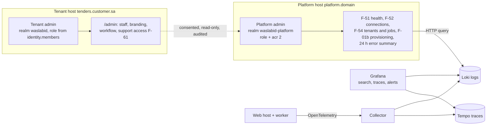

# ADR-0006: Separate the platform console from tenant administration, and phase the operations console

Date: 2026-09-26
Status: Accepted; superseded in part by ADR-0014 (2026-10-01)
Deciders: Ahmed Assaf
Related: F-01b, F-02, F-06, F-07, F-51 to F-54, F-60, F-61, N-08, N-10; spec `docs/superpowers/specs/2026-09-27-admin-ui-design.md` (D-1 to D-20); ADR-0001, ADR-0003

> Note 2026-10-01: the log and trace store and the Grafana parts of this record are superseded by ADR-0014. The collector now writes logs, traces and metrics to Elasticsearch; Kibana serves log search, traces and the usage dashboard; the console's 24-hour error summary reads Elasticsearch. Where this record says Loki, Tempo or Grafana (the diagram, decision 4 and the consequences), read Elasticsearch and Kibana. Everything else stands.

## Context

The admin UI slice was built with fourteen design decisions taken without the user (spec section 1). They were reviewed one by one on 2026-09-26 and confirmed unchanged, and the review added six more: support access, the provisioning screen, how the operations console is delivered, the log store, when settings take effect, and layout. Two of them change a stack row and the pilot scope, so they are recorded here.

## Decision

1. Platform staff sign in to their own realm `waslabid-platform` on their own host; every platform endpoint requires the `platform-admin` role and `acr` level 2. Tenant hosts return 404 for platform paths and the reverse.
2. Tenant administration lives under `/admin` on the tenant host, with the fixed F-07 roles stored in `identity.members`; users are invited through the Keycloak Admin API.
3. Staff see inside a tenant only in a support session the tenant admin granted: read-only, time-boxed, bannered, no offers, envelopes or scores, every view in the tenant's audit log (F-61).
4. The operations console is built in phases. The pilot builds F-51, F-52, F-54, F-01b and a 24-hour error summary; Grafana over Loki and Tempo serves log search, traces and alerts. The console's own log and trace views (rest of F-53) follow after three to five paying customers.
5. Settings take effect by risk: workflow by draft and publish, branding by preview and save, staff and roles immediately; all audited with before and after values.

## Consequences

- One app and one deploy serve both admin areas, and a tenant token can never carry a platform role.
- The pilot scope grows by F-01b, F-52 and the error summary, roughly two weeks on the 20-week plan (docs/05 rows 1, 20, 21).
- Tempo and the OpenTelemetry collector join the Compose stack and the deployment diagram; Grafana gives a view that survives when the app is down.
- Customers can see every support view in their own audit log, which is a sales point with procurement and audit teams.
- `AdminLayout` moves to start-side navigation; branding gains a preview before save.

## Alternatives considered

| Option | Why not now |
|---|---|
| Staff in the tenant realm with a `platform-admin` role | One role mis-assignment would give a tenant user platform power |
| Build the full log and trace explorer in the pilot | Weeks of solo work before revenue, and the console fails together with the app it should diagnose |
| Grafana, Uptime Kuma and the Hangfire dashboard only, no console | No secret-reference registry and no audited tenant actions in one place |
| Break-glass impersonation without consent | Hard to sell to procurement and audit teams |
| Rename `/admin` to `/settings` | Rework of built routes and tests for a wording change |
