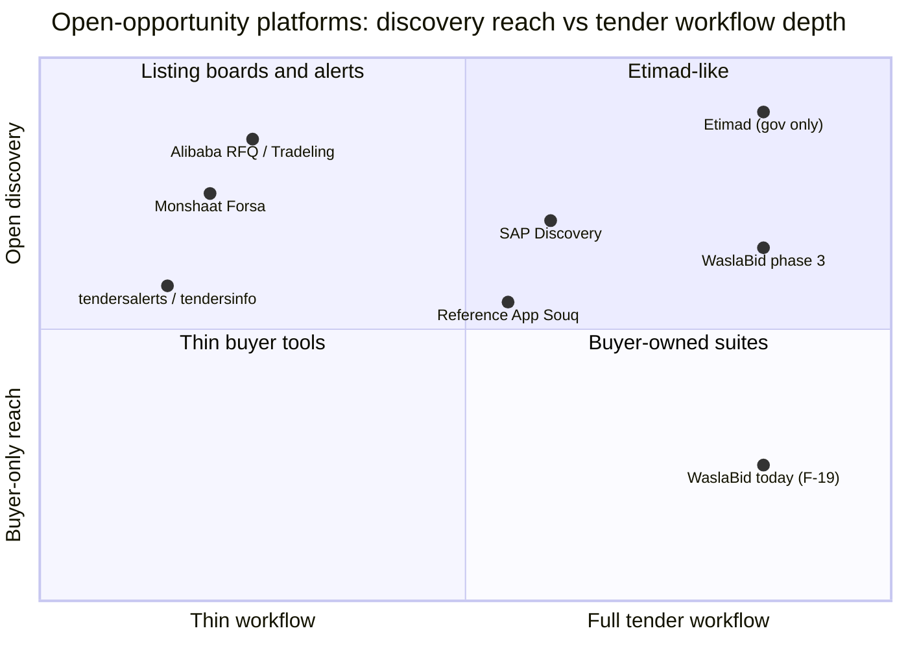
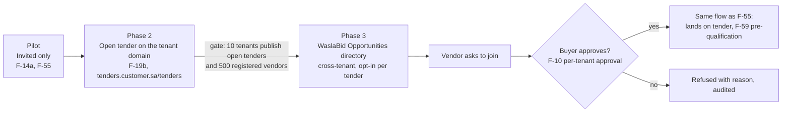

# ADR-0007: Keep open tenders on the tenant's domain; add a cross-tenant opportunities directory only after the vendor network exists

Date: 2026-09-26
Status: Proposed
Deciders: Ahmed Assaf
Related: F-02, F-10, F-11, F-19 (F-19b post-pilot), F-55, F-59; docs/01 section 3 and the deferred "cross-tenant vendor marketplace"; docs/04 (Reference App Souq marketplace); docs/12 (global vendor identity, vendors never pay)

## Context

Etimad lets any registered vendor discover and join government tenders, but private companies cannot publish there. The question (2026-09-26) is whether a private equivalent exists, and whether WaslaBid should be one: buyers publish public opportunities that any registered vendor can find and ask to join. Today F-19 gives each tenant an open listing on its own domain (post-pilot as F-19b; the pilot is invited-only, docs/05). A listing across all tenants was deferred in docs/01 until the vendor count is large. The platforms below already do parts of this. The Forsa and SAP entries are from general knowledge and still need checking with sources by the market-analyst agent.

## Landscape and how each compares with WaslaBid

| Platform | What it does better than WaslaBid | Where WaslaBid wins | Threat |
|---|---|---|---|
| Etimad | One national vendor register; every vendor already has an account; mandatory, so no sales needed | Private buyers cannot use it; no tenant brand; no configurable approval chain (F-56) | None directly; it sets vendor expectations for the flow |
| Monshaat Forsa | Government-backed reach to SMEs; free; big private buyers already post there | Forsa is a board: no sealed envelopes (F-23), scoring, finance approval, or PO. WaslaBid can be where a Forsa lead turns into a sealed offer | Low; possible partner |
| SAP Business Network Discovery | Global supplier network; buyers such as Aramco already use it; flows into Ariba sourcing | Only useful to SAP Ariba buyers; English-first; priced for large enterprises; no Arabic right-to-left tenant brand (F-02) | Low for mid-size, high for large accounts |
| Reference App Souq | Saudi, launched with Monshaat, backed by the Reference App's supplier base and financing | Their supplier portal is buyer-owned; our vendor account works across every buyer (F-10); white-label per tenant; configurable workflow | **High**: same buyers, same construction vendors (docs/04) |
| Alibaba RFQ, Tradeling | Huge supplier pools; fast quotes for goods | Quotes only: no sealed technical and financial envelopes, no committee, no audit trail (F-41) | Low; different buying (catalogue goods, not tenders) |
| tendersalerts, tendersinfo | Cheap alerts that vendors already pay for | They have no workflow; vendors never pay on WaslaBid (docs/12) | None |

**Pros of WaslaBid against all of them:** sealed envelopes and fixed invariants that no workflow can skip (ADR-0003), a configurable approval chain per tenant, the buyer's own brand and domain, Arabic right-to-left first, Saudi data residency, one free vendor account across buyers.

**Cons of WaslaBid against them:** no vendor network on day one (Etimad, SAP, Forsa, and the Reference App already have one); no government backing; no financing (the Reference App has a lender partner); a directory with few tenders is worse than none, because vendors visit once and do not come back.

## Decision

1. We do not build a cross-tenant directory in the pilot or in phase 2. Open tenders stay on the tenant's own domain (F-19b).
2. Phase 3 opens only at the gate: 10 tenants publishing open tenders and 500 registered vendors. The gate numbers are proposed and must be confirmed by the user.
3. Choices made now so phase 3 needs no rework; a reviewer can check pull requests against them:
   - Tender visibility is an enumeration, not a boolean, so a third value `OpenAndListed` can be added without a migration of meaning.
   - Public tender fields (title, category, deadline, buyer display name, pre-qualification summary) come from a published projection with no envelope, offer, or score data. The directory reads the projection and never the tenant's schema, so row-level security is never bypassed.
   - Vendor identity stays global (F-10); approval stays per tenant.
   - Listing in the directory is opt-in per tender and per tenant, because the directory carries the WaslaBid brand and tenant screens carry only the tenant's brand (F-02).
   - Vendors never pay to discover or join (docs/12).
4. If accepted, phase 3 gets a new feature ID appended to docs/02 (next free after F-61) and a backlog row in docs/09.

## Consequences

- Easier: the pilot stays small; phase 3 is a new read model and one page, not a data-model change.
- Easier: every tenant that publishes an open tender grows the vendor pool that phase 3 needs, so the directory starts with content.
- Harder: until phase 3 we lose vendors who want to browse all opportunities; the Reference App Souq may win the supplier side first (docs/04 marks it contested since 2025-09-28).
- Given up: early marketplace revenue or lead fees; vendors never pay.
- To change if accepted: docs/02 (new feature row, F-19 note), docs/03 feature map and roadmap, docs/05 out-of-scope list, docs/01 section 3 (add Forsa and SAP Discovery once verified), CLAUDE.md and README ADR lists.

## Alternatives considered

| Option | Why not now |
|---|---|
| Build the cross-tenant directory in the MVP | An empty directory drives vendors away; weeks of solo work before a paying customer (docs/13) |
| Never build a directory; stay white-label only | Gives up the network effect that makes vendors pull buyers onto the platform (docs/04 point 3) and leaves the supplier side to the Reference App |
| Post our tenants' open tenders to Forsa or aggregators | Worth testing in phase 2 as a lead source; depends on their terms, which are not verified |
| Charge vendors for directory access | Against "vendors never pay" (docs/12); aggregators already take that money for alerts only |
