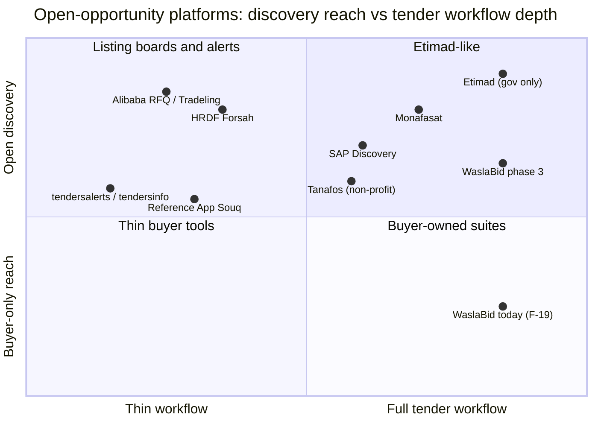
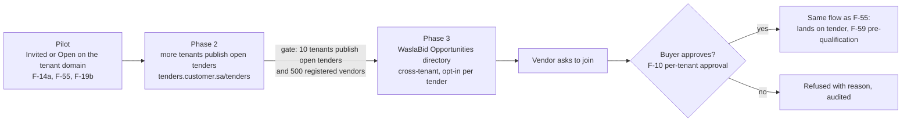

# ADR-0007: Keep open tenders on the tenant's domain; add a cross-tenant opportunities directory only after the vendor network exists

Date: 2026-09-26
Status: Accepted (2026-09-26, gates confirmed: 10 tenants publishing open tenders and 500 registered vendors). Amended the same day by ADR-0008: open tenders on the tenant domain (F-19b) move into the pilot, so phase 2 starts with the pilot
Deciders: Ahmed Assaf
Related: F-62 (the directory), F-02, F-10, F-11, F-19 (F-19b in the pilot since ADR-0008), F-55, F-59; docs/01 section 3 and the deferred "cross-tenant vendor marketplace"; docs/04 (Reference App Souq marketplace); docs/12 (global vendor identity, vendors never pay)

## Context

Etimad lets any registered vendor discover and join government tenders, but private companies cannot publish there. The question (2026-09-26) is whether a private equivalent exists, and whether WaslaBid should be one: buyers publish public opportunities that any registered vendor can find and ask to join. Today F-19 gives each tenant an open listing on its own domain (post-pilot as F-19b; the pilot is invited-only, docs/05). A listing across all tenants was deferred in docs/01 until the vendor count is large. The platforms below already do parts of this. One private equivalent already exists: Monafasat (a Riyadh company founded in 2022, unrelated to the old government portal of the same name) lists tenders from many buyers with technical and financial proposals, scoring, and award, and charges suppliers per opportunity. The table was verified with sources by the market-analyst agent on 2026-09-26; see docs/01 section 3.2 and section 7.

## Landscape and how each compares with WaslaBid

| Platform | What it does better than WaslaBid | Where WaslaBid wins | Threat |
|---|---|---|---|
| Etimad | One national vendor register; every vendor already has an account; mandatory, so no sales needed | Private buyers cannot use it; no tenant brand; no configurable approval chain (F-56) | None directly; it sets vendor expectations for the flow |
| Monafasat (private, 2022) | Already a private cross-buyer tender directory with technical and financial proposals, scoring, and award; free for buyers | Suppliers pay per opportunity, we never charge vendors (docs/12); white-label, sealed envelopes, and a configurable approval chain not found publicly; small team (2 to 10) | **High for F-62**: it is the phase-3 directory already live |
| HRDF Forsah (Nine-Tenths programme) | Government-run, free for suppliers; government and private buyers post; over 38,000 suppliers and SAR 2.6bn awarded in 2025 | RFQ, price offer, and award only; sealed envelopes, scoring, finance approval, and PO not found publicly; no buyer brand | Low; possible lead source for phase-2 open tenders |
| Tanafos | Multi-buyer tender platform for the non-profit sector | Non-profit only; we serve private companies | Low; different segment |
| SAP Business Network Discovery | Global supplier network; buyers post free | Suppliers pay subscription tiers plus 0.155 to 0.35% transaction fees; Arabic interface not found publicly; no tenant brand (F-02). Aramco and SABIC run their own Ariba supplier portals, which are buyer-owned, not open directories | Low for mid-size, high for large accounts |
| Reference App Souq | Saudi, launched with Monshaat in 2022, backed by the Reference App's supplier base and financing | A catalogue and RFQ marketplace for goods, not a tender directory; host showed an expired TLS certificate on 2026-09-26 and no activity since 2025 was found publicly; our vendor account works across every buyer (F-10) | Medium for F-62; the Reference App stays the main competitor overall (docs/04) |
| Alibaba RFQ, Tradeling | Huge supplier pools; fast quotes for goods (Alibaba: only paid Gold Suppliers quote beyond a free quota) | Quotes only: no sealed technical and financial envelopes, no committee, no audit trail (F-41) | Low; different buying (catalogue goods, not tenders) |
| tendersalerts, tendersinfo | Cheap alerts that vendors already pay for | They have no workflow; vendors never pay on WaslaBid (docs/12) | None |

**Pros of WaslaBid against all of them:** sealed envelopes and fixed invariants that no workflow can skip (ADR-0003), a configurable approval chain per tenant, the buyer's own brand and domain, Arabic right-to-left first, Saudi data residency, one free vendor account across buyers.

**Cons of WaslaBid against them:** no vendor network on day one (Etimad, Forsah, SAP, Monafasat, and the Reference App already have one); Monafasat already runs a private cross-buyer directory, so F-62 will be a follower, not a first mover; no government backing; no financing (the Reference App has a lender partner); a directory with few tenders is worse than none, because vendors visit once and do not come back.

## Decision

1. We do not build a cross-tenant directory in the pilot or in phase 2. Open tenders stay on the tenant's own domain (F-19b).
2. Phase 3 opens only at the gate: 10 tenants publishing open tenders and 500 registered vendors (confirmed by the user on 2026-09-26).
3. Choices made now so phase 3 needs no rework; a reviewer can check pull requests against them:
   - Tender visibility is an enumeration, not a boolean, so a third value `OpenAndListed` can be added without a migration of meaning.
   - Public tender fields (title, category, deadline, buyer display name, pre-qualification summary) come from a published projection with no envelope, offer, or score data. The directory reads the projection and never the tenant's schema, so row-level security is never bypassed.
   - Vendor identity stays global (F-10); approval stays per tenant.
   - Listing in the directory is opt-in per tender and per tenant, because the directory carries the WaslaBid brand and tenant screens carry only the tenant's brand (F-02).
   - Vendors never pay to discover or join (docs/12).
4. Phase 3 is feature F-62 in docs/02 section 2.4 and a gated P2 row in docs/09.

## Consequences

- Easier: phase 3 is a new read model and one page, not a data-model change. (The pilot grows by F-19b after the ADR-0008 amendment.)
- Easier: every tenant that publishes an open tender grows the vendor pool that phase 3 needs, so the directory starts with content.
- Harder: until phase 3 we lose vendors who want to browse all opportunities; the Reference App Souq may win the supplier side first (docs/04 marks it contested since 2025-09-28).
- Given up: early marketplace revenue or lead fees; vendors never pay.
- Changed with this ADR: docs/02 (F-62 row, F-19 note), docs/03 feature map, docs/05 out-of-scope list, docs/09 (F-62 row), docs/01 section 3 (platforms verified by the market-analyst agent), CLAUDE.md and README ADR lists. The docs/03 roadmap covers version 1 only, so F-62 is not on it.

## Alternatives considered

| Option | Why not now |
|---|---|
| Build the cross-tenant directory now to race Monafasat | An empty directory drives vendors away; weeks of solo work before a paying customer (docs/13) |
| Never build a directory; stay white-label only | Gives up the network effect that makes vendors pull buyers onto the platform (docs/04 point 3) and leaves the supplier side to the Reference App |
| Post our tenants' open tenders to HRDF Forsah, Monafasat, or aggregators | Worth testing in phase 2 as a lead source; whether a private buyer can post on Forsah and whether a feed or API exists are not verified |
| Charge vendors for directory access | Against "vendors never pay" (docs/12); aggregators already take that money for alerts only |
