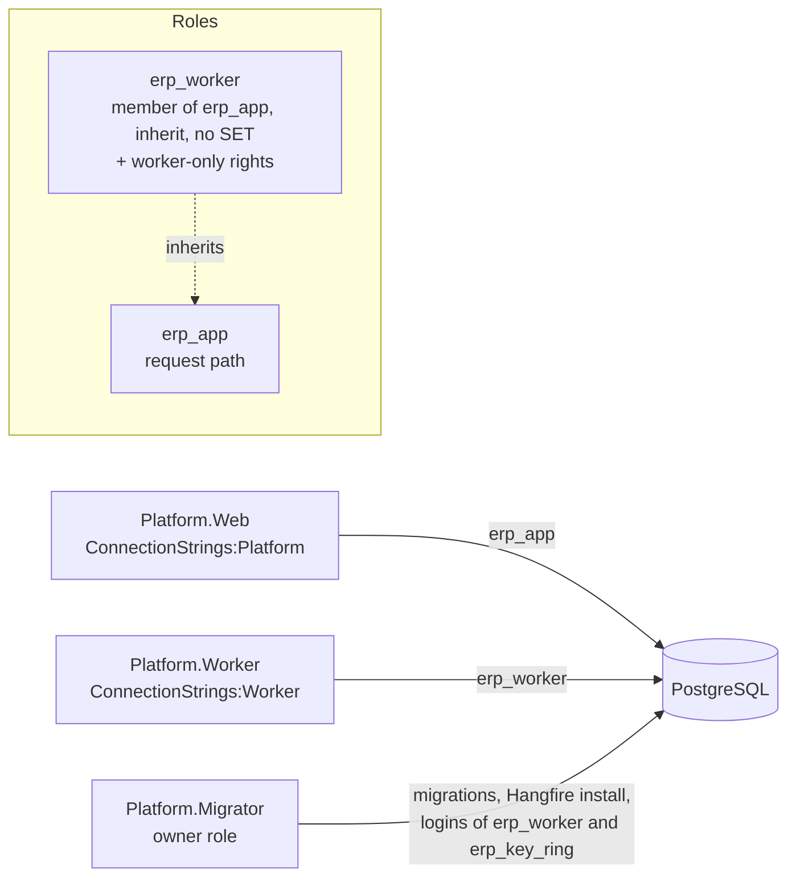

# ADR-0012: Keep vendor sessions out of staff rows in row-level security

Date: 2026-09-28
Status: Accepted 2026-09-28
Deciders: Ahmed Assaf
Related: N-02 tenant isolation, F-10, F-23, F-41, ADR-0008, vendor slice spec `docs/superpowers/specs/2026-09-27-vendors-design.md`, pentest of the vendor slice 2026-09-28 (P-1 to P-3)

## Context

A vendor signed in on a tenant host runs with both `app.tenant_id` (the host tenant) and `app.vendor_company_id` set. The tenant policy created by `platform.enable_tenant_rls` checks only `tenant_id = platform.current_tenant()`, so inside that tenant the database cannot tell a vendor from staff. The pentest proved that a vendor session can read every relationship row of the tenant (competitors' company ids and status), the tenant's staff members and audit events, and can insert an `identity.members` row for itself. None of this is reachable through the app today, because the web policies keep vendors off those paths, but the database is meant to hold isolation on its own, and the first tenant table holding offers (F-23) would make the same gap critical. Migration 0011 already closed the same gap for four security-definer functions.

## Decision

1. **Staff-only by default.** `platform.enable_tenant_rls` creates `tenant_id = platform.current_tenant() and platform.current_vendor_company() is null` for both `using` and `with check`. Every existing tenant table is re-applied by a migration, and new tables get it automatically.
2. **Vendor-visible tenant tables are explicit.** A second helper, `platform.enable_tenant_vendor_rls(schema, table, company_column)`, creates `tenant_id = platform.current_tenant() and (platform.current_vendor_company() is null or <company_column> = platform.current_vendor_company())`. It is used only where a vendor legitimately reads its own row inside a tenant: today `vendor.relationships`; later a vendor's own offers and the tenders it is invited to (with their own rules for sealed envelopes).
3. **Audit is write-only for vendors.** `audit.events` keeps one policy for insert that accepts a vendor context (vendor actions are audited in the tenant's log, F-41) and a staff-only policy for select.
4. **Security-definer functions state who may call them.** Staff functions refuse a vendor context (as 0011 does) and, where they change a decision, check the acting user's role in `identity.members`; vendor functions refuse a missing or different vendor context; and worker-only functions refuse any tenant or vendor context, so a tenant-host session cannot call them. Until a separate worker role exists (see Consequences), "no tenant and no vendor context" also matches every platform-host session, so a platform admin's session can call the worker's functions and read the platform audit; the platform host serves only platform admins behind the PlatformAdmin policy with OTP, and a test pins this known gap so it is closed deliberately. The platform audit is written only through a security-definer function and read only without a tenant or vendor context.
5. **Tests.** The table catalog test asserts that every tenant table uses one of the two policies, and the pentest tests in `tests/Platform.IntegrationTests/Security/` stay as regression tests.

## Consequences

- The database holds the vendor-versus-staff line inside a tenant by itself, so a query that forgets a company filter cannot leak a competitor's rows.
- Every future tenant table that a vendor must see needs a deliberate choice of the second helper, which a reviewer can check in the migration.
- One migration touches tables in the Identity, Audit, Workflow and Vendors schemas; it runs in the vendor slice before the slice is merged.
- A separate database role for the worker (so worker-only functions need no context rule) stays a later option.
- docs/03 diagram 5 (tenant isolation) gains the vendor context as a second key when the vendor slice updates its docs.

## Alternatives considered

| Option | Why not now |
|---|---|
| Leave `app.tenant_id` empty for vendor sessions | The vendor's pages are tenant-branded and its relationship, audit and future offer rows are tenant rows; every vendor query would need a security-definer function |
| Separate database roles for staff and vendor connections | Two connection strings and pools per host for the same result; can follow later if the policies grow complex |
| Rely on the web policies and `VendorDirectory` checks | Isolation must not depend on every future query remembering a filter; that is the reason row-level security is forced |

## Addendum 2026-10-03: the worker's own database role (W-36)

Approved by the user on 2026-10-03 as hardening before gate 1. It takes up the option left in Consequences ("a separate database role for the worker") and closes the known gap of point 4; points 1 to 5 stand unchanged.

**Problem.** The worker connected as `erp_app`, so "no tenant, no vendor and no acting user" was the only mark of a worker-only function, and a platform console session without a user matched it too (pentest I-2, PT-W10-01). The Hangfire tables were owned by `erp_app`, which could alter or drop them, and `ops.incidents` and `ops.job_failure_streaks` had no row-level security.

**Decision.**

1. **Role.** Platform migration 0008 creates `erp_worker` without a login and makes it a member of `erp_app` (`with inherit true, set false`): the worker runs every module's jobs, tenant-scoped ones included, so it needs what `erp_app` has, plus the worker-only rights below; `erp_app` is not a member of `erp_worker`. The migrator gives it a login from its own `ConnectionStrings:Worker`, exactly as W-24 does for `erp_key_ring` (a SCRAM verifier, never the password); the password is `ERP_WORKER_DB_PASSWORD` in `infra/compose/.env`. The worker reads only `ConnectionStrings:Worker` and refuses to start without it or with any role but `erp_worker`; the web host refuses `erp_worker` as `ConnectionStrings:Platform`.
2. **Worker-only rights move.** EXECUTE on `identity.activity_counts`, `identity.prune_activity`, `tenancy.referenced_logos`, `vendor.unalerted_cr_disputes`, `vendor.mark_cr_disputes_alerted`, `vendor.pending_scan_documents`, `vendor.stale_uploads`, `vendor.claim_stale_upload` and `vendor.remove_stale_upload` is revoked from `erp_app` and granted to `erp_worker` only. Their context checks stay, as defence in depth.
3. **ops tables.**

| Table | `erp_app` (web, console) | `erp_worker` (adds) | Row-level security |
|---|---|---|---|
| `ops.health_results` | SELECT | INSERT | none (unchanged) |
| `ops.incidents` | SELECT | INSERT, UPDATE | forced: read without tenant or vendor context; insert and update only to `erp_worker` without any context |
| `ops.job_failure_streaks` | nothing | SELECT, INSERT, UPDATE, DELETE | forced: only `erp_worker` without any context |
| `ops.active_user_counts` | SELECT | INSERT, DELETE | as before; the write policies now name `erp_worker` |

4. **Hangfire.** The migrator installs and upgrades Hangfire's tables as the owner role (`PostgreSqlObjectsInstaller`, after the platform migrations) and the hosts no longer prepare the schema. `erp_app` loses CREATE on schema `hangfire` and ownership of its tables (moved to the owner by migration 0008); it keeps USAGE and SELECT, INSERT, UPDATE, DELETE on the tables and USAGE, SELECT on the sequences (default privileges cover tables a later Hangfire version adds), which the web host needs to enqueue, re-run from the console and show the dashboard. The worker has the same through `erp_app`.

**What the web host loses.** The nine functions above, writes to `ops.health_results`, `ops.incidents` and `ops.active_user_counts`, every right on `ops.job_failure_streaks`, and DDL on Hangfire's tables. The console still reads the health board, incidents, the usage page and failed jobs as before.

**Consequences.** A console session, with or without a user, can no longer call a worker function: the gap test becomes a regression test that it cannot. Deploys need a fourth secret (`ConnectionStrings:Worker` for the migrator and the worker). The migration owner needs, besides CREATEROLE, admin rights on `erp_app` (to grant the membership) and, on a database whose Hangfire tables were created by `erp_app`, membership of `erp_app` to take them over; the Compose owner `erp` is a superuser. On the pilot (W-19) an administrator may instead create `erp_worker` once and leave `ConnectionStrings:Worker` unset for the migrator.
