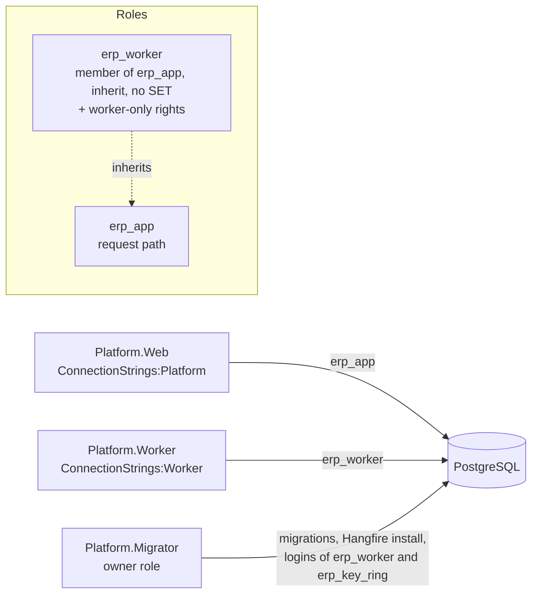
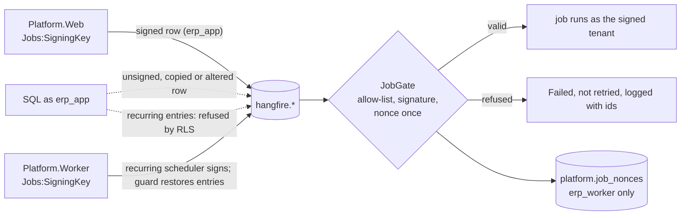

# ADR-0012: Keep vendor sessions out of staff rows in row-level security

Date: 2026-09-28
Status: Accepted 2026-09-28
Deciders: Ahmed Assaf
Related: N-02 tenant isolation, F-10, F-23, F-41, ADR-0008, vendor slice spec `docs/superpowers/specs/2026-09-27-vendors-design.md`, pentest of the vendor slice 2026-09-28 (P-1 to P-3)

## Context

A vendor signed in on a tenant host runs with both `app.tenant_id` (the host tenant) and `app.vendor_company_id` set. The tenant policy created by `platform.enable_tenant_rls` checks only `tenant_id = platform.current_tenant()`, so inside that tenant the database cannot tell a vendor from staff. The pentest proved that a vendor session can read every relationship row of the tenant (competitors' company ids and status), the tenant's staff members and audit events, and can insert an `identity.members` row for itself. None of this is reachable through the app today, because the web policies keep vendors off those paths, but the database is meant to hold isolation on its own, and the first tenant table holding offers (F-23) would make the same gap critical. Migration 0011 already closed the same gap for four security-definer functions.

## Decision

1. **Staff-only by default.** `platform.enable_tenant_rls` creates `tenant_id = platform.current_tenant() and platform.current_vendor_company() is null` for both `using` and `with check`. Every existing tenant table is re-applied by a migration, and new tables get it automatically.
2. **Vendor-visible tenant tables are explicit.** A second helper, `platform.enable_tenant_vendor_rls(schema, table, company_column)`, creates `tenant_id = platform.current_tenant() and (platform.current_vendor_company() is null or <company_column> = platform.current_vendor_company())`. It is used only where a vendor legitimately reads its own row inside a tenant: today `vendor.relationships`; later a vendor's own offers and the tenders it is invited to (with their own rules for sealed envelopes).
3. **Audit is write-only for vendors.** `audit.events` keeps one policy for insert that accepts a vendor context (vendor actions are audited in the tenant's log, F-41) and a staff-only policy for select.
4. **Security-definer functions state who may call them.** Staff functions refuse a vendor context (as 0011 does) and, where they change a decision, check the acting user's role in `identity.members`; vendor functions refuse a missing or different vendor context; and worker-only functions refuse any tenant or vendor context, so a tenant-host session cannot call them. Until a separate worker role exists (see Consequences), "no tenant and no vendor context" also matches every platform-host session, so a platform admin's session can call the worker's functions and read the platform audit; the platform host serves only platform admins behind the PlatformAdmin policy with OTP, and a test pins this known gap so it is closed deliberately. The platform audit is written only through a security-definer function and read only without a tenant or vendor context.
5. **Tests.** The table catalog test asserts that every tenant table uses one of the two policies, and the pentest tests in `tests/Platform.IntegrationTests/Security/` stay as regression tests.

## Consequences

- The database holds the vendor-versus-staff line inside a tenant by itself, so a query that forgets a company filter cannot leak a competitor's rows.
- Every future tenant table that a vendor must see needs a deliberate choice of the second helper, which a reviewer can check in the migration.
- One migration touches tables in the Identity, Audit, Workflow and Vendors schemas; it runs in the vendor slice before the slice is merged.
- A separate database role for the worker (so worker-only functions need no context rule) stays a later option.
- docs/03 diagram 5 (tenant isolation) gains the vendor context as a second key when the vendor slice updates its docs.

## Alternatives considered

| Option | Why not now |
|---|---|
| Leave `app.tenant_id` empty for vendor sessions | The vendor's pages are tenant-branded and its relationship, audit and future offer rows are tenant rows; every vendor query would need a security-definer function |
| Separate database roles for staff and vendor connections | Two connection strings and pools per host for the same result; can follow later if the policies grow complex |
| Rely on the web policies and `VendorDirectory` checks | Isolation must not depend on every future query remembering a filter; that is the reason row-level security is forced |

## Addendum 2026-10-03: the worker's own database role (W-36)

Approved by the user on 2026-10-03 as hardening before gate 1. It takes up the option left in Consequences ("a separate database role for the worker") and closes the known gap of point 4; points 1 to 5 stand unchanged.

**Problem.** The worker connected as `erp_app`, so "no tenant, no vendor and no acting user" was the only mark of a worker-only function, and a platform console session without a user matched it too (pentest I-2, PT-W10-01). The Hangfire tables were owned by `erp_app`, which could alter or drop them, and `ops.incidents` and `ops.job_failure_streaks` had no row-level security.

**Decision.**

1. **Role.** Platform migration 0008 creates `erp_worker` without a login and makes it a member of `erp_app` (`with inherit true, set false`): the worker runs every module's jobs, tenant-scoped ones included, so it needs what `erp_app` has, plus the worker-only rights below; `erp_app` is not a member of `erp_worker`. The migrator gives it a login from its own `ConnectionStrings:Worker`, exactly as W-24 does for `erp_key_ring` (a SCRAM verifier, never the password); the password is `ERP_WORKER_DB_PASSWORD` in `infra/compose/.env`. The worker reads only `ConnectionStrings:Worker` and refuses to start without it or with any role but `erp_worker`; the web host refuses `erp_worker` as `ConnectionStrings:Platform`.
2. **Worker-only rights move.** EXECUTE on `identity.activity_counts`, `identity.prune_activity`, `tenancy.referenced_logos`, `vendor.unalerted_cr_disputes`, `vendor.mark_cr_disputes_alerted`, `vendor.pending_scan_documents`, `vendor.stale_uploads`, `vendor.claim_stale_upload` and `vendor.remove_stale_upload` is revoked from `erp_app` and granted to `erp_worker` only. Their context checks stay, as defence in depth.
3. **ops tables.**

| Table | `erp_app` (web, console) | `erp_worker` (adds) | Row-level security |
|---|---|---|---|
| `ops.health_results` | SELECT | INSERT | none (unchanged) |
| `ops.incidents` | SELECT | INSERT, UPDATE | forced: read without tenant or vendor context; insert and update only to `erp_worker` without any context |
| `ops.job_failure_streaks` | nothing | SELECT, INSERT, UPDATE, DELETE | forced: only `erp_worker` without any context |
| `ops.active_user_counts` | SELECT | INSERT, DELETE | as before; the write policies now name `erp_worker` |

4. **Hangfire.** The migrator installs and upgrades Hangfire's tables as the owner role (`PostgreSqlObjectsInstaller`, after the platform migrations) and the hosts no longer prepare the schema. `erp_app` loses CREATE on schema `hangfire` and ownership of its tables (moved to the owner by migration 0008); it keeps USAGE and SELECT, INSERT, UPDATE, DELETE on the tables and USAGE, SELECT on the sequences (default privileges cover tables a later Hangfire version adds), which the web host needs to enqueue, re-run from the console and show the dashboard. The worker has the same through `erp_app`.

5. **Job allow-list (review of W-36, 2026-10-03).** `erp_app` still writes Hangfire's tables, so a job row is untrusted: whoever holds that role could name any loadable type and public method (`System.Diagnostics.Process.Start`) and the worker would run it as `erp_worker`. Every process that runs a job server therefore resolves Hangfire types only through `JobAllowList.ResolveType` (types of `Platform.*` and Hangfire's assemblies, and a short list of framework argument types such as `string`, `Guid`, `CancellationToken`), and `JobAllowListFilter` refuses, before activation, any job whose class lacks `[PlatformJob]`, whose method is not the class's own public method, or that carries a tenant while its class is not `TenantScoped`; the job activator applies the tenant rule again to the parameters it uses. The resolver is set when a job server is registered, before any stored row is read. A refused row fails without being invoked and is not retried, whether the retry would be scheduled or, with a zero delay, enqueued. Job arguments are deserialized without type names (Hangfire's default for user data, pinned by a test), so a `$type` inside an argument is never instantiated.

6. **Platform audit actor (W-41, 2026-10-03).** `ops.write_platform_audit` (operations 0008) lets only a member of `erp_worker` without an acting user write under a free actor (the system, null); every `erp_app` session, the console's included, writes only as `platform.current_user_id()` and must have one. Residual: `app.user_id` is a session setting that `erp_app` sets itself, so SQL injected as `erp_app` could still impersonate a user, as with the tenant audit (`audit.events`); the rule closes the console's forged id and the free actor, not injected SQL.

**What the web host loses.** The nine functions above, writes to `ops.health_results`, `ops.incidents` and `ops.active_user_counts`, every right on `ops.job_failure_streaks`, and DDL on Hangfire's tables. The console still reads the health board, incidents, the usage page and failed jobs as before.

**Consequences.** A console session, with or without a user, can no longer call a worker function: the gap test becomes a regression test that it cannot. Deploys need a fourth secret (`ConnectionStrings:Worker` for the migrator and the worker). The migration owner needs CREATEROLE (or superuser) to create `erp_worker` and give it its login, admin rights on `erp_app` to grant the membership, and, on a database whose Hangfire tables were created by `erp_app`, membership of `erp_app` to take them over; the Compose owner `erp` is a superuser. On the pilot (W-19) an administrator may create `erp_worker` beforehand, with its membership of `erp_app` (inherit, no set) and its password, and leave `ConnectionStrings:Worker` unset for the migrator: migration 0008 then grants nothing and only checks the role (no superuser, BYPASSRLS, CREATEROLE, CREATEDB or REPLICATION attribute, no other membership, no member that can use its rights), but taking over Hangfire tables that `erp_app` created still needs the owner to be a member of `erp_app`. Residual (W-42): `erp_app` can still enqueue the allow-listed platform jobs (today six platform jobs without a tenant, idempotent and bounded, so running them early or often is a nuisance only) and, once tenant-scoped jobs exist, such a job for any tenant, because a row the web host writes and a row injected as `erp_app` are indistinguishable; it can also delete or re-time the recurring-job entries, stalling the worker's recurring jobs until a restart adds them again (availability only); this is to be closed before the first tenant-scoped job (closed by the W-42 addendum below). Related (W-41, closed): `ops.write_platform_audit` no longer accepts a free actor from an `erp_app` session (point 6).

## Addendum 2026-10-03: signed job rows and the worker's recurring entries (W-42)

Approved by the user on 2026-10-03 as hardening before gate 1. It closes the residual recorded at the end of the W-36 addendum; points 1 to 5 of that addendum stand unchanged.

**Problem.** `erp_app` writes Hangfire's tables to enqueue, so a row the web host wrote and a row SQL injected as `erp_app` wrote looked the same to the worker: such a row could enqueue any allow-listed platform job at any time and, once tenant-scoped jobs exist, for any tenant (the activator accepted any consistent `TenantId` and `Tenant`). `erp_app` could also delete or re-time the `recurring-job:*` hashes, the `recurring-jobs` set and the scheduler's lock, stalling the health checks, scans, cleanups and alerts until the worker restarted.

**Decision.**

1. **Signed job rows.** Both hosts sign every job they create with HMAC-SHA256 under `Jobs:SigningKey` (base64, at least 32 bytes, a secret in user secrets or the secret store; `Jobs:PreviousSigningKey` optionally still verifies jobs signed before a key change). The signature, in job parameter `Authenticity`, covers the job's class, method, parameter types (named without versions) and arguments, its queue, `TenantId`, the `Tenant` snapshot, `RecurringJobId`, the culture pair Hangfire stamps (`CurrentCulture`, `CurrentUICulture`, the language a job writes in), a random nonce and the signing time. `TraceParent` and `RetryCount` are not signed: they serve observability and retry counting only. The client filter runs last among the client filters in the web host's and the worker's `IBackgroundJobClient`, in the signed recurring job manager, and in the job server's own factory, so the jobs the worker's recurring scheduler creates are signed too. Each host refuses to start without the key.
2. **The worker's gate.** `JobAllowListFilter` refuses, before activation, a job whose signature is missing, malformed, made under another key, or does not match the job as loaded and its stored tenant; the refused job fails once and is not retried, and the log names the job id and the reason only (never the token). `TenantJobActivator` then reads the tenant and the signature once, checks the signature over exactly the values it uses, and runs the job with that tenant (`JobGate.Admit`), so a parameter changed after the filter's read is judged on what is used.
3. **One run per signature.** The first run binds the signature's nonce to its job id in `platform.job_nonces` (jobs migrations 0001 and 0002; `erp_worker` only, without any context; `erp_app` has no right on it), and a run that ends without an exception marks it completed. A signed row copied into a new job is refused, and so is a succeeded job moved back to the queue. While a run lasts, it holds a session advisory lock on its nonce (key `hashtextextended('waslabid.job.run:' || nonce, 0)`, on a connection of its own, released after the completion is recorded, or by the connection closing if the worker dies), so a second run of the same job id meanwhile (`erp_app` can queue the job again, and Hangfire lets a Processing job be processed again) is refused as already running, once and without a retry. A failed job's retries and the console's re-run keep their job id and run again once the run has ended. A nonce not seen before is accepted only within 30 days of signing, so a job scheduled more than 30 days ahead would be refused when it comes due (none is today); ledger rows are kept that long and while their job exists, and pruned by the guard.
4. **Recurring entries, locks, job ids and heartbeats are the worker's.** Jobs migrations 0001 to 0003, run by the migrator right after it installs Hangfire's tables, force row-level security on `hangfire.hash`, `hangfire.set`, `hangfire.lock` and `hangfire.job`: `erp_app` reads every row (the dashboard) but may not insert, update or delete hash keys `recurring-job:*`, the `recurring-jobs` set, or any lock but a job's state lock (`hangfire:job:<id>:state-lock`, which enqueueing and the console's re-run take); a state lock it writes must carry an acquisition time at most five minutes ahead (Hangfire.PostgreSql expires locks only by that time, so a lock without one would never expire); and a job row it writes or moves must keep an id the job sequence already handed out, also on a sequence that has handed out none (jobs migration 0003; an explicit id ahead of it would collide with a later job). `erp_app` keeps only SELECT on `hangfire.server`, so it cannot write a heartbeat that keeps the worker's check green while the worker is down. `erp_worker` and the owner are unrestricted. The migrations refuse an owner without BYPASSRLS, and on every run, after Hangfire's install or upgrade, the migrator checks that these tables still have forced row-level security and their policies, and that `erp_app` cannot write `hangfire.server`, and stops otherwise.
5. **Self-healing.** The modules schedule their recurring jobs through `RecurringJobCatalog`; the worker's `RecurringJobGuard` checks them every five minutes (`JobServerSettings.RecurringJobGuardInterval`), writes back an entry that is missing, out of the `recurring-jobs` set, or altered in job, arguments, cron, queue or time zone, and removes an id in the set that it does not define only when no worker may run its job: a class this build loads that is not a platform job, or a type the allow-list refuses (logging the id only; a worker that defines none looks at none). An unknown entry naming a platform job, or a type this build does not know, is left in place and logged, so an old and a new worker running side by side during a deploy never remove each other's jobs. Each pass is recorded as health component `Jobs` (alerted, not a board tile): a restore or removal opens one F-60 incident naming the ids, and the next intact pass closes it with the recovery email.

**What the web host loses.** Writing recurring entries, the worker's locks, job ids ahead of the sequence and server heartbeats; it never needed them (the console's re-run moves a failed job back to the queue, and the dashboard is read-only).

**Consequences.** SQL injected as `erp_app` can no longer make the worker run a job it did not sign, run a job as another tenant or in another language, run a signed job as a second job, a second time while it runs, or again after it succeeded, stall the recurring jobs, or fake the worker's heartbeat. Each running job holds one more database connection (its run lock) for its duration, from the worker's job pool. Deploys need one more secret, the same `Jobs:SigningKey` for the web host and the worker (`WASLABID_JOB_SIGNING_KEY` in `infra/compose/.env`, docs/07 section 4); a key change needs `Jobs:PreviousSigningKey` on the worker until the jobs signed before it have run. On the upgrade, jobs queued and retries scheduled before it carry no signature and fail once as unsigned (the recurring jobs fire again, signed, on their next occurrence). The Data Protection key ring was not used for the signature: it would give the worker the power to forge every web session (the W-24 rule that the worker never loads the ring, pinned by a test, stays). Residuals: a compromised web process holds `Jobs:SigningKey` and can still sign any job, for any tenant (the key is a protection against SQL injection, not against code running in a host); `erp_app` can still delete, re-time or block individual queued jobs (rows of `hangfire.job`, `jobqueue`, `jobparameter`, the `schedule` set; a changed parameter makes the job fail its signature; a state lock it holds and refreshes, or a run lock it takes on a nonce it read from the job's parameters, makes a run wait or fail as already running): a persistent injector can block a given job for about 15 minutes per injection (Hangfire's state-lock timeout) and repeat it, and can make a run fail once, but each recurring job fires again on its next occurrence and the guard keeps the schedule; the culture pair is verified at the gate, but Hangfire's culture filter reads it again on its own, so a change in the moment between the two reads is not caught; a lock RLS refuses makes Hangfire.PostgreSql retry until its lock timeout rather than fail, so a web-host path that one day needs another lock would hang, not error; the guard does not compare an entry's next execution time with its cron (only the worker's role can write it); with several workers each runs its own guard, and only one finds a given drift.
