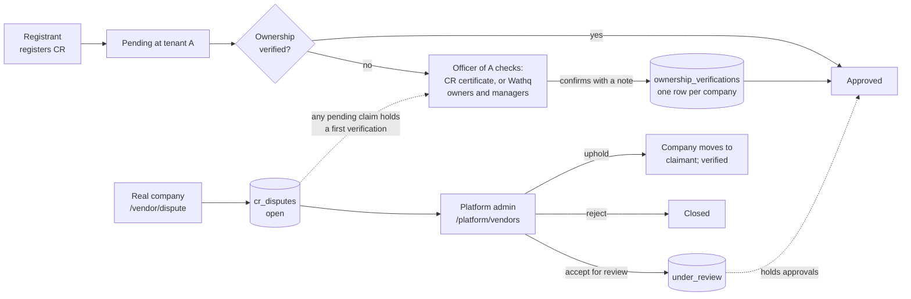

# ADR-0013: Verify CR ownership before a vendor company's first approval, with a platform dispute path

Date: 2026-09-29
Status: Accepted 2026-09-29 (the user decided "build both checks, Wathq optional, method changeable from the admin", confirmed that the admin is the platform console, decided that disputes hold only after triage, and accepted the residual risk below once the review and pentest fixes landed)
Deciders: Ahmed Assaf
Related: W-33, pentest P-4 (vendor slice, 2026-09-28), F-10, F-11, F-12, F-64, N-10; ADR-0006, ADR-0008, ADR-0010, ADR-0012; vendor slice spec `docs/superpowers/specs/2026-09-27-vendors-design.md` (V-15 to V-17)

## Context

ADR-0008 keys one vendor company across all tenants on its CR number, and the first person to register a number owns the company on every tenant. The pentest of the vendor slice (P-4) showed that a squatter can register a real company's CR number and lock the real company out of every buyer on the platform. Nothing checked the registering person against the commercial registration, and the real company had no way back.

## Decision

1. **A fixed point.** A company's first approval by any tenant needs its ownership verified; the database refuses `vendor.approve_relationship` for an unverified company or one with an open dispute. Once verified, later tenants approve without a check and learn only that it was verified and by which method, never which tenant or officer verified it (ADR-0008).
2. **Two methods behind one port**, `ICrOwnershipVerifier` in the Vendors module: Manual (the officer reads the CR certificate the vendor uploaded, F-12) and Wathq (the officer also sees the CR's owners and managers from Wathq's commercial registration API). The officer confirms with a box and a note in both; Wathq never decides alone. The registrant's national ID is not collected, so automatic matching is out of scope.
3. **The method is a platform setting**, Manual by default, changed only in the platform console (ADR-0006) and audited in the platform audit, because vendor identity is global and the Wathq subscription belongs to the platform, not a tenant.
4. **Wathq fails closed.** Not configured, unreachable, answering with an error or without a record: the dialog says which and the manual check applies. An approval never proceeds unverified. The API key lives in user secrets or the cloud KMS, never in the repository or a log (N-10).
5. **Dispute path.** A signed-in person without a vendor company or a staff role raises a dispute on a tenant host (at most three pending per person, every post rate-limited, the platform admins alerted by email with no personal data; never refused for the company's count, since a squatter could fill any cap from throwaway accounts: the console lists disputes grouped by company, oldest first, and marks a dispute while five older ones of its company are still pending, worked out when listing). A new dispute holds nothing for a verified company; it holds that company's approvals only once a platform admin accepts it for review, so a throwaway account cannot block a verified vendor. A company not verified yet cannot be verified while any claim on it is pending. A platform admin checks the claimant against the CR certificate outside the platform and upholds or rejects it in the console, never a dispute they raised themselves. Upholding moves the company to the claimant as its vendor admin, removes its vendor users, records ownership as verified (method dispute, the replaced verification kept on the dispute) and closes the company's other pending disputes, in one transaction, audited. The identity provider follows: the claimant gets the vendor role and the organization of every tenant the company works with, the removed users lose both (so W-21 ends their sessions and its refusal to restore memberships through `/vendor/join` stays intact); each step's outcome is stored and a failure is retried from the console. A retry runs only the steps that failed, for the tenants the company worked with when the uphold committed, so it never gives back a membership a tenant removed since (only the tenant restores access, W-21); once a later dispute has moved the company on, a retry of the earlier one runs nothing and is recorded as superseded. The consent ledger, documents and relationships stay with the company (ADR-0010).
6. **Row-level security** (ADR-0012 point 4): verifications are under the company policy with no grant to the application role; disputes are readable only by a session without a tenant or vendor context and with an acting user; every change goes through a security-definer function that states who may call it, and those deciding about one company serialise on its row (approval and verification FOR SHARE, disputes FOR NO KEY UPDATE). The application role writes no vendor user and edits no company directly.

## Residual risk (accepted 2026-09-29)

The registrant's name is self-declared at sign-up and the CR certificate is a public document, so a determined squatter who uploads a real company's certificate and types the owner's name can pass the manual check. Wathq does not close this either, since the registrant's national ID is not collected. The mitigation is the officer's guidance in the dialog: the name is labelled self-declared, the email verified or not, and the officer is told to ask for an authorisation letter signed by an owner or manager named on the certificate, or to contact the company through its registered channels, before confirming. The dispute path is the way back when the check was fooled.

## Consequences

- A squatter can no longer be approved anywhere without an officer comparing the registrant with the CR certificate, and the real company has a documented way back that WaslaBid staff decide.
- Every first approval costs the officer one check; with Wathq it also costs one paid Wathq call per dialog opening (owners and managers), so the lookup runs only when the Approve dialog opens.
- A squatter already approved before this change keeps its approvals; only later tenants' approvals are checked. The pilot has no real vendors yet.
- W-21 (PR #3) ends a removed user's sessions within minutes once Keycloak has taken them out of the organization. When that Keycloak step of an uphold failed and waits for the retry, the removed squatter is still a member there, so the membership check alone would keep an open circuit, which holds the vendor context it was given when it opened; the circuit's revalidation therefore also asks the database whose company its user belongs to and ends the circuit at the next check (at most one minute) once the company moved, and every HTTP request is refused by the Vendor policy at once (no vendor row). What remains until the retry succeeds is the squatter's Keycloak membership and realm role, which give no access to the company's data.
- Changes: docs/09 W-33 acceptance and status; docs/02 F-11; docs/03 diagram 7; vendor slice spec V-15 to V-17 and section 2; docs/07 section 4 (optional Wathq secrets); README; CLAUDE.md's ADR list.

## Alternatives considered

| Option | Why not now |
|---|---|
| Wathq only | Needs a paid subscription before the pilot and fails when Wathq is down; the manual check works on day one |
| Match the registrant's national ID against Wathq automatically | Needs national ID collection at registration, a data protection decision the user has not taken |
| Tenant-level method setting | Vendor identity is global (ADR-0008); a verification by one tenant would mean different things to another |
| Let the tenant admin resolve disputes | The company is platform-level; one tenant would decide who owns a company for every other tenant |
