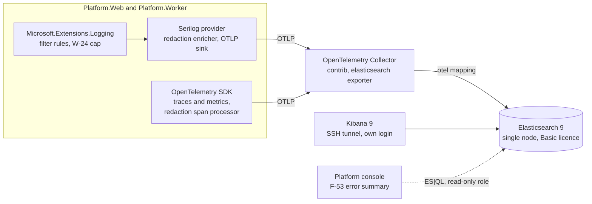

# ADR-0014: Send logs, traces and metrics through the OpenTelemetry Collector to Elasticsearch and Kibana, with Serilog as a logging provider and no Sentry

Date: 2026-10-01
Status: Accepted 2026-10-01 (the user answered the W-10 questions Q1 to Q8 and chose the backend)
Deciders: Ahmed Assaf
Related: W-10, W-19, W-24, F-51, F-53, F-60, N-01, N-08, N-10; spec `docs/superpowers/specs/2026-09-30-observability-design.md` (O-1 to O-26, section 11), plan `docs/superpowers/plans/2026-09-30-observability.md`; supersedes in part ADR-0006 (its Loki, Tempo and Grafana parts) and admin spec D-18

## Context

The docs/02 stack row named Serilog, Prometheus, Grafana, Loki, Tempo and self-hosted Sentry, and ADR-0006 had the platform console read Loki and Tempo with Grafana beside it. The W-10 spec, drafted on 2026-09-30, proposed dropping Serilog and Sentry and keeping Loki, Tempo, Prometheus and Grafana, and left eight questions to the user. W-24's N-10 protection depends on `Microsoft.Extensions.Logging` filter rules staying in force, self-hosted Sentry does not fit the pilot VM, and Sentry SaaS stores data outside the Kingdom (N-01). The user answered on 2026-10-01.

## Decision

1. Logs go through Serilog, registered only as a `Microsoft.Extensions.Logging` provider: a `SerilogLoggerProvider` registered directly (`ILoggingBuilder.AddSerilog` would add a provider-specific Trace rule overriding the configured levels); `UseSerilog()` and `services.AddSerilog()` are never used, because they replace the logger factory and would bypass W-24's filter rules. Serilog's minimum level is Verbose so the MEL rules stay the only level gate; `Enrich.FromLogContext`; the sink is `Serilog.Sinks.OpenTelemetry`. Redaction is a Serilog enricher and destructuring policy. There is no OpenTelemetry log provider.
2. Traces and metrics go through the OpenTelemetry .NET SDK, with a redaction span processor.
3. Both hosts send OTLP to one OpenTelemetry Collector (contrib distribution), which writes logs, traces and metrics to Elasticsearch with the `elasticsearch` exporter in mapping mode `otel`. No Logstash.
4. Elasticsearch 9.x and Kibana 9.x, free Basic licence, self-hosted in the Saudi region beside the app: single node, 0 replicas, built-in security on, passwords in `infra/compose/.env` and the secret store (N-10), TLS off on the internal Compose network. Retention by index lifecycle policy: logs 30 days, traces 7 days, metrics 30 days.
5. Kibana is the one UI: log search, traces, error triage and the "WaslaBid usage" dashboard. On the pilot it is reached only through an SSH tunnel, with Kibana's own login for named platform-staff users. The console usage page links to it (`Observability:KibanaUrl`).
6. No Sentry or Sentry-protocol service in the pilot.
7. The F-53 error summary in the console queries Elasticsearch with ES|QL over HTTP under a read-only role.

## Consequences

- One store and one UI for logs, traces and metrics; a trace id from `X-Correlation-Id` finds both the logs and the trace in Kibana.
- The team keeps Serilog's enrichers and destructuring, and W-24's guard keeps working; a test pins that Serilog never replaces the logger factory.
- Memory: Elasticsearch 1.5 GB (768 MB heap) and the collector 256 MB always on, Kibana only while in use (Compose profile `kibana`; 768 MB planned, 1280 MB as built because 9.5.4 runs out of heap below that), against about 1.8 GB for the drafted Loki, Tempo, Prometheus and Grafana. To fit the 12 GB pilot VM the user also trimmed PostgreSQL to 1.5 GB and ClamAV to 2 GB (`ConcurrentDatabaseReload no`), about 9.3 GB steady and about 10.5 GB with Kibana up in all (spec section 9). Smoke 2026-10-02: Kibana's APM trace view shows no data for the OTel-native traces; logs and traces are found by trace id in Discover. Choosing between Elastic's collector components and ECS mapping is open for the user (spec O-4). W-19 now depends on W-10.
- Kibana single sign-on (OIDC or SAML) needs a paid Elastic licence; oauth2-proxy with the `waslabid-platform` realm is the later option when a third person needs access.
- Risk: Kibana's Observability views must read the OTel-native data the `otel` mapping writes; the smoke task (plan task 10) verifies it, and ECS mapping is the fallback.
- Licence: Elasticsearch and Kibana are offered under the Elastic License 2.0 and the AGPL; self-hosted internal use is what the user accepted, and the platform does not offer either as a service to customers.
- Error triage without Sentry's grouping and release tracking; GlitchTip in-Kingdom stays the later option if Kibana proves too weak.
- Elsewhere: docs/02 stack row, section 4.2 diagram and section 5 item 8; docs/03 diagram 9; docs/05 row 21; docs/09 W-10, W-19 and F-53; ADR-0006 carries a note; admin spec D-18 is marked superseded; the W-10 spec and plan are rewritten; plan task 7b renames the console's Grafana link to Kibana.

## Alternatives considered

| Option | Why not now |
|---|---|
| Loki, Tempo, Prometheus and Grafana, as drafted in the spec | Four stores and a separate UI to run; the user chose one store and one UI |
| Serilog writing directly to Elasticsearch (`Elastic.Serilog.Sinks`) | Logs would bypass the collector's buffering and attribute dropping, and traces and metrics would still need it |
| Logstash between the collector and Elasticsearch | Another JVM on the pilot VM, with nothing for it to transform that the collector cannot |
| Sentry SaaS | Event data stored outside the Kingdom (N-01) |
| Self-hosted Sentry | 16 GB minimum and about 40 containers; does not fit the pilot VM |
| GlitchTip (Sentry protocol, self-hosted) | Fits, but a second error UI beside Kibana; kept as the later option |
