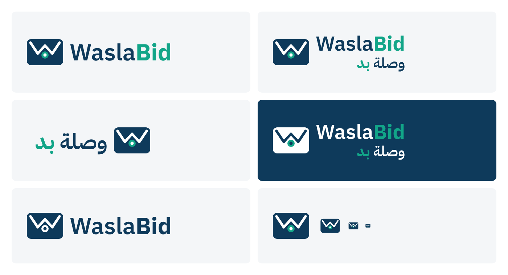

# WaslaBid Logo

Date: 2026-09-26. Status: first version, for review. Name decision: `docs/01-idea-competitors-features-ai.md` section 1.1.

## The mark

A sealed envelope whose flap is a **W**. The W stands for Wasla (وصلة, the link): two strokes meeting in the middle, buyer and vendor. The seal sits where they join, which is the product's core promise: the offer stays sealed until the opening (F-23). It is one shape, so it still reads at favicon size.

## Files

| File | Use |
|---|---|
| `waslabid-horizontal.svg` | Default English lockup: website header, slides, email signature. |
| `waslabid-bilingual.svg` | English over Arabic: contracts, invoices, proposals, anywhere both audiences read. |
| `waslabid-arabic.svg` | Arabic lockup, mark on the right: Arabic-only material. |
| `waslabid-bilingual-reversed.svg` | On navy or dark photos. |
| `waslabid-mono.svg` | One colour: stamps, fax, embossing, single-colour print. |
| `waslabid-icon.svg`, `waslabid-icon-512.png` | Mark alone: favicon, app icon, social avatar. |

All text is converted to outlines, so the SVGs need no font installed.

## Colours and type

| Token | Hex | Where |
|---|---|---|
| Navy | `#0E3A5B` | Envelope, "Wasla", "وصلة" |
| Teal | `#12A588` | Seal, "Bid", "بد" |
| White | `#FFFFFF` | Flap, reversed text |

Type: IBM Plex Sans Arabic (the product font, `docs/08-design-system.md`), SemiBold for Wasla, Bold for Bid. The Latin and Arabic halves come from one family, so they match in weight and height.

## Rules

- Always "WaslaBid", one word, capital B; the two-colour split carries the B even in lowercase contexts such as the domain.
- Clear space around the logo: at least the height of the seal on every side. Minimum size: mark 16 px wide on screen, logo 25 mm wide in print.
- Do not recolour the halves, stretch, add effects, or set the wordmark in another font.
- This is our brand as vendor of record. Tenant-facing screens, emails, and PDFs show the tenant's brand, not this logo (F-02, `docs/08-design-system.md` section 5).

## Rebuild

`pip install fonttools uharfbuzz`, then `python docs/brand/build.py`. It downloads the OFL fonts to `docs/brand/.fonts/` (git-ignored), writes every SVG, and renders `preview.png` and the 512 px icon with headless Chrome or Edge. Change the mark or colours in `build.py`, never by hand in the SVGs.

## Open

- A designer should review before any print run; this is a solid first version, not a final identity.
- The Arabic form بد reads as "budd" to an Arabic reader who does not know the English name (as in لا بد). If that proves confusing in customer conversations, the fallback is the Arabic descriptor "منصة وصلة للمناقصات" alone.
- Trademark search (SAIP) should cover the mark as a figurative element, not only the word.
