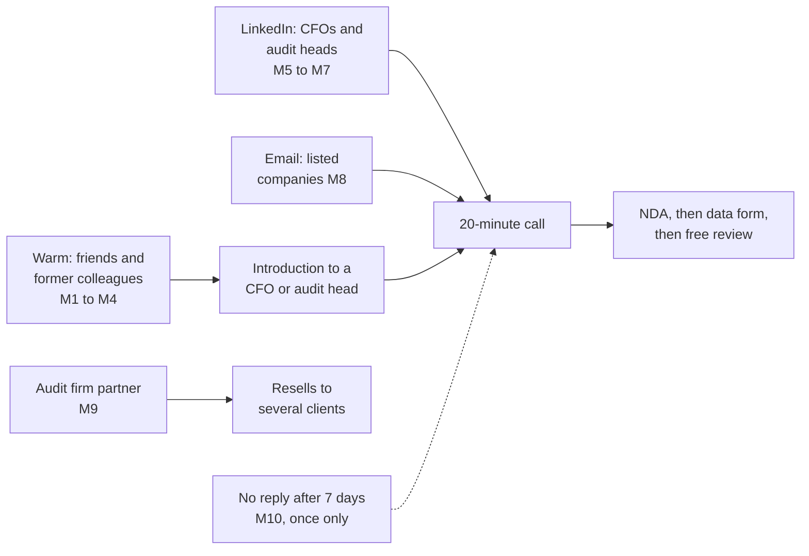

# First 10 outreach messages: procurement audit review

Date: 2026-09-27
Related: `audit-review-offer.pdf` (attach it only where a message says so), docs/15 (interview kit and tracker), docs/16 idea 7, `docs/legal/`

**How to use.** Replace everything in angle brackets and add one personal line, such as how you know them or something from their company. Send 2 or 3 a day, not all at once. Log each one in the Leads sheet of `docs/15-interview-tracker.xlsx` and put the message number (M1 to M10) in Notes. Offer the free review only while you have fewer than three reference customers, then switch to the paid price.

| # | To | Channel | Goal |
|---|---|---|---|
| M1 | Friend at a contracting company | WhatsApp | Introduction to their CFO or procurement head |
| M2 | Friend at a hospital or clinic group | WhatsApp | Introduction to finance or internal audit |
| M3 | Friend at any mid-size company | WhatsApp | Find out who owns purchasing controls |
| M4 | Former colleague now in finance | WhatsApp or call | A call with them directly |
| M5 | CFO or finance director | LinkedIn connection note | Get connected |
| M6 | CFO who accepted | LinkedIn message | Book 20 minutes |
| M7 | Head of internal audit | LinkedIn message | Book 20 minutes |
| M8 | Head of internal audit, listed or Nomu company | Email with the PDF | Book 20 minutes |
| M9 | Partner at a small or mid-size audit firm | Email or LinkedIn | Reseller conversation |
| M10 | Anyone who did not reply in 7 days | Same channel | One polite follow-up |

## M1. Friend at a contracting company (WhatsApp)

> السلام عليكم <الاسم>، أخبارك؟ بدأت مشروعاً جانبياً: نراجع مشتريات الشركات كاملة، مو عيّنة، ونطلع الملاحظات اللي تفوت المراجعة العادية، مثل الطلبات المجزأة تحت حد الاعتماد أو الفواتير المكررة. شركات المقاولات عندها مشتريات كثيرة من مقاولي الباطن والموردين، فأتوقع الفايدة عندكم واضحة. مين المسؤول عن المالية أو المشتريات عندكم؟ لو تعرّفني عليه أكون شاكر لك، وأول مراجعة مجانية.

> Hi <name>, how are you? I have started a side project: we review a company's purchasing in full, not a sample, and find what normal audits miss, such as orders split under an approval limit or invoices paid twice. Contracting companies buy a lot from subcontractors and suppliers, so I expect the value would be clear at yours. Who looks after finance or procurement there? I would be grateful for an introduction, and the first review is free.

## M2. Friend at a hospital or clinic group (WhatsApp)

> هلا <الاسم>، عساك بخير. عندي سؤال سريع: في مجموعتكم، مين يتابع ضوابط المشتريات، المدير المالي أو المراجعة الداخلية؟ أقدّم خدمة تفحص كل أوامر الشراء والفواتير لربع سنة وتطلع ملاحظات مرتبة بالمبالغ، مع ملف جاهز للجنة المراجعة. المستشفيات تشتري من موردين كثير، فعادةً تطلع ملاحظات مفيدة. أبغى ٢٠ دقيقة معه بس، والمراجعة الأولى علينا.

> Hi <name>, hope you are well. Quick question: in your group, who looks after purchasing controls, the CFO or internal audit? I offer a service that checks every purchase order and invoice for a quarter and ranks the findings by amount, with a file ready for the audit committee. Hospitals buy from many suppliers, so there are usually useful findings. I only need 20 minutes with them, and the first review is on us.

## M3. Friend at any mid-size company (WhatsApp)

> السلام عليكم <الاسم>، أبغى أستشيرك: في شركتكم، لو أحد يبغى يتكلم عن ضوابط المشتريات والفواتير، مين الشخص الصح؟ المدير المالي؟ المراجعة الداخلية؟ أشتغل على خدمة مراجعة مشتريات كاملة وأدور أول ثلاث شركات أجرّبها معهم مجاناً مقابل رأيهم. لو ما يناسب، عادي تماماً.

> Hi <name>, I would value your advice: at your company, if someone wanted to talk about purchasing and invoice controls, who is the right person? The CFO? Internal audit? I am working on a full purchasing review service and looking for the first three companies to try it free in return for their feedback. If it is not a fit, no problem at all.

## M4. Former colleague now in finance (WhatsApp or call)

> هلا <الاسم>، من زمان! شفت إنك صرت <المنصب> في <الشركة>، مبروك. أشتغل على شي قريب من شغلك: مراجعة ١٠٠٪ من المشتريات بدل العيّنة، مع ثمان فحوصات جاهزة للتجزئة والتكرار وتعارض المصالح. ودي آخذ رأيك كشخص مالي قبل أي أحد. تفضّل مكالمة ٢٠ دقيقة هالأسبوع أو قهوة؟

> Hi <name>, it has been a while! I saw you are now <title> at <company>, congratulations. I am working on something close to your work: reviewing 100% of purchasing instead of a sample, with eight ready-made checks for split orders, duplicates and conflicts of interest. I would like your view as a finance person before anyone else's. Would a 20-minute call this week or a coffee suit you?

## M5. CFO or finance director (LinkedIn connection note, under 300 characters)

> أستاذ <الاسم>، أعمل على مراجعة مشتريات الشركات بالكامل بدل العيّنة، وأتعلّم من المدراء الماليين في المملكة كيف يتابعون ضوابط الشراء. يسعدني التواصل معك.

> <Name>, I work on reviewing company purchasing in full rather than by sample, and I am learning from CFOs in the Kingdom how they keep purchasing controls in check. Glad to connect.

## M6. CFO who accepted (LinkedIn message)

> شكراً على قبول الدعوة أستاذ <الاسم>. باختصار: نفحص كل أوامر الشراء والفواتير لربع سنة بثمانية فحوصات، منها الطلبات المجزأة تحت حد الاعتماد، والفواتير المدفوعة مرتين، وتطابق حساب مورد مع حساب موظف، ونسلّم ملفاً مرتباً بالمبالغ يُعرض على لجنة المراجعة. نبحث عن أول ثلاث شركات نقدّم لها المراجعة مجاناً مقابل خطاب توصية، مع اتفاقية سرية قبل أي بيانات. هل يناسبك اتصال ٢٠ دقيقة الأسبوع القادم أعرض فيه مثالاً على بيانات وهمية؟

> Thank you for connecting, <name>. In short: we check every purchase order and invoice for a quarter with eight tests, including orders split under an approval limit, invoices paid twice, and a vendor's bank account matching a staff account, and deliver a file ranked by amount for the audit committee. We are looking for the first three companies to review free in return for a written reference, with an NDA before any data. Could we have a 20-minute call next week, where I show an example on fictional data?

## M7. Head of internal audit (LinkedIn message)

> أستاذ <الاسم>، تحية طيبة. أعرف أن مراجعة المشتريات تعتمد غالباً على عيّنة بسبب الوقت. بنينا فحوصات جاهزة تغطي ١٠٠٪ من أوامر الشراء والفواتير في ربع السنة، وتعطي فريقك قائمة ملاحظات مع الدليل لكل واحدة، وأنتم تقررون ما هو حقيقي. نقدّم المراجعة الأولى مجاناً لثلاث شركات مقابل رأيكم. هل ترى فائدة في ٢٠ دقيقة أعرض فيها مثالاً؟

> <Name>, greetings. I know purchasing reviews usually rely on a sample because of time. We built ready-made checks that cover 100% of a quarter's purchase orders and invoices, and give your team a list of findings with the evidence for each; you decide what is real. We offer the first review free to three companies in return for their feedback. Would 20 minutes to show you an example be useful?

## M8. Head of internal audit at a listed or Nomu company (email, attach the PDF)

Subject: مراجعة ١٠٠٪ من المشتريات لربع سنة، مجاناً لأول ثلاث شركات / 100% purchasing review for one quarter, free for the first three companies

> الأستاذ <الاسم> المحترم،
>
> تحية طيبة، وبعد،
>
> تُطالَب لجان المراجعة في الشركات المدرجة بالاطمئنان إلى ضوابط الشراء والصرف، بينما تعتمد المراجعة غالباً على عيّنة محدودة. نقدّم مراجعة تحليلية تفحص جميع أوامر الشراء والفواتير لربع سنة بثمانية فحوصات جاهزة، منها تجزئة الطلبات تحت حدود الاعتماد، والفواتير المكررة، وتطابق الحسابات البنكية للموردين مع حسابات الموظفين، والأسعار الشاذة.
>
> النتيجة ملف مراجعة مرتّب حسب المبالغ مع الدليل لكل ملاحظة، وجلسة ٣٠ دقيقة لشرحه. تتم المعالجة داخل المملكة فقط، وتُحذف البيانات بعد ٣٠ يوماً، ونوقّع اتفاقية سرية قبل استلام أي ملف. المرفق يوضّح الخدمة والأسعار.
>
> نقدّم المراجعة الأولى مجاناً لأول ثلاث شركات مقابل خطاب توصية. هل يناسبك اتصال لمدة ٢٠ دقيقة خلال الأسبوعين القادمين؟
>
> مع خالص التحية،
> <الاسم> · <الجوال>

> Dear <name>,
>
> Audit committees of listed companies must be comfortable with purchasing and payment controls, yet reviews usually rely on a limited sample. We offer an analytical review that checks every purchase order and invoice in a quarter with eight ready-made tests, including orders split under approval limits, duplicate invoices, vendor bank accounts matching staff accounts, and price outliers.
>
> You receive an audit file ranked by amount with the evidence for each finding, and a 30-minute walk-through. Processing is in Saudi Arabia only, data is deleted after 30 days, and we sign an NDA before receiving any file. The attachment explains the service and prices.
>
> The first review is free for the first three companies, in return for a written reference. Would a 20-minute call in the next two weeks suit you?
>
> Kind regards,
> <Name> · <Mobile>

## M9. Partner at a small or mid-size audit firm (email or LinkedIn)

> أستاذ <الاسم>، تحية طيبة. أتواصل معك لأن عملاء مكتبكم من الشركات المتوسطة يحتاجون غالباً اطمئناناً على ضوابط المشتريات، لكن الفحص الكامل مكلف يدوياً. عندنا أداة تفحص ١٠٠٪ من أوامر الشراء والفواتير بثمانية فحوصات، وتنتج ملفاً مرتباً بالمبالغ خلال أيام. أبحث عن مكتب شريك يقدّمها لعملائه تحت خدماته الاستشارية، مع هامش يُتفق عليه. هل يناسبك لقاء ٢٠ دقيقة أعرض فيه مثالاً على بيانات وهمية؟

> <Name>, greetings. I am reaching out because your firm's mid-size clients often need comfort on purchasing controls, but a full manual test is costly. We have a tool that checks 100% of purchase orders and invoices with eight tests and produces a file ranked by amount within days. I am looking for a partner firm to offer it to its clients as part of its advisory services, with an agreed margin. Could we meet for 20 minutes so I can show an example on fictional data?

## M10. Follow-up after 7 days with no reply (same channel, once only)

> أستاذ <الاسم>، أعرف أن وقتك مزدحم، فأختصر: لو كانت مراجعة المشتريات الكاملة غير مناسبة الآن، يكفيني ردّ بكلمة "لاحقاً" ولن أزعجك. ولو تحب تشوف مثالاً قصيراً، أرسل لك تقريراً تجريبياً على بيانات وهمية تطّلع عليه في وقتك.

> <Name>, I know your time is busy, so briefly: if a full purchasing review is not a fit right now, a one-word "later" is enough and I will not trouble you. If you would like a short example, I can send a sample report on fictional data to look at in your own time.

## Rules

- Personalise every message; never paste the same text to two people in one company.
- Arabic first. Use English only when their profile or company works in English.
- Attach the offer PDF only in M8, or after someone asks. Send the sample report only when asked, and only the fictional one.
- Stop after M10. Record "No reply" in the tracker and move on.
- Keep this separate from your employer: no employer clients, contacts or working hours.
