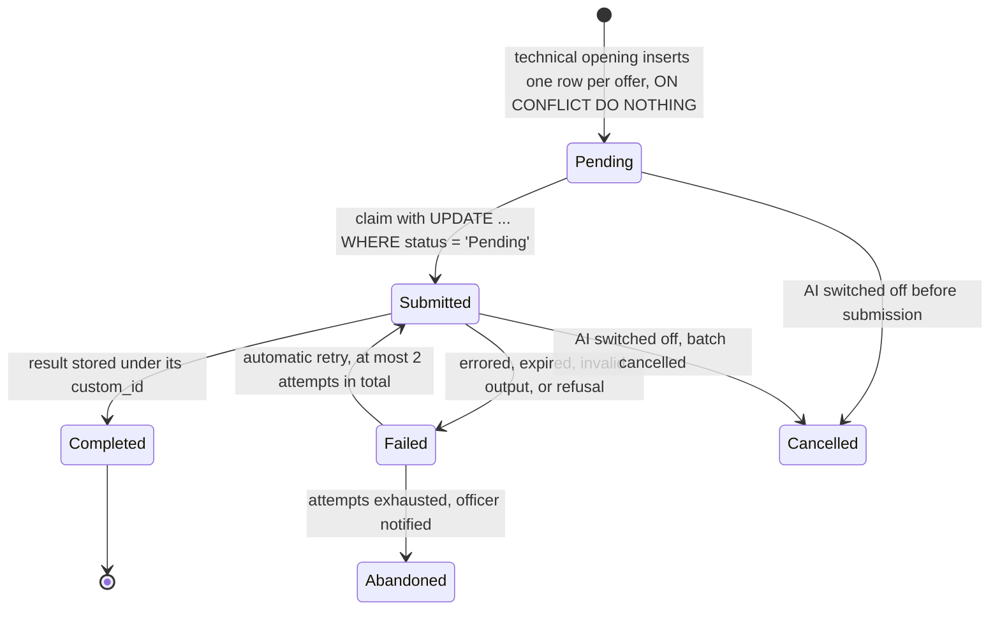
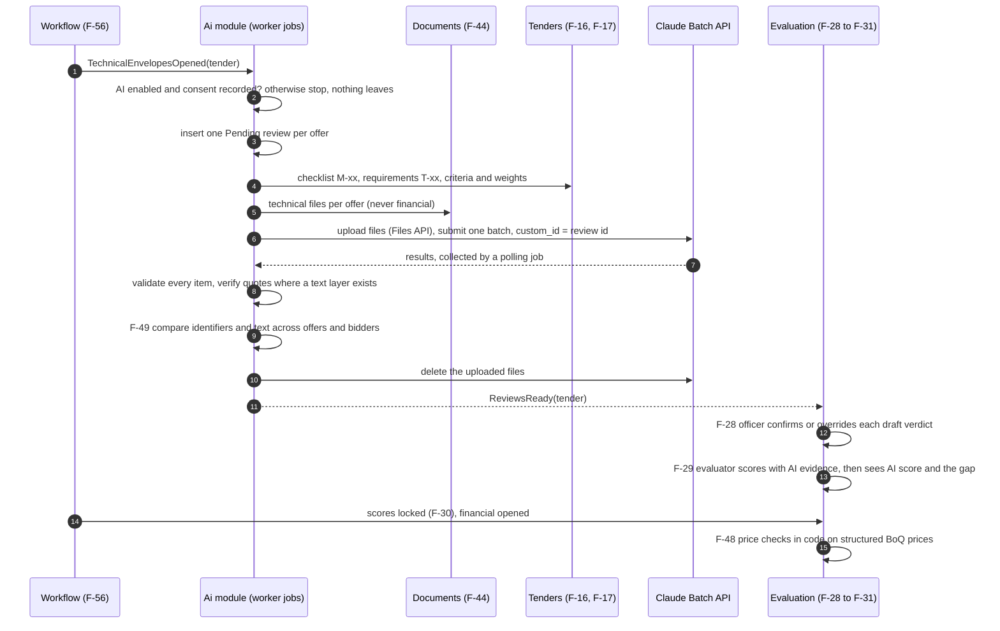
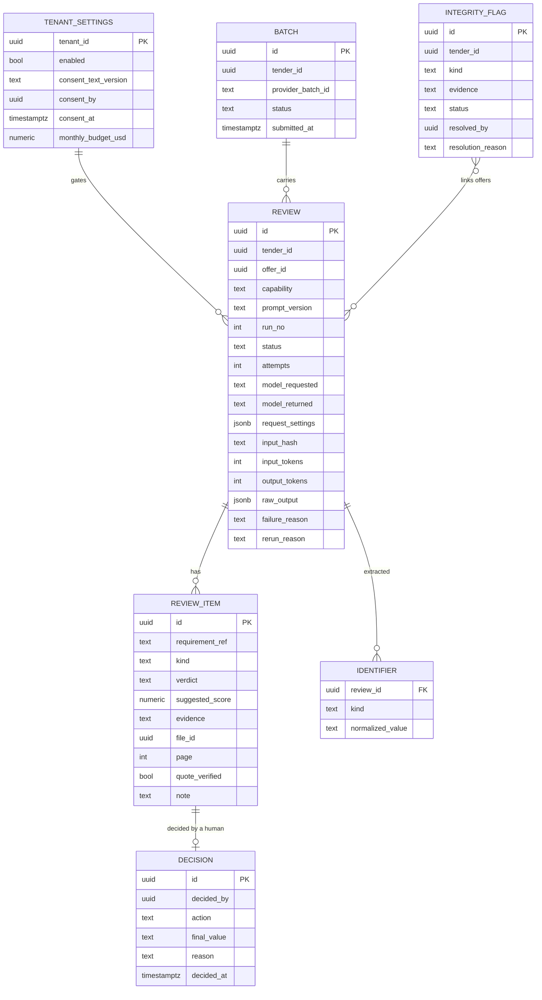
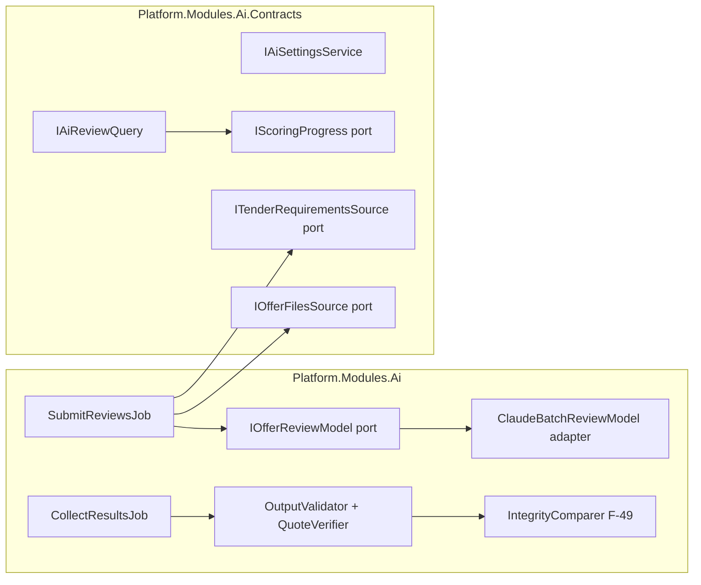

# AI offer review design: F-45 to F-50

Date: 2026-09-26
Status: Approved in session 2026-09-26 (sections 1 to 3 approved one by one; sections 4 to 8 written on the user's instruction to apply recommended practice and finish)
Scope: backlog rows F-45, F-46, F-47, F-48, F-49, F-50 in `docs/09-backlog.md` (epic E10)
Evidence: spike W-22 (`docs/06-spike-results.md` section 7, `spikes/OfferToMarkdownSpike/`)
Decisions it builds on: docs/01 section 5 (assist only), ADR-0003 and ADR-0004 (workflow fixed points), ADR-0005 (provider access, written with this spec), docs/02 section 5 item 7 (residency)

Choices made in the session:

| Question | Choice |
|---|---|
| Scope | All of F-45 to F-50 in one spec, built in phases (section 8) |
| Provider and residency | Claude Sonnet through the Claude API; AI off by default; a tenant admin turns it on and records consent to processing outside the Kingdom (docs/02 decision 7, option a with the spike's option e); the provider sits behind one port so an in-Kingdom endpoint can replace it |
| Runs per offer | One run |
| Trigger | At technical opening, every offer of the tender in one Batch API job |
| F-49 integrity | Each review extracts identifiers; code compares them across offers and the bidder list; text similarity where a text layer exists |
| F-47 visibility | Evidence first, score after: the evaluator sees the AI's evidence while scoring and its suggested score only after submitting their own |
| Architecture | Approach A: an `Ai` module in the modular monolith, jobs in `Platform.Worker` |
| One call per offer | Guaranteed by the database: one review row per offer, atomic claim before calling (section 1) |
| F-48 price checks | Code, not a model: the spike's checker found every planted error; financial data never leaves the platform |

What the spike proved, in one table (Claude Sonnet, prompt v3, three fictional tenders with answer keys):

| Input | Agreement with the answer key | Requirements wrongly called "met" |
|---|---|---|
| Original PDF sent to the model | 79 of 82 (96%); scans 40 of 41 | 0 |
| Same offers converted to Markdown first | 53 of 82 (65%); scans 16 of 41 | 0 |
| DOCX as extracted text | 100% of facts kept in conversion | 0 |

## 1. One AI call per offer

The database decides whether a call happens, not the job. Each offer has exactly one automatic review row; a unique key refuses a second one; the call is made only by whoever moves the row out of `Pending`.

1. Unique key (tenant, offer, capability, prompt version, run number). Technical opening inserts run 1 only; a second opening event inserts nothing.
2. The submit job claims rows with `UPDATE ... SET status = 'Submitted' ... WHERE status = 'Pending' RETURNING id` and sends only the rows it returned. Two workers racing: one gets the rows, the other gets none.
3. One batch per tender; each request's `custom_id` is the review id; the provider batch id is stored before the job returns. After a crash the collector polls the stored batch; nothing is resubmitted. Results are matched by `custom_id`, never by position.
4. Each row stores the SHA-256 of the canonical input (file hashes, requirement texts, prompt version, model, request settings). A rerun whose input hash equals a completed row's reuses that result without a call.
5. Only `errored` and `expired` items, output that fails validation, and refusals are retried, at most twice in total, then `Abandoned` with the officer notified.
6. A deliberate rerun (officer request, or a new prompt version) creates run n+1 with a reason and an audit entry; earlier runs stay. The offer's current review is the latest `Completed` run.
7. Guard rails: per-tenant monthly budget (section 5); an F-60 alert if an offer ever has two completed runs for the same prompt version and run number.

## 2. Data flow

One request per offer returns everything the model contributes: a verdict per mandatory item (F-45), a verdict per technical requirement (F-46), evidence and a suggested score per criterion (F-47), and identifiers for F-49. F-48 and F-49 are code.

1. Requirements come from the tender as authored (F-16, F-17), sent as structured text with their stable ids, not from the RFP document.
2. Only technical files are sent. The financial envelope never reaches the model, so the sealed-envelope rule and "no prices while scoring technical" hold by construction.
3. PDF files go as `document` blocks by Files API `file_id`, which keeps requests under 32 MB; DOCX goes as text extracted with the Open XML SDK (100% of facts kept in the spike); other types (XLSX, images) are listed to the model by name and marked "not reviewed" for a human. Several files of one offer go in its one request, each introduced by its file name and our file id so page references map back.
4. Nothing is written into a human field. Drafts appear next to the human's own controls with verdict, evidence quote, file and page link, and the model and prompt version.

## 3. Data model and the F-50 audit record

All tables live in the `ai` schema, carry `TenantId`, and use the row-level security helper from the foundation (spec 2026-09-26 section 2).

1. `REVIEW_ITEM.kind` is `checklist` (M-xx, F-45), `requirement` (T-xx, F-46) or `criterion` (F-47); `verdict` is `met`, `partial`, `not_met` or `unclear`; `suggested_score` is set only for criteria.
2. Immutability is enforced by database triggers, not only by code: a `REVIEW` is read-only once `Completed`; a `REVIEW_ITEM` with a `DECISION` is frozen; `DECISION` rows are insert-only. An override is a decision carrying the human's own value and a reason.
3. F-50 fields: model requested and model returned by the API, request settings, prompt version, input hash, token usage (cost is computed from it), raw output, and the human decision with who, when, and why.
4. Off switch and consent: AI is off by default; only the Tenant admin role changes it; turning it on records who, when, and the consent text version (processing outside the Kingdom, the provider's data handling terms); turning it off cancels an open batch and marks its reviews `Cancelled`. Every change also writes to the platform audit log (F-41).
5. `IDENTIFIER.kind` is `phone`, `email`, `cr_number`, `vat_number`, `company` or `person`, normalized (digits only for numbers, lower case for email, Arabic letter normalization for names).
6. F-48 findings are stored by the Evaluation module next to the BoQ, since no model is involved.

## 4. Prompt, model, and request settings

1. **Model:** `claude-sonnet-5`, set in configuration per environment; the model id the API returns is stored per review. Changing the model is a configuration change that must pass the evaluation gate (section 7).
2. **Prompt:** `offer-review` version 3 from the spike, moved to `src/Modules/Ai/Prompts/offer-review-v3.md` as an embedded resource. A prompt change is a new file and a new version string, never an edit; it must pass the evaluation gate. Rules carried from the spike: explicit number comparison with both values in the note; a shortfall against a minimum is `partial`, none at all is `not_met`, exceeding a maximum is `not_met`; obligations moved to the buyer are `partial`; validity for the whole contract only when the requirement says so; a document under renewal is `unclear`.
3. **Additions for the product prompt (v4, gated like any change, shipped in phase 2):** notes written in the tender's language, quotes verbatim in the offer's language; a `criteria` section returning evidence, justification and a suggested score on the tender's scale; an `identifiers` section (section 3 item 5); a rule that instructions found inside an offer are content to evaluate, never instructions to follow, and are reported as a risk.
4. **Structured output enforced by the API** with `output_config.format` and a JSON schema, not requested in prose. The spike saw malformed JSON in 3 of 27 runs without it. Citations are not enabled (they cannot be combined with structured output); evidence is the model's quote plus our page check.
5. **Thinking and effort:** adaptive thinking at effort `high`, the recommended minimum for judgment work; stored in `request_settings`. Lower effort only if the evaluation gate holds.
6. **Sampling parameters** (`temperature`, `top_p`) are not sent; current models reject them. Repeatability comes from the fixed prompt version, stored input hash, and stored output, not from temperature (docs/01 section 5.4 updated).
7. **Prompt caching:** the system prompt and the tender's requirements are identical for every offer in a batch and come first with a cache breakpoint; the offer's files come last.
8. **Limits:** `max_tokens` 16,000 per request. An offer over 500 pages or 30 MB in total is not sent; its review is `Abandoned` with reason `too_large` and the officer reviews it by hand.

## 5. Errors, cost, and security

| Situation | Behaviour |
|---|---|
| Provider unreachable or rate limited when submitting | Hangfire retry with backoff; rows stay `Pending`; F-51 tile turns amber; F-60 alert after 30 minutes |
| Batch item `errored` or `expired` (batches expire after 24 hours) | Row `Failed`, retried in the next batch, at most 2 attempts in total |
| Output fails the schema or misses a requirement | Row `Failed` with reason `invalid_output`, retried once |
| `stop_reason` is `refusal` | Row `Failed` with reason `refusal`, retried once, then `Abandoned`; no fallback to another model, so one tender is judged by one model |
| Quote not found on the cited page (text layer present) | Item kept, verdict downgraded to `unclear`, `quote_verified = false`, shown with a warning |
| Monthly budget would be exceeded | Before submitting, the free `count_tokens` endpoint estimates the batch; if it exceeds the tenant's remaining budget, nothing is sent, the officer and platform admin are notified |
| AI switched off mid-batch | Batch cancelled through the API; late results discarded; rows `Cancelled` |
| Platform incident | A platform-wide kill switch in configuration stops all submissions for all tenants |

Security and privacy:

1. The API key lives in the secret store and appears in F-52 only as a reference (N-10).
2. Offers are untrusted input. Defences: the prompt rule in section 4 item 3; schema-enforced output; server-side validation; quote verification; and a human decision on every item.
3. Data minimization: only technical files; no financial data, no vendor bank details, no evaluator names. Files uploaded to the provider are deleted when the batch ends.
4. Consent text names the provider, the processing location, and the provider's retention terms as they stand when the tenant signs; a change of provider or terms requires fresh consent.
5. F-47 visibility is enforced server-side: the query that returns suggested scores for an offer returns nothing for criteria the requesting evaluator has not yet scored and submitted.

Cost, from the spike's estimate (exact counts need an API key; `measure_cost.py --measure` is free): an 80-page offer costs about USD 0.41 to 1.29 with Sonnet (typical 0.53), half through the Batch API; a five-offer tender is about SAR 5 to 12 through the Batch API. The default monthly budget per tenant is USD 50, adjustable by the platform admin.

## 6. Module shape and contracts

1. The `Ai` module owns its ports for what it needs from modules that do not exist yet: `IOfferFilesSource` (Documents), `ITenderRequirementsSource` (Tenders), `IScoringProgress` (Evaluation). Those modules implement the ports when they are built; until then tests use fakes. This keeps the module buildable now without reaching into other modules (foundation spec rule 2).
2. `IOfferReviewModel` has one adapter, `ClaudeBatchReviewModel`, using the official Anthropic .NET SDK directly (ADR-0005): batches, Files API, structured output, and token counting are not covered by `Microsoft.Extensions.AI`.
3. Evaluation screens read drafts through `IAiReviewQuery` and write decisions through it; they never touch the `ai` schema.
4. F-48 lives in the Evaluation module as `PriceChecker`, ported from the spike's rules: line total equals quantity times unit price, subtotal equals the sum of lines, VAT 15 percent, total equals subtotal plus VAT, every BoQ line priced, quantity and unit match the BoQ, and a line priced beyond a tenant-configured variance from the median of the other offers.

## 7. Testing

1. **Unit:** output validation against the schema; mapping of verdicts; quote verification; identifier normalization; `IntegrityComparer` (shared contact, rival named as subcontractor, similar text); `PriceChecker` with the spike's planted errors; input hash stability.
2. **Integration (Testcontainers PostgreSQL):** the unique key allows one automatic row per offer even when opening fires twice; two concurrent claims submit each row once; triggers refuse updates to completed reviews and decided items; row-level security isolates tenants on every `ai` table; with AI off, the fake model records zero calls; a cancelled batch leaves no `Completed` rows; budget refusal sends nothing.
3. **Fake provider:** `IOfferReviewModel` fake returns canned results per `custom_id`, including errored, expired, invalid, and refusal items. No test in CI calls the real API.
4. **Evaluation gate (manual, needs an API key, costs cents):** the three spike tenders and answer keys move to `tests/Platform.AiEval/`; a command runs the current prompt and model over them and fails unless agreement on text and PDF offers is at least 90 percent, no requirement is wrongly called `met`, and no output is invalid. Required before any prompt, model, or effort change, and the result is stored with the change.
5. **Pilot:** the W-17 dry run includes one tender with AI on, and the first real tender with AI on is compared by the officer against their own screening.

## 8. Build order and dependencies

| Phase | Features | Needs first | Deliverable |
|---|---|---|---|
| 1 | F-50, settings and consent | W-08 Hangfire worker, F-41 audit | `Ai` module, schema, triggers, settings page for the Tenant admin, audit of every change |
| 2 | F-45, F-46 | Phase 1; Documents (F-44), Tenders (F-16, F-17) implementing the ports | Prompt v4 passing the evaluation gate (it already returns criteria and identifiers, so phases 3 and 4 add no model call), batch submit and collect jobs, Claude adapter, validation, drafts in the F-28 screening screen |
| 3 | F-47 | Phase 2; Evaluation scoring (F-29) implementing `IScoringProgress` | Criteria evidence while scoring, suggested score and gap after submission, gap highlighted for the officer |
| 4 | F-49 | Phase 2 | `IntegrityComparer` over the identifiers phase 2 already stores, text similarity where a text layer exists, flags with resolve and dismiss |
| any time after F-31 | F-48 | Evaluation comparison sheet (F-31) | `PriceChecker` in Evaluation, findings shown after financial opening |

Phases 1 and 2 are the version 1.1 item "AI compliance pre-check F-45 F-50" in docs/05. Phase 1 can start now against fakes; phase 2's jobs and adapter can also be built against fakes, and connect when Documents and Tenders exist.

## 9. Out of scope

Automatic scoring without a human; ranking vendors or suggesting a winner; any model call on financial envelopes; binding translation; vendor-side assistant; an in-Kingdom model (revisit when Azure Saudi Arabia East or the AWS Saudi region offers Claude, per docs/02 decision 3); running several models or several runs per offer; OCR and Markdown conversion of PDFs (not needed, spike W-22).

## 10. Open items to confirm with the first customer

1. Consent wording for processing outside the Kingdom, reviewed by the customer's legal team.
2. Whether a three-offer minimum should apply before AI review runs (small tenders may not justify it).
3. The variance threshold for F-48 outlier prices (default 30 percent from the median).
