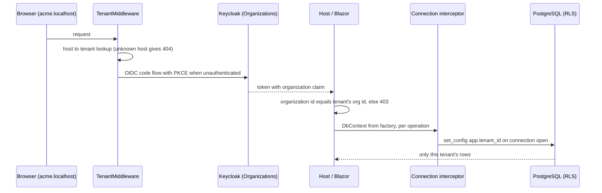
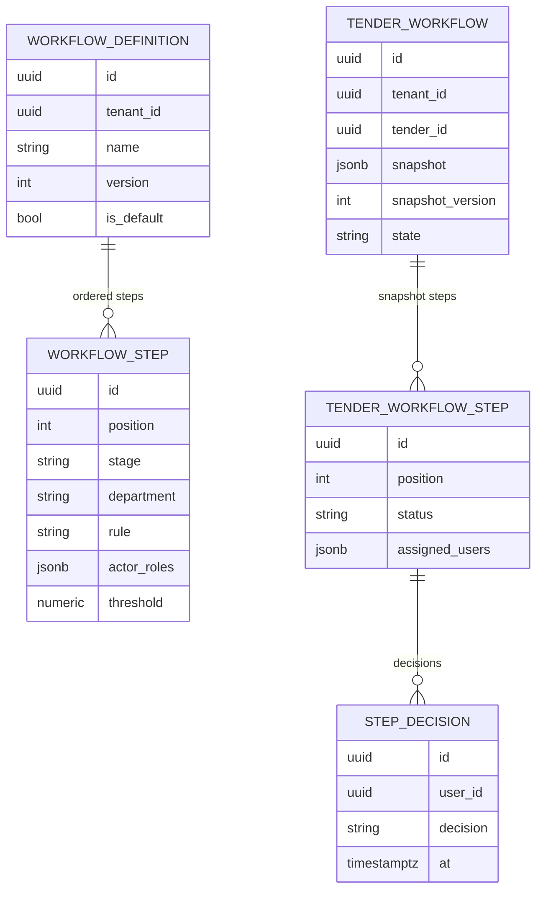

# Foundation slice design: W-02, W-03, W-04, W-05, W-07, F-56

Date: 2026-09-26
Status: Approved in the brainstorming session; awaiting written review
Scope: backlog rows W-02, W-03, W-04, W-05, W-07 and F-56 in `docs/09-backlog.md`
Decisions it builds on: ADR-0002 (Tailwind and `Platform.UI`), ADR-0003 (configurable workflow), ADR-0004 (own state machine), docs/06 (spike rules), docs/07 section 4 (local stack)

Choices made in the session:

| Question | Choice |
|---|---|
| SDK | .NET 10 (10.0.401 installed 2026-09-26); solution targets `net10.0` |
| Modules created now | Only those the slice uses: Tenancy, Identity, Workflow, Audit |
| Tenant resolution | Host name resolves the tenant; the token's Keycloak organization must match, otherwise 403 |
| Data access | One DbContext, schema and migration history per module; context per operation; connection interceptor sets the tenant; separate migrator |
| Standards | Where a recognised standard exists, use it without asking (user instruction, 2026-09-26) |

## 1. Solution layout (W-02)

```
ERP/
  global.json                      SDK 10.0.x, rollForward latestFeature
  Directory.Build.props            net10.0, Nullable, TreatWarningsAsErrors, AnalysisLevel latest-recommended, Deterministic
  Directory.Packages.props         central package management
  .editorconfig                    enforced by `dotnet format --verify-no-changes`
  WaslaBid.slnx
  src/
    Platform.Web/                  host: Blazor Web App (Interactive Server), minimal APIs,
                                   tenant middleware, OIDC, composition root
    Platform.Migrator/             console: applies every module's migrations as the owner role, seeds templates
    Platform.Shared/               TenantContext, ITenantAccessor, tenant connection interceptor,
                                   RLS migration helper, Result types, IClock
    Modules/
      Tenancy/   Platform.Modules.Tenancy + .Contracts     tenants, host names, branding record
      Identity/  Platform.Modules.Identity + .Contracts    Keycloak organization to tenant mapping, user lookup
      Workflow/  Platform.Modules.Workflow + .Contracts    definitions, snapshots, executor (ADR-0004)
      Audit/     Platform.Modules.Audit + .Contracts       append-only audit writer
    UI/
      Platform.UI/                 Tailwind tokens and build, layout, fonts, localisation resources
  tests/
    Platform.UnitTests/            xUnit v3 + Shouldly
    Platform.IntegrationTests/     xUnit v3 + Testcontainers (PostgreSQL, Keycloak) + WebApplicationFactory,
                                   architecture tests
```

Rules:

1. Each module is two projects. `.Contracts` holds public interfaces and records only. The module project holds everything else as `internal`.
2. A module references other modules' `.Contracts` projects only. `Platform.Web` and `Platform.Migrator` are the only projects that reference module implementation projects, each through one `AddXxxModule()` or `ApplyXxxMigrations()` entry point.
3. Each module owns one PostgreSQL schema (`tenancy`, `identity`, `workflow`, `audit`) and never queries another schema.
4. An architecture test fails if a module project references another module's implementation project, or if a public type exists in a module project outside its entry-point class.
5. Workflow is its own module, not part of Evaluation as docs/02 section 4.5 listed: ADR-0004 makes the executor a reusable engine that Evaluation and later modules call through `IWorkflowService`. Update docs/02 section 4.5 in the same pull request as W-02.

Deliberately not created now: `Platform.Worker` (arrives with W-08 Hangfire), `Platform.UITests` (arrives with W-06 components), and the six other modules (each arrives with the first slice that needs it).

W-02 acceptance: `dotnet build -warnaserror` and `dotnet test` succeed with at least one test per module project, and the architecture test passes.

## 2. Tenant, identity and row-level security (W-03, W-04)



### 2.1 Resolution

- `TenantMiddleware` reads the host, looks it up in `tenancy.tenant_hosts` through a 60-second in-memory cache, and sets `TenantContext` (tenant id, Keycloak organization id, default culture, branding). An unknown host returns 404 before authentication.
- `tenancy.tenants` and `tenancy.tenant_hosts` are platform-level tables, the one deliberate exception to the RLS rule: they carry no `tenant_id` policy, and access is limited by grants instead (`erp_app` reads only the current tenant's row through Tenancy's service, which filters by id).
- The lookup runs as the `tenant_resolver` database role, which can select only `host`, `tenant_id` and `keycloak_org_id` from that table. It is the only query that runs without a tenant set.
- After authentication, an authorization policy `SameTenant` compares the token's organization id with `TenantContext.KeycloakOrgId`; a mismatch returns 403 and writes an audit row with the attempted host.
- In Blazor circuits the tenant is captured when the circuit starts and served by a scoped `ITenantAccessor`. No tenant state is static.

### 2.2 Row-level security

- Every tenant-owned table has `tenant_id uuid not null` and an index that starts with it.
- The migration helper `migrationBuilder.EnableTenantRls("schema", "table")` issues `ENABLE ROW LEVEL SECURITY`, `FORCE ROW LEVEL SECURITY`, and the policy `USING (tenant_id = current_setting('app.tenant_id', true)::uuid) WITH CHECK (same)`. With no tenant set the setting is NULL, so zero rows return and inserts fail.
- `TenantConnectionInterceptor` (a `DbConnectionInterceptor`) runs `select set_config('app.tenant_id', @id, false)` in `ConnectionOpened` and `ConnectionOpenedAsync`. Npgsql's default reset on close clears it when the connection returns to the pool. If no tenant is available the interceptor sets nothing, and RLS returns zero rows.
- EF global query filters mirror the rule for readable failures; the database is the enforcing layer.
- DbContexts are created through `IDbContextFactory<T>` per operation and disposed immediately. No context lives for the life of a circuit.

Roles. `erp` and `erp_app` already exist from `infra/compose/postgres/init/01-databases.sql`; that script's default privileges cover only the `public` schema, so the migrator grants rights on each module schema it creates and creates `tenant_resolver`:

| Role | Used by | Rights |
|---|---|---|
| `erp` | Platform.Migrator | owns the schemas, runs DDL |
| `erp_app` | Platform.Web | DML on module tables; not a superuser, no BYPASSRLS; INSERT and SELECT only on `audit.events` |
| `tenant_resolver` | TenantMiddleware lookup | SELECT on three columns of `tenancy.tenant_hosts` |

### 2.3 Keycloak

- `infra/compose/keycloak/import/waslabid-realm.json`: realm `waslabid`, Organizations enabled, confidential client `waslabid-web` (authorization code with PKCE, redirect URIs for `https://*.localhost:8443/*` and `http://localhost:5273/*`), an organization membership mapper that puts the organization id and alias in the access and id tokens, organizations `acme` and `beta` with one admin user each, and a `locale` claim.
- The host uses the standard ASP.NET Core OpenID Connect handler with cookie sign-in. The client secret comes from user secrets locally and never from source (N-10).
- Only staff users are modelled. The vendor identity model is an open decision (docs/02 section 5) and is not touched by this slice.

### 2.4 Acceptance tests

1. Tenant A authenticated, EF query: only A's rows.
2. Same query as raw SQL through `erp_app`: only A's rows.
3. No tenant set: zero rows, and an insert fails.
4. Pool reuse: A's connection returns to the pool, B opens one, B sees none of A's rows.
5. Testcontainers Keycloak imports the realm; a login for `acme` yields a token whose organization maps to the `acme` `TenantContext`.
6. A `beta` token used on host `acme` returns 403 and writes an audit row.

## 3. Tailwind build and localisation (W-05, W-07)

### 3.1 Tailwind

- The Tailwind v4 standalone CLI, pinned by version and SHA-256, is downloaded by an MSBuild target in `Platform.UI` into `.tools/` (git-ignored) and runs before build. No Node.js.
- Source `Platform.UI/Styles/app.css` holds the `@theme` tokens from docs/08. Output is `Platform.UI/wwwroot/css/app.css`, served as a static web asset.
- IBM Plex Sans Arabic and Noto Sans are self-hosted under `wwwroot/fonts` with `font-display: swap`.
- White-label colour: the layout writes `--brand-primary` and related variables inline from the tenant's branding record, and the `@theme` tokens reference them. A tenant's colour needs no rebuild.
- Physical-utility lint: a unit test scans `.razor`, `.cs` and `.css` files under `src/` for physical direction utilities (`ml-`, `mr-`, `pl-`, `pr-`, `left-`, `right-`, `text-left`, `text-right`, `rounded-l-`, `rounded-r-`, `border-l-`, `border-r-`, `float-left`, `float-right`) and fails naming file and line.

W-05 acceptance: a `.razor` file containing `ml-4` fails the lint with its file and line; the built CSS contains `--color-primary` as a CSS variable.

### 3.2 Localisation

- `IStringLocalizer<SharedResource>` with `Platform.UI/Resources/SharedResource.ar-SA.resx` and `SharedResource.en-US.resx`.
- Culture order: the token's `locale` claim, then the `.AspNetCore.Culture` cookie, then the tenant's default culture, then `ar-SA`.
- `App.razor` renders `<html lang="@lang" dir="@dir">` from the current UI culture.
- `/culture/set?culture=&returnUrl=` writes the cookie and redirects with a local-URL check.
- A unit test fails if either resource file has a key the other lacks.

W-07 acceptance: with the profile set to Arabic, every page renders `<html lang="ar" dir="rtl">` and no visible string falls back to an English key.

## 4. Configurable workflow (F-56, ADR-0004)



All five tables are in schema `workflow`, carry `tenant_id`, and have RLS enabled.

### 4.1 Model

- **Stages** are a fixed enum in system order: `Screening`, `TechnicalScoring`, `LockScores`, `FinancialOpening`, `Approval`, `Award`. `LockScores` and `FinancialOpening` are system stages with no actors. A definition decides who acts within the human stages; it cannot reorder stages or omit `LockScores` or `FinancialOpening`.
- **Step:** position, stage, department label, rule (`AnyOf` or `AllOf`), actor roles, optional amount threshold (used by F-09 later; stored now, not evaluated).
- **Snapshot:** at publishing, the definition and its steps are serialised to our own versioned JSON (`snapshot_version` = 1) on `tender_workflow`, and one `tender_workflow_step` row per step is created with the users assigned from the tender's committee. The executor reads only the snapshot and the step rows.

### 4.2 Validator

`DefinitionValidator` runs on save and on publish and returns every broken rule by name:

- stages appear in system order;
- `LockScores` and `FinancialOpening` are present, `LockScores` first;
- every human step has at least one actor role;
- an `AllOf` step has at least one actor.

Example message: "Financial opening must follow score locking (F-30)."

### 4.3 Executor

`IWorkflowService` in `Platform.Modules.Workflow.Contracts`:

| Operation | Behaviour |
|---|---|
| `StartAsync(tenderId, definitionId, assignments)` | validates, snapshots, creates step rows, opens the first step |
| `DecideAsync(tenderId, userId, decision)` | records the decision on the open step; `AnyOf` completes on the first approval; `AllOf` stays open until all assigned users approve; a rejection completes the step as Rejected |
| `CompleteSystemStageAsync(tenderId, stage)` | called by the owning domain module when scores are locked or envelopes opened; refuses if the stage is not the current one |
| `GetStatusAsync(tenderId)` | current step, pending users, history |

- A decision from a user who is not assigned to the open step returns `Refused`, writes an audit row, and changes no state (docs/06 section 6.3 finding 1).
- Concurrency: `tender_workflow` uses PostgreSQL `xmin` as the EF concurrency token; a lost race returns `Conflict` and the caller retries.
- The executor never reads tender data. Until the Tenders module exists, tests pass a generated `tenderId`.

### 4.4 Audit

- `audit.events`: id, tenant_id, occurred_at, actor_id, action, subject_type, subject_id, data (jsonb). RLS on.
- `IAuditWriter` in `Platform.Modules.Audit.Contracts`. Workflow writes one event per transition and per refusal.
- `erp_app` has INSERT and SELECT only; UPDATE and DELETE are not granted, so the log is append-only at the database level (F-41 basis).

### 4.5 Default template

Seeded per tenant by `Platform.Migrator`: contracts screening (`Screening`, AnyOf, role `contracts`), technical evaluators (`TechnicalScoring`, AllOf, role `evaluator`), score locking, financial opening, finance approver (`Approval`, AnyOf, role `finance`). No editor screen in the pilot (F-56b follows in version 1.1).

### 4.6 Acceptance tests (docs/09 F-56)

1. Publishing with the default template stores a snapshot and assigned users fill the steps.
2. Editing the definition afterwards leaves the running tender's snapshot and steps unchanged.
3. Saving a definition with financial opening before score locking is rejected with the rule named.
4. An AllOf step with two approvers stays open after one approval, and the status names the pending user.
5. A decision from an unassigned user is refused, audited, and the step stays open.

## 5. Errors and testing

- Operations return `Result<T>` with typed errors `NotFound`, `Refused`, `InvariantViolated`, `Conflict`, `Validation`. `Platform.Web` maps them to 404, 403, 409, 409 and 400 with RFC 9457 problem details. Exceptions are for defects and infrastructure failures only; they are logged and never swallowed.
- Tests are written before the code they cover (docs/07). Unit tests: validator, executor transitions, tenant resolution, resource parity, physical-utility lint, architecture rules. Integration tests: the six RLS and Keycloak cases in 2.4, migrations applying to an empty database, and the five F-56 cases in 4.6 against real PostgreSQL.
- Integration tests use Testcontainers images that match `infra/compose/docker-compose.yml` versions.

Done when:

- every acceptance line in docs/09 for W-02, W-03, W-04, W-05, W-07 and F-56 has a named test;
- `dotnet build -warnaserror` and `dotnet test` are green;
- `https://acme.localhost:8443` through Caddy, signed in as the seeded `acme` admin, shows a page in Arabic, right to left, in the tenant's colour;
- docs/02 section 4.5 shows the Workflow module and the two-project module rule, and docs/09 rows move to Done in the same pull requests.

## 6. Out of scope for this slice

Hangfire and deadlines (W-08), CI workflow (W-09), `Platform.UI` components and gallery (W-06), tenant provisioning screen (F-01 is by script later), vendor accounts, the workflow editor (F-56b), threshold evaluation (F-09), Worker host, production Caddyfile and Kubernetes.
