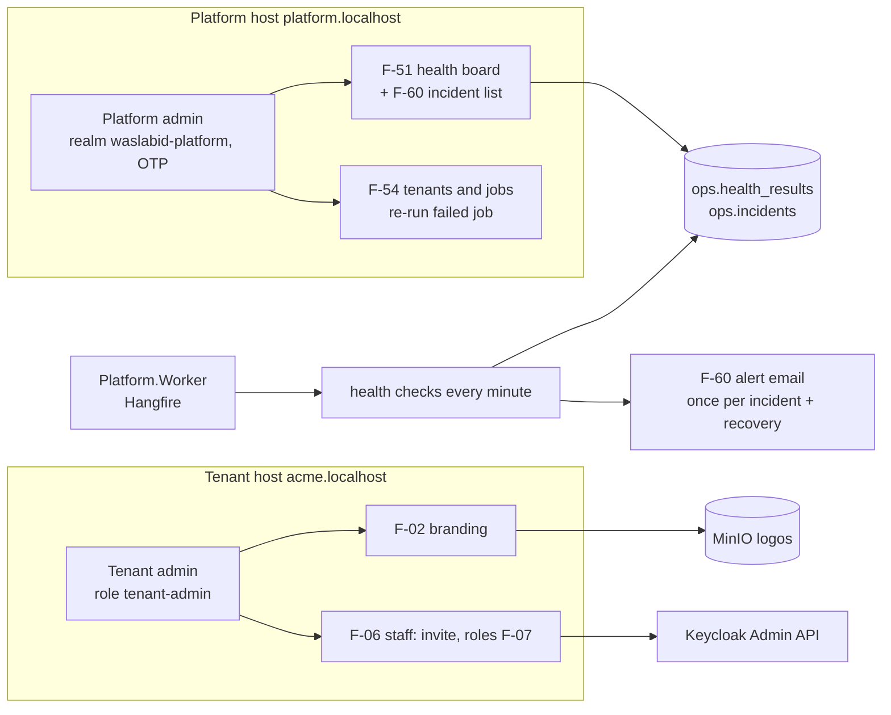

# Admin UI slice design: platform console and tenant administration

Date: 2026-09-27
Status: Written overnight on the user's instruction ("I need admin UI"; "use best practice recommendation standards"); **decisions marked D-n in section 1 were taken without the user and need confirmation**
Builds on: the foundation slice (`2026-09-26-foundation-design.md`, branch `foundation`)
Backlog rows: W-06 (components, admin subset), W-08 (Hangfire and worker), W-10 (health endpoints only), F-02, F-06, F-07, F-51, F-54, F-60, all with the MVP narrowing in `docs/05-mvp-scope.md` rows 2, 3, 4, 17, 18, 19

## 1. Decisions to confirm

| # | Decision | Chosen default | Why | Alternative |
|---|---|---|---|---|
| D-1 | Where platform admins sign in | A second Keycloak realm, `waslabid-platform`, with OTP required for every user; the platform console lives on host `platform.localhost` (production: `platform.<domain>`) | Platform staff never share a realm, session or organization with tenant users; MFA is enforced by the realm, not by app code | Same realm with a `platform-admin` role and step-up OTP |
| D-2 | How the app proves MFA | Keycloak's `acr` claim, mapped so that an OTP login yields level `2`; the console requires `acr >= 2` | Standard OIDC signal; a password-only session cannot open the console even if realm config drifts | Trust the realm configuration alone |
| D-3 | Where tenant roles live | Our table `identity.members (tenant_id, user_id, roles text[])` with RLS; Keycloak holds identity and organization membership only | Keycloak organizations have no organization-scoped roles; a user may hold different roles in two tenants later (F-10) | Keycloak client roles per tenant (does not scale per tenant) |
| D-4 | How invitations work | The app calls the Keycloak Admin API with a confidential service-account client `waslabid-admin-api`: create user (or find by email), add to the organization, send the `execute-actions-email` with `UPDATE_PASSWORD` and `CONFIGURE_TOTP`; Keycloak sends the email through the Compose SMTP (Mailpit) | Keycloak owns passwords and TOTP enrolment; we never see a password | Our own invitation tokens and password pages |
| D-5 | TOTP lockout (F-06: three wrong codes, fifteen minutes) | Keycloak brute-force detection on the tenant realm: `failureFactor 3`, `waitIncrementSeconds 900`, `maxFailureWaitSeconds 900`, temporary lockout | Built in and tested by Keycloak; the lockout event reaches our audit through the admin events API later (W-28) | Custom authenticator |
| D-6 | Worker process | New host `Platform.Worker` running the Hangfire server with PostgreSQL storage (schema `hangfire`); the web host only enqueues | docs/02 section 4.5 layout; a job crash never takes the web host down | Hangfire server inside the web host for the pilot |
| D-7 | Health checks | ASP.NET Core health checks in the worker, run by a Hangfire recurring job every minute, results stored in `ops.health_results`; the board reads the latest row per component. Components (docs/05 row 17): web host, worker, PostgreSQL, object storage (MinIO), Keycloak, ClamAV, email (SMTP) | One scheduler, results survive restarts, the board never probes on request | Probe live on page load |
| D-8 | Platform audit | New append-only table `ops.platform_audit` (no tenant_id), same grant pattern as `audit.events` | Platform actions such as "re-ran a job for tenant X" are not tenant events and must not be visible in the tenant's log | Reuse `audit.events` with a platform tenant id |
| D-9 | Branding writes | Security-definer function `tenancy.update_branding(...)` that only updates the row whose id equals `platform.current_tenant()`; logos stored in MinIO under `tenants/{tenantId}/branding/logo-{hash}.{ext}` and served through the app with cache headers | `tenancy.tenants` stays unwritable by `erp_app` (foundation rule); a tenant can only brand itself | Grant UPDATE on two columns |
| D-10 | Logo upload path | A plain authenticated `POST /admin/branding/logo` multipart endpoint (PNG or JPEG, at most 512 KB), re-encoded server-side to PNG with SkiaSharp (MIT licence; ImageSharp's licence needs a commercial tier above USD 1M revenue), not the Blazor circuit | ADR-0001 keeps files off the circuit; logos are small so chunking is unnecessary; re-encoding strips metadata and anything hidden in the file | Chunked upload (ADR-0001 path) |
| D-11 | Colour contrast (F-02) | On save, if the colour's contrast with white is under 4.5:1, darken it in HSL lightness steps until it passes, store the adjusted value, and show both to the admin | docs/09 F-02 acceptance | Reject the colour |
| D-12 | Active tenders and storage columns (F-54) | "Active tenders" shows a dash until the Tenders module exists (it provides `ITenderCounts` later); storage is the sum of object sizes under the tenant prefix, cached for ten minutes | No fake numbers | Hide the columns |
| D-13 | Email library | MailKit for our own alert emails (F-60) | Maintained, standard, async | `System.Net.Mail.SmtpClient` (obsolete for new code) |
| D-14 | SMS in F-60 | Not built (docs/05 row 19: email only) | MVP narrowing | — |

## 2. Scope

In: the components in section 5, the gallery page, the worker host with Hangfire, the operations module, the tenant admin pages, the platform console, and the Keycloak realm changes.

Out (later slices): tenant provisioning screen (F-01b), suspend and TLS actions (F-54 full), SMS (F-60 full), threshold screen, logs view (F-53), connections registry (F-52), auditor role, SSO (F-06b), vendor portal shell variant.

## 3. Platform console (F-51, F-54, F-60)

### 3.1 Host and access
- `PlatformHostMiddleware` runs before `TenantMiddleware`: when the host equals the configured `Platform:Host` (`platform.localhost` in Development), it marks the request as a platform request and `TenantMiddleware` does not run; tenant pages on the platform host return 404, and platform pages on a tenant host return 404 (docs/09 F-51: a tenant admin requesting the URL gets 404).
- Authentication on the platform host uses a second OIDC scheme `PlatformOidc` against realm `waslabid-platform`, with its own cookie `waslabid.platform`. Policy `PlatformAdmin`: authenticated with the platform scheme, realm role `platform-admin`, and `acr` level at least 2 (D-2).
- PlatformAdmin holds on every platform endpoint that is not explicitly anonymous (health, static assets, culture switch, sign-out), also where the endpoint names only a role or another policy: a middleware after `UseAuthorization` evaluates it. The platform cookie lives a fixed 15 minutes (no sliding). The platform realm has brute-force detection (temporary lockout after five failures) and the password policy `length(12) and notUsername and passwordHistory(5)`; its client requires PAR (`infra/compose/keycloak/import/README.md`).
- Sign-out: `POST /platform/sign-out` and `POST /account/sign-out`, antiforgery-validated, each clears only its own host's cookie and ends the session at its own realm, returning to `/platform` or `/`.
- Pages under `/platform/*` in `Platform.Web`, Interactive Server, rendered with the tenant-neutral WaslaBid brand (the platform is the vendor-of-record brand, CLAUDE.md).

### 3.2 Health board (F-51 as narrowed)
- Tile per component: status (Healthy, Degraded, Unhealthy), latency in ms, last check time, last failure time and text. Stale when the last check is older than 120 seconds (shown as Unknown).
- Components and checks: PostgreSQL (`select 1` as `erp_app`), object storage (MinIO bucket exists), Keycloak (`/health/ready` on the management port), ClamAV (`PING` on 3310 expects `PONG`), email (SMTP connect and `NOOP`), worker (Hangfire server heartbeat within 60 s), web host (its own `/health` probed from the worker).
- Failure text never contains a connection string, password, or token (N-10); a test asserts it with a deliberately wrong password.

### 3.3 Incidents and alerts (F-60 as narrowed)
- `ops.incidents (id, component, opened_at, closed_at, last_message, notified_open, notified_close)`. Opening rule: first failed check for a component with no open incident. Closing rule: first healthy check while open.
- Alerts: one email to `Platform:AlertRecipients` when an incident opens, one when it closes. Also: a Hangfire job that failed three times in a row, and disk usage above 80 percent (PostgreSQL data directory size against configured capacity is out of scope; check host disk of the worker volume). Deadline-closure alert waits for the Tenders module.
- The F-51 page lists incidents of the last 30 days with start, end and component.

### 3.4 Tenants and jobs (F-54 as narrowed)
- Table: tenant name, slug, status (active), user count (Keycloak organization members), active tenders (dash, D-12), storage used, failing jobs (Hangfire failed jobs whose `TenantId` parameter matches).
- Action: re-run a failed job, with a confirmation dialog naming the job and tenant; requeues the Hangfire job; writes `ops.platform_audit` with the admin, tenant and job id.
- Reading tenant rows needs a platform read path: security-definer function `tenancy.list_tenants()` executable by `erp_app`, called only from the platform module after the `PlatformAdmin` policy passed.

## 4. Tenant administration (F-02, F-06, F-07)

### 4.1 Roles (F-07)
- Roles: `tenant-admin`, `contracts-officer`, `technical-evaluator`, `finance-approver`.
- `identity.members` (D-3) with RLS; `IMemberDirectory` in Identity contracts: `GetRolesAsync(userId)`, `ListAsync()`, `SetRolesAsync(userId, roles)`.
- A claims transformation adds `role` claims from `identity.members` for the current tenant after the same-tenant check; policies `TenantAdmin`, `ContractsOfficer`, `TechnicalEvaluator`, `FinanceApprover` require the role and the same-tenant requirement. A user in the organization with no member row has no role and sees only the home page.
- The last tenant admin cannot remove their own admin role (refused, audited).
- Denials are audited once per user, host and path per minute (throttled, closes W-27's concern for this path).

### 4.2 Staff (F-06)
- `/admin/staff`: list members (name, email, roles, status: invited or active), invite by email with roles, change roles, resend invitation.
- Invite: Keycloak Admin API (D-4). The member row is created with status `invited` and the chosen roles; it turns `active` on first successful login (claims transformation sees the member).
- Lockout: realm brute-force settings (D-5); the acceptance test proves three wrong TOTP codes lock the account in the Keycloak Testcontainer.
- Development seed: `acme.admin` and `beta.admin` get `tenant-admin` member rows.

### 4.3 Branding (F-02)
- `/admin/branding`: portal name, primary colour (colour input plus hex field), logo upload with preview; save shows the adjusted colour when D-11 changed it.
- Logo: PNG or JPEG only in the pilot (SVG rejected; it can carry script), at most 512 KB and 1024 px on the long side, re-encoded server-side to PNG to strip metadata, stored per D-9, `logo_url` set to `/branding/logo/{hash}` served by the app with a long cache lifetime. The existing `logo_url` check constraint allows `https://` only; a new migration relaxes it to also allow the app path pattern `^/branding/logo/[a-f0-9]{64}\.png$`.
- The `AppShell` header shows the logo and portal name; emails and PDFs use them in their slices.

## 5. Components (W-06, admin subset)

Built in `Platform.UI` with logical utilities only, each shown on `/dev/gallery` (Development only) in both directions: `AppShell` (tenant and platform variants), `Button`, `TextField`, `Select`, `ColorField`, `DataTable` (QuickGrid), `StatusBadge`, `Dialog`, `Toast`, `EmptyState`, `AuditList`. `FileUpload`, `Stepper`, `StageTimeline` and `SealedEnvelope` come with the vendor and tender slices. bUnit tests for component behaviour; a Playwright screenshot pass of the gallery at 360 px and 1280 px in `ar-SA` and `en-US` is the W-06 golden set for this subset.

## 6. Data

| Schema.table | Tenant-scoped | Access |
|---|---|---|
| `identity.members` | yes, forced RLS | `erp_app` DML |
| `ops.health_results` | no | `erp_app` insert and select |
| `ops.incidents` | no | `erp_app` DML |
| `ops.platform_audit` | no | `erp_app` insert and select only |
| `hangfire.*` | no | owned by Hangfire, created by its storage on first run as `erp_app` in schema `hangfire` (granted create on that schema only) |
| `tenancy.update_branding()`, `tenancy.list_tenants()` | functions | security definer, execute granted to `erp_app` |

The catalog test from the foundation keeps guarding every table with `tenant_id`.

## 7. Testing and done

- Test first, as before. Integration tests with Testcontainers PostgreSQL, Keycloak (both realms), MinIO, and Mailpit (generic container `axllent/mailpit`, its HTTP API reads delivered mail).
- Done when: each narrowed acceptance line of F-02, F-06, F-07, F-51, F-54, F-60, W-06 (subset), W-08 has a named test; build, tests and format are green; a real-browser pass through Caddy shows a tenant admin inviting a user who receives the email in Mailpit, sets a password and TOTP, and signs in with the invited role; a platform admin signing in with OTP sees the board with every tile healthy, stops ClamAV, sees the tile fail and receives one alert email, restarts it and receives one recovery email.
