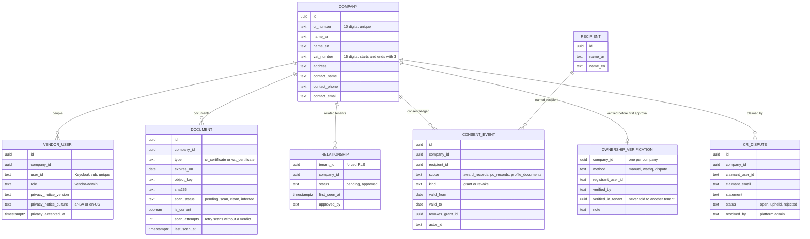

# Vendor slice design: one vendor across tenants, registration, documents, consent ledger

Date: 2026-09-27
Status: Approved by the user in the brainstorming session, then realigned the same day to the decision review merged on `main` (ADR-0008 to ADR-0011); the realignment is listed in section 1
Backlog rows (MVP narrowing in `docs/05-mvp-scope.md`): F-11 (row 5), F-12 (row 6), F-10 (row 22), F-64 (row 26); the remaining W-06 component `FileUpload`; N-02 consent at registration
Decisions: ADR-0008 (one vendor identity across tenants, keyed by CR, Keycloak organization membership per related tenant), ADR-0010 (consent ledger), ADR-0001 (uploads over chunked HTTP), ADR-0007 as amended (open tenders on the tenant's domain), CLAUDE.md invariants

## 1. Decisions

| # | Decision | Chosen | Source |
|---|---|---|---|
| V-1 | Vendor identity | One platform-wide company keyed by a mandatory, unique CR number; users and documents platform-level; everything a tenant knows or decides lives in a tenant-scoped relationship row | ADR-0008 points 1-2 |
| V-2 | Where vendors work | `/vendor/*` on each tenant host, in the tenant's brand | ADR-0008, ADR-0007 as amended |
| V-3 | Keycloak model | Vendor users in the tenant realm with realm role `vendor`; they become members of each tenant organization with which their company has a relationship, so the existing host-equals-organization check applies. Vendors never get a row in `identity.members`, and every staff policy (the four role policies and the tenant default and fallback) also refuses any principal holding the realm role `vendor`, so staff policies stay closed to them even with a member row | ADR-0008 point 3 (realigned: the first draft kept vendors out of organizations) |
| V-4 | Vendor second factor | Not required in the MVP once the account holds the realm role `vendor`; tenant staff keep required TOTP (admin D-5). An account that signed up but has not yet registered a company has no `vendor` role, so it still passes the TOTP step (confirmed by the user 2026-09-27) | Session decision |
| V-5 | Email verification | Keycloak self-registration with `verifyEmail`; the account cannot sign in until the link is clicked | F-11 acceptance |
| V-6 | Duplicate CR | Refused with one neutral message ("This company already has an account on WaslaBid. Ask its administrator to add you.") and audited in the platform audit (`ops.platform_audit`) under a keyed HMAC-SHA256 of the CR number (key `Vendors:CrAuditKey` from user secrets or `.env`, never in the repository; a plain hash of a 10-digit number is reversible by enumeration), never the number and never in a tenant's log; no company details shown. After five refusals in an hour a user gets that message for every CR number | Session decision; review of task 2 |
| V-7 | Relationship states | `pending` on first contact (registration through the tenant's host, or later an invitation or open tender); `approved` by a contracts officer or tenant admin; `blocked` arrives with F-14 | docs/05 row 22 (realigned) |
| V-8 | Documents | `cr_certificate`, `vat_certificate`; PDF, PNG or JPEG up to 10 MB; one current file per type, older files kept as history | docs/05 row 6 |
| V-9 | Upload path | Chunked HTTP: start, 1 MB chunks, complete (assemble, hash, scan); `FileUpload` drives it. Completion writes the document and the upload's outcome in one transaction, so completing again answers the first outcome. At most 10 open uploads (not completed, under a day old) per company (`vendor.too_many_uploads`, HTTP 429) and `Vendors:UploadRequestsPerMinute` (120) upload API requests per company per minute | ADR-0001, docs/06 spike 2; review of task 3 |
| V-10 | Virus scanning | ClamAV `INSTREAM` before listing; infected files deleted and audited; scanner down leaves `pending_scan`, a worker job retries. The retry stops its run only when clamd is unreachable or silent; a file clamd answers with an error for, or whose quarantined copy is gone, counts an attempt and the run goes on; after 12 attempts the file is parked for a person. `ClamAv:MaxStreamBytes` below 10 MB fails start | F-12 acceptance; review of task 3 |
| V-11 | Tenant view | Contracts officer and tenant admin see the company card and documents only while a relationship exists; the approve action lives there | ADR-0008 consequences |
| V-12 | Consent ledger | Vendor admin grants, views and revokes consent per recipient, scope and period; append-only grant and revocation rows, audited; `IConsentLedger.CheckAsync` is the only path any later export may use; tenants cannot grant | ADR-0010, docs/05 row 26 (realigned: added) |
| V-13 | Consent recipients in the MVP | A platform-level recipient list with no real recipients yet; the dev seed adds one test recipient so the screen and the check can be exercised; the list is maintained by migration until the platform console gets a screen | ADR-0010 point 3 |
| V-15 | CR ownership before the first approval (W-33, ADR-0013) | A company's first approval by any tenant needs its ownership verified: the officer confirms, with a box and a note, that the current clean CR certificate names the registering person or that an authorisation backs them. Recorded once per company (`vendor.ownership_verifications`) and audited in the tenant's log and the platform audit; later tenants approve without a check and learn only the method. The database refuses an unverified approval | User decision 2026-09-29, pentest P-4 |
| V-16 | Check method (W-33) | A platform setting, Manual (default) or Wathq, changed only in the platform console (`/platform/vendors`) and audited. Both behind `ICrOwnershipVerifier`. Wathq (`GET /owners/{id}`, `GET /managers/{id}`, header `apiKey`, settings `Wathq:BaseUrl` and `Wathq:ApiKey`) only shows the officer the CR's owners and managers by name, type and position; not configured or failing, the dialog says so and the manual check applies | User decision 2026-09-29 |
| V-17 | Dispute path (W-33) | A signed-in person without a vendor company or staff role raises a dispute at `/vendor/dispute` (linked from the duplicate-CR refusal; one pending per claimant and company, three per claimant; never refused for the company's count: the console lists disputes grouped by company (oldest pending dispute first), oldest first within it, and marks one while five older ones of its company are pending, worked out when listing (migration 0021; the `over_cap` column of 0020 only records the count when it was raised); every post rate-limited to five in fifteen minutes; the platform admins alerted by email). Disputes hold only after triage: a new (open) dispute holds nothing for a verified company, and holds its approvals only once a platform admin accepts it for review (`under_review`, audited); a company not verified yet is not verified while any claim is pending. A platform admin upholds or rejects it in the console with a note, never their own. Upholding moves the company to the claimant as vendor admin, removes its vendor users, records ownership (method dispute, the replaced verification kept on the dispute) and closes the company's other pending disputes, in one transaction; then Keycloak: the claimant gets the realm role `vendor` and membership of every related tenant's organization, the removed users lose both (W-21's `/vendor/join` no longer restores a membership), each step's outcome stored on the dispute and retried from the console. The ledger, documents and relationships stay with the company | User decisions 2026-09-29, ADR-0010, ADR-0013 |
| V-14 | Privacy consent at registration | The registration form requires acceptance of the platform's privacy notice (versioned text), stored with the user, the time and the culture it was shown in (`ar-SA` or `en-US`). A published text never changes in place (a unit test pins its SHA-256); a new text is a new version | N-02 |

## 2. Data (module `Vendors`, schema `vendor`)



- Platform-level tables (`companies`, `vendor_users`, `documents`, `consent_events`) get forced row-level security keyed on the company: `company_id = platform.current_vendor_company()` (the id column on `companies`), a second session setting `app.vendor_company_id` set by the connection interceptor from a set-once `VendorAccessor`. With no vendor context, `erp_app` sees no vendor rows. `consent_events` is insert and select only (append-only); its policy's `with check` also requires `actor_id = platform.current_user_id()` (0015), and one trigger (0016) refuses a row that names a time other than the database's `now()`, a row whose actor is not a user of its company, and a grant whose `valid_from` is before today in Riyadh (no backdating); since 0017 the time rule and the no-backdating rule raise under their own constraint names (`ck_consent_events_recorded_now`, `ck_consent_events_not_backdated`), and only the second is shown to the vendor as an invalid period. `recipients` is readable by `erp_app`.
- Tenant tables and vendor sessions (ADR-0012, pentest P-1): a vendor session on a tenant host carries `app.tenant_id` too, so `platform.enable_tenant_rls` is staff-only (`tenant_id = platform.current_tenant() and platform.current_vendor_company() is null`) and every tenant table was re-applied (platform migration 0006). `platform.enable_tenant_vendor_rls(schema, table, company_column)` (policy `tenant_vendor_isolation`) lets a vendor read its own rows inside a tenant and is chosen explicitly per table: `vendor.relationships` only (vendors 0013). `audit.events` accepts inserts with a vendor context (a vendor's own actions go to the tenant's log) and is read by staff only (audit 0002); a vendor session writes only as its own acting user, and a trigger sets `occurred_at = now()` on every insert, refusing a vendor session that names another time (audit 0003). `ops.platform_audit` is written only through `ops.write_platform_audit` (the database's time; with a tenant or vendor context, only as the acting user) and read only by a session with neither a tenant nor a vendor context, under forced row-level security (operations 0004). Security-definer functions state who may call them: staff functions refuse a vendor context (0011; `approve_relationship` also refuses an acting user who is a vendor user, 0014, and requires an active `identity.members` row of the tenant with contracts-officer or tenant-admin, 0016; `tenancy.update_branding` refuses a vendor context and requires an active tenant admin, tenancy 0007, and since tenancy 0008 also refuses an acting user who is a vendor user, so the name and colour save and the logo upload answer the same not-allowed; `BrandingService` sets `app.user_id` from the acting user and treats a different `actorId` as a defect; `tenancy.list_tenants` refuses any tenant or vendor context, tenancy 0007), vendor functions need the matching vendor context, and the worker's functions (`stale_uploads`, `claim_stale_upload`, `remove_stale_upload`, `pending_scan_documents`) answer only a session with neither a tenant nor a vendor context (0014). Until a separate worker role exists, that also matches a platform-host session (ADR-0012 point 4; a test pins the gap). Every module whose migrations create such functions refuses to migrate as a role without BYPASSRLS, and refuses when one of its security-definer functions is owned by such a role (vendors from 0001, tenancy 0008, operations 0005).
- `relationships`: tenant-scoped, forced RLS with the vendor helper, covered by the catalog test. `erp_app` may only select it; rows are created and changed only by security-definer functions: `vendor.register_company(...)` (pending for the registering tenant), `vendor.join_tenant()` (pending for `platform.current_tenant()` and `platform.current_vendor_company()`, only when the acting user is a user of that company; idempotent; returns `boolean`, true when this call created the relationship, so only that call audits `vendor.joined`, since migration 0010) and `vendor.approve_relationship(company_id)` (sets `approved` with `approved_by = platform.current_user_id()`; the app calls it only after the officer or admin policy passed).
- The acting user is a third session setting, `app.user_id` (`platform.current_user_id()`), set by the interceptor from a set-once `ActingUserAccessor`, which the web host fills from the authenticated principal's `sub` (middleware after authentication, and the circuit handler for circuits). Functions that record who acted read it; none takes a user id parameter.
- Registration before a company exists and the CR check go through security-definer functions `vendor.register_company(...)` (first vendor admin = the acting user; refused without one) and `vendor.cr_exists(cr)`. Tenant staff read through `vendor.related_company(company_id)` and `vendor.related_documents(company_id)`, and for the tenant's list through `vendor.related_companies()` (the related companies with the tenant's relationship status, first seen and approver) and `vendor.related_current_documents()` (the current clean document of each type of every related company) (migration 0010): security-definer functions that return rows only when a relationship exists for `platform.current_tenant()`.
- `consent_events`: a revocation must name a grant of the same company (foreign key on `(revokes_grant_id, company_id, 'grant')`). `vendor_users.privacy_notice_version` is 1 to 40 characters and not blank.
- `uploads` (plan task 3): the state of a chunked upload (company, document type, declared name, size and type, received chunk indexes, and the outcome once complete, so a repeated completion answers the same), under the company policy; the chunks are staged in object storage under `staging/{upload id}/{index}`. `erp_app` never deletes an upload row: the worker's hourly cleanup removes uploads older than a day through the security-definer functions `vendor.stale_uploads()` and `vendor.remove_stale_upload(id)`, which fix that age themselves. Clean files live under `vendors/{company}/documents/{document}`, files awaiting a scan under `vendors/{company}/quarantine/{document}`; a check constraint holds every document's key to one of those two forms. The five-minute retry scan finds pending files through `vendor.pending_scan_documents(limit)` (ids only, least recently tried first, none with 12 attempts) and handles each under that company's vendor context. A completed upload's `(document_id, company_id)` references the document of its own company (migration 0006; checked at commit since 0007). An infected upload leaves no document row; a pending file the retry scan finds infected is deleted and its row kept as `infected`, never listed. Both findings are audited as `vendor.upload_infected` in the platform audit (subject the company, data the signature name and the upload or document id), since the file belongs to the platform-level company and the retry scan has no tenant. The audit is written before the finding is recorded (audit, then the outcome or the `infected` mark, then the delete): at least once, never lost, and a duplicate is recognisable by its id. A file refused for its type records the upload outcome `refused` and its chunks are dropped; an expiry refusal leaves the upload open for a corrected date (migration 0007). Per company, at most 10 open uploads (no outcome, a start or a chunk within the hour, `last_chunk_at`) and at most `Vendors:MaxUploadsPerDay` (30) starts in any 24 hours, both answered with `vendor.too_many_uploads` and 429. The cleanup waits 25 hours (an hour past the usable day), claims each stale row with a lock (`vendor.claim_stale_upload`, `SKIP LOCKED`, so a completion still holding it is skipped), and for an upload that never recorded an outcome also deletes the document and quarantine keys under its id (migration 0008). Retry scan queue: a document without a verdict (clamd's size-limit error, a timeout or error reply, or a scanner exception) moves to the back of the queue (`last_scan_at`) and the scanner is probed at once with a small known-clean canary: canary clean, the file is charged one attempt; canary without a verdict, it is a clamd outage and nothing is charged (migration 0009 has no schema change for this). A storage failure while reading the quarantined file, or any failure after the scan, is never charged. Three such outages in a row stop the run, so an outage parks nothing; a missing quarantine file counts against that document itself. The attempt that reaches 12 parks the document and is audited (`vendor.document_parked`); `vendor.unpark_document(id)` (owner role only, docs/07 section 4) gives it back to the queue and is audited (`vendor.document_unparked`, actor the operator's session role).
- W-33 (migration 0018, ADR-0013): `ownership_settings` holds the platform's check method (one row, readable by `erp_app` like `recipients`, changed only through `vendor.set_ownership_method` by a session with neither a tenant nor a vendor context and an acting user). `ownership_verifications` sits under the company policy with no grant to `erp_app`; staff read it only through `vendor.related_ownership(company_id)` (registrant, verified, method, disputed, current clean CR certificate; rows only with a relationship and no vendor context). `vendor.verify_ownership(company_id, method, note)` has the approver rule of 0016 (now `vendor.require_vendor_manager()`), needs a relationship, a current clean CR certificate and no open dispute, records `wathq` only while the setting is Wathq, and keeps the first record. `vendor.approve_relationship` refuses a pending company that is unverified or disputed (`ck_relationships_ownership_verified`, `ck_relationships_not_disputed`). `cr_disputes` has its own forced policy (select only without a tenant or vendor context); `vendor.raise_cr_dispute` (tenant host, acting user, no vendor context, not a vendor user, not active staff; at most three open per claimant, one per claimant and company), `vendor.my_cr_disputes`, `vendor.open_cr_disputes` and `vendor.resolve_cr_dispute` (platform session with an acting user) are its only paths.
- W-33 hardening (migration 0019, review and pentest 2026-09-29): disputes gain the state `under_review` (`vendor.accept_cr_dispute`), which alone holds a verified company's approvals; the select policy on `cr_disputes` also needs an acting user; approval and verification lock the company row FOR SHARE and the dispute functions FOR NO KEY UPDATE before any check of state, and raising takes an advisory lock per claimant before counting; the admin who raised a dispute can neither accept nor resolve it (`ck_cr_disputes_not_self`); an uphold keeps the replaced verification (`superseded_verification`) and closes the company's other pending disputes; a company has at most one vendor admin (`ux_vendor_users_one_admin`); `erp_app` loses INSERT on `vendor_users` and UPDATE on `companies` (so an upload start and a document change now serialise per company on a transaction advisory lock, `CompanyLock`, instead of `SELECT ... FOR UPDATE` on the company row, which needs UPDATE); the identity provider's outcome of an uphold is stored overall and per step (`idp_outcome`, `idp_details`, `vendor.record_dispute_idp_outcome`, `vendor.upheld_disputes_needing_idp`), and `vendor.dispute_related_tenants` names the tenants whose organizations the claimant joins and the removed users leave; the worker's alert job reads `vendor.unalerted_cr_disputes` and marks `vendor.mark_cr_disputes_alerted`, both only for a session with neither context nor acting user.
- A catalog test asserts every `vendor.*` table except `recipients`, `ownership_settings` and `cr_disputes` has forced RLS with either the tenant or the vendor-company policy, and every tenant table's policies are exactly those the two tenant helpers write (with the `audit.events` exception).

## 3. Flows

```
acme.localhost/vendor/register
  → Keycloak sign-up (tenant realm, verifyEmail, realm role vendor) → email link → account active
  → /vendor/register/company: staff or another organization's member told before the form;
      CR, names ar/en, VAT, address, contact, privacy notice accepted with its culture (V-14)
      CR exists → V-6 message, platform audit vendor.duplicate_cr_refused (CR HMAC-SHA256); 5 per user per hour
      else → realm role vendor, then acme's Keycloak organization (Admin API, as the staff invitations do);
             company + vendor-admin user + relationship(acme, pending)
             on failure: undo what this attempt added, only if the user still has no company
             audit vendor.registered (acme's log)
      role vendor + only acme's organization + no company → a half-finished registration, may finish
  → /vendor: company, documents with expiry and status, upload per type, consent ledger
  → upload → scan → listed as clean with expiry
acme.localhost/admin/vendors: pending and approved vendors related to acme
  → company card and documents → Approve (audited vendor.approved)
beta.localhost/vendor or / (same account, not yet related to beta)
  → sign-in works (realm), host check fails until related: redirected to /vendor/join, which offers "Work with Beta"
  → organization membership, then relationship(beta, pending), audited vendor.joined in beta's log
  → a related company's user who lost the membership is refused there (vendor.membership_restore_refused);
      only the tenant restores access (W-21, amended 2026-09-29 after the pentest)
```

- Vendor policy `Vendor`: authenticated, email verified, realm role `vendor`, a `vendor.users` row, and a member of the host tenant's organization. Staff policies (`TenantStaffPolicy`: the tenant default and fallback, and inside the four role policies) refuse any principal holding the realm role `vendor`, since vendors sign in without a second factor (V-4); a signed-in vendor opening `/` is redirected to `/vendor`. The Blazor hub keeps the same-tenant fallback, since each component's page passed its own policy.
- The console's user count per tenant (F-54) leaves out organization members holding the realm role `vendor`.
- `IVendorCompliance.GetBlockingDocumentsAsync(companyId, onDate)` returns missing or expired document types with names in both languages; the submission wizard (F-22) calls it.
- `IConsentLedger`: `ListRecipientsAsync` (the platform list, for the grant dialog), `GrantAsync`, `RevokeAsync`, `ListAsync` (each grant with its status today: active, not yet valid, expired or revoked), and `CheckAsync(companyId, recipientId, scope)` (a grant in force today in Riyadh, first and last day included, that no revocation names; the newest when several do; through `vendor.consent_grant_in_force`, which takes no date since migration 0016, so an export can rely only on a grant in force when it runs). A check is asked without a context (an export), by the company itself, or by tenant staff only about a company their tenant works with; another company's vendor context or an unrelated tenant is refused. Only the company's vendor admin grants or revokes, as the acting user and in the company's vendor context; a grant starts today in Riyadh or later, never backdated. Grants, revocations and checks are audited in the platform audit (`vendor.consent_granted`, `vendor.consent_revoked`, `vendor.consent_check` with the result and the grant relied on), each naming the host tenant when there is one: the consent concerns the platform-level company and recipient, and the tenant need not learn whom a vendor consented to.

## 4. Components and pages
- `FileUpload` in `Platform.UI` (W-06 remainder): progress, retry, cancel, states (idle, uploading, scanning, done, rejected), accessible, both directions; small JS module for file slices only; gallery entry and bUnit tests.
- `AppShell` vendor variant (tenant brand, vendor navigation).
- Pages: `/vendor/register/company`, `/vendor` (company, documents), `/vendor/consent` (grant, view, revoke), `/vendor/join` (work with this tenant), `/admin/vendors` and `/admin/vendors/{id}` (staff).

## 5. Testing and done
- Test first. Testcontainers PostgreSQL, Keycloak (self-registration, verify email through Mailpit), MinIO, ClamAV (`clamav/clamav`, EICAR string for the infected case).
- Named tests include: `An_unverified_vendor_cannot_sign_in_until_the_link_is_clicked`, `A_cr_number_that_is_not_ten_digits_shows_a_specific_error_in_the_vendors_language`, `A_second_registration_with_the_same_cr_is_refused_without_revealing_the_company`, `Tenant_b_never_reads_tenant_a_relationship_rows`, `A_vendor_document_is_visible_to_a_tenant_only_while_a_relationship_exists`, `A_vendor_cannot_open_staff_pages`, `A_staff_account_cannot_act_as_a_vendor`, `An_officer_approves_a_pending_vendor_and_it_is_audited`, `A_document_is_listed_only_after_a_clean_scan`, `An_infected_upload_is_rejected_deleted_and_audited`, `A_resumed_upload_after_a_dropped_connection_completes_with_the_same_hash`, `Expired_and_missing_documents_are_reported_by_name`, the four F-64 acceptance cases (grant audited; revoke adds a row and leaves the grant unchanged; check refuses without an active grant and is audited; no tenant path grants), `Arabic_vendor_pages_render_right_to_left_without_raw_keys`.
- Done when each narrowed acceptance line of F-11, F-12, F-10 and F-64 has a named test; build, tests and format green; reviewer and qa-engineer passes; a real-browser pass through Caddy: register at acme, verify in Mailpit, company, both documents (one expired), grant and revoke a consent, officer approves; the same vendor joins beta and beta sees it only after that.

## 6. Known items

- `vendor.unpark_document` inserts into `ops.platform_audit` directly, as the migration owner, with a version 4 id (`gen_random_uuid()`), unlike the version 7 ids `IPlatformAudit` writes; the table comment records this (migration 0009). Unparking moves to the platform console through `IPlatformAudit` later, which removes the direct write.
- Completion holds the upload's row lock (`FOR UPDATE NOWAIT`) and an open transaction while clamd scans the file, up to `ClamAv:Timeout`. A second completion of the same upload gets 409 meanwhile, which is intended; the cost is one pooled connection per completion in progress. Kept for now (second review, item 7); revisit if completions queue behind slow scans.
- Staged chunks are removed by the hourly cleanup 25 hours after the start. The MinIO lifecycle rule on `staging/` (expire after 2 days) is the backstop in the Compose stack (`minio-init` in `infra/compose/docker-compose.yml`, commit 8f5f5c3). The pilot's Oracle Object Storage bucket needs the same rule (object lifecycle policy on the `staging/` prefix, 2 days); it is not set up yet.
- A file that crashes clamd (clamd drops the connection or stops answering while scanning it) also makes the canary that follows fail, so the retry scan reads it as a clamd outage and never charges the file an attempt: it never reaches 12 and is never parked. It keeps moving to the back of the queue (`last_scan_at`), at the cost of one scan and one canary per five-minute run, and blocks nothing, since the other files are tried first. If clamd does not come back for the canary, three such outages stop the run as for any outage. Accepted for the pilot; a per-document count of outages seen right after its own scan would park it, if it ever shows up in the worker log.
