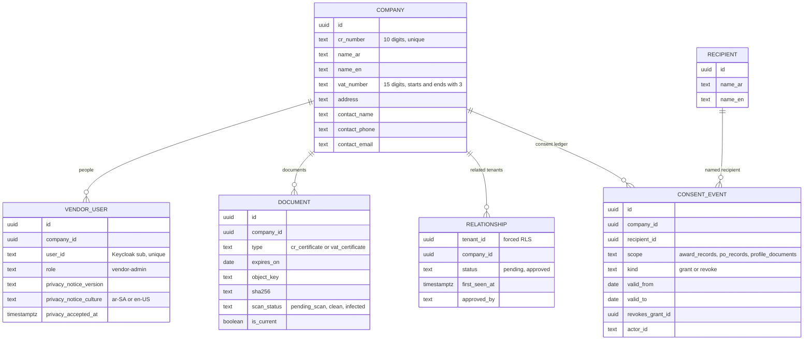

# Vendor slice design: one vendor across tenants, registration, documents, consent ledger

Date: 2026-09-27
Status: Approved by the user in the brainstorming session, then realigned the same day to the decision review merged on `main` (ADR-0008 to ADR-0011); the realignment is listed in section 1
Backlog rows (MVP narrowing in `docs/05-mvp-scope.md`): F-11 (row 5), F-12 (row 6), F-10 (row 22), F-64 (row 26); the remaining W-06 component `FileUpload`; N-02 consent at registration
Decisions: ADR-0008 (one vendor identity across tenants, keyed by CR, Keycloak organization membership per related tenant), ADR-0010 (consent ledger), ADR-0001 (uploads over chunked HTTP), ADR-0007 as amended (open tenders on the tenant's domain), CLAUDE.md invariants

## 1. Decisions

| # | Decision | Chosen | Source |
|---|---|---|---|
| V-1 | Vendor identity | One platform-wide company keyed by a mandatory, unique CR number; users and documents platform-level; everything a tenant knows or decides lives in a tenant-scoped relationship row | ADR-0008 points 1-2 |
| V-2 | Where vendors work | `/vendor/*` on each tenant host, in the tenant's brand | ADR-0008, ADR-0007 as amended |
| V-3 | Keycloak model | Vendor users in the tenant realm with realm role `vendor`; they become members of each tenant organization with which their company has a relationship, so the existing host-equals-organization check applies. Vendors never get a row in `identity.members`, and every staff policy (the four role policies and the tenant default and fallback) also refuses any principal holding the realm role `vendor`, so staff policies stay closed to them even with a member row | ADR-0008 point 3 (realigned: the first draft kept vendors out of organizations) |
| V-4 | Vendor second factor | Not required in the MVP once the account holds the realm role `vendor`; tenant staff keep required TOTP (admin D-5). An account that signed up but has not yet registered a company has no `vendor` role, so it still passes the TOTP step (confirmed by the user 2026-09-27) | Session decision |
| V-5 | Email verification | Keycloak self-registration with `verifyEmail`; the account cannot sign in until the link is clicked | F-11 acceptance |
| V-6 | Duplicate CR | Refused with one neutral message ("This company already has an account on WaslaBid. Ask its administrator to add you.") and audited in the platform audit (`ops.platform_audit`) under a keyed HMAC-SHA256 of the CR number (key `Vendors:CrAuditKey` from user secrets or `.env`, never in the repository; a plain hash of a 10-digit number is reversible by enumeration), never the number and never in a tenant's log; no company details shown. After five refusals in an hour a user gets that message for every CR number | Session decision; review of task 2 |
| V-7 | Relationship states | `pending` on first contact (registration through the tenant's host, or later an invitation or open tender); `approved` by a contracts officer or tenant admin; `blocked` arrives with F-14 | docs/05 row 22 (realigned) |
| V-8 | Documents | `cr_certificate`, `vat_certificate`; PDF, PNG or JPEG up to 10 MB; one current file per type, older files kept as history | docs/05 row 6 |
| V-9 | Upload path | Chunked HTTP: start, 1 MB chunks, complete (assemble, hash, scan); `FileUpload` drives it | ADR-0001, docs/06 spike 2 |
| V-10 | Virus scanning | ClamAV `INSTREAM` before listing; infected files deleted and audited; scanner down leaves `pending_scan`, a worker job retries | F-12 acceptance |
| V-11 | Tenant view | Contracts officer and tenant admin see the company card and documents only while a relationship exists; the approve action lives there | ADR-0008 consequences |
| V-12 | Consent ledger | Vendor admin grants, views and revokes consent per recipient, scope and period; append-only grant and revocation rows, audited; `IConsentLedger.CheckAsync` is the only path any later export may use; tenants cannot grant | ADR-0010, docs/05 row 26 (realigned: added) |
| V-13 | Consent recipients in the MVP | A platform-level recipient list with no real recipients yet; the dev seed adds one test recipient so the screen and the check can be exercised; the list is maintained by migration until the platform console gets a screen | ADR-0010 point 3 |
| V-14 | Privacy consent at registration | The registration form requires acceptance of the platform's privacy notice (versioned text), stored with the user, the time and the culture it was shown in (`ar-SA` or `en-US`). A published text never changes in place (a unit test pins its SHA-256); a new text is a new version | N-02 |

## 2. Data (module `Vendors`, schema `vendor`)



- Platform-level tables (`companies`, `vendor_users`, `documents`, `consent_events`) get forced row-level security keyed on the company: `company_id = platform.current_vendor_company()` (the id column on `companies`), a second session setting `app.vendor_company_id` set by the connection interceptor from a set-once `VendorAccessor`. With no vendor context, `erp_app` sees no vendor rows. `consent_events` is insert and select only (append-only). `recipients` is readable by `erp_app`.
- `relationships`: tenant-scoped, forced RLS, covered by the catalog test. `erp_app` may only select it; rows are created and changed only by security-definer functions: `vendor.register_company(...)` (pending for the registering tenant), `vendor.join_tenant()` (pending for `platform.current_tenant()` and `platform.current_vendor_company()`, only when the acting user is a user of that company; idempotent) and `vendor.approve_relationship(company_id)` (sets `approved` with `approved_by = platform.current_user_id()`; the app calls it only after the officer or admin policy passed).
- The acting user is a third session setting, `app.user_id` (`platform.current_user_id()`), set by the interceptor from a set-once `ActingUserAccessor`, which the web host fills from the authenticated principal's `sub` (middleware after authentication, and the circuit handler for circuits). Functions that record who acted read it; none takes a user id parameter.
- Registration before a company exists and the CR check go through security-definer functions `vendor.register_company(...)` (first vendor admin = the acting user; refused without one) and `vendor.cr_exists(cr)`. Tenant staff read through `vendor.related_company(company_id)` and `vendor.related_documents(company_id)`, security-definer functions that return rows only when a relationship exists for `platform.current_tenant()`.
- `consent_events`: a revocation must name a grant of the same company (foreign key on `(revokes_grant_id, company_id, 'grant')`). `vendor_users.privacy_notice_version` is 1 to 40 characters and not blank.
- `uploads` (plan task 3): the state of a chunked upload (company, document type, declared name, size and type, received chunk indexes, and the outcome once complete, so a repeated completion answers the same), under the company policy; the chunks are staged in object storage under `staging/{upload id}/{index}`. `erp_app` never deletes an upload row: the worker's hourly cleanup removes uploads older than a day through the security-definer functions `vendor.stale_uploads()` and `vendor.remove_stale_upload(id)`, which fix that age themselves. Clean files live under `vendors/{company}/documents/{document}`, files awaiting a scan under `vendors/{company}/quarantine/{document}`; the five-minute retry scan finds them through `vendor.pending_scan_documents(limit)` (ids only) and handles each under that company's vendor context. An infected upload leaves no row; a pending file the retry scan finds infected is deleted and its row kept as `infected`, never listed. Both findings are audited as `vendor.upload_infected` in the platform audit (subject the company, data the signature name only), since the file belongs to the platform-level company and the retry scan has no tenant.
- A catalog test asserts every `vendor.*` table except `recipients` has forced RLS with either the tenant or the vendor-company policy.

## 3. Flows

```
acme.localhost/vendor/register
  → Keycloak sign-up (tenant realm, verifyEmail, realm role vendor) → email link → account active
  → /vendor/register/company: staff or another organization's member told before the form;
      CR, names ar/en, VAT, address, contact, privacy notice accepted with its culture (V-14)
      CR exists → V-6 message, platform audit vendor.duplicate_cr_refused (CR HMAC-SHA256); 5 per user per hour
      else → realm role vendor, then acme's Keycloak organization (Admin API, as the staff invitations do);
             company + vendor-admin user + relationship(acme, pending)
             on failure: undo what this attempt added, only if the user still has no company
             audit vendor.registered (acme's log)
      role vendor + only acme's organization + no company → a half-finished registration, may finish
  → /vendor: company, documents with expiry and status, upload per type, consent ledger
  → upload → scan → listed as clean with expiry
acme.localhost/admin/vendors: pending and approved vendors related to acme
  → company card and documents → Approve (audited vendor.approved)
beta.localhost/vendor (same account, not yet related to beta)
  → sign-in works (realm), host check fails until related: the page offers "Work with Beta"
  → creates relationship(beta, pending) and organization membership, audited in beta's log
```

- Vendor policy `Vendor`: authenticated, email verified, realm role `vendor`, a `vendor.users` row, and a member of the host tenant's organization. Staff policies (`TenantStaffPolicy`: the tenant default and fallback, and inside the four role policies) refuse any principal holding the realm role `vendor`, since vendors sign in without a second factor (V-4); a signed-in vendor opening `/` is redirected to `/vendor`. The Blazor hub keeps the same-tenant fallback, since each component's page passed its own policy.
- The console's user count per tenant (F-54) leaves out organization members holding the realm role `vendor`.
- `IVendorCompliance.GetBlockingDocumentsAsync(companyId, onDate)` returns missing or expired document types with names in both languages; the submission wizard (F-22) calls it.
- `IConsentLedger`: `GrantAsync`, `RevokeAsync`, `ListAsync`, and `CheckAsync(companyId, recipientId, scope, onDate)` (active grant exists and no later revocation). Only vendor-admin calls grant or revoke.

## 4. Components and pages
- `FileUpload` in `Platform.UI` (W-06 remainder): progress, retry, cancel, states (idle, uploading, scanning, done, rejected), accessible, both directions; small JS module for file slices only; gallery entry and bUnit tests.
- `AppShell` vendor variant (tenant brand, vendor navigation).
- Pages: `/vendor/register/company`, `/vendor` (company, documents), `/vendor/consent` (grant, view, revoke), `/vendor/join` (work with this tenant), `/admin/vendors` and `/admin/vendors/{id}` (staff).

## 5. Testing and done
- Test first. Testcontainers PostgreSQL, Keycloak (self-registration, verify email through Mailpit), MinIO, ClamAV (`clamav/clamav`, EICAR string for the infected case).
- Named tests include: `An_unverified_vendor_cannot_sign_in_until_the_link_is_clicked`, `A_cr_number_that_is_not_ten_digits_shows_a_specific_error_in_the_vendors_language`, `A_second_registration_with_the_same_cr_is_refused_without_revealing_the_company`, `Tenant_b_never_reads_tenant_a_relationship_rows`, `A_vendor_document_is_visible_to_a_tenant_only_while_a_relationship_exists`, `A_vendor_cannot_open_staff_pages`, `A_staff_account_cannot_act_as_a_vendor`, `An_officer_approves_a_pending_vendor_and_it_is_audited`, `A_document_is_listed_only_after_a_clean_scan`, `An_infected_upload_is_rejected_deleted_and_audited`, `A_resumed_upload_after_a_dropped_connection_completes_with_the_same_hash`, `Expired_and_missing_documents_are_reported_by_name`, the four F-64 acceptance cases (grant audited; revoke adds a row and leaves the grant unchanged; check refuses without an active grant and is audited; no tenant path grants), `Arabic_vendor_pages_render_right_to_left_without_raw_keys`.
- Done when each narrowed acceptance line of F-11, F-12, F-10 and F-64 has a named test; build, tests and format green; reviewer and qa-engineer passes; a real-browser pass through Caddy: register at acme, verify in Mailpit, company, both documents (one expired), grant and revoke a consent, officer approves; the same vendor joins beta and beta sees it only after that.
