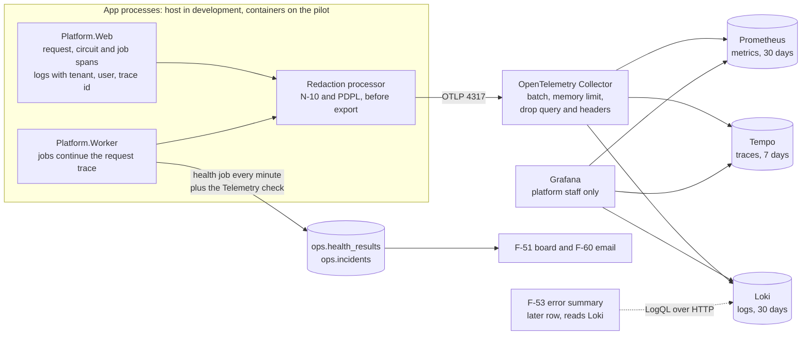
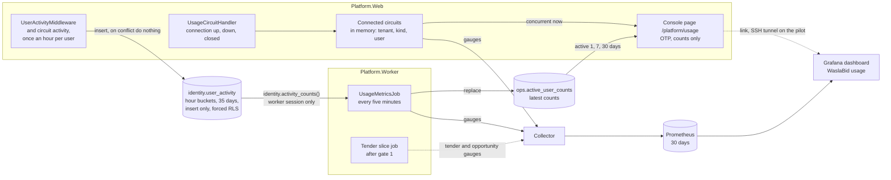

# Observability design (W-10): logs, traces, metrics and health for the pilot

Date: 2026-09-30
Status: Draft for the user's review, written overnight. Decisions O-1 to O-26 in section 2 are proposals, except O-23, which the user decided on 2026-09-30; the ones marked "needs the user" are open questions in section 11, each with a recommendation. Business metrics (section 6, O-19 to O-26, Q9 to Q12) were added on 2026-09-30 at the user's request: "the observability and dashboard should show how many active users, opportunities, tenders, concurrent users", and the same day "show the business metrics in the platform console too, not only Grafana". The plan (`docs/superpowers/plans/2026-09-30-observability.md`) is written on the recommended answers and says which task changes for any other answer. Nothing is built yet.
Builds on: the foundation, the admin UI slice (spec `2026-09-27-admin-ui-design.md` D-7, D-17, D-18; ADR-0006) and W-24 (the Data Protection logging cap)
Backlog rows: W-10 (P0, hardening before gate 1, docs/05 section 8); it feeds F-51, F-53 and F-60, and the pilot environment W-19

## 1. Scope for the pilot

W-10 is hardening, not a slice (docs/05 section 8): it makes what is already built observable. It adds no module and no tender path. The business metrics add one table in the Identity schema, one in the Operations schema and one console page (section 6); whether that still fits the hardening rule is question Q11.

In:

- The web host and the worker emit logs, traces and metrics through OpenTelemetry (OTLP) to a collector, with the tenant, the user, the vendor company, the job and the trace id on every record.
- A redaction step in the process, before anything leaves it (N-10 secrets, PDPL personal data, vendor and offer data).
- A liveness endpoint beside the existing `/health`, and the worker's health results published as metrics.
- The collector, Loki, Tempo, Prometheus and Grafana in the Compose stack, provisioned, with retention and memory limits sized for the pilot VM (W-19).
- The contract F-53 will read (labels, attribute names and the LogQL of the 24-hour error summary), proven by a smoke script, but not the F-53 panel itself.
- A "Telemetry" check in the worker's existing health job, so a dead pipeline is alerted by F-60 like Disk is.
- Business metrics (section 6): concurrent users and active users (1, 7 and 30 days) per tenant and kind, shown on a new platform console page `/platform/usage` and on a provisioned Grafana dashboard "WaslaBid usage"; the names, definitions and dashboard panels of the tender and opportunity counts, which the tender slices publish.

Out (later rows or slices):

- The F-53 error summary panel and the console's own log and trace views (F-53, after this row; the full view after three to five paying customers, ADR-0006).
- Grafana alert rules and dashboards beyond datasource provisioning and the usage dashboard (section 6.7); F-60 stays the only alert path in the pilot (O-14).
- Publishing the tender and opportunity counts, and showing them in the console: the tender slices after gate 1 (section 6.5).
- Usage numbers for tenant admins, even for their own tenant: no feature asks for it (section 6.7).
- Tracing inside Caddy and Keycloak (both can export OTLP; not needed to answer the W-10 acceptance).
- Sentry, unless the user decides otherwise (O-1, question Q1). If kept, it is plan task 11.
- Per-tenant log access for tenant admins (no feature asks for it; F-61 support sessions do not include logs).

## 2. Decisions proposed

Tags follow the user's convention: **Standard** (an industry or platform standard sets it), **Project decision** (follows from a decision already recorded in this repository), **Judgment** (my call; could reasonably go another way).

| # | Decision | Proposal | Why | Tag | Needs the user |
|---|---|---|---|---|---|
| O-1 | Sentry | Not in the pilot. Exceptions go to Loki (Error log line with type, masked message and stack) and Tempo (span status and exception event); the F-53 summary groups them. Revisit with GlitchTip (Sentry-SDK compatible, MIT, about 512 MB) hosted in-Kingdom if error triage in Grafana proves too weak | Self-hosted Sentry needs 4 cores and 16 GB RAM plus swap (32 GB in practice) and about 40 containers; the pilot VM has 24 GB for everything. Sentry SaaS stores data outside the Kingdom (N-01) | Judgment | Yes, Q1 (changes the docs/02 stack row and the W-10 acceptance) |
| O-2 | Serilog | Not used. Logging stays on `Microsoft.Extensions.Logging` with the OpenTelemetry provider; development keeps the console provider | W-24's N-10 cap on Data Protection logging is written as `LoggerFilterOptions` rules and a startup guard; they keep working unchanged. `UseSerilog()` or `services.AddSerilog()` replaces the logger factory and silently bypasses those rules. One pipeline carries trace ids and scopes into every record | Judgment | Yes, Q2 (changes the docs/02 stack row) |
| O-3 | Collector | One OpenTelemetry Collector; the app only knows its OTLP endpoint. The collector fans out to Loki, Tempo and Prometheus, batches, limits memory and drops risky attributes as a second net | ADR-0006 D-18 already names the collector; one endpoint, buffering and retry outside the app | Project decision | No |
| O-4 | Log store | Loki 3 with native OTLP ingestion, single tenant (`auth_enabled: false`); index labels only `service_name`, `deployment_environment` and the level; tenant, user, trace id and exception type as structured metadata | ADR-0006; low label cardinality is Loki's own guidance. Loki's multi-tenancy would separate our tenants' logs from each other, but only platform staff read logs, so it adds cost without a reader | Project decision (store), Judgment (single tenant) | No |
| O-5 | Trace store | Tempo, local storage, 100 percent sampling (parent-based) | ADR-0006; pilot volume is tiny, and every failed request must have its trace | Project decision | No |
| O-6 | Metrics | Prometheus 3 receiving OTLP from the collector | It is in the docs/02 stack row; request rate, latency, error rate, runtime, Npgsql pool and health results cost about 200 MB | Project decision | Yes, Q3 (now or later) |
| O-7 | Correlation id | The W3C trace id is the correlation id. Every response carries it in `X-Correlation-Id`; `ProblemDetails` already carries `traceId`. No second id is invented | W3C Trace Context; one id to paste into Grafana | Standard | No |
| O-8 | Inbound trace context | A `traceparent` sent from the internet is not trusted: the web host starts its own trace per request | A client could otherwise choose trace ids (collide with another request in F-53's lookup) or force sampling flags | Judgment | No |
| O-9 | Context on every record | `waslabid.tenant.id` and `waslabid.tenant.slug` (tenant hosts), `user.id` (the Keycloak `sub`, after sign-in), `waslabid.vendor_company.id` (vendor requests), `waslabid.job.id` and `waslabid.job.type` (worker), `waslabid.component` (section 5.3), plus the trace and span ids. Never an email, a name, a CR or national id number, a file name, or offer content | What F-53 filters on (tenant, correlation, component); the ids are pseudonymous and already used in today's log lines | Judgment (ids in logs are personal data under PDPL, limited by retention O-12) | Confirm, Q7 |
| O-10 | Redaction | Two layers: (1) at the source, log templates never take personal or secret values, enforced by a test over every `[LoggerMessage]` template; (2) a redaction processor in the process masks emails, runs of ten or more digits, JWTs and bearer tokens, and `password=`/`pwd=` pairs in messages, attributes, span tags and exception messages, and drops query strings, before export. The collector drops `url.query` and request headers again | N-10 and PDPL; the source rule is how the code base already works (ids and `{ErrorType}`, never `ex.Message`), the processor catches framework and library text we do not write | Standard (N-10), Judgment (the patterns) | No |
| O-11 | Bodies and offers | No request or response body, form value, header value or query string is ever captured (no HTTP logging middleware, no body enrichment); financial envelope content never enters a log line, span or metric label in any slice | Sealed envelopes (F-23) and PDPL; an attempt to read a sealed envelope is an audit row (`audit.events`), not a log line | Project decision | No |
| O-12 | Retention | Logs 30 days, traces 7 days, metrics 30 days on the pilot; 3 days on developer machines. Telemetry is not backed up | 30 days matches the F-60 incident list and lets a late-reported pilot problem be traced; traces are the bulkiest. Audit evidence lives in PostgreSQL, not in logs | Judgment | Yes, Q7 |
| O-13 | Who reads telemetry | Platform staff only, through Grafana (and later the console's F-53). Loki, Tempo, Prometheus and the collector are never published outside the Compose network on the pilot; on developer machines they bind to `127.0.0.1` | ADR-0006: operations data belongs to the platform realm's staff | Project decision | No |
| O-14 | Alerts | F-60 (the worker's health job, email) stays the only alert path. W-10 adds a non-board component "Telemetry" (collector health and Loki readiness) so a dead pipeline alerts like Disk does. No Grafana alert rules in W-10 | One alert path, one incident list; Grafana alerting would be a second channel with its own recipients and its own history | Judgment | No |
| O-15 | Health endpoints | Keep `/health` exactly as it is (readiness, includes the key ring; the worker probes it for F-51). Add `/alive` (liveness: the process answers, no dependency) for container health checks on the pilot. The worker keeps opening no port | `/health` and `/alive` is the .NET Aspire service-defaults convention; a path outside `/health/*` keeps TenantMiddleware's rule that only the exact `/health` skips tenant resolution | Standard | No |
| O-16 | Console output outside Development | Off. Outside Development and Testing, logs leave only through OTLP (redacted). Development keeps the console | Container stdout would keep an unredacted, unrotated second copy outside the retention in O-12 and can fill the pilot disk. Cost: `docker logs` shows only startup failures that happen before the pipeline starts, which the host still writes to stderr | Judgment | Confirm, Q8 |
| O-17 | Compose layout | The five services are part of the default stack (no profile), each with a memory limit | Developers see the same pipeline as the pilot; about 1.5 GB | Judgment | No |
| O-18 | Grafana access on the pilot | Through an SSH tunnel only; Grafana's own admin login with the password from the secret store. Keycloak platform-realm SSO for Grafana comes when a third person needs it | Nothing new exposed to the internet on a single VM; two partners are the only readers | Judgment | Yes, Q5 |
| O-19 | Business metric names and labels | Meter `WaslaBid.Usage`; tags only the tenant slug, the kind of user and small fixed value sets (window, tender state, visibility); never a user id, vendor company id, tender id or tenant-defined text (section 6.1) | Every label value is a series kept 30 days and copied into every scrape; a label cannot be redacted afterwards (N-10, PDPL) | Judgment | No |
| O-20 | Concurrent users | Counted in the web host from the Blazor circuit handler chain that W-21 extended: one more `CircuitHandler` keeps a registry of connected circuits in process memory; gauges read it (section 6.3) | Reuses the existing mechanism; no store, no per-request cost | Judgment | No |
| O-21 | Active users | Hourly activity buckets in a new table `identity.user_activity` (insert only, forced row-level security, 35 days), written at most once an hour per user, tenant and kind; a worker job counts them every five minutes (section 6.4) | Counts use, not sign-ins; retention under our control; see the options weighed in 6.4 | Judgment | Yes, Q10 |
| O-22 | Tenders and opportunities | Names, tags, definitions and dashboard panels fixed now; the tender slices publish them after gate 1 (section 6.5) | No Tenders module exists and W-10 adds no tender path (docs/05 section 8) | Project decision | Yes, Q9 (what an opportunity is) |
| O-23 | Where usage shows | Both: a console page `/platform/usage` that reads stored results, never Prometheus (section 6.6), and a provisioned Grafana dashboard for history (section 6.7), linked from the page | Decided by the user on 2026-09-30. The console is where the partners already work, with OTP; Grafana is reachable only through the SSH tunnel on the pilot (O-18) | Project decision | No (decided) |
| O-24 | Who counts, and as what | Kinds `staff`, `vendor` and `platform`; anonymous sessions and applicants without a company are not counted (section 6.2) | A small, fixed tag set; an applicant is not yet a vendor of anything | Judgment | No |
| O-25 | Console page placement | A new console page `/platform/usage` with its own navigation entry, not a section of the health board or a wider tenants table | The tenants table (F-54) already has five columns and a jobs table; eight usage numbers per tenant do not fit beside them, and the health board is about components | Judgment | Confirm, Q12 |
| O-26 | Tenders on the console page | Left off the usage page until the tender slice adds a "Tenders" section; F-54's "Active tenders" dash (admin spec D-12) stays the only sign of the gap | A section of dashes is noise; D-12 chose a dash for one column, not a whole section | Judgment | Confirm, Q12 |

## 3. Architecture

Read it as: the app never talks to a store directly; everything leaves through the redaction processor and the collector, and the health job that already drives F-51 and F-60 also watches the pipeline.



## 4. What exists today and what W-10 changes

| Area | Today | W-10 |
|---|---|---|
| Logging | `Microsoft.Extensions.Logging`, default providers, 64 source-generated `[LoggerMessage]` methods that log ids and `{ErrorType}`, never `ex.Message` | Adds the OpenTelemetry provider with scopes; console only in Development (O-16); the W-24 cap (`KeyRing.CapDataProtectionLogging`) and its startup guard apply to the new provider unchanged |
| Traces and metrics | None | OpenTelemetry SDK in both hosts; ASP.NET Core, HttpClient, Npgsql, runtime; our own `WaslaBid.Jobs` and `WaslaBid.Operations` sources and meters |
| `/health` (web) | Anonymous, skips tenant resolution, key-ring check cached 5 s, answers `Healthy`/`Unhealthy` only | Unchanged; excluded from traces. New `/alive` |
| Worker health job (F-51, F-60) | Seven board components plus Disk, results in `ops.health_results`, incidents and emails | Adds the non-board component Telemetry (O-14); publishes each result as a metric |
| Hangfire | `TenantJobFilter` stamps `TenantId` and `Tenant`; `TenantJobActivator` restores them | Also stamps `TraceParent`; a server filter opens the job span and log scope |
| Compose | Eight services | Plus collector, Loki, Tempo, Prometheus, Grafana |
| Circuit handlers | `TenantCircuitHandler`, `VendorCircuitHandler`, `CircuitSessionGuard` (W-21) | Plus `UsageCircuitHandler`, which keeps the registry of connected circuits (section 6.3) |
| Usage numbers | F-54 shows each tenant's user count (Keycloak organization members) and a dash for active tenders (admin spec D-12); nothing records use | Concurrent and active users per tenant and kind, on the console page `/platform/usage` and in Grafana; the tender names that `ITenderCounts` (D-12) will fill |

What W-10 adds for rows that depend on it:

- **F-51** is Done as narrowed without W-10 and needs nothing more to stay Done. W-10 adds `/alive` for the pilot's container health checks, health history as metrics (the board shows only the latest result), a trace per check run, and `service.version` on every record, which is what a later version column would read (the column itself stays narrowed out).
- **F-60** is Done as narrowed; its note says W-10 was not Done. W-10 adds the Telemetry component to its incident pipeline and changes nothing else.
- **F-53** (MVP: 24-hour error summary per component from Loki with a Grafana link) is unblocked by W-10: section 8 fixes the attributes and the query it will use, and the smoke script proves them against the running stack.
- **W-19** (pilot on Oracle Cloud Always Free) does not list W-10 as a dependency today; section 9 gives the memory budget it needs. Whether W-19 should depend on W-10 is question Q4.

## 5. What the app emits

### 5.1 Resource

Every record carries `service.name` (`waslabid-web` or `waslabid-worker`), `service.version` (the assembly's informational version, the git commit in CI builds), `service.instance.id` and `deployment.environment.name` (`development`, `pilot`).

### 5.2 Traces

- **Web:** a server span per HTTP request (route, method, status; `url.query` redacted by the instrumentation's default and dropped by our processor), client spans for HttpClient (Keycloak Admin API, Keycloak organization checks) and Npgsql (statement text only, parameters never), and, if .NET 10's Blazor activity source is present, circuit and event spans. Not traced: `/health`, `/alive`, `/_framework/*`, `/_content/*` and static assets.
- **Worker:** a span per Hangfire job named `job <Type>.<Method>`, a child of the request that enqueued it (the `TraceParent` job parameter), or a new trace for recurring jobs; status Error with the exception type when the job fails. The health job's run is one span with a child per check.
- **Tags on the server or job span:** the context in O-9.

### 5.3 Logs

- Every record carries the trace and span id (from the current activity), the context in O-9 as attributes (log scopes, `IncludeScopes`), the formatted message, and for an exception its type, masked message and stack trace.
- `waslabid.component` is derived from the logger category by a fixed table, so F-53 can group errors per component: `Platform.Modules.<Name>.*` gives the module name (Vendors, Identity, Operations, ...), `Npgsql*` and `Microsoft.EntityFrameworkCore*` give `PostgreSQL`, `Amazon.*` gives `MinIO`, `MailKit*` gives `SMTP`, `Hangfire*` gives `Jobs`, `Microsoft.AspNetCore.*` and `Platform.Web.*` give `Web`; anything else gives the service name. The PostgreSQL, MinIO and SMTP names are the `HealthComponents` names, so a board tile and its errors share a word.
- Levels: `Information` by default, `Microsoft.AspNetCore` at `Warning` (as today), Data Protection capped at `Information` for every provider (W-24).

### 5.4 Metrics

ASP.NET Core request duration and active requests, HttpClient duration, `System.Runtime` (GC, thread pool, exceptions), Npgsql connection pool, Hangfire job duration and failures (`waslabid.jobs.duration`, `waslabid.jobs.failed` with `job.type`), and the health results (`waslabid.health.status` as 0 Healthy, 1 Degraded, 2 Unhealthy, and `waslabid.health.check.duration`, both per `component`). These technical metrics never carry a tenant label (cardinality, and metrics are kept as long as logs). The business metrics in section 6 are the one exception: they carry the tenant slug, under the rules in 6.1.

## 6. Business metrics: users, tenders and opportunities

Asked by the user on 2026-09-30: "the observability and dashboard should show how many active users, opportunities, tenders, concurrent users", then "show the business metrics in the platform console too, not only Grafana". Read as: platform staff see, per tenant and in total, how many people use the product now and in the last day, week and month, and how much tender activity there is. Counts only, never who.

Read the diagram as: concurrent users come from the web host's own memory, active users from hourly activity rows counted by a worker job; the console reads the web host's registry and the job's stored results, Grafana reads Prometheus; the tender counts join the same meter when the tender slices exist.



### 6.1 Metrics

All on meter `WaslaBid.Usage` (a constant in `TelemetryNames`, with every name and tag below, so the tender slices use the same constants).

| Name | Instrument, unit | Tags | Meaning | Published by |
|---|---|---|---|---|
| `waslabid.circuits.connected` | observable gauge, `{circuit}` | `waslabid.tenant.slug`, `waslabid.user.kind` | Blazor circuits whose connection is up now, on this web instance | W-10, web host (6.3) |
| `waslabid.users.concurrent` | observable gauge, `{user}` | `waslabid.tenant.slug`, `waslabid.user.kind` | Distinct signed-in users with at least one connected circuit | W-10, web host (6.3) |
| `waslabid.users.active` | observable gauge, `{user}` | `waslabid.tenant.slug`, `waslabid.user.kind`, `waslabid.window` (`1d`, `7d`, `30d`) | Distinct users with an authenticated request or circuit activity in the window | W-10, worker (6.4) |
| `waslabid.users.active.all_tenants` | observable gauge, `{user}` | `waslabid.user.kind`, `waslabid.window` | The same across all tenants, each user once (a vendor active on two tenants counts once) | W-10, worker (6.4) |
| `waslabid.tenders` | observable gauge, `{tender}` | `waslabid.tenant.slug`, `waslabid.tender.state`, `waslabid.tender.visibility` (`invited`, `open`) | Tenders per F-15 stage now | the tender slice (6.5) |
| `waslabid.opportunities` | observable gauge, `{tender}` | `waslabid.tenant.slug`, `waslabid.tender.visibility`, `waslabid.directory` (`not_listed`; `listed` from F-62) | Tenders a vendor can bid on now (6.5) | the tender slice; F-62 adds `listed` |

Label rules (O-19):

- Tags take the tenant slug and small fixed value sets only. Never a user id, a vendor company id, an email, a tender id or reference, or text a tenant defines: the workflow steps a tenant adds (F-56) are not stages, and `waslabid.tender.state` takes only the fixed F-15 stages in snake case (`draft`, `published`, `clarification`, `closed`, `compliance_screening`, `technical_evaluation`, `technical_locked`, `financial_opening`, `financial_evaluation`, `finance_approval`, `awarded`, `cancelled`).
- The slug, not the tenant id: it reads in a filter, it is not personal data, and it is bounded by the number of tenants. At N-06 scale (50 tenants) the usage metrics are about 2,000 series (most of them the tender gauges), well inside the Prometheus budget in section 9.
- `platform` users carry no tenant tag.
- Prometheus stores the names with dots as underscores (`waslabid_users_active`); plan task 10 records the exact names, as it does for Loki.

### 6.2 Who counts, and as what (O-24)

One classifier, `UsageKind`, in the web host, used by both the circuit registry and the activity recorder:

| Session | Kind |
|---|---|
| Signed in on a tenant host as a staff member of that tenant (the members claims transformation gave it a tenant role), no vendor context | `staff` |
| Signed in on a tenant host with a vendor context under the Vendor policy (set by `VendorContextMiddleware`, or by `VendorCircuitHandler` in a circuit) | `vendor` |
| Signed in on the platform host (the `PlatformAdmin` policy passed) | `platform` |
| Anonymous; signed in but neither of the above (an applicant before its company exists, a vendor on the join page of a tenant it has not joined, under the JoiningVendor policy); a session W-21 has ended | not counted |

An applicant's circuits still count in the framework's own total of circuits (`aspnetcore.components.circuit.*`, if .NET 10 publishes it; plan task 1 reports whether it does), so load is visible even where use is not counted.

### 6.3 Concurrent users (O-20)

- `UsageCircuitHandler` is a `CircuitHandler` ordered after `CircuitSessionGuard` (`int.MinValue + 3`), so the tenant, the acting user and the vendor context are already set. On `OnConnectionUpAsync` it classifies the circuit once (the principal is fixed for the circuit's life) and adds the circuit's id, tenant slug, kind and user `sub` to the singleton `ConnectedCircuits`; on `OnConnectionDownAsync` and `OnCircuitClosedAsync` it removes it. A disconnected circuit held for reconnection does not count; a reconnection counts again. A circuit whose session W-21 ended leaves the registry at once.
- The gauges read the registry when metrics are collected: circuits per tenant and kind, and distinct `sub` values per tenant and kind. The `sub` stays in process memory for the life of the connection and is never exported.
- The console page reads the same registry directly (6.6).
- Per instance: each web instance knows only its own circuits. Grafana sums over instances, and a user connected to two instances counts twice; the console shows only the instance that serves it. Both are right for the single-VM pilot (one web instance, W-19). With several instances, each would write its counts to a shared store (a Redis set per tenant and kind with a short expiry) and both readers would take the union; that is noted here, not built.
- A gauge is a sample at export time (every 60 seconds by default), so peaks shorter than that are missed. It is what N-06 (200 concurrent users) is measured against.

### 6.4 Active users (O-21)

Options weighed for the source:

| Option | For | Against |
|---|---|---|
| **A. Our own hourly activity rows in the Identity schema (proposed)** | Counts use, not sign-ins; per tenant and kind; one small insert per user per hour; retention under our control | A new table and a write path |
| B. Keycloak login events (event store, read through the Admin API) | Nothing to build in the app | A sign-in is not use: a cookie session and an open circuit last for days without a new login, so a daily user may show one login a week. Events carry the IP address and user agent in Keycloak's database under its own expiry, a second personal-data store. One realm for every tenant and one vendor identity across tenants (ADR-0008) make the tenant of a login guesswork. The job would page the Admin API |
| C. Reuse `audit.events` | The table exists | It is the tenant's legal log, append-only and read by tenant admins (F-41): a row per user and hour would drown it and turn it into a user activity list for the tenant |
| D. A `last_seen_at` column on `identity.members` | One column | Staff only (vendors are not members), no history for the 7- and 30-day windows, and an update on every sign-of-life |

Design (A):

- **Table.** `identity.user_activity (tenant_id uuid, user_id text, kind text check (kind in ('staff', 'vendor')), hour timestamptz, primary key (tenant_id, user_id, kind, hour))`, migration `0002_identity_user_activity.sql`. A trigger sets `hour = date_trunc('hour', now())` from the database clock, as audit 0003 does for `occurred_at`, so no session chooses its hour.
- **Isolation.** Forced row-level security with two policies, modelled on `audit.events`: `tenant_isolation` for SELECT with the staff-only rule, and `tenant_activity_insert` for INSERT with `tenant_id = platform.current_tenant() and user_id = platform.current_user_id() and ((kind = 'staff' and platform.current_vendor_company() is null) or (kind = 'vendor' and platform.current_vendor_company() is not null))`: a session writes only its own row, for its host tenant, in the kind its context allows (ADR-0012). `erp_app` holds INSERT only; with no SELECT, UPDATE or DELETE grant, no request-path session reads activity, not even staff of the same tenant (the SELECT policy is there for the catalog rule and as a second wall). The catalog test that pins every tenant table's policies gains an explicit case for this table, as it has for `audit.events`.
- **Write.** `IUserActivityRecorder` (Identity contracts), called by `UserActivityMiddleware` after `VendorContextMiddleware`, and by `UsageCircuitHandler`'s inbound activity handler, so a user working in one long circuit counts. A process-wide throttle keyed by tenant, user, kind and hour lets only the first call of each hour through; the insert is `on conflict do nothing`, so a second instance or a restart repeats a harmless insert. A failed write is logged with `{ErrorType}` only and never fails the request or the circuit event. `/health`, `/alive`, static files and anonymous requests record nothing.
- **Count.** Security-definer `identity.activity_counts(p_now timestamptz)` returns tenant id, kind, window and user count for 1, 7 and 30 days, plus rows with no tenant for the distinct count across tenants; `identity.prune_activity(p_before timestamptz)` deletes older buckets. Both answer only a session with neither a tenant nor a vendor context, as the worker's vendor functions do (ADR-0012 point 4), and return counts, never rows.
- **Job.** `UsageMetricsJob` in the Operations module, a platform job (no tenant) every five minutes, reads the counts through `IUserActivityCounts` (Identity contracts), maps tenant ids to slugs through `ITenantCatalog`, replaces the rows of `ops.active_user_counts` in one transaction (6.6), and keeps the same result in memory for its observable gauges, so the console and Grafana show the same numbers and a scrape never queries the database. A result older than 15 minutes is not reported: a stopped job shows as a gap, not a flat line. Once a day it prunes buckets older than 35 days. The worker gains a reference to the Identity module for these registrations only (`AddIdentityActivityCounts()`, no Keycloak settings needed).
- **Windows.** Rolling, to the hour: "1d" is the last 24 hourly buckets, so a user seen at 09:10 counts until about 09:00 the next day.
- **Retention.** Buckets 35 days (the 30-day window plus margin), then deleted; the metrics 30 days in Prometheus (O-12); both under Q7.

### 6.5 Tenders and opportunities (O-22): named now, published by the tender slices

The Tenders module does not exist, and tender slices wait for gate 1 (W-31, docs/05 section 8). W-10 therefore fixes the names, the definitions and the dashboard panels only. The slice that publishes tenders publishes both gauges on `WaslaBid.Usage` with these names, from a snapshot job of its own in the pattern of 6.4; fills `ITenderCounts` (admin spec D-12) from the same count, which replaces F-54's "Active tenders" dash; and adds a "Tenders" section to the console usage page (O-26). The F-16 and F-62 acceptance in docs/09 says so.

- **Tender:** any tender of the tenant, by its F-15 stage and its visibility: `invited` (F-19) or `open` (F-19b, ADR-0008).
- **Opportunity:** a tender a vendor can bid on now: stage `published` or `clarification`, visibility Open or Invited, submission deadline in the future. A draft, a closed tender or a tender past its deadline is not one. When F-62's cross-tenant directory exists, a listed tender is counted once, with `waslabid.directory` = `listed`, not added a second time, so a sum never counts a tender twice. What "opportunity" means is question Q9.
- Business history beyond 30 days (tenders per month over a year) is a database report, not telemetry: Prometheus keeps 30 days (O-12).

### 6.6 The console usage page (O-23, O-25, O-26)

A new page `/platform/usage` on the platform host, with its own entry "Usage" in the console navigation between Tenants and Jobs.

- **Access:** the `PlatformAdmin` policy, like every console page: platform realm, `platform-admin` role, `acr` 2 (OTP) (admin spec D-1, D-2; ADR-0006). A tenant or vendor session is sent to the platform realm's sign-in and sees nothing, as on the other console paths (`CrossHostSessionTests`).
- **Content, top:** four `StatTile`s, each with the total and the staff and vendor split: "Online now", "Active today", "Active in 7 days", "Active in 30 days". Totals count each user once across tenants (`all_tenants` rows); a vendor active on two tenants counts in each tenant's row and once in the total, and the page says so in one line.
- **Content, table:** a `DataTable` with one row per tenant (portal name and slug, as on the tenants page): online now, today, 7 days and 30 days, each cell staff and vendor on two lines. A tenant with no activity shows zeros; an unknown number shows a dash, never a guess (as D-12).
- **Freshness:** the time of the job's last result through `ConsoleTime`; a result older than 15 minutes shows every active count as a dash with "Unknown", as the health board does for a stale result. A Refresh button reloads, as on the health board. Platform users are not shown (they are the readers).
- **Sources:** concurrent users from the web host's own `ConnectedCircuits` (6.3, with the per-instance caveat); active users from `ops.active_user_counts`, read through `IUsageLog` (Operations contracts), the same pattern as `IHealthLog` and `ops.health_results` (admin spec D-7). The page never queries Prometheus, Loki or Grafana, so it works without the telemetry stack and on the pilot without the tunnel.
- **`ops.active_user_counts`:** `(tenant_slug text null, kind text, time_window text, users integer, computed_at timestamptz)`, unique on slug, kind and window with nulls not distinct; a null slug is the across-tenants row. A platform aggregate like the other `ops` tables: no `tenant_id` column (the catalog test's rule for tenant-owned rows stays as it is), no personal data, `erp_app` holds select, insert and delete; the job replaces all rows in one transaction.
- **Grafana link:** "Open in Grafana" to `{Observability:GrafanaUrl}/d/waslabid-usage`, shown only when the setting is present; on the pilot it opens through the SSH tunnel (O-18).
- **UI rules:** Platform.UI components only, logical direction utilities only, every string in the Arabic and English resources, `data-*` hooks for tests as on the other console pages. The one new component, `StatTile` (label, value, optional split lines, a dash with "Unknown" for no value), goes into `Platform.UI`, `/dev/gallery` in both directions, bUnit tests, and a new golden set.
- **No tender section** until the tender slice (O-26).

### 6.7 The Grafana dashboard, and who sees what

- A provisioned dashboard "WaslaBid usage" (uid `waslabid-usage`, folder "WaslaBid"), JSON under `infra/compose/observability/grafana/dashboards/`, loaded by a file provider beside the datasources, not editable in the UI. Variables: `tenant` (multi-select with All, from the `waslabid_tenant_slug` label) and `kind`.
- Panels. **Now:** concurrent users by kind (stat and time series, with a line at N-06's 200), connected circuits. **Active:** active users 1, 7 and 30 days by kind (stat), daily active users over 30 days (time series of the `1d` window), active users per tenant (table). **Tenders:** opportunities now by visibility, tenders by stage, opportunities over time; each shows "No data" until the tender slice publishes, and its description says so.
- The console shows the numbers now; Grafana adds the 30-day history. The console page does not draw history in W-10.
- Platform staff only, as all telemetry (O-13, O-18). Grafana has no PostgreSQL datasource, so no panel can list users, and user ids are not labels, so no query can.
- Tenant admins see no usage numbers, not even their own tenant's: no feature asks for it. If one does, it reads the database through a tenant-scoped function, never Prometheus, which holds every tenant's series (as 7.2 says for logs).

### 6.8 Privacy

- Counts only, pseudonymous: activity rows keep the Keycloak `sub` and never an email or name; metric labels and `ops.active_user_counts` keep only the tenant slug and fixed values.
- No request-path session reads activity rows; the counting function returns counts; the circuit registry keeps a `sub` in memory only while its connection is up.
- Retention: activity buckets 35 days, then deleted; metrics 30 days; the stored counts are replaced every five minutes. Decided with the other retention periods in Q7.

## 7. Redaction and isolation

### 7.1 What never leaves the process

| Data | Rule | Where it is enforced |
|---|---|---|
| Secrets (N-10): connection strings, client secrets, tokens, cookies, key ring elements | Never logged; masked if a library writes one | Source rule; processor patterns `password=`, `pwd=`, JWT (`eyJ...`), `Bearer ...`; W-24 cap on Data Protection; no header capture |
| Personal data (PDPL): emails, names, phone, national id, iqama, CR numbers | Only pseudonymous ids (user `sub`, company id) | Source rule and template test; processor masks emails and runs of ten or more digits (CR, national id, iqama, phone, VAT and IBAN all have ten or more) |
| Vendor documents and file names | Document id only | Source rule (today's `VendorDocuments` logs already do this) |
| Offers, prices, financial envelopes (future Tenders slice) | Never, at any level, in any attribute or metric label | Source rule, template test (placeholders such as `{Price}`, `{Amount}`, `{Total}` refused), no body capture |
| Request bodies, form values, query strings, headers | Never captured | No HTTP logging middleware; instrumentation defaults kept; processor drops `url.query`; collector drops `url.query` and `http.request.header.*` again |

Masking replaces the match with a fixed marker (`[email]`, `[digits]`, `[token]`, `[secret]`) so a reader sees that something was removed. Trace ids, span ids and GUIDs are never masked (the digit rule does not match inside a hexadecimal or dashed run).

### 7.2 Tenant isolation of telemetry

Telemetry is platform operations data. One Loki tenant holds every tenant's lines with `waslabid.tenant.id` as structured metadata; the reader is always platform staff (O-13, O-18). A tenant admin never reads logs in the MVP. If a tenant-facing log view is ever built, it filters server-side by the tenant id from the session, never from the request, and that design gets its own ADR. Technical metrics carry no tenant label; the business metrics carry the tenant slug and are read by platform staff only, in the console and in Grafana (section 6).

## 8. How F-53 and F-60 read it

F-53's MVP summary (docs/05 row 21), per component for the last 24 hours, is one Loki query (attribute names as Loki stores OTLP structured metadata, dots become underscores; the implementer confirms them against the running Loki in plan task 10):

```
sum by (service_name, waslabid_component, exception_type) (
  count_over_time({service_name=~"waslabid-web|waslabid-worker"} | severity_text=~"Error|Critical" [24h])
)
```

A row links to Grafana Explore with the same selector and, for one error, to its trace by `trace_id`. The web host will call Loki's HTTP API from the platform console (setting `Observability:LokiUrl`), so a Loki outage shows as "summary unavailable", never as a console failure. That is F-53's work; W-10 only guarantees the attributes and proves the query.

F-60 reads nothing from Loki in the pilot (O-14). It gains the Telemetry component: the worker checks the collector's health extension and Loki's `/ready` with the same five-second timeout as every other check; Telemetry opens and closes incidents and sends emails like Disk, and is not a board tile (docs/05 row 17 lists seven tiles).

## 9. Pilot resources (W-19)

The Oracle Cloud Always Free Arm allowance is 4 OCPU and 24 GB RAM in total, with 200 GB of block storage. Estimated resident memory with the pilot's load:

| Service | Memory limit proposed | Note |
|---|---|---|
| PostgreSQL | 2 GB | Existing |
| Keycloak | 1.5 GB | Existing, JVM |
| ClamAV | 3 GB | Existing; about 1.2 GB resident, doubles briefly while signatures reload |
| MinIO, Redis, Caddy | 1 GB together | Existing |
| Web host, worker | 1.5 GB together | Existing, when containerised in W-19 |
| OpenTelemetry Collector | 256 MB | `memory_limiter` at 200 MB |
| Loki | 512 MB | Single binary, filesystem storage |
| Tempo | 512 MB | Local storage |
| Prometheus | 512 MB | 30 days, about 20 series families, plus about 2,000 usage series at N-06 scale (6.1) |
| Grafana | 256 MB | |
| **Total** | **about 11 GB** | Leaves about half the VM for peaks and the page cache |
| Self-hosted Sentry, for comparison | 16 GB minimum, 32 GB in practice | Does not fit beside the stack (O-1) |
| GlitchTip, for comparison | about 512 MB plus a database in the existing PostgreSQL | Fits, if Q1 chooses it |

Disk: at pilot volume (one tenant, tens of users) the three stores together stay well under 5 GB for the retention in O-12. All images named above publish arm64 builds; the devops agent confirms each digest is multi-architecture when pinning.

## 10. Acceptance

The W-10 row's acceptance today is "Given a request, when it fails, then a trace with tenant id and correlation id appears in the collector and an event in Sentry." Proposed replacement, with the Sentry clause depending on Q1:

- **W-10.** Given a request on a tenant host that fails with an unhandled exception, when it completes, then the response carries its trace id in `X-Correlation-Id`, and within 60 seconds Tempo holds that trace with `waslabid.tenant.id` on its server span and Loki holds one Error line with the same trace id, the tenant id, the component and the exception type (and, if Q1 keeps Sentry, one event in Sentry with the same trace id and no personal data).
- Given a log line, span tag or exception message that contains an email, a run of ten or more digits, a JWT or a `password=` pair, when it is exported, then the value is masked; given any request, then no body, form value, header value or query string is exported.
- Given a job enqueued during a request, when it runs and fails, then its span is in the request's trace and its log lines carry the job id, job type and tenant id.
- Given `/alive`, when called on any host without a database, then it answers 200 Healthy; `/health` answers exactly as before.
- Given the collector is stopped, when requests arrive, then they succeed with no added latency above 100 ms at the 95th percentile, and within two minutes F-60 sends one "Telemetry is down" email, then one recovery email after the restart.
- Given a clean clone, when the Compose stack starts, then the collector, Loki, Tempo, Prometheus and Grafana are healthy within four minutes, and Grafana opens with Loki, Tempo and Prometheus provisioned and a log line's trace id links to its trace.
- Given the F-53 query in section 8, when run against Loki after a deliberate failure, then it counts that error under its service and component.
- Given a staff user of acme with two tabs open and a vendor user of acme with one, when metrics are collected, then `waslabid.users.concurrent` is 1 for acme `staff` and 1 for acme `vendor`, `waslabid.circuits.connected` is 2 and 1, and the console usage page shows the same; when a tab closes, then the circuit count drops at the next collection; no exported usage metric carries a user id or a company id.
- Given a user who made an authenticated request on acme today, when the usage job has run, then `waslabid.users.active` for acme and that user's kind is at least 1 for `1d`, `7d` and `30d`, the console usage page shows the same numbers from `ops.active_user_counts`, and `identity.user_activity` holds at most one row for that user, tenant, kind and hour; given a session of another tenant, a vendor session or a staff session, then it can neither read acme's activity rows nor write a row for another user, tenant or kind.
- Given a tenant or vendor session, when it opens `/platform/usage`, then it is sent to the platform realm's sign-in and sees no count; given a platform admin without OTP (`acr` 1), then the page is refused, as every console page is.
- Given a clean clone, when the Compose stack starts, then Grafana lists the provisioned "WaslaBid usage" dashboard, and after a staff sign-in on acme it shows one concurrent `staff` user for acme.

## 11. Open questions for the user

Each has a recommendation; the plan follows the recommendation until the user answers.

**Q1. Sentry in the pilot: drop it, self-host Sentry, self-host GlitchTip, or Sentry SaaS?**
Recommendation: **drop it for the pilot** and let Loki and Tempo carry exceptions; revisit GlitchTip in Jeddah if error triage in Grafana proves too weak (for example after gate 2). *Judgment.* Self-hosted Sentry does not fit the pilot VM (section 9); Sentry SaaS stores event data, which can hold tenant data despite scrubbing, outside the Kingdom (N-01, *Standard* for this project). GlitchTip fits and speaks the Sentry protocol, so choosing it later costs one plan task (task 11) and one Compose service. If the user agrees: ADR-0014 records it, the docs/02 observability row and the docs/02 and docs/03 diagrams drop "Sentry" (or mark it "later"), and the W-10 acceptance takes section 10's text. The docs/02 note "You already run Sentry" is why this is the user's call.

**Q2. Keep Serilog, or log through Microsoft.Extensions.Logging with the OpenTelemetry provider only?**
Recommendation: **drop Serilog.** *Judgment.* The existing N-10 protection from W-24 is a set of `LoggerFilterOptions` rules and a startup guard; Serilog's usual hosting integration replaces the logger factory and those rules then do nothing, which a future change could do by accident. OpenTelemetry's provider already puts trace ids and scopes on every record. If the user prefers Serilog: it must be added only as a provider (`ILoggingBuilder.AddSerilog(logger, dispose: true)`), never through `UseSerilog()` or `services.AddSerilog()`, with `Serilog.Sinks.OpenTelemetry` for export and the redaction as an enricher; plan tasks 1 and 3 name the changes. Either way the docs/02 stack row changes wording, so this goes into the same ADR as Q1.

**Q3. Prometheus now, or only logs and traces now and metrics later?**
Recommendation: **now.** *Project decision:* it is already in the docs/02 stack row, it costs about 512 MB, and it gives health history and request latency for the pilot's success measures. Deferring it removes one Compose service and half of plan task 4, and the usage history in Grafana (6.7); the console usage page (6.6) does not depend on it.

**Q4. Pilot resource budget and W-19's dependency.**
Recommendation: **accept the memory limits in section 9 and add W-10 to W-19's dependencies.** *Judgment.* A pilot with real vendors and no logs or traces cannot be supported. This task changed only the W-10 row, so the W-19 dependency is left for the user.

**Q5. How platform staff reach Grafana on the pilot.**
Recommendation: **SSH tunnel only for the pilot**, with Grafana's own admin account whose password lives in the secret store. *Judgment.* Nothing new faces the internet; the F-53 "link to Grafana" then opens through the tunnel. The alternative is Grafana behind Caddy on the platform host with Keycloak SSO in the `waslabid-platform` realm (role `platform-admin`, OTP), about half a day in W-19; choose it when a third person needs access.

**Q6. Size.**
Recommendation: **re-size W-10 from S to L, and deliver it as two pull requests.** *Project decision* (docs/09: S is under a day, M one to three days, L a week). The pipeline alone (plan tasks 1 to 4, the Compose work, the documentation and the smoke run) is about two and a half days, which was the M of the first draft. The business metrics add about three and a half days: concurrent users half a day (task 5), active users with the activity table, its row-level security, the counting functions, the job and `ops.active_user_counts` one and a half days (task 6), the console page with `StatTile`, its gallery entry, golden screenshots and resources one day (task 7), and the usage dashboard, documentation and smoke steps half a day. About six days in all. The first pull request carries the pipeline (tasks 1 to 4 and 8, with their parts of 9 and 10), the second the business metrics (tasks 5 to 7 and the rest), so each review stays reviewable. The alternative is to split the business metrics into a row of their own (M, behind W-10) and keep W-10 at M.

**Q7. Personal identifiers and retention.**
Recommendation: **keep pseudonymous ids (user `sub`, tenant id, vendor company id) in telemetry, and keep logs 30 days, traces 7 days, metrics 30 days, and the hourly activity rows of the usage metrics 35 days (6.4, 6.8).** *Judgment* under PDPL data minimisation: ids are what make F-53's tenant and correlation filters useful; the retention is the limit. The activity rows need 30 days for the 30-day window; the five extra days cover a stopped job. A shorter log retention (14 days) is defensible if the user prefers less data held.

**Q8. Console logs outside Development.**
Recommendation: **off** (O-16). *Judgment.* The alternative, JSON console at Warning and above, would need the same redaction and a Docker log rotation setting on the pilot; it helps only when the collector is down, which F-60 then reports.

**Q9. What does "opportunities" mean?**
Recommendation: **a tender a vendor can bid on now: published (stage Published or Clarification), visibility Open or Invited, submission deadline in the future;** F-62's cross-tenant directory later counts the same tenders with `waslabid.directory` = `listed`, never as extra ones (6.5). *Project decision* for the two visibilities (ADR-0008: tenders are Invited or Open), *Judgment* for the rest. Alternatives: only Open tenders (what a directory or the Etimad watcher of docs/17 would call an opportunity; it ignores the invited tenders that are most of the pilot's), or every published tender whatever its deadline (it counts closed tenders still under evaluation, which no vendor can bid on). The definition is recorded now so the tender slice publishes the number the user means.

**Q10. Where active users come from.**
Recommendation: **our own hourly activity rows in the Identity schema, counted by a worker job (option A in 6.4), not Keycloak's login events.** *Judgment.* A login is not use: sessions and circuits last for days, so login counts undercount daily users; Keycloak's events also hold IP addresses under their own expiry and cannot tell reliably which tenant a login was for. The cost of A is one table, one middleware and one job. If the user prefers B, task 6 drops the table, the middleware and the circuit hook and reads the Admin API's `LOGIN` events instead, and the page labels the numbers "signed in" rather than "active".

**Q11. Do the business metrics still fit the hardening exception of docs/05 section 8?**
Recommendation: **yes, and record it there when the spec is approved:** "W-10 includes the usage metrics and the console usage page (decided 2026-09-30)". *Project decision.* The rule refuses a new module, a page for a new feature and a tender path. W-10 adds no module and no tender path (the tender metrics are only named), but the usage page is a new console page, so the rule needs this line to stay true. The user asked for it on 2026-09-30, and it measures what is already built: staff and vendor use of the vendor slice and the console. The alternative is to split the business metrics into a row of their own that waits for gate 1 (W-31).

**Q12. The console page's place and its tender section.**
Recommendation: **a new page `/platform/usage` (O-25), with no tender section until the tender slice adds one (O-26).** *Judgment.* Adding eight numbers per tenant to the tenants table would crowd the one page that has admin actions (job re-run) and does not fit a phone; a usage section on the health board would mix component health with business use. A "Tenders" section of dashes before gate 1 says nothing that F-54's one dash column does not already say. Alternatives: a usage section at the top of the tenants page (one page fewer, a longer page), or the tender tiles shown now as "Not yet available".

## 12. Testing and done

- Test first. Integration tests use the OpenTelemetry in-memory exporter inside `PlatformWebFactory` and the worker's `JobServerHost`, so CI needs no collector. The full pipeline (collector, Loki, Tempo) is proven by the smoke script `tests/e2e/observability.mjs` against the local stack, like the other e2e scripts: not in CI.
- Existing tests stay green, in particular `A_key_the_host_cannot_decrypt_is_never_written_whole_to_a_log_even_at_trace_level`, `A_host_that_would_log_the_key_ring_below_information_does_not_start` and `Health_endpoint_answers_without_a_tenant_or_sign_in_and_is_unhealthy_without_a_database`.
- The usage metrics are tested the same way: circuit handlers driven as `CircuitRevalidationTests` does, a `FakeTimeProvider` for the hourly throttle and the windows, the in-memory metric exporter for the gauges, and the console page through `PlatformWebFactory` as `PlatformConsoleTests` does. `StatTile` gets bUnit tests in `tests/Platform.UITests` and a gallery entry in both directions; the golden screenshots are retaken with `tests/e2e/golden.mjs`.
- Done when each acceptance line in section 10 has a named test or recorded smoke evidence; build, tests and format are green; the reviewer and the pentester have run (redaction, the new endpoints, the activity table's row-level security and the usage page are security-sensitive); docs/07 section 4, docs/09 (W-10 status and acceptance), docs/05 section 8 (per Q11), docs/02 and docs/03 (per Q1 and Q2), the golden set's README, README and CLAUDE.md are updated.
