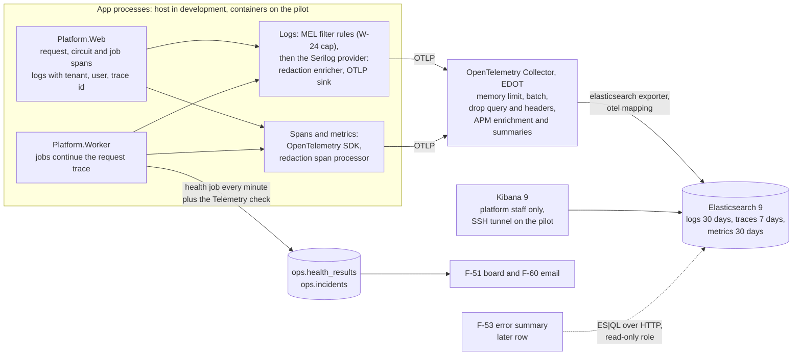
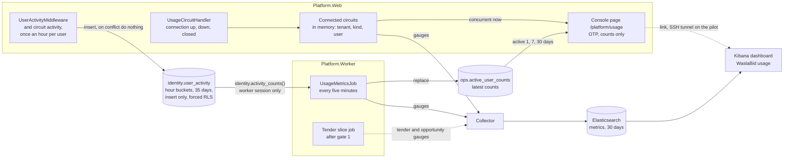

# Observability design (W-10): logs, traces, metrics and health for the pilot

Date: 2026-09-30, revised 2026-10-01
Status: approved. The user answered Q1 to Q8 on 2026-10-01 (section 11, ADR-0014): Serilog stays, as a logging provider only; Elasticsearch and Kibana replace Loki, Tempo, Prometheus and Grafana; no Sentry in the pilot. Q9 to Q12 were answered or adopted on 2026-09-30. Plan tasks 5 to 7 (business metrics and the console usage page) were built and merged in PR #6 on 2026-10-01; the telemetry pipeline (plan tasks 1 to 4, 7b and 8 to 10) was merged in PR #7 on 2026-10-02 (d6a1c0c); its follow-ups are on branch `w-10-followups`. Business metrics (section 6, O-19 to O-26) were added on 2026-09-30 at the user's request: "the observability and dashboard should show how many active users, opportunities, tenders, concurrent users", and the same day "show the business metrics in the platform console too, not only Grafana" (now Kibana). The first draft (written overnight on 2026-09-30) proposed Loki, Tempo, Prometheus and Grafana without Serilog; this revision replaces every section that named them.
Builds on: the foundation, the admin UI slice (spec `2026-09-27-admin-ui-design.md` D-7, D-17, D-18; ADR-0006), W-24 (the Data Protection logging cap) and ADR-0014
Backlog rows: W-10 (P0, hardening before gate 1, docs/05 section 8); it feeds F-51, F-53 and F-60, and the pilot environment W-19

## 1. Scope for the pilot

W-10 is hardening, not a slice (docs/05 section 8): it makes what is already built observable. It adds no module and no tender path. The business metrics add one table in the Identity schema, one in the Operations schema and one console page (section 6); the user decided on 2026-09-30 that this fits the hardening rule (Q11).

In:

- The web host and the worker emit logs through Serilog, registered as a `Microsoft.Extensions.Logging` provider with the OpenTelemetry (OTLP) sink, and traces and metrics through the OpenTelemetry SDK, all to one collector, with the tenant, the user, the vendor company, the job and the trace id on every record.
- A redaction step in the process, before anything leaves it (N-10 secrets, PDPL personal data, vendor and offer data).
- A liveness endpoint beside the existing `/health`, and the worker's health results published as metrics.
- The OpenTelemetry Collector, Elasticsearch and Kibana in the Compose stack, with a one-shot setup container for users, retention and the saved dashboard, sized for the pilot VM (W-19).
- The contract F-53 will read (attribute names and the ES|QL query of the 24-hour error summary), proven by a smoke script, but not the F-53 panel itself.
- A "Telemetry" check in the worker's existing health job, so a dead pipeline is alerted by F-60 like Disk is.
- Business metrics (section 6): concurrent users and active users (1, 7 and 30 days) per tenant and kind, shown on a platform console page `/platform/usage` and on a Kibana dashboard "WaslaBid usage"; the names, definitions and dashboard panels of the tender and opportunity counts, which the tender slices publish.

Out (later rows or slices):

- The F-53 error summary panel and the console's own log and trace views (F-53, after this row; the full view after three to five paying customers, ADR-0006).
- Kibana alert rules and dashboards beyond the usage dashboard (section 6.7); F-60 stays the only alert path in the pilot (O-14).
- Publishing the tender and opportunity counts, and showing them in the console: the tender slices after gate 1 (section 6.5).
- Usage numbers for tenant admins, even for their own tenant: no feature asks for it (section 6.7).
- Tracing inside Caddy and Keycloak (both can export OTLP; not needed to answer the W-10 acceptance).
- Sentry or any Sentry-protocol service (decided 2026-10-01, Q1). Plan task 11 is dropped.
- Logstash and Kibana single sign-on (Q5: Kibana OIDC needs a paid licence; oauth2-proxy is the later option).
- Per-tenant log access for tenant admins (no feature asks for it; F-61 support sessions do not include logs).

## 2. Decisions

Tags follow the user's convention: **Standard** (an industry or platform standard sets it), **Project decision** (follows from a decision already recorded in this repository), **Judgment** (my call; could reasonably go another way), **User decision** (the user chose it).

| # | Decision | Decision taken | Why | Tag | Decided by the user |
|---|---|---|---|---|---|
| O-1 | Sentry | Not in the pilot. Exceptions go to Elasticsearch: the Error status and `exception.type` on the span (span events are not exported since 2026-10-02, section 5.2) and, when the exception is logged (the request exception handler at Error, the job filter at Warning for a failed attempt, or any code that logs it), a log record of the same trace with the exception type, masked message and masked stack; the F-53 summary counts Error and above, so a failed job attempt shows there only through Hangfire's own Error record after its last retry. Errors are triaged in Kibana; the F-53 summary groups them. GlitchTip (Sentry-SDK compatible, about 512 MB) hosted in-Kingdom stays the later option if triage in Kibana proves too weak | Self-hosted Sentry needs 4 cores and 16 GB RAM plus swap (32 GB in practice) and about 40 containers, which does not fit the pilot VM. Sentry SaaS stores data outside the Kingdom (N-01) | User decision | Q1, 2026-10-01 |
| O-2 | Serilog | Kept, registered only as a `Microsoft.Extensions.Logging` provider: a `SerilogLoggerProvider` registered directly as an `ILoggerProvider` (not `ILoggingBuilder.AddSerilog`, which also adds a provider-specific Trace filter rule that overrides the configured category levels; found in task 1, 2026-10-01), never `UseSerilog()` or `services.AddSerilog()`. Serilog's minimum level is Verbose, so the MEL filter rules stay the only level gate; `Enrich.FromLogContext`; the sink `Serilog.Sinks.OpenTelemetry` exports OTLP to the collector. No OpenTelemetry log provider, which would export every record twice | W-24's N-10 cap on Data Protection logging is a set of `LoggerFilterOptions` rules and a startup guard. MEL applies them before any provider sees a record, so they keep working with Serilog as a provider; `UseSerilog()` and `services.AddSerilog()` replace the logger factory and would bypass them silently, which a test pins (`Serilog_is_a_logging_provider_and_never_replaces_the_logger_factory`) | User decision | Q2, 2026-10-01 |
| O-3 | Collector | One OpenTelemetry Collector (the contrib distribution as first built; since 2026-10-02 Elastic's distribution EDOT 9.5.4, which carries the same upstream components plus the `elasticapm` processor and connector, O-4); the app only knows its OTLP endpoint, which is required outside Development and Testing (a host without it does not start, rather than run with no logs; an explicitly empty `Telemetry:OtlpEndpoint` turns export off in tests; ruled in task 1, 2026-10-01). Database spans are recorded only inside a request or job, so background polling makes no root traces. The collector batches, limits memory, drops risky attributes as a second net, and writes logs, traces and metrics to Elasticsearch. No Logstash | ADR-0006 D-18 already names the collector; one endpoint, buffering and retry outside the app | Project decision | No |
| O-4 | Store | Elasticsearch 9.x, single node, 0 replicas, free Basic licence, built-in security on (passwords from `infra/compose/.env`, never in the repository, N-10), TLS off on the internal Compose network. The exporter writes in mapping mode `otel` (OTel-native data streams `logs-*`, `traces-*`, `metrics-*`), so Kibana's Observability views read the data; ECS mapping is the fallback if the smoke task shows they do not (risk, plan task 10). One set of data streams for every tenant. As built (2026-10-02): collector 0.161.0 deprecates `mapping::mode` and ignores it, so the exporter sets `mapping: allowed_modes: [otel]`, which makes otel the default and the only mode a client may ask for. Smoke outcome (step 9, first run): Kibana Discover and the Observability "All logs" view found the deliberate failure's logs and trace by trace id, but Kibana's APM trace view showed no data for the OTel-native traces (`has_data` false). **Resolved 2026-10-02 (W-10 follow-ups), otel mapping kept:** contrib 0.161.0 carries no `elasticapm` component, so the collector image became EDOT 9.5.4 (`docker.elastic.co/elastic-agent/elastic-otel-collector`, the same Elastic release as the stack, upstream components at 0.159), with the `elasticapm` processor in the traces pipeline after the two redaction steps (it adds `processor.event`, `transaction.*`, `event.outcome`) and the `elasticapm` connector fed by traces and logs, writing the APM summary streams `metrics-{service_summary,service_transaction,transaction,service_destination}.{1m,10m,60m}.otel-default`, which Elasticsearch's built-in templates put under the `waslabid-metrics` retention. Step 9 passes: `has_data` true, and `/app/apm/link-to/trace/<id>` opens the `GET /dev/throw` transaction of `waslabid-web`. Field names did not change | ADR-0014. One store and one UI for logs, traces and metrics. Only platform staff read telemetry, so per-tenant indices would add cost without a reader | User decision (store), Judgment (one set of data streams) | Backend, 2026-10-01 |
| O-5 | Traces | In Elasticsearch, 100 percent sampling (parent-based) | Pilot volume is tiny, and every failed request must have its trace | Judgment | No |
| O-6 | Metrics | In Elasticsearch, through the same collector; no Prometheus | ADR-0014; request rate, latency, error rate, runtime, Npgsql pool, health results and the usage gauges in one store | User decision | Q3 superseded, 2026-10-01 |
| O-7 | Correlation id | The W3C trace id is the correlation id. Every response carries it in `X-Correlation-Id`; `ProblemDetails` already carries `traceId`. No second id is invented | W3C Trace Context; one id to paste into Kibana | Standard | No |
| O-8 | Inbound trace context | A `traceparent` sent from the internet is not trusted: the web host starts its own trace per request | A client could otherwise choose trace ids (collide with another request in F-53's lookup) or force sampling flags | Judgment | No |
| O-9 | Context on every record | `waslabid.tenant.id` and `waslabid.tenant.slug` (tenant hosts), `user.id` (the Keycloak `sub`, after sign-in), `waslabid.vendor_company.id` (vendor requests), `waslabid.job.id` and `waslabid.job.type` (worker), `waslabid.component` (section 5.3), plus the trace and span ids. Never an email, a name, a CR or national id number, a file name, or offer content | What F-53 filters on (tenant, correlation, component); the ids are pseudonymous and already used in today's log lines | User decision (ids in logs are personal data under PDPL, limited by retention O-12) | Q7, 2026-10-01 |
| O-10 | Redaction | Two layers: (1) at the source, log templates never take personal or secret values, enforced by a test over every `[LoggerMessage]` template; (2) in the process, before export, a Serilog enricher and destructuring policy for logs and an OpenTelemetry span processor for spans mask emails, runs of ten or more digits, JWTs, Bearer and Basic credentials and `Authorization:` header values (added 2026-10-02), and `password=`/`pwd=` pairs in messages, properties, span tags and exception messages, and drop query strings. Since the final fix wave (2026-10-02, pentest F-OBS-01 to F-OBS-07): a non-ASCII value is matched on a normalised copy (format characters removed, NFKC), digits of any script and digit groups joined by one space or hyphen count, emails take every RFC 5322 local-part character and Unicode domains, `key: value` and JSON secret pairs are masked, and a value under a secret key name (`Authorization`, `Cookie`, `Password`, `Token`, `ConnectionString`, Npgsql's data source and pool names) is replaced whole on logs and dropped on spans. Since the follow-ups of 2026-10-02 (section 7.1): digit groups joined as people write phones count as one run (mixed spaces and hyphens, tabs, two spaces, parentheses, dots, a one-digit group such as `+966 5`), while the platform's own references (`RFP-2026-000045`; prefixes RFP, RFQ, PO, TND only, fix round 1) and dates with a one- or two-digit suffix (`2026-10-02-15`) are kept; no span event leaves (the OTLP exporter's event limit is 0, fix round 1), and a span keeps `exception.type`. The collector drops `url.query`, request headers, `user_agent.original` and `db.npgsql.data_source` again | N-10 and PDPL; the source rule is how the code base already works (ids and `{ErrorType}`, never `ex.Message`), the in-process step catches framework and library text we do not write | Standard (N-10), Judgment (the patterns) | No |
| O-11 | Bodies and offers | No request or response body, form value, header value or query string is ever captured (no HTTP logging middleware, no body enrichment; the user agent, `user_agent.original`, is dropped from every span since the final fix wave, 2026-10-02); financial envelope content never enters a log record, span or metric label in any slice | Sealed envelopes (F-23) and PDPL; an attempt to read a sealed envelope is an audit row (`audit.events`), not a log line | Project decision | No |
| O-12 | Retention | Index lifecycle policies: logs 30 days, traces 7 days, metrics 30 days on the pilot; 3 days on developer machines. Telemetry is not backed up. As built: Elasticsearch 9.5's OTel templates use ILM, so `elastic-setup` creates `waslabid-logs`, `waslabid-traces` and `waslabid-metrics` (daily rollover, delete at the configured age) and attaches them through the `logs-otel@custom`, `traces-otel@custom` and `metrics-otel@custom` component templates, which touches only OTel data streams; data goes between the age and one day after it | 30 days matches the F-60 incident list and lets a late-reported pilot problem be traced; traces are the bulkiest. Audit evidence lives in PostgreSQL, not in logs | User decision | Q7, 2026-10-01 |
| O-13 | Who reads telemetry | Platform staff only, through Kibana (and later the console's F-53). Elasticsearch, Kibana and the collector are never published outside the Compose network on the pilot; on developer machines they bind to `127.0.0.1` | ADR-0006: operations data belongs to the platform realm's staff | Project decision | No |
| O-14 | Alerts | F-60 (the worker's health job, email) stays the only alert path. W-10 adds a non-board component "Telemetry" (collector health and Elasticsearch cluster health) so a dead pipeline alerts like Disk does. Since 2026-10-02 it also reads Elasticsearch's disk use per node (`_nodes/stats/fs`, in parallel with the cluster health, the same monitoring user, cluster privilege `monitor`): Degraded at or above 90% (the high watermark), Unhealthy at or above 95% (the flood stage, where every index turns read-only while the cluster stays green). No Kibana alert rules in W-10 | One alert path, one incident list; Kibana alerting would be a second channel with its own recipients and its own history | Judgment | No |
| O-15 | Health endpoints | Keep `/health` exactly as it is (readiness, includes the key ring; the worker probes it for F-51). Add `/alive` (liveness: the process answers, no dependency) for container health checks on the pilot. The worker keeps opening no port | `/health` and `/alive` is the .NET Aspire service-defaults convention; a path outside `/health/*` keeps TenantMiddleware's rule that only the exact `/health` skips tenant resolution | Standard | No |
| O-16 | Console output outside Development | Off. Outside Development and Testing, logs leave only through Serilog's OTLP sink (redacted). Development keeps the console | Container stdout would keep an unredacted, unrotated second copy outside the retention in O-12 and can fill the pilot disk. Cost: `docker logs` shows only startup failures that happen before the pipeline starts, which the host still writes to stderr | User decision | Q8, 2026-10-01 |
| O-17 | Compose layout | The collector, Elasticsearch and the one-shot `elastic-setup` are part of the default stack, each with a memory limit; Kibana and its one-shot `kibana-setup` (saved objects import) sit in the Compose profile `kibana` and run only when someone looks (`docker compose --profile kibana up -d`), locally and on the pilot (trimmed by the user on 2026-10-01, section 9) | Developers see the same pipeline as the pilot; about 2.1 GB always on (Elasticsearch 1.75 GB and the collector 320 MB since 2026-10-02; 1.75 GB before), Kibana's 1280 MB only while in use (768 MB heap; 9.5.4 ran out of heap with 512 and 640 MB), which matters on a 16 GB laptop and the 12 GB pilot VM | Judgment | No |
| O-18 | Kibana access on the pilot | Through an SSH tunnel only, with Kibana's own login: a named platform-staff Elasticsearch user whose password lives in the secret store. Kibana OIDC needs a paid licence; oauth2-proxy in front of Kibana with the `waslabid-platform` realm is the later option when a third person needs access | Nothing new exposed to the internet on a single VM; two partners are the only readers | User decision | Q5, 2026-10-01 |
| O-19 | Business metric names and labels | Meter `WaslaBid.Usage`; tags only the tenant slug, the kind of user and small fixed value sets (window, tender state, visibility); never a user id, vendor company id, tender id or tenant-defined text (section 6.1) | Every label value is a dimension kept 30 days on every data point; a label cannot be redacted afterwards (N-10, PDPL) | Judgment | No |
| O-20 | Concurrent users | Counted in the web host from the Blazor circuit handler chain that W-21 extended: one more `CircuitHandler` keeps a registry of connected circuits in process memory; gauges read it (section 6.3) | Reuses the existing mechanism; no store, no per-request cost | Judgment | No |
| O-21 | Active users | Hourly activity buckets in a new table `identity.user_activity` (insert only, forced row-level security, 35 days), written at most once an hour per user, tenant and kind; a worker job counts them every five minutes (section 6.4) | Counts use, not sign-ins; retention under our control; see the options weighed in 6.4 | Judgment | Q10, adopted 2026-09-30 |
| O-22 | Tenders and opportunities | Names, tags, definitions and dashboard panels fixed now; the tender slices publish them after gate 1 (section 6.5) | No Tenders module exists and W-10 adds no tender path (docs/05 section 8) | Project decision | Q9, adopted 2026-09-30 |
| O-23 | Where usage shows | Both: a console page `/platform/usage` that reads stored results, never Elasticsearch (section 6.6), and a Kibana dashboard for history (section 6.7), linked from the page | Decided by the user on 2026-09-30; the dashboard moved from Grafana to Kibana with ADR-0014 on 2026-10-01. The console is where the partners already work, with OTP; Kibana is reachable only through the SSH tunnel on the pilot (O-18) | User decision | 2026-09-30 |
| O-24 | Who counts, and as what | Kinds `staff`, `vendor` and `platform`; anonymous sessions and applicants without a company are not counted (section 6.2) | A small, fixed tag set; an applicant is not yet a vendor of anything | Judgment | No |
| O-25 | Console page placement | A new console page `/platform/usage` with its own navigation entry, not a section of the health board or a wider tenants table | The tenants table (F-54) already has five columns and a jobs table; eight usage numbers per tenant do not fit beside them, and the health board is about components | Judgment | Q12, adopted 2026-09-30 |
| O-26 | Tenders on the console page | Left off the usage page until the tender slice adds a "Tenders" section; F-54's "Active tenders" dash (admin spec D-12) stays the only sign of the gap | A section of dashes is noise; D-12 chose a dash for one column, not a whole section | Judgment | Q12, adopted 2026-09-30 |

## 3. Architecture

Read it as: the app never talks to a store directly; logs pass the MEL filters and then Serilog's redaction, spans and metrics pass the span processor, everything leaves through the collector into Elasticsearch, and Kibana is the one UI. The health job that already drives F-51 and F-60 also watches the pipeline.



## 4. What exists today and what W-10 changes

| Area | Today | W-10 |
|---|---|---|
| Logging | `Microsoft.Extensions.Logging`, default providers, 64 source-generated `[LoggerMessage]` methods that log ids and `{ErrorType}`, never `ex.Message` | Adds Serilog as one MEL provider (minimum level Verbose, `Enrich.FromLogContext`, redaction enricher and destructuring policy, OTLP sink); console only in Development (O-16); the W-24 cap (`KeyRing.CapDataProtectionLogging`) and its startup guard apply unchanged, because MEL filters before any provider |
| Traces and metrics | None | OpenTelemetry SDK in both hosts; ASP.NET Core, HttpClient, Npgsql, runtime; our own `WaslaBid.Jobs` and `WaslaBid.Operations` sources and meters |
| `/health` (web) | Anonymous, skips tenant resolution, key-ring check cached 5 s, answers `Healthy`/`Unhealthy` only | Unchanged; excluded from traces. New `/alive` |
| Worker health job (F-51, F-60) | Seven board components plus Disk, results in `ops.health_results`, incidents and emails | Adds the non-board component Telemetry (O-14); publishes each result as a metric |
| Hangfire | `TenantJobFilter` stamps `TenantId` and `Tenant`; `TenantJobActivator` restores them | Also stamps `TraceParent`; a server filter opens the job span and log scope |
| Compose | Eight services | Plus the collector, Elasticsearch, Kibana and the one-shot `elastic-setup` |
| Circuit handlers | `TenantCircuitHandler`, `VendorCircuitHandler`, `CircuitSessionGuard` (W-21) | Plus `UsageCircuitHandler`, which keeps the registry of connected circuits (section 6.3) |
| Usage numbers | Built in PR #6: concurrent and active users on `/platform/usage`, with an "Open in Grafana" link (`GrafanaLink`) | The link becomes "Open in Kibana" (`KibanaLink`, plan task 7b); the Kibana dashboard "WaslaBid usage"; the tender names that `ITenderCounts` (D-12) will fill |

What W-10 adds for rows that depend on it:

- **F-51** is Done as narrowed without W-10 and needs nothing more to stay Done. W-10 adds `/alive` for the pilot's container health checks, health history as metrics (the board shows only the latest result), a trace per check run, and `service.version` on every record, which is what a later version column would read (the column itself stays narrowed out).
- **F-60** is Done as narrowed; its note says W-10 was not Done. W-10 adds the Telemetry component to its incident pipeline and changes nothing else.
- **F-53** (MVP: 24-hour error summary per component from Elasticsearch with a Kibana link) is unblocked by W-10: section 8 fixes the attributes and the query it will use, and the smoke script proves them against the running stack.
- **W-19** (pilot on Oracle Cloud Always Free) depends on W-10 since 2026-10-01 (Q4); section 9 gives the memory budget it needs.

## 5. What the app emits

### 5.1 Resource

Every record carries `service.name` (`waslabid-web` or `waslabid-worker`), `service.version` (the assembly's informational version, the git commit in CI builds), `service.instance.id` and `deployment.environment.name` (`development`, `pilot`). The OpenTelemetry SDK and Serilog's OTLP sink are given the same resource attributes.

### 5.2 Traces

- **Web:** a server span per HTTP request (route, method, status; `url.query` redacted by the instrumentation's default and dropped by our processor), client spans for HttpClient (Keycloak Admin API, Keycloak organization checks) and Npgsql (statement text only, parameters never), and, if .NET 10's Blazor activity source is present, circuit and event spans. Not traced: `/health`, `/alive`, `/_framework/*`, `/_content/*` and static assets.
- **Worker:** a span per Hangfire job named `job <Type>.<Method>`, a child of the request that enqueued it (the `TraceParent` job parameter), or a new trace for recurring jobs; status Error with the exception type when the job fails. The health job's run is one span with a child per check.
- **Tags on the server or job span:** the context in O-9.
- **No span events (2026-10-02, fix round 1).** Both hosts set the OTLP exporter's `OTEL_SPAN_EVENT_COUNT_LIMIT` to 0 in their configuration (`TelemetryModule.SpanEventCountLimit`, the last configuration source, so no environment variable raises it): the exporter writes no event, only the count it dropped. In the otel mapping each event would be a `logs-*` document (Npgsql records `received-first-response` on every command, about 1,200 an hour on an idle stack), and an event cannot be masked once recorded. The exception's type stays on the span as `exception.type` (copied from an `exception` event by the span processor when an instrumentation did not set it: Npgsql, and .NET 10's own HttpClient activity), with the Error status and Npgsql's `error.type`; the masked message and stack are on a log record of the same trace only when something logs the exception (the request exception handler always does, at Error; the job filter always does, at Warning for the failed attempt; a caller that catches and handles it without logging leaves only the type and the status). Proved on the wire by an integration test against a fake OTLP gRPC receiver.

### 5.3 Logs

- Every record carries the trace and span id (Serilog takes them from the current activity), the context in O-9 as properties (MEL log scopes, which the Serilog provider turns into properties, and `LogContext`), the message template and the rendered message, and for an exception `exception.type`, `exception.message` (masked) and `exception.stacktrace` (masked). The raw exception message never leaves: an enricher cannot replace Serilog's `LogEvent.Exception`, so the OTLP sink receives the event without it and with the three properties instead (plan task 3).
- `waslabid.component` is derived from the logger category (Serilog's `SourceContext`) by a fixed table, so F-53 can group errors per component: `Platform.Modules.<Name>.*` gives the module name (Vendors, Identity, Operations, ...), `Npgsql*` and `Microsoft.EntityFrameworkCore*` give `PostgreSQL`, `Amazon.*` gives `MinIO`, `MailKit*` gives `SMTP`, `Hangfire*` gives `Jobs`, `Microsoft.AspNetCore.*` and `Platform.Web.*` give `Web`; anything else gives the service name. The PostgreSQL, MinIO and SMTP names are the `HealthComponents` names, so a board tile and its errors share a word.
- Levels: the MEL rules decide, Serilog passes everything it receives (minimum level Verbose). `Information` by default, `Microsoft.AspNetCore` at `Warning` (as today), Data Protection capped at `Information` for every provider (W-24).

### 5.4 Metrics

ASP.NET Core request duration and active requests, HttpClient duration, `System.Runtime` (GC, thread pool, exceptions), Npgsql connection pool, Hangfire job duration and failures (`waslabid.jobs.duration`, `waslabid.jobs.failed` with `waslabid.job.type`, the same name as on spans and logs, O-9; aligned 2026-10-01), and the health results (`waslabid.health.status` as 0 Healthy, 1 Degraded, 2 Unhealthy, and `waslabid.health.check.duration`, both per `waslabid.component`, the same key as on logs; aligned 2026-10-02). These technical metrics never carry a tenant label (cardinality, and metrics are kept as long as logs). The business metrics in section 6 are the one exception: they carry the tenant slug, under the rules in 6.1.

### 5.5 Temporality (2026-10-02)

Both hosts' OTLP metric readers prefer delta temporality. The collector's Elasticsearch exporter (otel mapping) drops cumulative histograms, so with the SDK's default no request, database, HttpClient, job or health-check duration reached `metrics-*`; with delta they are stored as `histogram` fields (verified live 2026-10-02 with ES|QL on `metrics.http.server.request.duration`, `metrics.waslabid.jobs.duration`, `metrics.db.client.operation.duration`). Every monotonic counter (`waslabid.jobs.failed`, the runtime, Npgsql and HttpClient counters) is sent as a delta too, so a query sums it over a window rather than reading the last value. The backing index written before the change maps those fields as `counter_long` (cumulative), so until that index ages out under the metrics retention a field holds cumulative values in the old index and deltas in the new one; the dev stack's `metrics-generic.otel-default` was rolled over on 2026-10-02 so the new index starts clean. Up-down counters stay cumulative, and gauges, every business metric of section 6 among them, have no temporality and are unchanged.

## 6. Business metrics: users, tenders and opportunities

Asked by the user on 2026-09-30: "the observability and dashboard should show how many active users, opportunities, tenders, concurrent users", then "show the business metrics in the platform console too, not only Grafana" (Kibana since ADR-0014). Read as: platform staff see, per tenant and in total, how many people use the product now and in the last day, week and month, and how much tender activity there is. Counts only, never who.

Read the diagram as: concurrent users come from the web host's own memory, active users from hourly activity rows counted by a worker job; the console reads the web host's registry and the job's stored results, Kibana reads Elasticsearch; the tender counts join the same meter when the tender slices exist.



### 6.1 Metrics

All on meter `WaslaBid.Usage` (a constant in `TelemetryNames`, with every name and tag below, so the tender slices use the same constants).

| Name | Instrument, unit | Tags | Meaning | Published by |
|---|---|---|---|---|
| `waslabid.circuits.connected` | observable gauge, `{circuit}` | `waslabid.tenant.slug`, `waslabid.user.kind` | Blazor circuits whose connection is up now, on this web instance | W-10, web host (6.3) |
| `waslabid.users.concurrent` | observable gauge, `{user}` | `waslabid.tenant.slug`, `waslabid.user.kind` | Distinct signed-in users with at least one connected circuit | W-10, web host (6.3) |
| `waslabid.users.active` | observable gauge, `{user}` | `waslabid.tenant.slug`, `waslabid.user.kind`, `waslabid.window` (`1d`, `7d`, `30d`) | Distinct users with an authenticated request or circuit activity in the window | W-10, worker (6.4) |
| `waslabid.users.active.all_tenants` | observable gauge, `{user}` | `waslabid.user.kind`, `waslabid.window` | The same across all tenants, each user once (a vendor active on two tenants counts once) | W-10, worker (6.4) |
| `waslabid.tenders` | observable gauge, `{tender}` | `waslabid.tenant.slug`, `waslabid.tender.state`, `waslabid.tender.visibility` (`invited`, `open`) | Tenders per F-15 stage now | the tender slice (6.5) |
| `waslabid.opportunities` | observable gauge, `{tender}` | `waslabid.tenant.slug`, `waslabid.tender.visibility`, `waslabid.directory` (`not_listed`; `listed` from F-62) | Tenders a vendor can bid on now (6.5) | the tender slice; F-62 adds `listed` |

Label rules (O-19):

- Tags take the tenant slug and small fixed value sets only. Never a user id, a vendor company id, an email, a tender id or reference, or text a tenant defines: the workflow steps a tenant adds (F-56) are not stages, and `waslabid.tender.state` takes only the fixed F-15 stages in snake case (`draft`, `published`, `clarification`, `closed`, `compliance_screening`, `technical_evaluation`, `technical_locked`, `financial_opening`, `financial_evaluation`, `finance_approval`, `awarded`, `cancelled`).
- The slug, not the tenant id: it reads in a filter, it is not personal data, and it is bounded by the number of tenants. At N-06 scale (50 tenants) the usage metrics are about 2,000 time series (most of them the tender gauges), small for Elasticsearch at a 60-second export interval.
- `platform` users carry no tenant tag.
- The otel mapping keeps the dotted names: metric values under `metrics.<name>` and tags under `attributes.<name>` (for example `metrics.waslabid.users.active` by `attributes.waslabid.tenant.slug`); plan task 10 records the exact field names, as it does for logs.

### 6.2 Who counts, and as what (O-24)

One classifier, `UsageKind`, in the web host, used by both the circuit registry and the activity recorder:

| Session | Kind |
|---|---|
| Signed in on a tenant host as a staff member of that tenant (the members claims transformation gave it a tenant role), no vendor context | `staff` |
| Signed in on a tenant host with a vendor context under the Vendor policy (set by `VendorContextMiddleware`, or by `VendorCircuitHandler` in a circuit) | `vendor` |
| Signed in on the platform host (the `PlatformAdmin` policy passed) | `platform` |
| Anonymous; signed in but neither of the above (an applicant before its company exists, a vendor on the join page of a tenant it has not joined, under the JoiningVendor policy); a session W-21 has ended | not counted |

An applicant's circuits still count in the framework's own total of circuits (`aspnetcore.components.circuit.*`, if .NET 10 publishes it; plan task 1 reports whether it does), so load is visible even where use is not counted.

### 6.3 Concurrent users (O-20)

- `UsageCircuitHandler` is a `CircuitHandler` ordered after `CircuitSessionGuard` (`int.MinValue + 3`), so the tenant, the acting user and the vendor context are already set. On `OnConnectionUpAsync` it classifies the circuit once (the principal is fixed for the circuit's life) and adds the circuit's id, tenant slug, kind and user `sub` to the singleton `ConnectedCircuits`; on `OnConnectionDownAsync` and `OnCircuitClosedAsync` it removes it. A disconnected circuit held for reconnection does not count; a reconnection counts again. A circuit whose session W-21 ended leaves the registry at once.
- The gauges read the registry when metrics are collected: circuits per tenant and kind, and distinct `sub` values per tenant and kind. The `sub` stays in process memory for the life of the connection and is never exported.
- The console page reads the same registry directly (6.6).
- Per instance: each web instance knows only its own circuits. The Kibana dashboard sums over instances, and a user connected to two instances counts twice; the console shows only the instance that serves it. Both are right for the single-VM pilot (one web instance, W-19). With several instances, each would write its counts to a shared store (a Redis set per tenant and kind with a short expiry) and both readers would take the union; that is noted here, not built.
- A gauge is a sample at export time (every 60 seconds by default), so peaks shorter than that are missed. It is what N-06 (200 concurrent users) is measured against.
- Circuits are not users, by design: `waslabid.circuits.connected` counts connected tabs, so one user with many tabs open raises it (a load figure for the web instance), while `waslabid.users.concurrent` counts distinct users. The console's "Online now" tile and table use the users figure, never the circuit count.

### 6.4 Active users (O-21)

Options weighed for the source:

| Option | For | Against |
|---|---|---|
| **A. Our own hourly activity rows in the Identity schema (adopted)** | Counts use, not sign-ins; per tenant and kind; one small insert per user per hour; retention under our control | A new table and a write path |
| B. Keycloak login events (event store, read through the Admin API) | Nothing to build in the app | A sign-in is not use: a cookie session and an open circuit last for days without a new login, so a daily user may show one login a week. Events carry the IP address and user agent in Keycloak's database under its own expiry, a second personal-data store. One realm for every tenant and one vendor identity across tenants (ADR-0008) make the tenant of a login guesswork. The job would page the Admin API |
| C. Reuse `audit.events` | The table exists | It is the tenant's legal log, append-only and read by tenant admins (F-41): a row per user and hour would drown it and turn it into a user activity list for the tenant |
| D. A `last_seen_at` column on `identity.members` | One column | Staff only (vendors are not members), no history for the 7- and 30-day windows, and an update on every sign-of-life |

Design (A):

- **Table.** `identity.user_activity (tenant_id uuid, user_id text, kind text check (kind in ('staff', 'vendor')), hour timestamptz, primary key (tenant_id, user_id, kind, hour))`, migration `0003_identity_user_activity.sql` (as built: 0003, since pull request #5 adds identity 0002). A trigger sets `hour = date_trunc('hour', now(), 'UTC')` from the database clock, as audit 0003 does for `occurred_at`, so no session chooses its hour, not even through its time zone: a bucket is a UTC hour (after the pentest, PT-W10-03; a zone such as UTC+05:45 would otherwise start it at :15).
- **Isolation.** Forced row-level security with two policies, modelled on `audit.events`: `tenant_isolation` for SELECT with the staff-only rule, and `tenant_activity_insert` for INSERT with `tenant_id = platform.current_tenant() and user_id = platform.current_user_id() and ((kind = 'staff' and platform.current_vendor_company() is null) or (kind = 'vendor' and platform.current_vendor_company() is not null))`: a session writes only its own row, for its host tenant, in the kind its context allows (ADR-0012). `erp_app` holds INSERT only; with no SELECT, UPDATE or DELETE grant, no request-path session reads activity, not even staff of the same tenant (the SELECT policy is there for the catalog rule and as a second wall). The catalog test that pins every tenant table's policies gains an explicit case for this table, as it has for `audit.events`.
- **Write.** `IUserActivityRecorder` (Identity contracts), called by `UserActivityMiddleware` after `VendorContextMiddleware`, and by `UsageCircuitHandler`'s inbound activity handler, so a user working in one long circuit counts. A process-wide throttle keyed by tenant, user, kind and hour lets only the first call of each hour through; the insert is `on conflict do nothing`, so a second instance or a restart repeats a harmless insert. A failed write is logged with `{ErrorType}` only and never fails the request or the circuit event. `/health`, `/alive`, static files and anonymous requests record nothing.
- **Count.** Security-definer `identity.activity_counts(p_now timestamptz)` returns tenant id, kind, window and user count for 1, 7 and 30 days, plus rows with no tenant for the distinct count across tenants; `identity.prune_activity(p_before timestamptz)` deletes older buckets and refuses (22023) a missing cutoff or one later than `now() - 31 days`, so no caller deletes a bucket the 30-day count still needs (after the pentest, PT-W10-02; refused rather than clamped, since the only caller passes 35 days and any other cutoff is a bug to surface). Both answer only a session with neither a tenant nor a vendor context and no acting user, which is the worker (the platform console always has an acting user), as the worker's vendor functions do (ADR-0012 point 4), and return counts, never rows.
- **Job.** `UsageMetricsJob` in the Operations module, a platform job (no tenant) every five minutes, reads the counts through `IUserActivityCounts` (Identity contracts), maps tenant ids to slugs through `ITenantSlugs` (Tenancy contracts; as built, since `ITenantCatalog` refuses any scope that is not a platform console request and the worker never marks one: slugs only, for a scope with neither a tenant nor a vendor context), replaces the rows of `ops.active_user_counts` in one transaction (6.6), and keeps the same result in memory for its observable gauges, so the console and Kibana show the same numbers and a metric export never queries the database. A result older than 15 minutes is not reported: a stopped job shows as a gap, not a flat line. Once a day it prunes buckets older than 35 days (as built: a second recurring entry, `usage-activity-prune`, of the same job class). The worker gains a reference to the Identity module for these registrations only (`AddIdentityActivityCounts()`, no Keycloak settings needed). The web host does not register `IUserActivityCounts` at all (`AddIdentityModule` leaves it out, after the pentest, PT-W10-01): in the database "worker only" means "no context", which a web-host scope without a request has too, so the service is kept out of the web host's container. Since W-36 (2026-10-03, ADR-0012 addendum): the worker connects as its own role `erp_worker`, which alone holds EXECUTE on `identity.activity_counts` and `identity.prune_activity` and INSERT and DELETE on `ops.active_user_counts` (identity 0004, operations 0007); `erp_app` lost them, so the web host cannot count or prune even with its own connection.
- **Windows.** Rolling, to the hour: "1d" is the last 24 hourly buckets, so a user seen at 09:10 counts until about 09:00 the next day.
- **Retention.** Buckets 35 days (the 30-day window plus margin), then deleted; the metrics 30 days in Elasticsearch (O-12); both decided under Q7.

### 6.5 Tenders and opportunities (O-22): named now, published by the tender slices

The Tenders module does not exist, and tender slices wait for gate 1 (W-31, docs/05 section 8). W-10 therefore fixes the names, the definitions and the dashboard panels only. The slice that publishes tenders publishes both gauges on `WaslaBid.Usage` with these names, from a snapshot job of its own in the pattern of 6.4; fills `ITenderCounts` (admin spec D-12) from the same count, which replaces F-54's "Active tenders" dash; and adds a "Tenders" section to the console usage page (O-26). The F-16 and F-62 acceptance in docs/09 says so.

- **Tender:** any tender of the tenant, by its F-15 stage and its visibility: `invited` (F-19) or `open` (F-19b, ADR-0008).
- **Opportunity:** a tender a vendor can bid on now: stage `published` or `clarification`, visibility Open or Invited, submission deadline in the future. A draft, a closed tender or a tender past its deadline is not one. When F-62's cross-tenant directory exists, a listed tender is counted once, with `waslabid.directory` = `listed`, not added a second time, so a sum never counts a tender twice. Adopted as recommended in Q9.
- Business history beyond 30 days (tenders per month over a year) is a database report, not telemetry: Elasticsearch keeps metrics 30 days (O-12).

### 6.6 The console usage page (O-23, O-25, O-26)

A page `/platform/usage` on the platform host, with its own entry "Usage" in the console navigation between Tenants and Jobs (built in PR #6).

- **Access:** the `PlatformAdmin` policy, like every console page: platform realm, `platform-admin` role, `acr` 2 (OTP) (admin spec D-1, D-2; ADR-0006). A tenant or vendor session is sent to the platform realm's sign-in and sees nothing, as on the other console paths (`CrossHostSessionTests`).
- **Content, top:** four `StatTile`s, each with the total and the staff and vendor split: "Online now", "Active today", "Active in 7 days", "Active in 30 days". Totals count each user once across tenants (`all_tenants` rows); a vendor active on two tenants counts in each tenant's row and once in the total, and the page says so in one line.
- **Content, table:** a `DataTable` with one row per tenant (portal name and slug, as on the tenants page): online now, today, 7 days and 30 days, each cell staff and vendor on two lines. A tenant with no activity shows zeros; an unknown number shows a dash, never a guess (as D-12).
- **Freshness:** the time of the job's last result through `ConsoleTime`; a result older than 15 minutes shows every active count as a dash with "Unknown", as the health board does for a stale result. A Refresh button reloads, as on the health board. Platform users are not shown (they are the readers).
- **Sources:** concurrent users from the web host's own `ConnectedCircuits` (6.3, with the per-instance caveat); active users from `ops.active_user_counts`, read through `IUsageLog` (Operations contracts), the same pattern as `IHealthLog` and `ops.health_results` (admin spec D-7). The page never queries Elasticsearch or Kibana, so it works without the telemetry stack and on the pilot without the tunnel.
- **`ops.active_user_counts`:** `(tenant_slug text null, kind text, time_window text, users integer, computed_at timestamptz)`, unique on slug, kind and window with nulls not distinct; a null slug is the across-tenants row. A platform aggregate like the other `ops` tables: no `tenant_id` column (the catalog test's rule for tenant-owned rows stays as it is), no personal data, `erp_app` holds select, insert and delete; the job replaces all rows in one transaction. As built, the table is also under forced row-level security (operations 0006): reading admits a session with neither a tenant nor a vendor context (the worker and the platform console, like the read rule of `ops.platform_audit`), and inserting and deleting admit only such a session with no acting user, which is the worker; so no tenant or vendor session reads every tenant's counts and the console cannot change them.
- **Kibana link:** "Open in Kibana" to `{Observability:KibanaUrl}/app/dashboards#/view/waslabid-usage`, shown only when the setting is an absolute `http` or `https` address (`KibanaLink`); any other value (a relative path, `javascript:`, `data:`, `file:`, a host without a scheme) shows no link and logs one warning per process that names the scheme only, never the value. The link is built on the address's parts (W-10 follow-up, 2026-10-03): the dashboard's path goes after the configured path (a Kibana space is a path prefix, `/s/{id}`), its fragment replaces a configured one, and a query and user information (`user:password@`) are dropped, never shown on the page (N-10): Kibana needs nothing from a query (its global state `_g` lives inside the hash route), while a proxy in front of it may take a token there (`?token=`). On the pilot it opens through the SSH tunnel (O-18). As built in PR #6 the link was "Open in Grafana" (`GrafanaLink`, `Observability:GrafanaUrl`, `data-grafana`); plan task 7b renames it with the same validation.
- **UI rules:** Platform.UI components only, logical direction utilities only, every string in the Arabic and English resources, `data-*` hooks for tests as on the other console pages. The one new component, `StatTile` (label, value, optional split lines, a dash with "Unknown" for no value), is in `Platform.UI`, `/dev/gallery` in both directions, with bUnit tests and a new golden set.
- **No tender section** until the tender slice (O-26).

### 6.7 The Kibana dashboard, and who sees what

- A dashboard "WaslaBid usage" (saved object id `waslabid-usage`) over a data view on `metrics-*`, kept as saved objects NDJSON under `infra/compose/observability/kibana/` and imported, overwriting, by the one-shot `kibana-setup` container (profile `kibana`; it signs in as `elastic`, because the staff user's `viewer` role cannot write saved objects, while `elastic-setup` prepares users, retention and the usage mappings), so the file in the repository is the source of truth. Controls: `tenant` (options list on the tenant slug, multi-select) and `kind`.
- Panels. **Now:** concurrent users by kind (metric and time series, with a reference line at N-06's 200), connected circuits. **Active:** active users 1, 7 and 30 days by kind (metric), daily active users over 30 days (time series of the `1d` window), active users per tenant (table; the last value in the time range of each kind, added, so a change shows at the next collection: final fix wave 2026-10-02). **Tenders:** opportunities now by visibility, tenders by stage, opportunities over time; each shows "No results" until the tender slice publishes, and its description says so.
- The console shows the numbers now; Kibana adds the 30-day history. The console page does not draw history in W-10.
- Platform staff only, as all telemetry (O-13, O-18). The staff user has the built-in `viewer` role: it reads the data and the dashboards and cannot change users, roles or saved objects. Elasticsearch holds no PostgreSQL data, so no panel can list users, and user ids are not labels, so no query can.
- Tenant admins see no usage numbers, not even their own tenant's: no feature asks for it. If one does, it reads the database through a tenant-scoped function, never Elasticsearch, which holds every tenant's series (as 7.2 says for logs).

### 6.8 Privacy

- Counts only, pseudonymous: activity rows keep the Keycloak `sub` and never an email or name; metric labels and `ops.active_user_counts` keep only the tenant slug and fixed values.
- No request-path session reads activity rows; the counting function returns counts; the circuit registry keeps a `sub` in memory only while its connection is up.
- Retention: activity buckets 35 days, then deleted; metrics 30 days; the stored counts are replaced every five minutes. Decided with the other retention periods in Q7.

## 7. Redaction and isolation

### 7.1 What never leaves the process

Redaction in the process runs in the Serilog enricher and destructuring policy for logs and in the span processor for spans; both use one `TelemetryRedactor`.

| Data | Rule | Where it is enforced |
|---|---|---|
| Secrets (N-10): connection strings, client secrets, tokens, cookies, key ring elements | Never logged; masked if a library writes one | Source rule; redactor patterns `password=`, `password: `, `"password":"..."` (and `pwd`, `secret`, `apikey`), JWT (`eyJ...`), `Bearer ...`, `Basic ...` (base64 of `user:password`), `Authorization:` header values; the whole value under a secret key name (property, dictionary key, structure member, span tag: authorization, cookie, password, pwd, secret, token, apikey, connectionstring, `db.client.connection.pool.name`, `db.npgsql.data_source`); named Npgsql data sources and no pool name on metrics; W-24 cap on Data Protection; no header capture |
| Personal data (PDPL): emails, names, phone, national id, iqama, CR numbers | Only pseudonymous ids (user `sub`, company id) | Source rule and template test; redactor masks emails (every RFC 5322 local-part character, Unicode domains) and runs of ten or more digits of any script, digit groups joined as people write phones and IBANs counting as one run (CR, national id, iqama, phone, VAT and IBAN all have ten or more; the rules and tables below), on a normalised copy of a non-ASCII value (format characters removed, NFKC) |
| Vendor documents and file names | Document id only | Source rule (today's `VendorDocuments` logs already do this) |
| Offers, prices, financial envelopes (future Tenders slice) | Never, at any level, in any attribute or metric label | Source rule, template test (placeholders such as `{Price}`, `{Amount}`, `{Total}` refused), no body capture |
| Request bodies, form values, query strings, headers | Never captured | No HTTP logging middleware; instrumentation defaults kept; span processor drops `url.query` and `user_agent.original`; collector drops `url.query`, `user_agent.original` and `http.request.header.*` again |
| Raw exception messages | Never exported | Enricher adds `exception.type`, masked `exception.message` and `exception.stacktrace`; the OTLP sink receives the event without the raw exception (5.3) |

Masking replaces the match with a fixed marker (`[email]`, `[digits]`, `[token]`, `[secret]`) so a reader sees that something was removed. Trace ids, span ids and GUIDs are never masked (the digit rule does not match inside a hexadecimal identifier or a GUID, and a `TraceId`, `SpanId` or `ParentId` property holding a hexadecimal id is kept); dates and times, IP addresses, versions and references are kept. Since the final fix wave an email's whole local part is masked, so text such as `Host=` or a path before an address goes into the marker with it.

**Digit groups (2026-10-02 follow-ups, revised in fix round 1).** The redactor collects the digit groups of a value and walks them left to right; at each group the first rule that applies wins:

1. A date, three groups joined by the same `-` or `.`, `yyyy-mm-dd` or `dd-mm-yyyy` with a year from 1900 to 2099, is kept and breaks any chain. Only a valid `yyyy-mm-dd` date joined by hyphens keeps a suffix: a hyphen and one or two digits with no further hyphen and group (`2026-10-02-15`); a suffix that a chain or a dotted run goes on from is left to them (`2026-10-02-05 5123 4567` masks from the suffix, fix round 2); any other hyphen and group after a date makes it a chain (`2026-10-02-153045` is masked).
2. A platform reference is kept: right after `RFP`, `RFQ`, `PO` or `TND` (code constants, any case) and a hyphen, a year from 2000 to 2049, a hyphen and one sequence number of up to six digits from which no chain (a hyphen or phone separator and a group) and no dotted run goes on (fix round 2). Any other word before the year (`ID-`, `CR-`, `card-`), a longer sequence or a sequence that goes on (`RFP-2026-055-123-4567`, `RFP-2026-055 123 4567`, `RFP-2026-055.123.4567`) is read as a chain, so a reference written right before a phone masks with it (`RFP-2026-000045 055 123 4567` becomes one `[digits]`).
3. A dotted run (groups joined by single dots) is masked whole when it has three or more groups, every group after the first of two or more digits (any length after a `+`: `+1.212.555.1234`), ten or more digits in all, and it is not an IPv4 address (four groups of up to three digits, each at most 255, none of two or more digits starting with 0: `055.123.45.67` is a phone, fix round 2). A run kept whole whose last group goes on into a chain hands that group to the chain (`step 1.055 123 4567`).
4. Otherwise groups form a chain across a phone separator: an optional `)`, up to two spaces or tabs, an optional `-`, up to two spaces or tabs, an optional `(`. A one-digit group joins only as a token of its own and never next to another one-digit group. The chain stops before a date and before a dotted run, but takes the run's first group when that brings it to ten digits and the run is not an IPv4 address (`055 123 4567.89`); ten or more digits are masked.

**Other separators (review follow-ups sweep, 2026-10-03).** Wherever the rules above read a hyphen, an underscore or another dash also counts: en dash, em dash, horizontal bar, figure dash, the Unicode hyphens U+2010 and U+2011 and the minus sign U+2212 (alone between groups; the dashes also between blanks in a phone separator). So `055–123–4567`, `055 – 123 – 4567` and `055_123_4567` are masked, and dates and references written with them are kept (`2026–10–02`, `report_2026_10_02.pdf`, `RFP-2026–000045`). Wherever a dot starts a dotted run, a comma or the Arabic thousands separator U+066C does too, never mixed with dots in one run, and every group after the first must then have three or more digits (any after a `+`; two or more when the first group starts with a zero, as a phone does, so `055,123,45,67` and `٠٥٥٬١٢٣٬٤٥٬٦٧` are masked): `055,123,4567`, `٠٥٥٬١٢٣٬٤٥٦٧` and `1,234,567,890` are masked, while a list of short numbers (`12,34,56,78,90`, `1,2,3`), an amount below ten digits (`12,345,678.90`) and four groups of at most 255 (`100,200,150,250`) are kept. Accepted over-masks, as with a hyphen: a comma list of numbers of three or more digits that reaches ten digits (`ports 5432,5433,6379`), a compact timestamp joined by an underscore (`backup_20261002_123456.zip` becomes `backup_[digits].zip`, as `20261002-123456` already was), a dated file name whose time is joined by an underscore (`log_2026-10-03_12-34-56.txt` becomes `log_[digits].txt`: the underscore and the time's hyphens make the date go on, as in `2026-10-02-153045`), a comma list whose first number starts with a zero that reaches ten digits (`05,10,15,20,25`), and a reference with a number joined by a comma and no space (`RFP-2026-000045,12` becomes `RFP-[digits],12`).

**Number-typed values (user ruling 2026-10-03).** The enricher and the span processor also mask a value that is a number, not text: an integral value (`sbyte` to `ulong`, `Int128`, `UInt128`, `BigInteger`) of 10^9 or more in absolute value, and a `float`, `double` or `decimal` whose integer part has ten digits, becomes the string `[digits]`, in a log property, inside a structure, sequence or dictionary (a dictionary key too), and as a span tag. Smaller numbers (`999999999.99`, a status code, a count) stay numbers. Measurements are exempt by an explicit allow-list, since a byte count above 10 GB or a long duration is no personal data and a string where an index maps a number makes Elasticsearch refuse the record: for logs the property, member or key names (ignoring case) `ElapsedMilliseconds`, `ElapsedMs`, `DurationMs`, `DurationMilliseconds`, `Duration`, `Elapsed`, `ContentLength`, `Bytes`, `ByteCount`, `SizeBytes`, `LengthBytes`, `BodySize`, `RequestBytes`, `ResponseBytes`, `RowCount`, `Count`, `Rows`, `Size`; for spans the tags `http.request.size`, `http.response.size`, `http.request.body.size`, `http.response.body.size`, `db.response.returned_rows`, `messaging.message.body.size` and any tag ending in `.duration`, `.body.size`, `.returned_rows` or `.bytes`. Both lists are in `NumericRedaction`; a new measurement name is added there with a test. Accepted gap: a personal number logged under an allow-listed name is not masked, and an element of a sequence has no name, so it is always masked.


A single group of ten or more digits is masked wherever it stands; groups in a hexadecimal identifier or a GUID are kept. Every rule reads a bounded number of characters per group, so redaction stays linear (each new shape has 32 and 64 KB adversarial timing cases; since 2026-10-03 their budget is the larger of one second and 200 times a benign text of the same length timed in the same moment, so a loaded machine does not fail them and a quadratic pattern still does, and each pattern also has a load-independent linearity check, the best of seven alternating runs at 64 KB under three times that at 32 KB plus 5 ms, which catches a cheap per-step quadratic that stays under the budget).

| Masked | Kept |
|---|---|
| `+966 5 5123 4567`, `+966 55 123 4567`, `0 55 123 4567` | `192.168.100.200`, `10.0.0.1`, `192.168.100.200:5432` |
| `055-123 4567`, `055 - 123 - 4567`, the same with tabs, `055  123  4567` | `10.0.401`, `10.0.26100.4061`, `12345678.90` |
| `(011) 465 1234`, `+966 (11) 465 1234`, `055.123.4567`, `+1.212.555.1234`, `+966.5.5123.4567` | `2026-10-02 12:34:56`, `02-10-2026 12:34`, `2026.10.02`, `00:00:01.2345678` |
| `966.551.234.567`, `1.012.345.678`, `055.123.45.67`, `+055.123.45.67`, `055 123 4567.89`, `step 1.055 123 4567` | `RFP-2026-000045`, `rfp-2026-000045`, `RFQ-2026-12`, `PO-2026-000123`, `TND-2026-014` |
| `055-123-4567`, `SA03-8000-0000-6080-1016-7519`, `SA03 8000 0000 6080 1016 7519` | `2026-10-02-15`, `2026-10-02-7`, `W-10-2026-09-30` (a short number, then a date) |
| `mobile-055-123-4567`, `tel-1-212-555-1234`, `CR-1010-123456`, `ID-2012-345678`, `Iqama-2012-345-678`, `CR-2030-123456.pdf`, `card-2031-4567-8901-2345`, `x-2026-0551-234-567` | GUIDs, trace and span ids, ports, `404`, `attempts 1 2 3 4 5 6 7 8 9 10`, `(1) (2) ... (10)` |
| `RFP-2026-055-123-4567`, `RFP-2026-0551234567`, `PO-2026-10-02-0001`, `F-29-2026-1234`, `2026-10-02-153045`, `2026-10-02-055-123-4567` | `192.168.0.1`, `10.0.0.255`, `RFP-2026-000045, then 12 items` |
| `po-2026-123456 789 0123`, `RFP-2026-055 123 4567`, `Po-2026-055 1234567`, `RFP-2026-055 123-4567`, `RFP-2026-055  -123-4567`, `RFP-2026-0551 234 567`, `RFP-2026-055.123.4567`, `RFP-2026-000045 055 123 4567` (as one run), `2026-10-02-05 5123 4567` | `PO-2012-345678` (accepted, below) |

**Known gaps (PDPL risk, kept visible on purpose).** These shapes still leave unmasked when no group alone has ten digits:

- A slash between groups (`055/123/4567`). Not joined on purpose: a slash also writes dates in every form a culture prints (`02/10/2026`, en-US `10/31/2026 12:34:56`, Hijri `1448/04/18`, whose years the date rule does not know) and paths with numeric segments, and joining it would mask those. (En dash, em dash, underscore, comma and U+066C were closed on 2026-10-03, above.)
- Dots mixed with spaces or hyphens in one number (`055 123.4567`, `055-123.4567`), and commas mixed with spaces (`055,123 4567`): a number beside a version or an amount has the same shape (`build 10 10.0.26100`, `item 12 3,456.78`), so joining them needs a ruling on which to prefer.
- A phone written digit by digit (`0 5 5 1 2 3 4 5 6 7 8`), which has the shape of a list of single digits.
- A platform reference whose year and sequence number together read like an iqama or national id (`PO-2012-345678`, `RFP-2026-123456`): kept by design, since the shape is the platform's own reference format; a personal number written with one of these prefixes is not masked.
- A platform reference followed by any number the rules can join to it (a space or a dot, then digits) is masked whole, reference included, since the year and the six-digit sequence already make ten digits: `tender RFP-2026-000045 3 offers` leaves as `tender RFP-[digits] offers`, `deadline RFP-2026-000045 23:59` as `deadline RFP-[digits]:59`. Searching Kibana for such a reference misses those lines; a comma or a word after the reference keeps it (`RFP-2026-000045, then 12 items`). Masking was preferred (controller ruling, fix round 2).
- A reference or a date suffix followed by a group the rules do not join (a comma and a space, a slash or a word between them) keeps that group on its own: `RFP-2026-055, 123 4567` masks only when the rest reaches ten digits by itself.

The source rule (no personal value in a template, enforced by the template test) remains the first layer; these gaps matter only for framework and library text and for user-controlled values (a path, a user agent) that reach a tag or property.

### 7.2 Tenant isolation of telemetry

Telemetry is platform operations data. One set of Elasticsearch data streams holds every tenant's records with `waslabid.tenant.id` as an attribute; the reader is always platform staff (O-13, O-18). A tenant admin never reads logs in the MVP. If a tenant-facing log view is ever built, it filters server-side by the tenant id from the session, never from the request, and that design gets its own ADR. Technical metrics carry no tenant label; the business metrics carry the tenant slug and are read by platform staff only, in the console and in Kibana (section 6).

## 8. How F-53 and F-60 read it

F-53's MVP summary (docs/05 row 21), per component for the last 24 hours, is one ES|QL query. Field names are as the otel mapping is expected to store them (resource attributes under `resource.attributes.*`, log attributes under `attributes.*`, severity as `severity_number`, 17 and above being Error and Fatal); plan task 10 records the exact names against the running Elasticsearch and corrects this query in the same pull request if they differ.

```
FROM logs-*
| WHERE @timestamp >= NOW() - 24 hours
    AND resource.attributes.service.name IN ("waslabid-web", "waslabid-worker")
    AND severity_number >= 17
| STATS errors = COUNT(*) BY resource.attributes.service.name, attributes.waslabid.component, attributes.exception.type
| SORT errors DESC
```

The web host will send it to Elasticsearch's `POST /_query` from the platform console (setting `Observability:ElasticsearchUrl`) with a read-only credential: an API key or user holding the role `waslabid_errors_reader` (read on the log data streams only, created by `elastic-setup`; the credential itself is F-53's, kept in the secret store). An Elasticsearch outage shows as "summary unavailable", never as a console failure. A row links to Kibana Discover (`Observability:KibanaUrl`) with the same filter and, for one error, to its trace by `trace_id`. That is F-53's work; W-10 only guarantees the attributes, the role and the query.

F-60 reads nothing from Elasticsearch in the pilot (O-14). It gains the Telemetry component: the worker checks the collector's health extension and Elasticsearch's `/_cluster/health` (with a monitoring user) with the same five-second timeout as every other check, and, in parallel within the same budget, each node's disk from `_nodes/stats/fs?filter_path=nodes.*.fs.total` beside it (in use = total minus available, as Elasticsearch computes its watermarks; the disk counts only when the cluster is green or yellow, so a red or unreadable cluster is reported alone; the fullest node: Degraded at 90%, Unhealthy at 95%, Elasticsearch's default high and flood-stage watermarks; on a disk large enough for `max_headroom` to apply Elasticsearch blocks writes later, so the check warns early, never late; an unreadable answer is Unhealthy; the message names `elasticsearch disk` and the percentage only, N-10); Telemetry opens and closes incidents and sends emails like Disk, and is not a board tile (docs/05 row 17 lists seven tiles).

## 9. Pilot resources (W-19)

Estimated resident memory with the pilot's load (accepted by the user on 2026-10-01, Q4):

| Service | Memory limit | Note |
|---|---|---|
| PostgreSQL | 1.5 GB | Existing; trimmed from 2 GB, ample at pilot volume |
| Keycloak | 1.5 GB | Existing, JVM |
| ClamAV | 2 GB | Existing; about 1.2 GB resident; trimmed from 3 GB by setting `ConcurrentDatabaseReload no`, so a signature reload no longer loads a second copy (scans wait for the reload instead, a few tens of seconds a few times a day; uploads already show a scanning state) |
| MinIO, Redis, Caddy | 1 GB together | Existing |
| Web host, worker | 1.5 GB together | Existing, when containerised in W-19 |
| OpenTelemetry Collector | 320 MB, `GOMEMLIMIT` 250 MiB | EDOT 9.5.4 since 2026-10-02 (256 MB with contrib, which idled at 48 MiB): measured 143 MiB at idle and 196 MiB at about 50 requests a second (Docker's figure, which also counts the reclaimable file cache of the 700 MB binary; anonymous memory 130 to 150 MB, Go heap 35 to 40 MB), the growth being the larger binary and the `elasticapm` connector's in-memory aggregation; `memory_limiter` at 180 MB heap (spike 36 MB), so it acts before the container limit |
| Elasticsearch | 1.75 GB | 768 MB heap and direct memory capped at 128 MB (`-XX:MaxDirectMemorySize=128m`; measured use 25 MB, the default is half the heap), the rest for Lucene's file cache; single node, 0 replicas; trimmed from 2 GB to 1.5 GB, raised to 1.75 GB on 2026-10-02 with the heap unchanged, because at 1.5 GB it idled at about 96% of the limit (88 to 98.6% through the first smoke run). At 1.75 GB: 79% right after the restart, 85% through step 9 with Kibana up and at idle afterwards (heap 62% used; the rest is page cache), no OOM kill |
| Kibana | 1280 MB, only while in use | As built: Node heap 768 MB; 9.5.4 crashed with out-of-memory at 512 MB and at 640 MB, and a 1 GB limit left no headroom (about 912 MiB used with the dashboard loaded); Compose profile `kibana` (O-17) |
| `elastic-setup`, `kibana-setup` | none | One-shot, exit after setup |
| **Total** | **about 9.6 GB steady, about 10.8 GB with Kibana up** | The Elastic part is about 2.1 GB steady (1.75 GB before 2026-10-02, when the totals were about 9.3 and 10.5 GB); the first figure (about 12 GB) was trimmed by the user on 2026-10-01 |
| Loki, Tempo, Prometheus, Grafana (first draft, history) | about 1.8 GB together | Replaced by Elasticsearch and Kibana (ADR-0014) |
| Self-hosted Sentry, for comparison (history) | 16 GB minimum, 32 GB in practice | Does not fit beside the stack (O-1) |
| GlitchTip, for comparison (history) | about 512 MB plus a database in the existing PostgreSQL | The later option if Kibana triage proves too weak |

The first draft of this section took the Always Free Arm allowance as 4 OCPU and 24 GB; docs/02 section 5 item 3 records it as 2 Arm cores and 12 GB since June 2026. Nothing here needs 24 GB: the trimmed stack (decided by the user on 2026-10-01) is about 9.6 GB steady and about 10.8 GB while Kibana is up (corrected 2026-10-02 from about 10 GB, after Kibana needed 1280 MB, then from 9.3 and 10.5 GB, after Elasticsearch went to 1.75 GB and the collector to 320 MB), leaving about 2.4 GB, and about 1.2 GB while Kibana runs, for the operating system and page cache on the 12 GB VM. W-19 applies the PostgreSQL and ClamAV limits and the ClamAV setting on the pilot; the paid fallback in docs/02 stays the answer if the allowance shrinks again.

EDOT (2026-10-02, fix round 1): the `elasticapm` processor is at Alpha stability and the `elasticapm` connector at Development stability, so a minor release may change them; the image is about 1.2 GB on disk (contrib 0.161.0: about 0.5 GB locally) and needs that room on the pilot VM's disk; `node tests/e2e/observability.mjs 1 9` is re-run on every EDOT version bump; the image is pinned by digest and its cosign signature, like Elasticsearch's and Kibana's, was verified on 2026-10-03 against Elastic's published key (`infra/security/elastic-cosign.pub`); CI re-verifies all three on every run (docs/07 section 4, ADR-0014).

Disk: at pilot volume (one tenant, tens of users) Elasticsearch stays well under 10 GB for the retention in O-12. Elasticsearch needs `vm.max_map_count` of at least 262144 on the host (a sysctl on the pilot VM, W-19; Docker Desktop's WSL2 VM on developer machines). Elastic and the collector publish arm64 images; the devops agent confirms each digest is multi-architecture when pinning.

## 10. Acceptance

The W-10 row's acceptance was "Given a request, when it fails, then a trace with tenant id and correlation id appears in the collector and an event in Sentry." It is replaced (Q1: no Sentry) by:

- **W-10.** Given a request on a tenant host that fails with an unhandled exception, when it completes, then the response carries its trace id in `X-Correlation-Id`, and within 60 seconds Elasticsearch holds that trace with `waslabid.tenant.id` on its server span and one Error log record with the same trace id, the tenant id, the component, the exception type and a masked message, and Kibana finds both by the trace id (in Discover, the logs view and, since 2026-10-02, the APM trace view; O-4).
- Given a log record, span tag or exception message that contains an email, a run of ten or more digits, a JWT or a `password=` pair, when it is exported, then the value is masked; given any request, then no body, form value, header value or query string is exported.
- Given the hosts' services, then `ILoggerFactory` is MEL's own `LoggerFactory` with Serilog as one provider, no OpenTelemetry log provider is registered, and the W-24 logging tests stay green; outside Development and Testing no console provider is registered.
- Given a job enqueued during a request, when it runs and fails, then its span is in the request's trace and its log records carry the job id, job type and tenant id.
- Given `/alive`, when called on any host without a database, then it answers 200 Healthy; `/health` answers exactly as before.
- Given the collector or Elasticsearch is stopped, when requests arrive, then they succeed with no added latency above 100 ms at the 95th percentile, and within two minutes F-60 sends one "Telemetry is down" email naming which failed, then one recovery email after the restart.
- Given a clean clone, when the Compose stack starts, then the collector, Elasticsearch and Kibana are healthy (or their missing health check is documented) within four minutes, `elastic-setup` exits 0 and runs again cleanly, Kibana refuses anonymous access and accepts the staff user, the index lifecycle policies hold the configured retention (30, 7 and 30 days on the pilot, 3 days locally), and a log record's trace id finds its trace in Kibana (through Discover and, since 2026-10-02, the APM trace view; O-4).
- Given the ES|QL query in section 8, when run against Elasticsearch with the `waslabid_errors_reader` role after a deliberate failure, then it counts that error under its service and component; the same role cannot write.
- Given a staff user of acme with two tabs open and a vendor user of acme with one, when metrics are collected, then `waslabid.users.concurrent` is 1 for acme `staff` and 1 for acme `vendor`, `waslabid.circuits.connected` is 2 and 1, and the console usage page shows the same; when a tab closes, then the circuit count drops at the next collection; no exported usage metric carries a user id or a company id.
- Given a user who made an authenticated request on acme today, when the usage job has run, then `waslabid.users.active` for acme and that user's kind is at least 1 for `1d`, `7d` and `30d`, the console usage page shows the same numbers from `ops.active_user_counts`, and `identity.user_activity` holds at most one row for that user, tenant, kind and hour; given a session of another tenant, a vendor session or a staff session, then it can neither read acme's activity rows nor write a row for another user, tenant or kind.
- Given a tenant or vendor session, when it opens `/platform/usage`, then it is sent to the platform realm's sign-in and sees no count; given a platform admin without OTP (`acr` 1), then the page is refused, as every console page is.
- Given a clean clone, when the Compose stack starts, then Kibana lists the imported "WaslaBid usage" dashboard, and after a staff sign-in on acme it shows one concurrent `staff` user for acme; given `Observability:KibanaUrl`, the console usage page links to it.

## 11. Questions and the user's answers

Q1 to Q8 were answered by the user on 2026-10-01 (recorded in ADR-0014); Q9 to Q12 were answered or adopted on 2026-09-30. Plan tasks 5 to 7 were built on the 2026-09-30 answers (branch `w-10-observability`, PR #6); the pipeline was built on the 2026-10-01 answers (branch `w-10-pipeline`, merged in PR #7).

**Q1. Sentry in the pilot: drop it, self-host Sentry, self-host GlitchTip, or Sentry SaaS?**
Answered 2026-10-01: **no Sentry in the pilot**; plan task 11 is dropped. Errors are triaged in Kibana: the Error log record with exception type, masked message and stack, plus its trace. (Recommendation was the same, with Loki and Tempo carrying exceptions; GlitchTip in Jeddah stays the later option.)

**Q2. Keep Serilog, or log through Microsoft.Extensions.Logging with the OpenTelemetry provider only?**
Answered 2026-10-01: **keep Serilog, registered only as a MEL provider** (a `SerilogLoggerProvider` registered directly as an `ILoggerProvider` (not `ILoggingBuilder.AddSerilog`, which also adds a provider-specific Trace filter rule that overrides the configured category levels; found in task 1, 2026-10-01)), never `UseSerilog()` or `services.AddSerilog()`, which replace the logger factory and would disable W-24's `LoggerFilterOptions` guard. Minimum level Verbose so the MEL filter rules stay the only level gate; `Enrich.FromLogContext`; sink `Serilog.Sinks.OpenTelemetry` (OTLP) to the collector. Redaction runs as a Serilog enricher plus a destructuring policy; spans keep the OpenTelemetry span processor. No OpenTelemetry log provider (it would export twice). Test: `Serilog_is_a_logging_provider_and_never_replaces_the_logger_factory`. (Recommendation was to drop Serilog.)

**Backend (asked with Q2 and Q3).**
Answered 2026-10-01: **Elasticsearch 9.x and Kibana 9.x replace Loki, Tempo, Prometheus and Grafana.** Free Basic licence, built-in security on, passwords from `infra/compose/.env`, TLS off on the internal Compose network, single node with 0 replicas. Hosts send OTLP to the OpenTelemetry Collector (contrib image, `elasticsearch` exporter, mapping mode `otel`, with ECS as the fallback if Kibana's Observability views do not read the OTel-native data), which writes logs, traces and metrics to Elasticsearch. No Logstash. Kibana is the one UI.

**Q3. Prometheus now, or only logs and traces now and metrics later?**
Superseded 2026-10-01 by the backend answer: metrics go to Elasticsearch, not Prometheus, now.

**Q4. Pilot resource budget and W-19's dependency.**
Answered 2026-10-01: **accept the Elastic budget on the pilot VM**, then trimmed the same day at the user's request: Elasticsearch 1.5 GB (768 MB heap), collector 256 MB, Kibana only while in use (profile `kibana`; 768 MB then, 1280 MB as built, section 9), PostgreSQL 1.5 GB, ClamAV 2 GB with `ConcurrentDatabaseReload no`; about 9.3 GB steady for the whole pilot stack (section 9; about 9.6 GB since 2026-10-02, Elasticsearch 1.75 GB and the collector 320 MB); **W-10 is added to W-19's dependencies** in docs/09.

**Q5. How platform staff reach the UI on the pilot.**
Answered 2026-10-01: **Kibana through an SSH tunnel only**, with Kibana's own login: a named platform-staff Elasticsearch user whose password is in the secret store. Kibana OIDC needs a paid licence; oauth2-proxy with the `waslabid-platform` realm is the later option when a third person needs access.

**Q6. Size.**
Answered 2026-10-01: **W-10 is re-sized from S to L and delivered as two pull requests**: the usage metrics (tasks 5 to 7) merged in PR #6; the pipeline (tasks 1 to 4, 7b and 8 to 10) is the second. (The first draft proposed the pipeline first; the usage page was built first because the user asked for it on 2026-09-30.)

**Q7. Personal identifiers and retention.**
Answered 2026-10-01: **pseudonymous ids only** (user `sub`, tenant id, vendor company id); retention through index lifecycle policies: **logs 30 days, traces 7 days, metrics 30 days**; the hourly activity rows stay **35 days** (adopted 2026-09-30, unchanged).

**Q8. Console logs outside Development.**
Answered 2026-10-01: **no console log provider outside Development** (and Testing), as O-16.

**Q9. What does "opportunities" mean?**
Status (2026-09-30): adopted as recommended, open to the user's change. Only the names and the definition exist (`TelemetryNames`); nothing publishes the count until the tender slice.
Recommendation: **a tender a vendor can bid on now: published (stage Published or Clarification), visibility Open or Invited, submission deadline in the future;** F-62's cross-tenant directory later counts the same tenders with `waslabid.directory` = `listed`, never as extra ones (6.5). *Project decision* for the two visibilities (ADR-0008: tenders are Invited or Open), *Judgment* for the rest. Alternatives: only Open tenders (what a directory or the Etimad watcher of docs/17 would call an opportunity; it ignores the invited tenders that are most of the pilot's), or every published tender whatever its deadline (it counts closed tenders still under evaluation, which no vendor can bid on).

**Q10. Where active users come from.**
Status (2026-09-30): adopted as recommended (option A, our own hourly activity rows), open to the user's change; built in PR #6.
Recommendation: **our own hourly activity rows in the Identity schema, counted by a worker job (option A in 6.4), not Keycloak's login events.** *Judgment.* A login is not use: sessions and circuits last for days, so login counts undercount daily users; Keycloak's events also hold IP addresses under their own expiry and cannot tell reliably which tenant a login was for.

**Q11. Do the business metrics still fit the hardening exception of docs/05 section 8?**
Answered 2026-09-30: **yes**; the user asked to build the usage page now. docs/05 section 8 records the exception.

**Q12. The console page's place and its tender section.**
Status (2026-09-30): adopted as recommended (a page `/platform/usage` with its own navigation entry, no tender section), open to the user's change; built in PR #6.
Recommendation: **a new page `/platform/usage` (O-25), with no tender section until the tender slice adds one (O-26).** *Judgment.* Adding eight numbers per tenant to the tenants table would crowd the one page that has admin actions (job re-run) and does not fit a phone; a usage section on the health board would mix component health with business use.

## 12. Testing and done

- Test first. Integration tests capture logs with an in-memory Serilog `ILogEventSink` (it sees each event after the redaction enricher, as the OTLP sink does) and spans and metrics with the OpenTelemetry in-memory exporters, inside `PlatformWebFactory` and the worker's `JobServerHost`, so CI needs no collector and no Elasticsearch. The full pipeline (collector, Elasticsearch, Kibana) is proven by the smoke script `tests/e2e/observability.mjs` against the local stack, like the other e2e scripts: not in CI.
- Existing tests stay green, in particular `A_key_the_host_cannot_decrypt_is_never_written_whole_to_a_log_even_at_trace_level`, `A_host_that_would_log_the_key_ring_below_information_does_not_start` and `Health_endpoint_answers_without_a_tenant_or_sign_in_and_is_unhealthy_without_a_database`.
- The usage metrics are tested the same way: circuit handlers driven as `CircuitRevalidationTests` does, a `FakeTimeProvider` for the hourly throttle and the windows, the in-memory metric exporter for the gauges, and the console page through `PlatformWebFactory` as `PlatformConsoleTests` does. `StatTile` has bUnit tests in `tests/Platform.UITests` and a gallery entry in both directions; the golden screenshots were retaken with `tests/e2e/golden.mjs` (PR #6).
- Done when each acceptance line in section 10 has a named test or recorded smoke evidence; build, tests and format are green; the reviewer and the pentester have run (redaction, the new endpoints, the Elasticsearch users and roles, the activity table's row-level security and the usage page are security-sensitive); docs/07 section 4, docs/09 (W-10 status), the golden set's README, README and CLAUDE.md are updated (docs/02, docs/03, docs/05, the W-10 acceptance and ADR-0014 were updated with the decisions on 2026-10-01).
