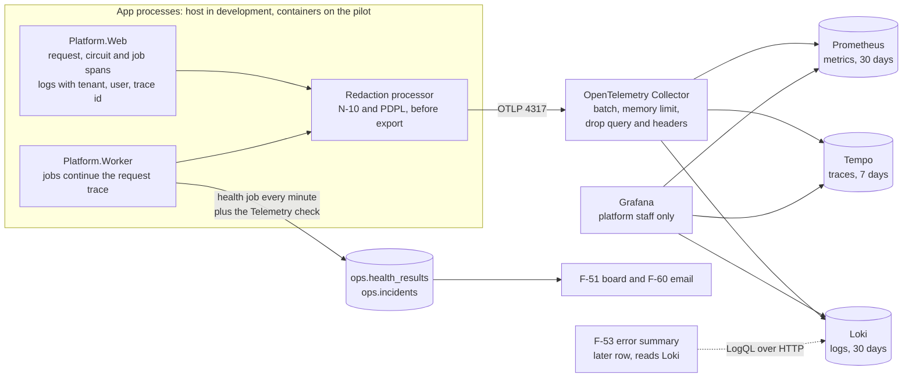

# Observability design (W-10): logs, traces, metrics and health for the pilot

Date: 2026-09-30
Status: Draft for the user's review, written overnight. Decisions O-1 to O-18 in section 2 are proposals; the ones marked "needs the user" are open questions in section 10, each with a recommendation. The plan (`docs/superpowers/plans/2026-09-30-observability.md`) is written on the recommended answers and says which task changes for any other answer. Nothing is built yet.
Builds on: the foundation, the admin UI slice (spec `2026-09-27-admin-ui-design.md` D-7, D-17, D-18; ADR-0006) and W-24 (the Data Protection logging cap)
Backlog rows: W-10 (P0, hardening before gate 1, docs/05 section 8); it feeds F-51, F-53 and F-60, and the pilot environment W-19

## 1. Scope for the pilot

W-10 is hardening, not a slice (docs/05 section 8): it makes what is already built observable. It adds no module, no page and no tender path.

In:

- The web host and the worker emit logs, traces and metrics through OpenTelemetry (OTLP) to a collector, with the tenant, the user, the vendor company, the job and the trace id on every record.
- A redaction step in the process, before anything leaves it (N-10 secrets, PDPL personal data, vendor and offer data).
- A liveness endpoint beside the existing `/health`, and the worker's health results published as metrics.
- The collector, Loki, Tempo, Prometheus and Grafana in the Compose stack, provisioned, with retention and memory limits sized for the pilot VM (W-19).
- The contract F-53 will read (labels, attribute names and the LogQL of the 24-hour error summary), proven by a smoke script, but not the F-53 panel itself.
- A "Telemetry" check in the worker's existing health job, so a dead pipeline is alerted by F-60 like Disk is.

Out (later rows or slices):

- The F-53 error summary panel and the console's own log and trace views (F-53, after this row; the full view after three to five paying customers, ADR-0006).
- Grafana alert rules and dashboards beyond datasource provisioning; F-60 stays the only alert path in the pilot (O-14).
- Tracing inside Caddy and Keycloak (both can export OTLP; not needed to answer the W-10 acceptance).
- Sentry, unless the user decides otherwise (O-1, question Q1). If kept, it is plan task 8.
- Per-tenant log access for tenant admins (no feature asks for it; F-61 support sessions do not include logs).

## 2. Decisions proposed

Tags follow the user's convention: **Standard** (an industry or platform standard sets it), **Project decision** (follows from a decision already recorded in this repository), **Judgment** (my call; could reasonably go another way).

| # | Decision | Proposal | Why | Tag | Needs the user |
|---|---|---|---|---|---|
| O-1 | Sentry | Not in the pilot. Exceptions go to Loki (Error log line with type, masked message and stack) and Tempo (span status and exception event); the F-53 summary groups them. Revisit with GlitchTip (Sentry-SDK compatible, MIT, about 512 MB) hosted in-Kingdom if error triage in Grafana proves too weak | Self-hosted Sentry needs 4 cores and 16 GB RAM plus swap (32 GB in practice) and about 40 containers; the pilot VM has 24 GB for everything. Sentry SaaS stores data outside the Kingdom (N-01) | Judgment | Yes, Q1 (changes the docs/02 stack row and the W-10 acceptance) |
| O-2 | Serilog | Not used. Logging stays on `Microsoft.Extensions.Logging` with the OpenTelemetry provider; development keeps the console provider | W-24's N-10 cap on Data Protection logging is written as `LoggerFilterOptions` rules and a startup guard; they keep working unchanged. `UseSerilog()` or `services.AddSerilog()` replaces the logger factory and silently bypasses those rules. One pipeline carries trace ids and scopes into every record | Judgment | Yes, Q2 (changes the docs/02 stack row) |
| O-3 | Collector | One OpenTelemetry Collector; the app only knows its OTLP endpoint. The collector fans out to Loki, Tempo and Prometheus, batches, limits memory and drops risky attributes as a second net | ADR-0006 D-18 already names the collector; one endpoint, buffering and retry outside the app | Project decision | No |
| O-4 | Log store | Loki 3 with native OTLP ingestion, single tenant (`auth_enabled: false`); index labels only `service_name`, `deployment_environment` and the level; tenant, user, trace id and exception type as structured metadata | ADR-0006; low label cardinality is Loki's own guidance. Loki's multi-tenancy would separate our tenants' logs from each other, but only platform staff read logs, so it adds cost without a reader | Project decision (store), Judgment (single tenant) | No |
| O-5 | Trace store | Tempo, local storage, 100 percent sampling (parent-based) | ADR-0006; pilot volume is tiny, and every failed request must have its trace | Project decision | No |
| O-6 | Metrics | Prometheus 3 receiving OTLP from the collector | It is in the docs/02 stack row; request rate, latency, error rate, runtime, Npgsql pool and health results cost about 200 MB | Project decision | Yes, Q3 (now or later) |
| O-7 | Correlation id | The W3C trace id is the correlation id. Every response carries it in `X-Correlation-Id`; `ProblemDetails` already carries `traceId`. No second id is invented | W3C Trace Context; one id to paste into Grafana | Standard | No |
| O-8 | Inbound trace context | A `traceparent` sent from the internet is not trusted: the web host starts its own trace per request | A client could otherwise choose trace ids (collide with another request in F-53's lookup) or force sampling flags | Judgment | No |
| O-9 | Context on every record | `waslabid.tenant.id` and `waslabid.tenant.slug` (tenant hosts), `user.id` (the Keycloak `sub`, after sign-in), `waslabid.vendor_company.id` (vendor requests), `waslabid.job.id` and `waslabid.job.type` (worker), `waslabid.component` (section 5.3), plus the trace and span ids. Never an email, a name, a CR or national id number, a file name, or offer content | What F-53 filters on (tenant, correlation, component); the ids are pseudonymous and already used in today's log lines | Judgment (ids in logs are personal data under PDPL, limited by retention O-12) | Confirm, Q7 |
| O-10 | Redaction | Two layers: (1) at the source, log templates never take personal or secret values, enforced by a test over every `[LoggerMessage]` template; (2) a redaction processor in the process masks emails, runs of ten or more digits, JWTs and bearer tokens, and `password=`/`pwd=` pairs in messages, attributes, span tags and exception messages, and drops query strings, before export. The collector drops `url.query` and request headers again | N-10 and PDPL; the source rule is how the code base already works (ids and `{ErrorType}`, never `ex.Message`), the processor catches framework and library text we do not write | Standard (N-10), Judgment (the patterns) | No |
| O-11 | Bodies and offers | No request or response body, form value, header value or query string is ever captured (no HTTP logging middleware, no body enrichment); financial envelope content never enters a log line, span or metric label in any slice | Sealed envelopes (F-23) and PDPL; an attempt to read a sealed envelope is an audit row (`audit.events`), not a log line | Project decision | No |
| O-12 | Retention | Logs 30 days, traces 7 days, metrics 30 days on the pilot; 3 days on developer machines. Telemetry is not backed up | 30 days matches the F-60 incident list and lets a late-reported pilot problem be traced; traces are the bulkiest. Audit evidence lives in PostgreSQL, not in logs | Judgment | Yes, Q7 |
| O-13 | Who reads telemetry | Platform staff only, through Grafana (and later the console's F-53). Loki, Tempo, Prometheus and the collector are never published outside the Compose network on the pilot; on developer machines they bind to `127.0.0.1` | ADR-0006: operations data belongs to the platform realm's staff | Project decision | No |
| O-14 | Alerts | F-60 (the worker's health job, email) stays the only alert path. W-10 adds a non-board component "Telemetry" (collector health and Loki readiness) so a dead pipeline alerts like Disk does. No Grafana alert rules in W-10 | One alert path, one incident list; Grafana alerting would be a second channel with its own recipients and its own history | Judgment | No |
| O-15 | Health endpoints | Keep `/health` exactly as it is (readiness, includes the key ring; the worker probes it for F-51). Add `/alive` (liveness: the process answers, no dependency) for container health checks on the pilot. The worker keeps opening no port | `/health` and `/alive` is the .NET Aspire service-defaults convention; a path outside `/health/*` keeps TenantMiddleware's rule that only the exact `/health` skips tenant resolution | Standard | No |
| O-16 | Console output outside Development | Off. Outside Development and Testing, logs leave only through OTLP (redacted). Development keeps the console | Container stdout would keep an unredacted, unrotated second copy outside the retention in O-12 and can fill the pilot disk. Cost: `docker logs` shows only startup failures that happen before the pipeline starts, which the host still writes to stderr | Judgment | Confirm, Q8 |
| O-17 | Compose layout | The five services are part of the default stack (no profile), each with a memory limit | Developers see the same pipeline as the pilot; about 1.5 GB | Judgment | No |
| O-18 | Grafana access on the pilot | Through an SSH tunnel only; Grafana's own admin login with the password from the secret store. Keycloak platform-realm SSO for Grafana comes when a third person needs it | Nothing new exposed to the internet on a single VM; two partners are the only readers | Judgment | Yes, Q5 |

## 3. Architecture

Read it as: the app never talks to a store directly; everything leaves through the redaction processor and the collector, and the health job that already drives F-51 and F-60 also watches the pipeline.



## 4. What exists today and what W-10 changes

| Area | Today | W-10 |
|---|---|---|
| Logging | `Microsoft.Extensions.Logging`, default providers, 64 source-generated `[LoggerMessage]` methods that log ids and `{ErrorType}`, never `ex.Message` | Adds the OpenTelemetry provider with scopes; console only in Development (O-16); the W-24 cap (`KeyRing.CapDataProtectionLogging`) and its startup guard apply to the new provider unchanged |
| Traces and metrics | None | OpenTelemetry SDK in both hosts; ASP.NET Core, HttpClient, Npgsql, runtime; our own `WaslaBid.Jobs` and `WaslaBid.Operations` sources and meters |
| `/health` (web) | Anonymous, skips tenant resolution, key-ring check cached 5 s, answers `Healthy`/`Unhealthy` only | Unchanged; excluded from traces. New `/alive` |
| Worker health job (F-51, F-60) | Seven board components plus Disk, results in `ops.health_results`, incidents and emails | Adds the non-board component Telemetry (O-14); publishes each result as a metric |
| Hangfire | `TenantJobFilter` stamps `TenantId` and `Tenant`; `TenantJobActivator` restores them | Also stamps `TraceParent`; a server filter opens the job span and log scope |
| Compose | Eight services | Plus collector, Loki, Tempo, Prometheus, Grafana |

What W-10 adds for rows that depend on it:

- **F-51** is Done as narrowed without W-10 and needs nothing more to stay Done. W-10 adds `/alive` for the pilot's container health checks, health history as metrics (the board shows only the latest result), a trace per check run, and `service.version` on every record, which is what a later version column would read (the column itself stays narrowed out).
- **F-60** is Done as narrowed; its note says W-10 was not Done. W-10 adds the Telemetry component to its incident pipeline and changes nothing else.
- **F-53** (MVP: 24-hour error summary per component from Loki with a Grafana link) is unblocked by W-10: section 7 fixes the attributes and the query it will use, and the smoke script proves them against the running stack.
- **W-19** (pilot on Oracle Cloud Always Free) does not list W-10 as a dependency today; section 8 gives the memory budget it needs. Whether W-19 should depend on W-10 is question Q4.

## 5. What the app emits

### 5.1 Resource

Every record carries `service.name` (`waslabid-web` or `waslabid-worker`), `service.version` (the assembly's informational version, the git commit in CI builds), `service.instance.id` and `deployment.environment.name` (`development`, `pilot`).

### 5.2 Traces

- **Web:** a server span per HTTP request (route, method, status; `url.query` redacted by the instrumentation's default and dropped by our processor), client spans for HttpClient (Keycloak Admin API, Keycloak organization checks) and Npgsql (statement text only, parameters never), and, if .NET 10's Blazor activity source is present, circuit and event spans. Not traced: `/health`, `/alive`, `/_framework/*`, `/_content/*` and static assets.
- **Worker:** a span per Hangfire job named `job <Type>.<Method>`, a child of the request that enqueued it (the `TraceParent` job parameter), or a new trace for recurring jobs; status Error with the exception type when the job fails. The health job's run is one span with a child per check.
- **Tags on the server or job span:** the context in O-9.

### 5.3 Logs

- Every record carries the trace and span id (from the current activity), the context in O-9 as attributes (log scopes, `IncludeScopes`), the formatted message, and for an exception its type, masked message and stack trace.
- `waslabid.component` is derived from the logger category by a fixed table, so F-53 can group errors per component: `Platform.Modules.<Name>.*` gives the module name (Vendors, Identity, Operations, ...), `Npgsql*` and `Microsoft.EntityFrameworkCore*` give `PostgreSQL`, `Amazon.*` gives `MinIO`, `MailKit*` gives `SMTP`, `Hangfire*` gives `Jobs`, `Microsoft.AspNetCore.*` and `Platform.Web.*` give `Web`; anything else gives the service name. The PostgreSQL, MinIO and SMTP names are the `HealthComponents` names, so a board tile and its errors share a word.
- Levels: `Information` by default, `Microsoft.AspNetCore` at `Warning` (as today), Data Protection capped at `Information` for every provider (W-24).

### 5.4 Metrics

ASP.NET Core request duration and active requests, HttpClient duration, `System.Runtime` (GC, thread pool, exceptions), Npgsql connection pool, Hangfire job duration and failures (`waslabid.jobs.duration`, `waslabid.jobs.failed` with `job.type`), and the health results (`waslabid.health.status` as 0 Healthy, 1 Degraded, 2 Unhealthy, and `waslabid.health.check.duration`, both per `component`). Tenant id is never a metric label (cardinality, and metrics are kept as long as logs).

## 6. Redaction and isolation

### 6.1 What never leaves the process

| Data | Rule | Where it is enforced |
|---|---|---|
| Secrets (N-10): connection strings, client secrets, tokens, cookies, key ring elements | Never logged; masked if a library writes one | Source rule; processor patterns `password=`, `pwd=`, JWT (`eyJ...`), `Bearer ...`; W-24 cap on Data Protection; no header capture |
| Personal data (PDPL): emails, names, phone, national id, iqama, CR numbers | Only pseudonymous ids (user `sub`, company id) | Source rule and template test; processor masks emails and runs of ten or more digits (CR, national id, iqama, phone, VAT and IBAN all have ten or more) |
| Vendor documents and file names | Document id only | Source rule (today's `VendorDocuments` logs already do this) |
| Offers, prices, financial envelopes (future Tenders slice) | Never, at any level, in any attribute or metric label | Source rule, template test (placeholders such as `{Price}`, `{Amount}`, `{Total}` refused), no body capture |
| Request bodies, form values, query strings, headers | Never captured | No HTTP logging middleware; instrumentation defaults kept; processor drops `url.query`; collector drops `url.query` and `http.request.header.*` again |

Masking replaces the match with a fixed marker (`[email]`, `[digits]`, `[token]`, `[secret]`) so a reader sees that something was removed. Trace ids, span ids and GUIDs are never masked (the digit rule does not match inside a hexadecimal or dashed run).

### 6.2 Tenant isolation of telemetry

Telemetry is platform operations data. One Loki tenant holds every tenant's lines with `waslabid.tenant.id` as structured metadata; the reader is always platform staff (O-13, O-18). A tenant admin never reads logs in the MVP. If a tenant-facing log view is ever built, it filters server-side by the tenant id from the session, never from the request, and that design gets its own ADR. Metrics carry no tenant label.

## 7. How F-53 and F-60 read it

F-53's MVP summary (docs/05 row 21), per component for the last 24 hours, is one Loki query (attribute names as Loki stores OTLP structured metadata, dots become underscores; the implementer confirms them against the running Loki in plan task 7):

```
sum by (service_name, waslabid_component, exception_type) (
  count_over_time({service_name=~"waslabid-web|waslabid-worker"} | severity_text=~"Error|Critical" [24h])
)
```

A row links to Grafana Explore with the same selector and, for one error, to its trace by `trace_id`. The web host will call Loki's HTTP API from the platform console (setting `Observability:LokiUrl`), so a Loki outage shows as "summary unavailable", never as a console failure. That is F-53's work; W-10 only guarantees the attributes and proves the query.

F-60 reads nothing from Loki in the pilot (O-14). It gains the Telemetry component: the worker checks the collector's health extension and Loki's `/ready` with the same five-second timeout as every other check; Telemetry opens and closes incidents and sends emails like Disk, and is not a board tile (docs/05 row 17 lists seven tiles).

## 8. Pilot resources (W-19)

The Oracle Cloud Always Free Arm allowance is 4 OCPU and 24 GB RAM in total, with 200 GB of block storage. Estimated resident memory with the pilot's load:

| Service | Memory limit proposed | Note |
|---|---|---|
| PostgreSQL | 2 GB | Existing |
| Keycloak | 1.5 GB | Existing, JVM |
| ClamAV | 3 GB | Existing; about 1.2 GB resident, doubles briefly while signatures reload |
| MinIO, Redis, Caddy | 1 GB together | Existing |
| Web host, worker | 1.5 GB together | Existing, when containerised in W-19 |
| OpenTelemetry Collector | 256 MB | `memory_limiter` at 200 MB |
| Loki | 512 MB | Single binary, filesystem storage |
| Tempo | 512 MB | Local storage |
| Prometheus | 512 MB | 30 days, about 20 series families |
| Grafana | 256 MB | |
| **Total** | **about 11 GB** | Leaves about half the VM for peaks and the page cache |
| Self-hosted Sentry, for comparison | 16 GB minimum, 32 GB in practice | Does not fit beside the stack (O-1) |
| GlitchTip, for comparison | about 512 MB plus a database in the existing PostgreSQL | Fits, if Q1 chooses it |

Disk: at pilot volume (one tenant, tens of users) the three stores together stay well under 5 GB for the retention in O-12. All images named above publish arm64 builds; the devops agent confirms each digest is multi-architecture when pinning.

## 9. Acceptance

The W-10 row's acceptance today is "Given a request, when it fails, then a trace with tenant id and correlation id appears in the collector and an event in Sentry." Proposed replacement, with the Sentry clause depending on Q1:

- **W-10.** Given a request on a tenant host that fails with an unhandled exception, when it completes, then the response carries its trace id in `X-Correlation-Id`, and within 60 seconds Tempo holds that trace with `waslabid.tenant.id` on its server span and Loki holds one Error line with the same trace id, the tenant id, the component and the exception type (and, if Q1 keeps Sentry, one event in Sentry with the same trace id and no personal data).
- Given a log line, span tag or exception message that contains an email, a run of ten or more digits, a JWT or a `password=` pair, when it is exported, then the value is masked; given any request, then no body, form value, header value or query string is exported.
- Given a job enqueued during a request, when it runs and fails, then its span is in the request's trace and its log lines carry the job id, job type and tenant id.
- Given `/alive`, when called on any host without a database, then it answers 200 Healthy; `/health` answers exactly as before.
- Given the collector is stopped, when requests arrive, then they succeed with no added latency above 100 ms at the 95th percentile, and within two minutes F-60 sends one "Telemetry is down" email, then one recovery email after the restart.
- Given a clean clone, when the Compose stack starts, then the collector, Loki, Tempo, Prometheus and Grafana are healthy within four minutes, and Grafana opens with Loki, Tempo and Prometheus provisioned and a log line's trace id links to its trace.
- Given the F-53 query in section 7, when run against Loki after a deliberate failure, then it counts that error under its service and component.

## 10. Open questions for the user

Each has a recommendation; the plan follows the recommendation until the user answers.

**Q1. Sentry in the pilot: drop it, self-host Sentry, self-host GlitchTip, or Sentry SaaS?**
Recommendation: **drop it for the pilot** and let Loki and Tempo carry exceptions; revisit GlitchTip in Jeddah if error triage in Grafana proves too weak (for example after gate 2). *Judgment.* Self-hosted Sentry does not fit the pilot VM (section 8); Sentry SaaS stores event data, which can hold tenant data despite scrubbing, outside the Kingdom (N-01, *Standard* for this project). GlitchTip fits and speaks the Sentry protocol, so choosing it later costs one plan task (task 8) and one Compose service. If the user agrees: ADR-0014 records it, the docs/02 observability row and the docs/02 and docs/03 diagrams drop "Sentry" (or mark it "later"), and the W-10 acceptance takes section 9's text. The docs/02 note "You already run Sentry" is why this is the user's call.

**Q2. Keep Serilog, or log through Microsoft.Extensions.Logging with the OpenTelemetry provider only?**
Recommendation: **drop Serilog.** *Judgment.* The existing N-10 protection from W-24 is a set of `LoggerFilterOptions` rules and a startup guard; Serilog's usual hosting integration replaces the logger factory and those rules then do nothing, which a future change could do by accident. OpenTelemetry's provider already puts trace ids and scopes on every record. If the user prefers Serilog: it must be added only as a provider (`ILoggingBuilder.AddSerilog(logger, dispose: true)`), never through `UseSerilog()` or `services.AddSerilog()`, with `Serilog.Sinks.OpenTelemetry` for export and the redaction as an enricher; plan tasks 1 and 3 name the changes. Either way the docs/02 stack row changes wording, so this goes into the same ADR as Q1.

**Q3. Prometheus now, or only logs and traces now and metrics later?**
Recommendation: **now.** *Project decision:* it is already in the docs/02 stack row, it costs about 512 MB, and it gives health history and request latency for the pilot's success measures. Deferring it removes one Compose service and half of plan task 4.

**Q4. Pilot resource budget and W-19's dependency.**
Recommendation: **accept the memory limits in section 8 and add W-10 to W-19's dependencies.** *Judgment.* A pilot with real vendors and no logs or traces cannot be supported. This task changed only the W-10 row, so the W-19 dependency is left for the user.

**Q5. How platform staff reach Grafana on the pilot.**
Recommendation: **SSH tunnel only for the pilot**, with Grafana's own admin account whose password lives in the secret store. *Judgment.* Nothing new faces the internet; the F-53 "link to Grafana" then opens through the tunnel. The alternative is Grafana behind Caddy on the platform host with Keycloak SSO in the `waslabid-platform` realm (role `platform-admin`, OTP), about half a day in W-19; choose it when a third person needs access.

**Q6. Size.**
Recommendation: **re-size W-10 from S to M.** *Project decision* (docs/09: S is under a day, M one to three days). The plan is about two and a half days: four small developer tasks, the Compose work, the documentation and the smoke run do not fit in one day. The alternative is to cut O-6 (Q3) and O-14 and stay near S.

**Q7. Personal identifiers and retention.**
Recommendation: **keep pseudonymous ids (user `sub`, tenant id, vendor company id) in telemetry, and keep logs 30 days, traces 7 days, metrics 30 days.** *Judgment* under PDPL data minimisation: ids are what make F-53's tenant and correlation filters useful; the retention is the limit. A shorter log retention (14 days) is defensible if the user prefers less data held.

**Q8. Console logs outside Development.**
Recommendation: **off** (O-16). *Judgment.* The alternative, JSON console at Warning and above, would need the same redaction and a Docker log rotation setting on the pilot; it helps only when the collector is down, which F-60 then reports.

## 11. Testing and done

- Test first. Integration tests use the OpenTelemetry in-memory exporter inside `PlatformWebFactory` and the worker's `JobServerHost`, so CI needs no collector. The full pipeline (collector, Loki, Tempo) is proven by the smoke script `tests/e2e/observability.mjs` against the local stack, like the other e2e scripts: not in CI.
- Existing tests stay green, in particular `A_key_the_host_cannot_decrypt_is_never_written_whole_to_a_log_even_at_trace_level`, `A_host_that_would_log_the_key_ring_below_information_does_not_start` and `Health_endpoint_answers_without_a_tenant_or_sign_in_and_is_unhealthy_without_a_database`.
- Done when each acceptance line in section 9 has a named test or recorded smoke evidence; build, tests and format are green; the reviewer and the pentester have run (redaction and the new endpoints are security-sensitive); docs/07 section 4, docs/09 (W-10 status and acceptance), docs/02 and docs/03 (per Q1 and Q2), README and CLAUDE.md are updated.
