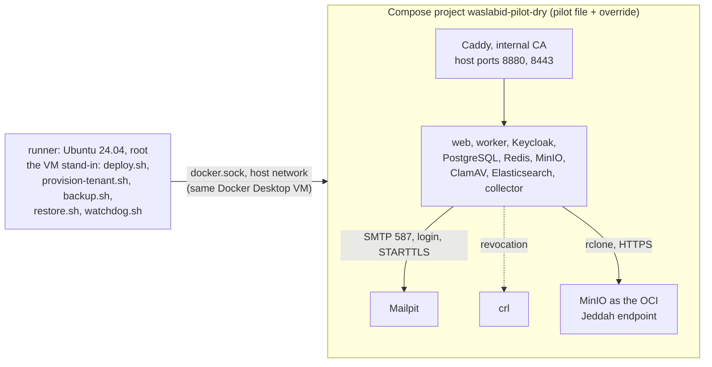

# Pilot rehearsal on a laptop (local only, never on the VM)

Runs the real pilot scripts of `infra/pilot/` end to end on a Windows laptop with Docker Desktop, with stand-ins for
what only Oracle Cloud has. First run 2026-10-03; results in docs/19 section 10. Nothing here goes to a cloud.



| Stand-in | For | Why |
|---|---|---|
| `runner.Dockerfile`, `runner.sh` | The VM | Root, a Linux file system, and bind-mount paths that the engine resolves as the scripts do (`/opt/waslabid-dry`) |
| Caddy `local_certs` with the dry-run CA as root (`prepare.sh` writes `state/Caddyfile` from `../Caddyfile`) | Let's Encrypt | No public DNS; the on-demand ask flow is unchanged |
| Host ports 8880 and 8443 | 80 and 443 | Windows (System, PID 4) holds 80 and 443 |
| Mailpit, login and STARTTLS required, certificate from the dry-run CA | OCI Email Delivery | Exercises `Smtp:Username/Password` over STARTTLS for the hosts, Keycloak and the watchdog |
| `crl` (Caddy file server) | The CRL/OCSP service of a public CA | MailKit checks revocation and refuses a certificate without a distribution point |
| `oci-standin` (MinIO on HTTPS 443 with the OCI host name) | OCI Object Storage, Jeddah | `rclone.sh`'s Jeddah-only check runs unchanged |
| `keycloak-day-one.sh` | Docs/19 step 7 in the admin console | Creates `waslabid-ops`, a named admin and deletes the bootstrap admin through the Admin API |

Not stood in: `bootstrap.sh` (systemd, ufw, unattended upgrades, SSH), the systemd timers, instance metadata, IAM, the
bucket retention rule, DNS, and `build-images.sh <ssh target>` (images are built for amd64 on the same engine).

## Run it

From the repository root in Git Bash, with the development stack stopped (`docker compose -p erp-dev stop`, from
`infra/compose`) and the app images built for the host: `PLATFORM=linux/amd64 infra/pilot/build-images.sh`.

```bash
R=infra/pilot/dry-run/runner.sh
$R start                                    # runner image, container, clone of this branch, sync of infra/pilot
$R exec infra/pilot/generate-secrets.sh     # step 1: .env and secrets/key-ring.pfx, inside the runner only
$R exec infra/pilot/dry-run/prepare.sh      # the values a human types, the dry-run CA, state/Caddyfile
$R exec bash -c '. infra/pilot/lib.sh; export IMAGE_TAG=<tag>; dc up -d mailpit crl oci-standin && dc --profile tools run --rm -T oci-standin-init'
$R exec infra/pilot/deploy.sh --tag <tag>   # step 2
$R exec infra/pilot/dry-run/keycloak-day-one.sh
$R exec infra/pilot/provision-tenant.sh --slug acme --name "Acme Contracting" --culture ar-SA --color '#0F766E' \
    --admin-email admin@acme.pilot.localhost --admin-first Sara --admin-last Alqahtani
$R exec infra/pilot/backup.sh && $R exec infra/pilot/restore.sh --verify
$R exec infra/pilot/watchdog.sh
```

Edits in the working tree reach the runner with `$R sync` (only `infra/pilot`, never `.env`, `secrets/` or `state/`).
The runner sets `PILOT_COMPOSE_OVERRIDE` (lib.sh layers this override) and `PILOT_HTTPS_PORT=8443` (deploy.sh's HTTPS
checks).

From Windows, with the public dry-run CA (`$R exec cat infra/pilot/dry-run/state/ca/ca.crt > ca.crt`):

```bash
curl --ssl-no-revoke --cacert ca.crt --connect-to ::127.0.0.1:8443 -I https://acme.pilot.localhost/
```

`--connect-to` keeps the host name (SNI and `Host`) while reaching port 8443; `--ssl-no-revoke` because Windows'
Schannel cannot fetch the CRL from the `crl` container. A browser cannot complete a sign-in: Keycloak's issuer and the
redirect URIs have no port, and 443 belongs to Windows. Mailpit's UI: `http://127.0.0.1:8025`.

## Clean up

```bash
$R exec bash -c '. infra/pilot/lib.sh; export IMAGE_TAG=<tag>; dc --profile tools --profile kibana down -v'
$R rm                                        # the runner and its folders in Docker Desktop's VM
```
